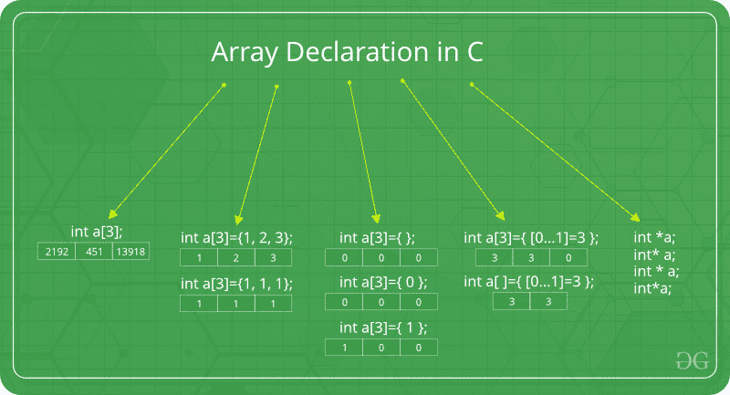
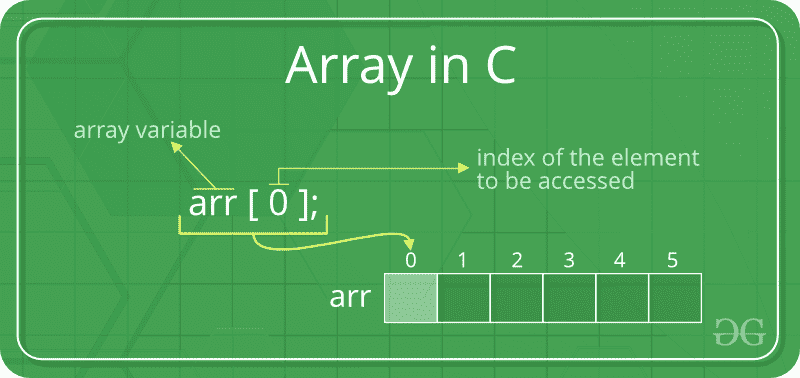

# C/C++ 中的数组

> 原文： [https://www.geeksforgeeks.org/arrays-in-c-language-set-1-introduction/](https://www.geeksforgeeks.org/arrays-in-c-language-set-1-introduction/)

C 或 C++ 中的数组是存储在连续内存位置的项目的集合，可以使用数组的索引随机访问元素。 它们用于存储相似类型的元素，因为所有元素的数据类型必须相同。 它们可用于存储原始数据类型的集合，例如任何特定类型的`int`，`float`，`double`，`char`等。 另外，使用 C 或 C++ 的数组可以存储派生的数据类型，例如结构，指针等。下面给出的是数组的如画表示。


**为什么需要数组？**

当我们有少量对象时，我们可以使用普通变量（`v1`，`v2`，`v3`，..），但是如果我们要存储大量实例，则很难用普通变量来管理它们 变量。 数组的想法是在一个变量中表示许多实例。

**C/C++ 中的数组声明**：



我们可以通过多种方式声明数组。 可以通过指定其类型和大小，对其进行初始化或同时对两者进行初始化来完成。

1.  **通过指定大小声明数组**：

    ```

    // Array declaration by specifying size 
    int arr1[10]; 

    // With recent C/C++ versions, we can also 
    // declare an array of user specified size 
    int n = 10; 
    int arr2[n]; 

    ```

2.  **通过初始化元素声明数组**：

    ```

    // Array declaration by initializing elements 
    int arr[] = { 10, 20, 30, 40 } 

    // Compiler creates an array of size 4\. 
    // above is same as  "int arr[4] = {10, 20, 30, 40}" 

    ```

3.  **通过指定大小和初始化元素来声明数组**：

    ```

    // Array declaration by specifying size and initializing 
    // elements 
    int arr[6] = { 10, 20, 30, 40 } 

    // Compiler creates an array of size 6, initializes first 
    // 4 elements as specified by user and rest two elements as 0\. 
    // above is same as  "int arr[] = {10, 20, 30, 40, 0, 0}" 

    ```

**C/C++ 中的数组的优点**：

1.  使用数组索引随机访问元素。

2.  使用较少的代码行，因为它创建了多个元素的单个数组。

3.  轻松访问所有元素。

4.  使用单个循环，遍历数组变得容易。

5.  排序变得很容易，因为可以通过编写更少的代码行来实现。

**C/C++ 中的数组的缺点**：

1.  允许输入在声明时确定的固定数量的元素。 与链表不同，C 中的数组不是动态的。

2.  元素的插入和删除可能很昂贵，因为需要根据新的内存分配来管理元素。

**关于 C/C++ 中的数组的事实**：

**访问数组元素**：

Array elements are accessed by using an integer index. Array index starts with 0 and goes till size of array minus 1.

    



**示例**：

## C

```c

#include <stdio.h> 

int main() 
{ 
    int arr[5]; 
    arr[0] = 5; 
    arr[2] = -10; 
    arr[3 / 2] = 2; // this is same as arr[1] = 2 
    arr[3] = arr[0]; 

    printf("%d %d %d %d", arr[0], arr[1], arr[2], arr[3]); 

    return 0; 
} 

```

## C++
    
```cpp
#include <iostream> 
using namespace std; 
  
int main() 
{ 
    int arr[5]; 
    arr[0] = 5; 
    arr[2] = -10; 
  
    // this is same as arr[1] = 2 
    arr[3 / 2] = 2; 
    arr[3] = arr[0]; 
  
    cout << arr[0] << " " << arr[1] 
         << " " << arr[2] << " " << arr[3]; 
  
    return 0; 
} 
```

输出：

```
5 2 -10 5
```

没有索引越界检查：

在 C/C++ 中，没有没有超出范围的索引检查，例如，以下程序可以正常编译，但在运行时可能会产生意外的输出。

## C

```c
// This C program compiles fine 
// as index out of bound 
// is not checked in C. 
  
#include <stdio.h> 
  
int main() 
{ 
    int arr[2]; 
  
    printf("%d ", arr[3]); 
    printf("%d ", arr[-2]); 
  
    return 0; 
} 
```

## C++

```cpp
// This C++ program compiles fine 
// as index out of bound 
// is not checked in C. 
  
#include <iostream> 
using namespace std; 
  
int main() 
{ 
    int arr[2]; 
  
    cout << arr[3] << " "; 
    cout << arr[-2] << " "; 
  
    return 0; 
} 
```

输出：

```
2008101287 4195777
```

在 C 语言中，使用比指定大小更多的元素初始化数组不是编译器错误。 例如，下面的程序可以正常编译并仅显示警告。

```c
#include <stdio.h> 
int main() 
{ 
  
    // Array declaration by initializing it with more 
    // elements than specified size. 
    int arr[2] = { 10, 20, 30, 40, 50 }; 
  
    return 0; 
} 
```

警告：

```
prog.c: In function 'main':
prog.c:7:25: warning: excess elements in array initializer
  int arr[2] = { 10, 20, 30, 40, 50 };
                         ^
prog.c:7:25: note: (near initialization for 'arr')
prog.c:7:29: warning: excess elements in array initializer
  int arr[2] = { 10, 20, 30, 40, 50 };
                             ^
prog.c:7:29: note: (near initialization for 'arr')
prog.c:7:33: warning: excess elements in array initializer
  int arr[2] = { 10, 20, 30, 40, 50 };
                                 ^
prog.c:7:33: note: (near initialization for 'arr')
```

注意：该程序无法在 C++ 中编译。 如果将上述程序另存为`.cpp`，则该程序会生成编译器错误“错误：`'int [2]'`的初始化器太多”。

元素存储在连续的内存位置：

例：

## C

```c
// C program to demonstrate that array elements are stored 
// contiguous locations 
  
#include <stdio.h> 
int main() 
{ 
    // an array of 10 integers.  If arr[0] is stored at 
    // address x, then arr[1] is stored at x + sizeof(int) 
    // arr[2] is stored at x + sizeof(int) + sizeof(int) 
    // and so on. 
    int arr[5], i; 
  
    printf("Size of integer in this compiler is %lu\n", sizeof(int)); 
  
    for (i = 0; i < 5; i++) 
        // The use of '&' before a variable name, yields 
        // address of variable. 
        printf("Address arr[%d] is %p\n", i, &arr[i]); 
  
    return 0; 
} 
```

## C++

```cpp
// C++ program to demonstrate that array elements 
// are stored contiguous locations 
  
#include <iostream> 
using namespace std; 
  
int main() 
{ 
    // an array of 10 integers.  If arr[0] is stored at 
    // address x, then arr[1] is stored at x + sizeof(int) 
    // arr[2] is stored at x + sizeof(int) + sizeof(int) 
    // and so on. 
    int arr[5], i; 
  
    cout << "Size of integer in this compiler is " << sizeof(int) << "\n"; 
  
    for (i = 0; i < 5; i++) 
        // The use of '&' before a variable name, yields 
        // address of variable. 
        cout << "Address arr[" << i << "] is " << &arr[i] << "\n"; 
  
    return 0; 
} 
```

输出：

```
Size of integer in this compiler is 4
Address arr[0] is 0x7ffd636b4260
Address arr[1] is 0x7ffd636b4264
Address arr[2] is 0x7ffd636b4268
Address arr[3] is 0x7ffd636b426c
Address arr[4] is 0x7ffd636b4270
```

数组与指针：

数组和指针是两个不同的东西（我们可以通过应用`sizeof`进行检查）。 之所以会造成混乱，是因为数组名称指示第一个元素的地址，并且数组始终作为指针传递（即使我们使用方括号）。 更多细节请参阅：[C 中的指针和数组之间的区别？](https://www.geeksforgeeks.org/difference-pointer-array-c/)。

C++ 中的向量是什么？
C++ 中的`vector`是 STL 中的一个表示数组的类。 向量比普通阵列的优势在于，

+   声明向量时，我们不需要传递大小作为额外的参数，即向量支持动态大小（我们不必最初指定向量的大小）。 我们还可以调整向量的大小。
+   向量具有许多内置功能，例如删除元素等。
+   要了解有关`vector`提供的功能的更多信息，请参考 [C++ 中的`vector`](https://www.geeksforgeeks.org/vector-in-cpp-stl/)获取更多详细信息。