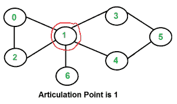
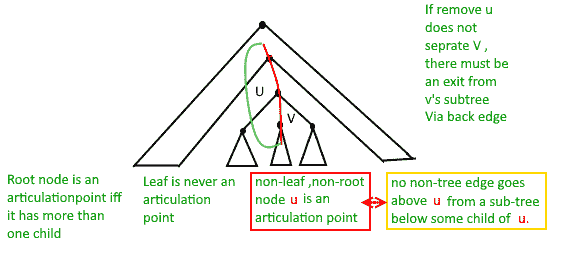

# 图中的铰接点（或切点）

> 原文： [https://www.geeksforgeeks.org/articulation-points-or-cut-vertices-in-a-graph/](https://www.geeksforgeeks.org/articulation-points-or-cut-vertices-in-a-graph/)

无向连接图中的顶点是铰接点（或切割的顶点），如果将其移除（以及穿过它的边）会断开图的连接。 铰接点表示连接的网络中的漏洞–单个点的故障会将网络分成 2 个或更多组件。 它们对于设计可靠的网络很有用。

对于断开的无向图，铰接点是顶点移除，这增加了连通组件数。

以下是一些示例图，其中用红色包围了铰接点。

 

 

 

**如何找到给定图中的所有铰接点？**

一种简单的方法是一个接一个地删除所有顶点，然后查看删除顶点是否会导致图形断开。 以下是连接图的简单方法步骤。

+   对于每个顶点`v`，请执行以下：
    +   从图形中移除`v`。
    +   查看剩余图是否是连通的（通过 BFS 或 DFS）
    +   将`v`添加回图中

对于使用邻接表表示的图，上述方法的时间复杂度为`O(V * (V + E))`。 我们可以做得更好吗？

**一种`O(V + E)`算法，用于查找所有铰接点（AP）**

想法是使用 DFS（深度优先搜索）。 在 DFS 中，我们遵循称为 DFS 树的树形式的顶点。 在 DFS 树中，如果`v`被`u`发现（显然`v`是图中`u`的相邻），则`u`是另一个顶点`v`的父级。 在 DFS 树中，如果满足以下两个条件之一，则顶点`u`是连接点。

1.  `u`是 DFS 树的根，并且至少有两个子代。

2.  `u`不是 DFS 树的根，并且它具有子`v`，因此以`v`为根的子树中的任何顶点都不具有`u`的祖先之一（在 DFS 树中）的后边。

下图显示了与上述相同的点，另外还有一个点，即 DFS 树中的叶子永远不能是铰接点。



我们使用附加代码对给定图进行 DFS 遍历，以找出铰接点（AP）。 在 DFS 遍历中，我们维护一个`parent[]`数组，其中`parent[u]`存储顶点`u`的父元素。 在上述两种情况中，第一种情况很容易检测。 对于每个顶点，计算孩子数。 如果当前访问的顶点`u`是根（`parent[u]`是`NIL`）并且有两个以上的子节点，请打印该顶点。

如何处理第二种情况？ 第二种情况比较棘手。 我们维护一个数组`disc[]`来存储顶点的发现时间。 对于`u`的每个节点，我们需要找出可以从以`u`为根的子树中到达的最早访问的顶点（具有最短发现时间的顶点）。 因此，我们维护一个附加数组`low[]`，其定义如下。

```
low[u] = min(disc[u], disc[w]) 
where w is an ancestor of u and there is a back edge from 
some descendant of u to w.
```

以下是 Tarjan 用于查找发音点的算法的 C++，Java 和 Python 实现。

## C++

```cpp

// A C++ program to find articulation points in an undirected graph 
#include<iostream> 
#include <list> 
#define NIL -1 
using namespace std; 

// A class that represents an undirected graph 
class Graph 
{ 
    int V;    // No. of vertices 
    list<int> *adj;    // A dynamic array of adjacency lists 
    void APUtil(int v, bool visited[], int disc[], int low[],  
                int parent[], bool ap[]); 
public: 
    Graph(int V);   // Constructor 
    void addEdge(int v, int w);   // function to add an edge to graph 
    void AP();    // prints articulation points 
}; 

Graph::Graph(int V) 
{ 
    this->V = V; 
    adj = new list<int>[V]; 
} 

void Graph::addEdge(int v, int w) 
{ 
    adj[v].push_back(w); 
    adj[w].push_back(v);  // Note: the graph is undirected 
} 

// A recursive function that find articulation points using DFS traversal 
// u --> The vertex to be visited next 
// visited[] --> keeps tract of visited vertices 
// disc[] --> Stores discovery times of visited vertices 
// parent[] --> Stores parent vertices in DFS tree 
// ap[] --> Store articulation points 
void Graph::APUtil(int u, bool visited[], int disc[],  
                                      int low[], int parent[], bool ap[]) 
{ 
    // A static variable is used for simplicity, we can avoid use of static 
    // variable by passing a pointer. 
    static int time = 0; 

    // Count of children in DFS Tree 
    int children = 0; 

    // Mark the current node as visited 
    visited[u] = true; 

    // Initialize discovery time and low value 
    disc[u] = low[u] = ++time; 

    // Go through all vertices aadjacent to this 
    list<int>::iterator i; 
    for (i = adj[u].begin(); i != adj[u].end(); ++i) 
    { 
        int v = *i;  // v is current adjacent of u 

        // If v is not visited yet, then make it a child of u 
        // in DFS tree and recur for it 
        if (!visited[v]) 
        { 
            children++; 
            parent[v] = u; 
            APUtil(v, visited, disc, low, parent, ap); 

            // Check if the subtree rooted with v has a connection to 
            // one of the ancestors of u 
            low[u]  = min(low[u], low[v]); 

            // u is an articulation point in following cases 

            // (1) u is root of DFS tree and has two or more chilren. 
            if (parent[u] == NIL && children > 1) 
               ap[u] = true; 

            // (2) If u is not root and low value of one of its child is more 
            // than discovery value of u. 
            if (parent[u] != NIL && low[v] >= disc[u]) 
               ap[u] = true; 
        } 

        // Update low value of u for parent function calls. 
        else if (v != parent[u]) 
            low[u]  = min(low[u], disc[v]); 
    } 
} 

// The function to do DFS traversal. It uses recursive function APUtil() 
void Graph::AP() 
{ 
    // Mark all the vertices as not visited 
    bool *visited = new bool[V]; 
    int *disc = new int[V]; 
    int *low = new int[V]; 
    int *parent = new int[V]; 
    bool *ap = new bool[V]; // To store articulation points 

    // Initialize parent and visited, and ap(articulation point) arrays 
    for (int i = 0; i < V; i++) 
    { 
        parent[i] = NIL; 
        visited[i] = false; 
        ap[i] = false; 
    } 

    // Call the recursive helper function to find articulation points 
    // in DFS tree rooted with vertex 'i' 
    for (int i = 0; i < V; i++) 
        if (visited[i] == false) 
            APUtil(i, visited, disc, low, parent, ap); 

    // Now ap[] contains articulation points, print them 
    for (int i = 0; i < V; i++) 
        if (ap[i] == true) 
            cout << i << " "; 
} 

// Driver program to test above function 
int main() 
{ 
    // Create graphs given in above diagrams 
    cout << "\nArticulation points in first graph \n"; 
    Graph g1(5); 
    g1.addEdge(1, 0); 
    g1.addEdge(0, 2); 
    g1.addEdge(2, 1); 
    g1.addEdge(0, 3); 
    g1.addEdge(3, 4); 
    g1.AP(); 

    cout << "\nArticulation points in second graph \n"; 
    Graph g2(4); 
    g2.addEdge(0, 1); 
    g2.addEdge(1, 2); 
    g2.addEdge(2, 3); 
    g2.AP(); 

    cout << "\nArticulation points in third graph \n"; 
    Graph g3(7); 
    g3.addEdge(0, 1); 
    g3.addEdge(1, 2); 
    g3.addEdge(2, 0); 
    g3.addEdge(1, 3); 
    g3.addEdge(1, 4); 
    g3.addEdge(1, 6); 
    g3.addEdge(3, 5); 
    g3.addEdge(4, 5); 
    g3.AP(); 

    return 0; 
} 

```

## Java

```java

// A Java program to find articulation points in an undirected graph 
import java.io.*; 
import java.util.*; 
import java.util.LinkedList; 

// This class represents an undirected graph using adjacency list 
// representation 
class Graph 
{ 
    private int V;   // No. of vertices 

    // Array  of lists for Adjacency List Representation 
    private LinkedList<Integer> adj[]; 
    int time = 0; 
    static final int NIL = -1; 

    // Constructor 
    Graph(int v) 
    { 
        V = v; 
        adj = new LinkedList[v]; 
        for (int i=0; i<v; ++i) 
            adj[i] = new LinkedList(); 
    } 

    //Function to add an edge into the graph 
    void addEdge(int v, int w) 
    { 
        adj[v].add(w);  // Add w to v's list. 
        adj[w].add(v);    //Add v to w's list 
    } 

    // A recursive function that find articulation points using DFS 
    // u --> The vertex to be visited next 
    // visited[] --> keeps tract of visited vertices 
    // disc[] --> Stores discovery times of visited vertices 
    // parent[] --> Stores parent vertices in DFS tree 
    // ap[] --> Store articulation points 
    void APUtil(int u, boolean visited[], int disc[], 
                int low[], int parent[], boolean ap[]) 
    { 

        // Count of children in DFS Tree 
        int children = 0; 

        // Mark the current node as visited 
        visited[u] = true; 

        // Initialize discovery time and low value 
        disc[u] = low[u] = ++time; 

        // Go through all vertices aadjacent to this 
        Iterator<Integer> i = adj[u].iterator(); 
        while (i.hasNext()) 
        { 
            int v = i.next();  // v is current adjacent of u 

            // If v is not visited yet, then make it a child of u 
            // in DFS tree and recur for it 
            if (!visited[v]) 
            { 
                children++; 
                parent[v] = u; 
                APUtil(v, visited, disc, low, parent, ap); 

                // Check if the subtree rooted with v has a connection to 
                // one of the ancestors of u 
                low[u]  = Math.min(low[u], low[v]); 

                // u is an articulation point in following cases 

                // (1) u is root of DFS tree and has two or more chilren. 
                if (parent[u] == NIL && children > 1) 
                    ap[u] = true; 

                // (2) If u is not root and low value of one of its child 
                // is more than discovery value of u. 
                if (parent[u] != NIL && low[v] >= disc[u]) 
                    ap[u] = true; 
            } 

            // Update low value of u for parent function calls. 
            else if (v != parent[u]) 
                low[u]  = Math.min(low[u], disc[v]); 
        } 
    } 

    // The function to do DFS traversal. It uses recursive function APUtil() 
    void AP() 
    { 
        // Mark all the vertices as not visited 
        boolean visited[] = new boolean[V]; 
        int disc[] = new int[V]; 
        int low[] = new int[V]; 
        int parent[] = new int[V]; 
        boolean ap[] = new boolean[V]; // To store articulation points 

        // Initialize parent and visited, and ap(articulation point) 
        // arrays 
        for (int i = 0; i < V; i++) 
        { 
            parent[i] = NIL; 
            visited[i] = false; 
            ap[i] = false; 
        } 

        // Call the recursive helper function to find articulation 
        // points in DFS tree rooted with vertex 'i' 
        for (int i = 0; i < V; i++) 
            if (visited[i] == false) 
                APUtil(i, visited, disc, low, parent, ap); 

        // Now ap[] contains articulation points, print them 
        for (int i = 0; i < V; i++) 
            if (ap[i] == true) 
                System.out.print(i+" "); 
    } 

    // Driver method 
    public static void main(String args[]) 
    { 
        // Create graphs given in above diagrams 
        System.out.println("Articulation points in first graph "); 
        Graph g1 = new Graph(5); 
        g1.addEdge(1, 0); 
        g1.addEdge(0, 2); 
        g1.addEdge(2, 1); 
        g1.addEdge(0, 3); 
        g1.addEdge(3, 4); 
        g1.AP(); 
        System.out.println(); 

        System.out.println("Articulation points in Second graph"); 
        Graph g2 = new Graph(4); 
        g2.addEdge(0, 1); 
        g2.addEdge(1, 2); 
        g2.addEdge(2, 3); 
        g2.AP(); 
        System.out.println(); 

        System.out.println("Articulation points in Third graph "); 
        Graph g3 = new Graph(7); 
        g3.addEdge(0, 1); 
        g3.addEdge(1, 2); 
        g3.addEdge(2, 0); 
        g3.addEdge(1, 3); 
        g3.addEdge(1, 4); 
        g3.addEdge(1, 6); 
        g3.addEdge(3, 5); 
        g3.addEdge(4, 5); 
        g3.AP(); 
    } 
} 
// This code is contributed by Aakash Hasija 

```

## Python

```py

# Python program to find articulation points in an undirected graph 

from collections import defaultdict 

#This class represents an undirected graph  
#using adjacency list representation 
class Graph: 

    def __init__(self,vertices): 
        self.V= vertices #No. of vertices 
        self.graph = defaultdict(list) # default dictionary to store graph 
        self.Time = 0

    # function to add an edge to graph 
    def addEdge(self,u,v): 
        self.graph[u].append(v) 
        self.graph[v].append(u) 

    '''A recursive function that find articulation points  
    using DFS traversal 
    u --> The vertex to be visited next 
    visited[] --> keeps tract of visited vertices 
    disc[] --> Stores discovery times of visited vertices 
    parent[] --> Stores parent vertices in DFS tree 
    ap[] --> Store articulation points'''
    def APUtil(self,u, visited, ap, parent, low, disc): 

        #Count of children in current node  
        children =0

        # Mark the current node as visited and print it 
        visited[u]= True

        # Initialize discovery time and low value 
        disc[u] = self.Time 
        low[u] = self.Time 
        self.Time += 1

        #Recur for all the vertices adjacent to this vertex 
        for v in self.graph[u]: 
            # If v is not visited yet, then make it a child of u 
            # in DFS tree and recur for it 
            if visited[v] == False : 
                parent[v] = u 
                children += 1
                self.APUtil(v, visited, ap, parent, low, disc) 

                # Check if the subtree rooted with v has a connection to 
                # one of the ancestors of u 
                low[u] = min(low[u], low[v]) 

                # u is an articulation point in following cases 
                # (1) u is root of DFS tree and has two or more chilren. 
                if parent[u] == -1 and children > 1: 
                    ap[u] = True

                #(2) If u is not root and low value of one of its child is more 
                # than discovery value of u. 
                if parent[u] != -1 and low[v] >= disc[u]: 
                    ap[u] = True    

                # Update low value of u for parent function calls     
            elif v != parent[u]:  
                low[u] = min(low[u], disc[v]) 

    #The function to do DFS traversal. It uses recursive APUtil() 
    def AP(self): 

        # Mark all the vertices as not visited  
        # and Initialize parent and visited,  
        # and ap(articulation point) arrays 
        visited = [False] * (self.V) 
        disc = [float("Inf")] * (self.V) 
        low = [float("Inf")] * (self.V) 
        parent = [-1] * (self.V) 
        ap = [False] * (self.V) #To store articulation points 

        # Call the recursive helper function 
        # to find articulation points 
        # in DFS tree rooted with vertex 'i' 
        for i in range(self.V): 
            if visited[i] == False: 
                self.APUtil(i, visited, ap, parent, low, disc) 

        for index, value in enumerate (ap): 
            if value == True: print index, 

 # Create a graph given in the above diagram 
g1 = Graph(5) 
g1.addEdge(1, 0) 
g1.addEdge(0, 2) 
g1.addEdge(2, 1) 
g1.addEdge(0, 3) 
g1.addEdge(3, 4) 

print "\nArticulation points in first graph "
g1.AP() 

g2 = Graph(4) 
g2.addEdge(0, 1) 
g2.addEdge(1, 2) 
g2.addEdge(2, 3) 
print "\nArticulation points in second graph "
g2.AP() 

g3 = Graph (7) 
g3.addEdge(0, 1) 
g3.addEdge(1, 2) 
g3.addEdge(2, 0) 
g3.addEdge(1, 3) 
g3.addEdge(1, 4) 
g3.addEdge(1, 6) 
g3.addEdge(3, 5) 
g3.addEdge(4, 5) 
print "\nArticulation points in third graph "
g3.AP() 

#This code is contributed by Neelam Yadav 

```

## C#

```cs

// A C# program to find articulation  
// points in an undirected graph 
using System; 
using System.Collections.Generic; 

// This class represents an undirected graph  
// using adjacency list representation 
public class Graph 
{ 
    private int V; // No. of vertices 

    // Array of lists for Adjacency List Representation 
    private List<int> []adj; 
    int time = 0; 
    static readonly int NIL = -1; 

    // Constructor 
    Graph(int v) 
    { 
        V = v; 
        adj = new List<int>[v]; 
        for (int i = 0; i < v; ++i) 
            adj[i] = new List<int>(); 
    } 

    // Function to add an edge into the graph 
    void addEdge(int v, int w) 
    { 
        adj[v].Add(w); // Add w to v's list. 
        adj[w].Add(v); //Add v to w's list 
    } 

    // A recursive function that find articulation points using DFS 
    // u --> The vertex to be visited next 
    // visited[] --> keeps tract of visited vertices 
    // disc[] --> Stores discovery times of visited vertices 
    // parent[] --> Stores parent vertices in DFS tree 
    // ap[] --> Store articulation points 
    void APUtil(int u, bool []visited, int []disc, 
                int []low, int []parent, bool []ap) 
    { 

        // Count of children in DFS Tree 
        int children = 0; 

        // Mark the current node as visited 
        visited[u] = true; 

        // Initialize discovery time and low value 
        disc[u] = low[u] = ++time; 

        // Go through all vertices aadjacent to this 
        foreach(int i in adj[u]) 
        { 
            int v = i; // v is current adjacent of u 

            // If v is not visited yet, then make it a child of u 
            // in DFS tree and recur for it 
            if (!visited[v]) 
            { 
                children++; 
                parent[v] = u; 
                APUtil(v, visited, disc, low, parent, ap); 

                // Check if the subtree rooted with v has  
                // a connection to one of the ancestors of u 
                low[u] = Math.Min(low[u], low[v]); 

                // u is an articulation point in following cases 

                // (1) u is root of DFS tree and has two or more chilren. 
                if (parent[u] == NIL && children > 1) 
                    ap[u] = true; 

                // (2) If u is not root and low value of one of its child 
                // is more than discovery value of u. 
                if (parent[u] != NIL && low[v] >= disc[u]) 
                    ap[u] = true; 
            } 

            // Update low value of u for parent function calls. 
            else if (v != parent[u]) 
                low[u] = Math.Min(low[u], disc[v]); 
        } 
    } 

    // The function to do DFS traversal.  
    // It uses recursive function APUtil() 
    void AP() 
    { 
        // Mark all the vertices as not visited 
        bool []visited = new bool[V]; 
        int []disc = new int[V]; 
        int []low = new int[V]; 
        int []parent = new int[V]; 
        bool []ap = new bool[V]; // To store articulation points 

        // Initialize parent and visited, and  
        // ap(articulation point) arrays 
        for (int i = 0; i < V; i++) 
        { 
            parent[i] = NIL; 
            visited[i] = false; 
            ap[i] = false; 
        } 

        // Call the recursive helper function to find articulation 
        // points in DFS tree rooted with vertex 'i' 
        for (int i = 0; i < V; i++) 
            if (visited[i] == false) 
                APUtil(i, visited, disc, low, parent, ap); 

        // Now ap[] contains articulation points, print them 
        for (int i = 0; i < V; i++) 
            if (ap[i] == true) 
                Console.Write(i + " "); 
    } 

    // Driver method 
    public static void Main(String []args) 
    { 
        // Create graphs given in above diagrams 
        Console.WriteLine("Articulation points in first graph "); 
        Graph g1 = new Graph(5); 
        g1.addEdge(1, 0); 
        g1.addEdge(0, 2); 
        g1.addEdge(2, 1); 
        g1.addEdge(0, 3); 
        g1.addEdge(3, 4); 
        g1.AP(); 
        Console.WriteLine(); 

        Console.WriteLine("Articulation points in Second graph"); 
        Graph g2 = new Graph(4); 
        g2.addEdge(0, 1); 
        g2.addEdge(1, 2); 
        g2.addEdge(2, 3); 
        g2.AP(); 
        Console.WriteLine(); 

        Console.WriteLine("Articulation points in Third graph "); 
        Graph g3 = new Graph(7); 
        g3.addEdge(0, 1); 
        g3.addEdge(1, 2); 
        g3.addEdge(2, 0); 
        g3.addEdge(1, 3); 
        g3.addEdge(1, 4); 
        g3.addEdge(1, 6); 
        g3.addEdge(3, 5); 
        g3.addEdge(4, 5); 
        g3.AP(); 
    } 
} 

// This code is contributed by PrinciRaj1992 

```

**Output:**

```
Articulation points in first graph
0 3
Articulation points in second graph
1 2
Articulation points in third graph
1
```

**时间复杂度**：上面的功能是带有附加数组的简单 DFS。 因此，时间复杂度与 DFS 相同，对于图的邻接表表示，它的时间复杂度为`O(V + E)`。

**参考**：

[https://www.cs.washington.edu/education/courses/421/04su/slides/artic.pdf](https://www.cs.washington.edu/education/courses/421/04su/slides/artic.pdf)

[http://www.slideshare.net/TraianRebedea/algorithm-design-and-complexity-course-8](http://www.slideshare.net/TraianRebedea/algorithm-design-and-complexity-course-8)

[http://faculty.simpson.edu/lydia.sinapova/www/cmsc250/LN250_Weiss/ L25-Connectivity.htm](http://faculty.simpson.edu/lydia.sinapova/www/cmsc250/LN250_Weiss/L25-Connectivity.htm)

如果发现任何不正确的地方，或者想分享有关上述主题的更多信息，请写评论。

