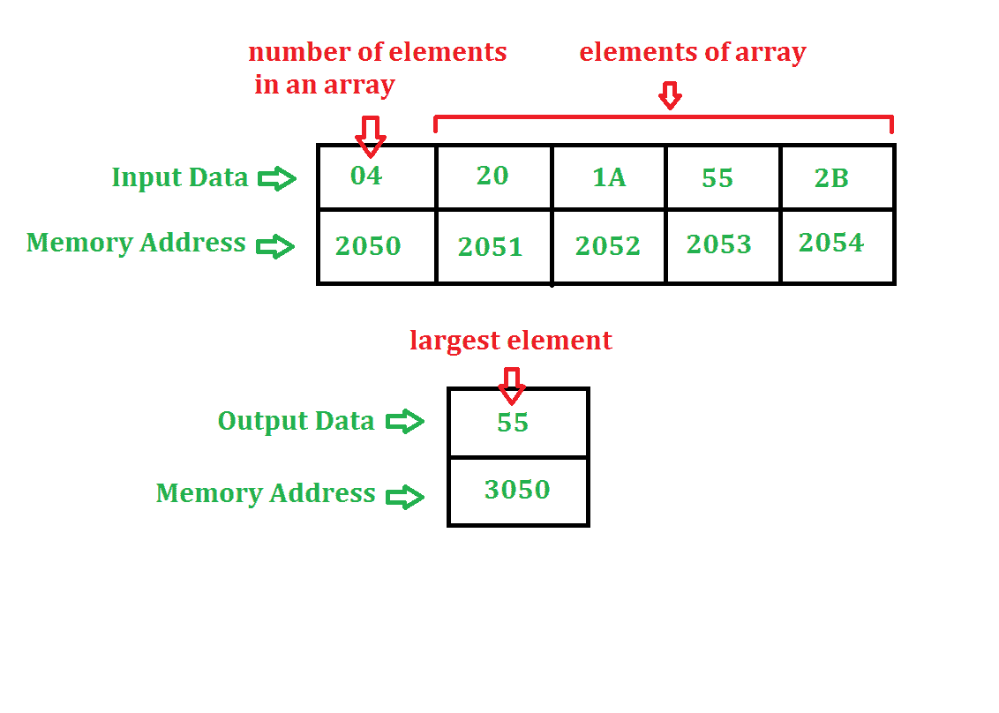

# 寻找数组中最大数的汇编语言程序

> 原文:[https://www . geesforgeks . org/汇编语言-程序-查找-最大数-数组/](https://www.geeksforgeeks.org/assembly-language-program-find-largest-number-array/)

**问题–**确定 n 个元素的数组中的最大数。n 的值存储在地址 2050，数组从地址 2051 开始。结果存储在地址 3050。程序的起始地址取 2000。

**示例–**

**算法–**

1.  我们正在取数组的第一个元素
2.  将 A 与数组的其他元素进行比较，如果 A 较小，则将该元素存储在 A 中，否则与下一个元素进行比较
3.  A 的值就是答案

**程序–**

| 存储地址 | 记忆术 | 评论 |
| --- | --- | --- |
| Two thousand | LXI H 2050 年夏季奥林匹克运动会 | 页:1 |
| Two thousand and three | 莫夫·c·m | b |
| Two thousand and four | DCR C(消歧义) | C-01 战斗机 |
| Two thousand and five | INX H(消歧义) | HL←HL+0001 |
| Two thousand and six | 莫夫 a，m | 页:1 |
| Two thousand and seven | INX H(消歧义) | HL←HL+0001 |
| Two thousand and eight | CMP M 号航空母舰 | 上午 |
| Two thousand and nine | JNC 200D | 如果进位标志=0，转到 200D |
| 200 摄氏度 | 莫夫 a，m | 页:1 |
| 200D | DCR C(消歧义) | C←C-1 型核潜艇 |
| 200E | JNZ 2007 | 如果零标志=0，转到 2007 |
| Two thousand and eleven | STA 3050 | A→3050 |
| Two thousand and fourteen | HLT |  |

**解释–**使用的寄存器: **A、H、L、C**

1.  **LXI 2050** 给 H 分配 20，给 L 分配 50
2.  **MOV C，M** 将内存内容(由 HL 寄存器对指定)复制到 C(这用作计数器)
3.  **DCR C** 将 C 的值减 1
4.  **INX H** 使 HL 值增加 1。这样做是为了访问下一个存储位置
5.  **MOV A，M** 将内存内容(由 HL 寄存器对指定)复制到 A
6.  **INX H** 使 HL 值增加 1。这样做是为了访问下一个存储位置
7.  **CMP M** 通过从 A 中减去 M 来比较 A 和 M。**如果 A-M 为负，进位标志和符号标志将被设置**
8.  **如果进位标志= 0，JNC 200D** 将程序计数器跳到 200D
9.  **MOV A，M** 将内存内容(由 HL 寄存器对指定)复制到 A
10.  **DCR C** 将 C 的值减 1
11.  如果零标志= 0，则 **JNZ 2007** 将程序计数器跳至 2007
12.  **STA 3050** 在 3050 存储位置存储 A 的值
13.  **HLT** 停止执行程序并停止任何进一步的执行