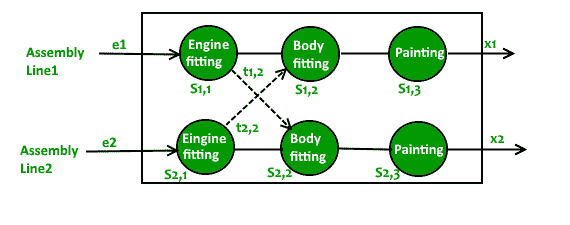
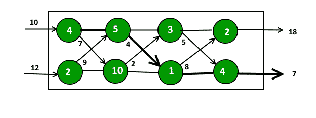

# 装配线调度| DP-34

> 原文:[https://www . geesforgeks . org/装配线-调度-dp-34/](https://www.geeksforgeeks.org/assembly-line-scheduling-dp-34/)

一个汽车工厂有两条装配线，每条装配线有 n 个工位。一个工位用 S <sub>i，j</sub> 表示，其中 I 是 1 或 2，表示该工位所在的装配线，j 表示该工位的编号。每个站花费的时间用 <sub>i，j</sub> 表示。每个工作站都致力于某种工作，如发动机装配、车身装配、喷漆等。因此，汽车底盘在出厂前必须依次通过 n 个工位。两条装配线的平行工位执行相同的任务。通过 S 站 <sub>i、j</sub> 后，将继续到 S 站 <sub>i、j+1</sub> 除非决定换乘其他线路。继续在同一条线路上行驶不会产生额外费用，但是从 j–1 站的 I 号线换乘另一条线路上的 j 号线需要时间 t <sub>i，j</sub> 。每条装配线的进入时间 e <sub>i</sub> 和退出时间 x <sub>i</sub> 对于两条生产线可能不同。给出一个计算制造汽车底盘所需最短时间的算法。

下图以清晰的画面呈现问题:



可以从问题陈述中提取以下信息，使其更简单:

*   两条装配线，1 号和 2 号，每条装配线上有 1 到 n 个工位。
*   汽车底盘必须按顺序通过从 1 到 n 的所有工位(在两条装配线的任何一条上)。即如果它们不在一个移动距离，它不能从站 I 跳到站 j。
*   汽车底盘可以在同一条线上向前移动一个站，或者在另一条线上对角移动一个站。从 I 线移动到 j 站会产生额外的成本 ti，j。在同一条线上移动不会产生任何成本。
*   I 线 j 站的时间为 <sub>i，j</sub> 。
*   S <sub>i，j</sub> 代表 I 线上的一个站 j。

**将问题分解成更小的子问题:**
如果已知第(i-1)个阶乘，我们可以很容易地找到第 I 个阶乘。我们可以在这里应用类似的基本原理吗？
如果底盘离开工位 S <sub>i，j-1</sub> 所用的最短时间已知，则通过组合 a <sub>i，j</sub> 和 t <sub>i，j</sub> 可以快速计算出离开工位 S <sub>i，j</sub> 所用的最短时间。
**T1(j)** 表示汽车底盘在装配线 1 上离开工位 j 所需的最短时间。
**T2(j)** 表示汽车底盘离开装配线 2 上的工位 j 所需的最短时间。

***基例:***
进入时间 e <sub>i</sub> 只有当汽车底盘进入车厂时才会进入画面。
离开 1 号线首站所用时间由下式给出:
T1(1)= 1 号线进站时间+S<sub>1，1</sub>
T1(1)= e<sub>1</sub>+a<sub>1，1</sub>T16】同样，离开 2 号线首站所用时间由下式给出:
T2(1) = e <sub>2</sub> + a <sub>2，1</sub>

***递归关系:***
如果我们看问题陈述，很快可以归结为以下观察:
站 S <sub>1、j</sub> 的汽车底盘可以来自站 S <sub>1、j-1</sub> 或站 S <sub>2、j-1</sub> 。

案例 1:其前一站为 S <sub>1，j-1</sub>
离开站 S <sub>1，j</sub> 的最短时间由下式给出:
T1(j) =离开站 S <sub>1，j-1</sub> +在站 S <sub>1，j</sub>
T1(j)= T1(j-1)+a<sub>1，j</sub>

案例 2:其前一站为 S <sub>2，j-1</sub>
离开 S1 站的最短时间 j 由下式给出:
T1(j) =离开 S <sub>2，j-1</sub> 站的最短时间+更换装配线产生的额外费用+在 S <sub>1，j</sub> 站花费的时间】T1(j) = T2(j-1) + t <sub>2，j</sub> + a <sub>1，j</sub>

最小时间 T1(j)由情况#1 和#2 中获得的两者的最小值给出。
T1(j) = min((T1(j-1) + a <sub>1，j</sub> )，(T2(j-1) + t <sub>2，j</sub> + a <sub>1，j</sub> )

同样，到达 S2 站 j 的最短时间由下式给出:
T2(j) =分钟((T2(j-1) + a <sub>2、j</sub> )、(T1(j-1) + t <sub>1、j</sub> + a <sub>2、j</sub> )

汽车底盘出厂的总最短时间由下式给出:
Tmin = min(离开站 S <sub>i、n</sub> +离开车厂的时间)
Tmin = min(T1(n) + x <sub>1</sub> 、T2(n) + x <sub>2</sub> )

**为什么要动态编程？**
上面的递归展示了重叠的子问题。到达 S 站 <sub>1、j 站</sub>有两种方式:

1.  从站 S <sub>1，j-1</sub>
2.  从站 S <sub>2，j-1</sub>

所以，要找到离开站 S <sub>1，j</sub> 的最短时间，必须计算出离开前两个站的最短时间(如上面递归中所解释的)。

同样，到达 S 站 <sub>2、j 站</sub>也有两种方式:

1.  从站 S <sub>2，j-1</sub>
2.  从站 S <sub>1，j-1</sub>

请注意，S <sub>1、j-1</sub> 和 S <sub>2、j-1</sub> 出站的最短时间已经计算过了。
因此，我们需要两个表来存储装配线上每个工位的部分计算结果。这张桌子将以自下而上的方式摆满。

**注:**
在这篇帖子中，“离开”一词被用来代替“到达”，以避免混淆。由于汽车底盘必须在每个工位停留固定的时间，所以“离开”这个词更适合。

**实施:**

## C++

```
// A C++ program to find minimum possible 
// time by the car chassis to complete 
#include <bits/stdc++.h>
using namespace std;
#define NUM_LINE 2 
#define NUM_STATION 4 

// Utility function to find a minimum of two numbers 
int min(int a, int b)
{ 
    return a < b ? a : b; 
} 

int carAssembly(int a[][NUM_STATION], 
                int t[][NUM_STATION], 
                int *e, int *x) 
{ 
    int T1[NUM_STATION], T2[NUM_STATION], i; 

    // time taken to leave first station in line 1 
    T1[0] = e[0] + a[0][0]; 

    // time taken to leave first station in line 2 
    T2[0] = e[1] + a[1][0]; 

    // Fill tables T1[] and T2[] using the 
    // above given recursive relations 
    for (i = 1; i < NUM_STATION; ++i) 
    { 
        T1[i] = min(T1[i - 1] + a[0][i], 
                    T2[i - 1] + t[1][i] + a[0][i]); 
        T2[i] = min(T2[i - 1] + a[1][i],
                    T1[i - 1] + t[0][i] + a[1][i]); 
    } 

    // Consider exit times and return minimum 
    return min(T1[NUM_STATION - 1] + x[0], 
               T2[NUM_STATION - 1] + x[1]); 
} 

// Driver Code
int main() 
{ 
    int a[][NUM_STATION] = {{4, 5, 3, 2}, 
                            {2, 10, 1, 4}}; 
    int t[][NUM_STATION] = {{0, 7, 4, 5}, 
                            {0, 9, 2, 8}}; 
    int e[] = {10, 12}, x[] = {18, 7}; 

    cout << carAssembly(a, t, e, x); 

    return 0; 
} 

// This is code is contributed by rathbhupendra
```

## C

```
// A C program to find minimum possible time by the car chassis to complete
#include <stdio.h>
#define NUM_LINE 2
#define NUM_STATION 4

// Utility function to find minimum of two numbers
int min(int a, int b) { return a < b ? a : b; }

int carAssembly(int a[][NUM_STATION], int t[][NUM_STATION], int *e, int *x)
{
    int T1[NUM_STATION], T2[NUM_STATION], i;

    T1[0] = e[0] + a[0][0]; // time taken to leave first station in line 1
    T2[0] = e[1] + a[1][0]; // time taken to leave first station in line 2

    // Fill tables T1[] and T2[] using the above given recursive relations
    for (i = 1; i < NUM_STATION; ++i)
    {
        T1[i] = min(T1[i-1] + a[0][i], T2[i-1] + t[1][i] + a[0][i]);
        T2[i] = min(T2[i-1] + a[1][i], T1[i-1] + t[0][i] + a[1][i]);
    }

    // Consider exit times and return minimum
    return min(T1[NUM_STATION-1] + x[0], T2[NUM_STATION-1] + x[1]);
}

int main()
{
    int a[][NUM_STATION] = {{4, 5, 3, 2},
                {2, 10, 1, 4}};
    int t[][NUM_STATION] = {{0, 7, 4, 5},
                {0, 9, 2, 8}};
    int e[] = {10, 12}, x[] = {18, 7};

    printf("%d", carAssembly(a, t, e, x));

    return 0;
}
```

## Java 语言(一种计算机语言，尤用于创建网站)

```
// A java program to find minimum possible
// time by the car chassis to complete
import java.io.*;

class GFG 
{
    static int NUM_LINE = 2;
    static int NUM_STATION = 4;

    // Utility function to find minimum of two numbers
    static int min(int a, int b) 
    { 
        return a < b ? a : b; 

    }

    static int carAssembly(int a[][], int t[][], int e[], int x[])
    {
        int T1[]= new int [NUM_STATION];
        int T2[] =new int[NUM_STATION] ;
        int i;

        // time taken to leave first station in line 1
        T1[0] = e[0] + a[0][0]; 

        // time taken to leave first station in line 2
        T2[0] = e[1] + a[1][0];

        // Fill tables T1[] and T2[] using 
        // the above given recursive relations
        for (i = 1; i < NUM_STATION; ++i)
        {
            T1[i] = min(T1[i - 1] + a[0][i], 
                    T2[i - 1] + t[1][i] + a[0][i]);
            T2[i] = min(T2[i - 1] + a[1][i], 
                    T1[i - 1] + t[0][i] + a[1][i]);
        }

        // Consider exit times and return minimum
        return min(T1[NUM_STATION-1] + x[0], 
                    T2[NUM_STATION-1] + x[1]);
    }

    // Driver code
    public static void main (String[] args) 
    {
        int a[][] = {{4, 5, 3, 2},
                    {2, 10, 1, 4}};
        int t[][] = {{0, 7, 4, 5},
                    {0, 9, 2, 8}};
        int e[] = {10, 12}, x[] = {18, 7};

        System.out.println(carAssembly(a, t, e, x));    

    }
}
// This code is contributed by vt_m
```

## 蟒蛇 3

```
# Python program to find minimum possible 
# time by the car chassis to complete

def carAssembly (a, t, e, x):

    NUM_STATION = len(a[0])
    T1 = [0 for i in range(NUM_STATION)]
    T2 = [0 for i in range(NUM_STATION)]

    T1[0] = e[0] + a[0][0] # time taken to leave
                           # first station in line 1
    T2[0] = e[1] + a[1][0] # time taken to leave
                           # first station in line 2

    # Fill tables T1[] and T2[] using
    # above given recursive relations
    for i in range(1, NUM_STATION):
        T1[i] = min(T1[i-1] + a[0][i],
                    T2[i-1] + t[1][i] + a[0][i])
        T2[i] = min(T2[i-1] + a[1][i],
                    T1[i-1] + t[0][i] + a[1][i] )

    # consider exit times and return minimum
    return min(T1[NUM_STATION - 1] + x[0],
               T2[NUM_STATION - 1] + x[1])

a = [[4, 5, 3, 2],
     [2, 10, 1, 4]]
t = [[0, 7, 4, 5],
     [0, 9, 2, 8]]
e = [10, 12]
x = [18, 7]

print(carAssembly(a, t, e, x))

# This code is contributed by Soumen Ghosh
```

## C#

```
// A C# program to find minimum possible
// time by the car chassis to complete
using System;

class GFG {

    static int NUM_STATION = 4;

    // Utility function to find minimum 
    // of two numbers
    static int min(int a, int b) 
    { 
        return a < b ? a : b; 

    }

    static int carAssembly(int [,]a, int [,]t,
                             int []e, int []x)
    {
        int []T1= new int [NUM_STATION];
        int []T2 =new int[NUM_STATION] ;
        int i;

        // time taken to leave first station
        // in line 1
        T1[0] = e[0] + a[0,0]; 

        // time taken to leave first station
        // in line 2
        T2[0] = e[1] + a[1,0];

        // Fill tables T1[] and T2[] using 
        // the above given recursive relations
        for (i = 1; i < NUM_STATION; ++i)
        {
            T1[i] = min(T1[i - 1] + a[0,i], 
                  T2[i - 1] + t[1,i] + a[0,i]);
            T2[i] = min(T2[i - 1] + a[1,i], 
                  T1[i - 1] + t[0,i] + a[1,i]);
        }

        // Consider exit times and return
        // minimum
        return min(T1[NUM_STATION-1] + x[0], 
                    T2[NUM_STATION-1] + x[1]);
    }

    // Driver code
    public static void Main () 
    {
        int [,]a = { {4, 5, 3, 2},
                     {2, 10, 1, 4} };

        int [,]t = { {0, 7, 4, 5},
                     {0, 9, 2, 8} };

        int []e = {10, 12};
        int []x = {18, 7};

        Console.Write(carAssembly(a, t, e, x)); 

    }
}

// This code is contributed by nitin mittal.
```

## 服务器端编程语言（Professional Hypertext Preprocessor 的缩写）

```
<?php
// A PHP program to find minimum
// possible time by the car chassis
// to complete

$NUM_LINE = 2;
$NUM_STATION = 4;

// Utility function to find 
// minimum of two numbers
function carAssembly($a, $t, 
                     $e, $x)
{
    global $NUM_LINE,
           $NUM_STATION;
    $T1 = array(); 
    $T2 = array();
    $i;

    $T1[0] = $e[0] + $a[0][0]; // time taken to leave 
                               // first station in line 1
    $T2[0] = $e[1] + $a[1][0]; // time taken to leave 
                               // first station in line 2

    // Fill tables T1[] and T2[] 
    // using the above given
    // recursive relations
    for ($i = 1; 
         $i < $NUM_STATION; ++$i)
    {
        $T1[$i] = min($T1[$i - 1] + $a[0][$i], 
                      $T2[$i - 1] + $t[1][$i] + 
                                    $a[0][$i]);
        $T2[$i] = min($T2[$i - 1] + $a[1][$i], 
                      $T1[$i - 1] + $t[0][$i] + 
                                    $a[1][$i]);
    }

    // Consider exit times 
    // and return minimum
    return min($T1[$NUM_STATION - 1] + $x[0], 
               $T2[$NUM_STATION - 1] + $x[1]);
}

// Driver Code
$a = array(array(4, 5, 3, 2),
           array(2, 10, 1, 4));
$t = array(array(0, 7, 4, 5),
           array(0, 9, 2, 8));
$e = array(10, 12);
$x = array(18, 7);

echo carAssembly($a, $t, $e, $x);

// This code is contributed
// by anuj_67.
?>
```

## java 描述语言

```
<script>

// A JavaScript program to find minimum possible
// time by the car chassis to complete

const NUM_LINE = 2;
const NUM_STATION = 4;

// Utility function to find a minimum of two numbers
function min(a, b)
{
    return a < b ? a : b;
}

function carAssembly(a, t, e, x)
{
    let T1 = new Array(NUM_STATION); 
    let T2 = new Array(NUM_STATION);
    let i;

    // time taken to leave first station in line 1
    T1[0] = e[0] + a[0][0];

    // time taken to leave first station in line 2
    T2[0] = e[1] + a[1][0];

    // Fill tables T1[] and T2[] using the
    // above given recursive relations
    for (i = 1; i < NUM_STATION; ++i)
    {
        T1[i] = min(T1[i - 1] + a[0][i],
                    T2[i - 1] + t[1][i] + a[0][i]);
        T2[i] = min(T2[i - 1] + a[1][i],
                    T1[i - 1] + t[0][i] + a[1][i]);
    }

    // Consider exit times and return minimum
    return min(T1[NUM_STATION - 1] + x[0],
            T2[NUM_STATION - 1] + x[1]);
}

// Driver Code
    let a = [[4, 5, 3, 2],
                            [2, 10, 1, 4]];
    let t = [[0, 7, 4, 5],
                            [0, 9, 2, 8]];
    let e = [10, 12], x = [18, 7];

    document.write(carAssembly(a, t, e, x));

// This code is contributed by Surbhi Tyagi.

</script>
```

**Output:** 

```
35
```



粗线显示给定输入值时汽车底盘所覆盖的路径。我们只需要辅助数组中的最后两个值。因此，我们可以使用两个变量，而不是创建两个数组。

## C++

```
// A space optimized solution for
// assembly line scheduling 
#include <bits/stdc++.h> 
using namespace std; 

int carAssembly(int a[][4], 
                int t[][4], 
                int *e, int *x) 
{ 
    int first, second, i;

    // Time taken to leave first 
    // station in line 1 
    first = e[0] + a[0][0]; 

    // Time taken to leave first 
    // station in line 2 
    second = e[1] + a[1][0]; 

    // Fill tables T1[] and T2[] using the 
    // above given recursive relations 
    for(i = 1; i < 4; ++i) 
    { 
        int up =  min(first + a[0][i], 
                     second + t[1][i] + 
                              a[0][i]); 
        int down = min(second + a[1][i], 
                        first + t[0][i] + 
                                a[1][i]); 
        first = up;
        second = down;
    } 

    // Consider exit times and 
    // return minimum 
    return min(first + x[0], 
              second + x[1]); 
} 

// Driver Code 
int main() 
{ 
    int a[][4] = { { 4, 5, 3, 2 }, 
                   { 2, 10, 1, 4 } }; 
    int t[][4] = { { 0, 7, 4, 5 }, 
                   { 0, 9, 2, 8 } }; 
    int e[] = { 10, 12 }, x[] = { 18, 7 }; 

    cout << carAssembly(a, t, e, x); 

    return 0; 
} 

// This code is contributed by chitrasingla2001
```

## Java 语言(一种计算机语言，尤用于创建网站)

```
// A space optimized solution for assembly line scheduling
public class AssemblyLine {
    public static void main(String[] args) {
        int a[][] = {{4, 5, 3, 2},
                {2, 10, 1, 4}};
        int t[][] = {{0, 7, 4, 5},
                {0, 9, 2, 8}};
        int e[] = {10, 12}, x[] = {18, 7};

        System.out.println(carAssembleTime(a, t, e, x));
    }

    public static int carAssembleTime(int a[][], int t[][], 
                                       int e[], int x[]) {
        int n = a[0].length;

        // time taken to leave first station in line 1  
        int first = e[0] + a[0][0];

        // time taken to leave first station in line 2
        int second = e[1] + a[1][0];

        for (int i = 1; i < n; i++) {
            int up = Math.min(first + a[0][i],
                    second + t[1][i] + a[0][i]),
                    down = Math.min(second + a[1][i],
                            first + t[0][i] + a[1][i]);
            first = up;
            second = down;
        }

        first += x[0];
        second += x[1];

        return Math.min(first, second);
    }
}
```

## 蟒蛇 3

```
# A space optimized solution for assembly
# line scheduling in Python3
def carAssembleTime(a, t, e, x):

    n = len(a[0])

    # Time taken to leave first station
    # in line 1
    first = e[0] + a[0][0]

    # Time taken to leave first station 
    # in line 2
    second = e[1] + a[1][0]

    for i in range(1, n):
        up = min(first + a[0][i], 
                 second + t[1][i] + a[0][i])
        down = min(second + a[1][i], 
                   first + t[0][i] + a[1][i]) 

        first, second = up, down 

    first += x[0] 
    second += x[1] 

    return min(first, second)

# Driver Code
a = [ [ 4, 5, 3, 2 ], [ 2, 10, 1, 4 ] ] 
t = [ [ 0, 7, 4, 5 ], [ 0, 9, 2, 8 ] ]
e = [ 10, 12 ] 
x = [ 18, 7 ] 

print(carAssembleTime(a, t, e, x))

# This code is contributed by Prateek Gupta 
```

## C#

```
// A space optimized solution for 
// assembly line scheduling
using System;

class GFG{

static int carAssembleTime(int[,] a, int[,] t, 
                           int[] e, int[] x)
{
    int n = a.GetLength(1);

    // Time taken to leave first station in line 1  
    int first = e[0] + a[0, 0];

    // Time taken to leave first station in line 2
    int second = e[1] + a[1, 0];

    for(int i = 1; i < n; i++)
    {
        int up = Math.Min(first + a[0, i],
               second + t[1, i] + a[0, i]),
            down = Math.Min(second + a[1, i],
                   first + t[0, i] + a[1, i]);

        first = up;
        second = down;
    }

    first += x[0];
    second += x[1];

    return Math.Min(first, second);
}

// Driver Code
static void Main() 
{
    int[,] a = { { 4, 5, 3, 2 },
                 { 2, 10, 1, 4 } };
    int[,] t = { { 0, 7, 4, 5 },
                 { 0, 9, 2, 8 } };
    int[] e = { 10, 12 }, x = { 18, 7 };

    Console.WriteLine(carAssembleTime(a, t, e, x));
}
}

// This code is contributed by divyeshrabadiya07
```

## java 描述语言

```
<script>
// A space optimized solution for assembly line scheduling

    function carAssembleTime(a , t , e , x) {
        var n = a[0].length;

        // time taken to leave first station in line 1
        var first = e[0] + a[0][0];

        // time taken to leave first station in line 2
        var second = e[1] + a[1][0];

        for (var i = 1; i < n; i++) {
            var up = Math.min(first + a[0][i], second + t[1][i] + a[0][i]),
                    down = Math.min(second + a[1][i], first + t[0][i] + a[1][i]);
            first = up;
            second = down;
        }

        first += x[0];
        second += x[1];

        return Math.min(first, second);
        }
       var a = [ [ 4, 5, 3, 2 ], [ 2, 10, 1, 4 ] ];
        var t = [ [ 0, 7, 4, 5 ], [ 0, 9, 2, 8 ] ];
        var e = [ 10, 12 ], x = [ 18, 7 ];

        document.write(carAssembleTime(a, t, e, x));

// This code is contributed by gauravrajput1
</script>
```

**Output:** 

```
35
```

**练习:**
扩展以上算法，打印工厂内汽车底盘覆盖的路径。

**参考文献:**
[Clifford Stein，Thomas H. Cormen，Charles E. Leiserson，罗纳德·L·李维斯特](http://www.flipkart.com/introduction-algorithms-3rd/p/itmczynzhyhxv2gs?pid=9788120340077&affid=sandeepgfg)
算法导论第三版本文由[**aashis Barnwal**](https://www.facebook.com/barnwal.aashish)整理。如果您发现任何不正确的地方，请写评论，或者您想分享更多关于上面讨论的主题的信息