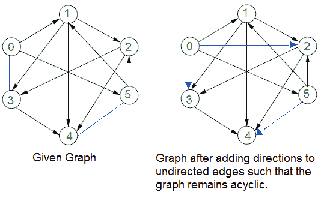
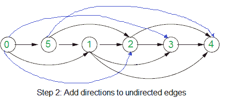

# 给边指定方向，使有向图保持非循环

> 原文:[https://www . geesforgeks . org/assign-directions-to-edges-so-directed-graph-to-edges-保持非循环/](https://www.geeksforgeeks.org/assign-directions-to-edges-so-that-the-directed-graph-remains-acyclic/)

给定一个有向边和无向边的图。给出了有向边不形成循环的结论。如何给无向边指定方向，使图(有所有有向边)即使在指定后也保持无环？

例如，在下图中，蓝色边没有方向。

**强烈建议尽量减少浏览器，先自己试试这个。**

思路是用[拓扑排序](https://www.geeksforgeeks.org/topological-sorting/)。以下是算法中使用的两个步骤。

**1)** 只考虑有向边的子图，求子图的拓扑排序。在上面的例子中，拓扑排序是{0，5，1，2，3，4}。下图显示了上述示例图的拓扑排序。

**2)** 使用上述拓扑排序为无向边指定方向。对于每条无向边(u，v)，如果在拓扑排序中 u 在 v 之前，则为其指定从 u 到 v 的方向，否则为其指定从 v 到 u 的方向。
下图显示了示例图中的指定方向。

来源:[http://courses . csail . MIT . edu/6.006/old quicks/solutions/Q2-f 2009-sol . pdf](http://courses.csail.mit.edu/6.006/oldquizzes/solutions/q2-f2009-sol.pdf)

本文由**阿迪蒂亚·阿格沃尔**供稿。如果你发现任何不正确的地方，或者你想分享更多关于上面讨论的话题的信息，请写评论。