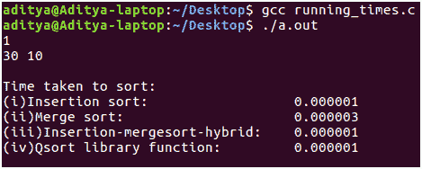
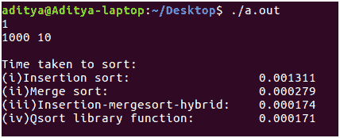
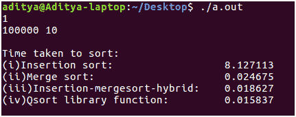

# 排序算法的渐近分析和比较

> 原文:[https://www . geesforgeks . org/渐近-分析-比较-排序-算法/](https://www.geeksforgeeks.org/asymptotic-analysis-comparison-sorting-algorithms/)

合并排序比插入排序运行得更快，这是一个公认的事实。使用[渐近分析](https://www.geeksforgeeks.org/analysis-of-algorithms-set-1-asymptotic-analysis/),我们可以证明合并排序在 O(nlogn)时间内运行，插入排序采用 O(n^2).这是显而易见的，因为合并排序通过递归地解决插入排序遵循增量方法的问题来使用分治法。
如果我们进一步仔细研究时间复杂度分析，我们就会知道插入排序还不够糟糕。令人惊讶的是，在较小的输入大小上，插入排序胜过合并排序。这是因为在推导时间复杂度时，我们忽略的常数很少。对于较大的 10^4 阶输入，这不会影响我们函数的行为。但是当输入大小低于，比如小于 40，那么等式中的常数支配输入大小“n”。
到目前为止，还不错。但是我对这样的数学分析并不满意。作为一名计算机科学本科生，我们必须相信编写代码。我已经写了一个 C 程序来感受算法如何在不同的输入大小上相互竞争。此外，为什么要对这些排序算法的运行时间复杂性进行如此严格的数学分析。
 **实施:**

```
//C++ code to compare performance of sorting algorithms
#include <stdio.h>
#include <stdlib.h>
#include <stdbool.h>
#include <time.h>
#define MAX_ELEMENT_IN_ARRAY 1000000001

int cmpfunc (const void * a, const void * b)
{
    // Compare function used by qsort
    return ( *(int*)a - *(int*)b );
}

int* generate_random_array(int n)
{
    srand(time(NULL));
    int *a = malloc(sizeof(int) * n), i;
    for(i = 0; i < n; ++i)
        a[i] = rand() % MAX_ELEMENT_IN_ARRAY;
    return a;
}

int* copy_array(int a[], int n)
{
    int *arr = malloc(sizeof(int) * n);
    int i;
    for(i = 0; i < n ;++i)
        arr[i] = a[i];
    return arr;
}

//Code for Insertion Sort
void insertion_sort_asc(int a[], int start, int end)
{
    int i;
    for(i = start + 1; i <= end ; ++i)
    {
        int key = a[i];
        int j = i - 1;
        while(j >= start && a[j] > key)
        {
            a[j + 1] = a[j];
            --j;
        }
        a[j + 1] = key;
    }
}

//Code for Merge Sort
void merge(int a[], int start, int end, int mid)
{
    int i = start, j = mid + 1, k = 0;
    int *aux = malloc(sizeof(int) * (end - start + 1));
    while(i <= mid && j <= end)
    {
        if(a[i] <= a[j])
            aux[k++] = a[i++];
        else
            aux[k++] = a[j++];
    }
    while(i <= mid)
        aux[k++] = a[i++];
    while(j <= end)
        aux[k++] = a[j++];
    j = 0;
    for(i = start;i <= end;++i)
        a[i] = aux[j++];
    free(aux);
}

void _merge_sort(int a[],int start,int end)
{
    if(start < end)
    {
        int mid = start + (end - start) / 2;
        _merge_sort(a,start,mid);
        _merge_sort(a,mid + 1,end);
        merge(a,start,end,mid);
    }
}
void merge_sort(int a[],int n)
{
    return _merge_sort(a,0,n - 1);
}

void insertion_and_merge_sort_combine(int a[], int start, int end, int k)
{
    // Performs insertion sort if size of array is less than or equal to k
    // Otherwise, uses mergesort
    if(start < end)
    {
        int size = end - start + 1;

        if(size <= k)
        {
            //printf("Performed insertion sort- start = %d and end = %d\n", start, end);
            return insertion_sort_asc(a,start,end);
        }
        int mid = start + (end - start) / 2;
        insertion_and_merge_sort_combine(a,start,mid,k);
        insertion_and_merge_sort_combine(a,mid + 1,end,k);
        merge(a,start,end,mid);
    }
}

void test_sorting_runtimes(int size,int num_of_times)
{
    // Measuring the runtime of the sorting algorithms
    int number_of_times = num_of_times;
    int t = number_of_times;
    int n = size;
    double insertion_sort_time = 0, merge_sort_time = 0;
    double merge_sort_and_insertion_sort_mix_time = 0, qsort_time = 0;
    while(t--)
    {
        clock_t start, end;

        int *a = generate_random_array(n);
        int *b = copy_array(a,n);
        start = clock();
        insertion_sort_asc(b,0,n-1);
        end = clock();
        insertion_sort_time += ((double) (end - start)) / CLOCKS_PER_SEC;
        free(b);
        int *c = copy_array(a,n);
        start = clock();
        merge_sort(c,n);
        end = clock();
        merge_sort_time += ((double) (end - start)) / CLOCKS_PER_SEC;
        free(c);
        int *d = copy_array(a,n);
        start = clock();
        insertion_and_merge_sort_combine(d,0,n-1,40);
        end = clock();
        merge_sort_and_insertion_sort_mix_time+=((double) (end - start))/CLOCKS_PER_SEC;
        free(d);
        start = clock();
        qsort(a,n,sizeof(int),cmpfunc);
        end = clock();
        qsort_time += ((double) (end - start)) / CLOCKS_PER_SEC;
        free(a);
    }

    insertion_sort_time /= number_of_times;
    merge_sort_time /= number_of_times;
    merge_sort_and_insertion_sort_mix_time /= number_of_times;
    qsort_time /= number_of_times;
    printf("\nTime taken to sort:\n"
            "%-35s %f\n"
            "%-35s %f\n"
            "%-35s %f\n"
            "%-35s %f\n\n",
            "(i)Insertion sort: ",
            insertion_sort_time,
            "(ii)Merge sort: ",
            merge_sort_time,
            "(iii)Insertion-mergesort-hybrid: ",
            merge_sort_and_insertion_sort_mix_time,
            "(iv)Qsort library function: ",
            qsort_time);
}

int main(int argc, char const *argv[])
{
    int t;
    scanf("%d", &t);
    while(t--)
    {
        int size, num_of_times;
        scanf("%d %d", &size, &num_of_times);
        test_sorting_runtimes(size,num_of_times);
    }
    return 0;
}
```

我比较了以下算法的运行时间:

*   [**【插入排序】**](http://geeksquiz.com/insertion-sort/) :无修改/优化的传统算法。对于较小的输入大小，它的性能非常好。是的，它确实击败了合并排序
*   **[合并排序](http://geeksquiz.com/merge-sort/) :** 采用各个击破的方式。对于 10^5 阶的输入大小，该算法是正确的选择。对于如此大的输入大小，它使得插入排序不切实际。
*   **插入排序和合并排序的组合版本:**我稍微调整了合并排序的逻辑，以便在较小的输入大小下获得更好的运行时间。正如我们所知，合并排序将其输入分成两半，直到它小到足以对元素进行排序。但是在这里，当输入大小下降到诸如‘n’<40 的阈值以下时，该混合算法调用传统的插入排序过程。事实上，插入排序在较小的输入上运行得更快，而合并排序在较大的输入上运行得更快，这个算法充分利用了这两个方面。
*   [**快速排序:**](http://geeksquiz.com/quick-sort/) 我没有执行这个程序。这是库函数 qsort()，可在<stdlib.h>获得。为了知道实现的意义，我考虑过这个算法。它需要大量的编程专业知识来最大限度地减少步骤的数量，并最多利用底层语言原语以最佳方式实现算法。这是推荐使用库函数的主要原因。它们是用来处理任何事情的。他们尽可能地优化。在我忘记之前，根据我的分析，qsort()在几乎任何输入大小上都运行得非常快！</stdlib.h>

**分析:**

*   **输入:**用户必须提供他/她想要测试对应于测试用例数量的算法的次数。对于每个测试用例，用户必须输入两个用空格分隔的整数，表示输入大小“n”，输入次数“num_of_times”，表示他/她希望运行分析并取平均值的次数。(说明:如果“次数”为 10，则上面指定的每个算法运行 10 次，取平均值。这样做是因为输入数组是根据您指定的输入大小随机生成的。输入数组可以全部排序。我们的 it 可能对应于最坏的情况，即降序。为了避免这种输入数组的运行时间。算法运行“次数”，取平均值。)
    时钟()例程和<time.h>中的 CLOCKS _ PER _ SEC 宏用于测量花费的时间。
    编译:以上代码我都是在 Linux 环境下(Ubuntu 16.04 LTS)写的。复制上面的代码片段。使用 gcc 编译它，按规定输入，欣赏排序算法的能力！</time.h>
*   **结果:**如您所见，对于较小的输入大小，插入排序比合并排序快 2 * 10^-6 秒。但这种时间上的差异并不那么显著。另一方面，混合算法和 qsort()库函数的性能都和插入排序一样好。
    [](https://media.geeksforgeeks.org/wp-content/uploads/Asymptotic-Analysis-of-Algos_0.png) 
    输入大小现在从 n = 30 增加了大约 100 倍到 n = 1000。区别现在是显而易见的。合并排序比插入排序快 10 倍。混合算法的性能和 qsort()例程之间也有联系。这表明 qsort()的实现方式或多或少与我们的混合算法相似，即在不同算法之间切换，以充分利用它们。
    [](https://media.geeksforgeeks.org/wp-content/uploads/Asymptotic-Analysis-of-Algos_1.png) 
    最后，输入大小增加到 10^5(110 万！)这很可能是实际场景中使用的理想尺寸。与之前的输入 n = 1000(合并排序比插入排序快 10 倍)相比，这里的差异更加显著。合并排序比插入排序快 100 倍！
    我们编写的混合算法实际上比传统的合并排序快了 0.01 秒。最后，库函数 qsort()最终向我们证明了实现也起着至关重要的作用，它通过运行快 3 毫秒，细致地测量了运行时间！😀

[](https://media.geeksforgeeks.org/wp-content/uploads/Asymptotic-Analysis-of-Algos_2.png) 
注意:不要用 n > = 10^6 运行上面的程序，因为这会耗费大量的计算能力。谢谢你和快乐编码！🙂

本文由 **Aditya Ch** 供稿。如果你喜欢 GeeksforGeeks 并想投稿，你也可以使用[contribute.geeksforgeeks.org](http://www.contribute.geeksforgeeks.org)写一篇文章或者把你的文章邮寄到 contribute@geeksforgeeks.org。看到你的文章出现在极客博客主页上，帮助其他极客。

如果你发现任何不正确的地方，或者你想分享更多关于上面讨论的话题的信息，请写评论。