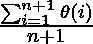
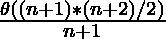
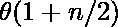

# 渐近符号以及如何计算它们

> 原文:[https://www . geeksforgeeks . org/渐近符号和计算方法/](https://www.geeksforgeeks.org/asymptotic-notations-and-how-to-calculate-them/)

在数学中， [**渐近分析**](https://www.geeksforgeeks.org/analysis-of-algorithms-set-1-asymptotic-analysis/) ，也称**渐近**，是描述函数极限行为的一种方法。在计算中，算法的[渐近分析](https://www.geeksforgeeks.org/analysis-of-algorithms-set-1-asymptotic-analysis/)指的是基于输入大小定义其运行时性能的数学界限。比如一个操作的运行时间计算为*****f*****(n)**，可能对于另一个操作，计算为***g*****(n****2**)。这意味着第一次操作的运行时间会随着 **n** 的增加而线性增加，当 **n** 增加时，第二次操作的运行时间会呈指数级增加。同样的，如果 **n** 值很小，两个操作的运行时间也会差不多。**

**通常，算法的[分析基于三种情况](https://www.geeksforgeeks.org/analysis-of-algorithms-set-2-asymptotic-analysis/):**

1.  ****最佳案例(****【ω】****)****
2.  ****平均值** **病例(T** **荷塔记法(ω)****)****
3.  ****最差情况(O 符号(O))****

**所有这些符号将在下面详细讨论:**

****omega(ω)**T2】符号:**

**ω**(ω)符号规定了函数 f(n)的渐近下界。对于给定的函数 g(n)，ω(g(n))由下式表示:****

> ****ω(g(n))= { f(n):存在正常数 c 和 n 0 ，使得 0 ≤ c*g(n) ≤ f(n)对于所有 n ≥ n 0 }。****
> 
> ****这意味着，f(n)=ω(g(n))，如果存在正常数 n 0 和 c，那么在 n 0 的右边，f(n)总是位于 c*g(n)之上。****

****

图示**** 

****按照以下步骤计算程序的ω:****

1.  ****将程序分成更小的部分。****
2.  ****假设给定的输入使得程序花费最少的时间，求每个段执行的操作数(根据输入大小)。****
3.  ****把所有的运算加起来简化一下，就说是 f(n)。****
4.  ****去掉所有的常数，选择阶次最小的项或任何其他函数，当 n 趋于无穷大时，总是小于 f(n)，假设它是 g(n)，那么 f(n)的ω(ω)就是ω(g(n))。****

****Omega 符号并不能真正帮助分析一个算法，因为评估一个算法的最佳输入情况是伪造的。****

********【heta】******符号:**********

****大θ(θ)符号指定函数 f(n)的界限。对于给定的函数 g(n)，θ(g(n))由下式表示:****

> ****θ(g(n))= { f(n):存在正常数 c 1 、c 2 和 n 0 使得 0≤c1* g(n)≤f(n)≤c2* g(n)对于所有 n ≥ n 的 0 }。****
> 
>  ****这意味着，f(n)=θ(g(n))，如果存在正常数 n 0 和 c，使得在 n 0 的右侧，f(n)总是位于 c 1 之上*g(n)和 c 2 之下*g(n)。****

****

图示**** 

****按照以下步骤计算程序的θ:****

1.  ****将程序分成更小的部分。****
2.  ****找到所有类型的输入，并计算它们需要执行的操作数。确保输入案例分布均匀。****
3.  ****求出所有计算值的总和，然后将总和除以输入总数，假设得到的 n 的函数是 g(n)，去掉所有常数后，在θ表示法中，它表示为θ(g(n))。****

******例:**在一个[线性搜索问题](https://www.geeksforgeeks.org/linear-search/)中，我们假设所有的情况都是[均匀分布的](https://www.geeksforgeeks.org/python-uniform-discrete-distribution-in-statistics/)(包括数组中没有键的情况)。所以，把键出现在位置 1，2，3，…，n 和不出现的所有情况相加，然后除以 n + 1。****

> ****平均案例时间复杂度= ****
> 
> ****⇒ ****
> 
> ****⇒ ****
> 
> ****⇒ ****

****由于在计算平均时间复杂度时考虑了所有类型的输入，因此它是算法的最佳分析方法之一。****

******大─或表示法:******

****大–0(0)符号指定函数 f(n)的渐近上限。对于给定的函数 g(n)，O(g(n))由下式表示:****

> ****ω(g(n))= { f(n):存在正常数 c 和 n 0 ，使得 f(n) ≤ c*g(n)对于所有 n ≥ n 0 }。****
> 
> ****这意味着，f(n)=ω(g(n))，如果存在正常数 n 0 和 c，那么在 n 0 的右边，f(n)总是位于 c*g(n)之上或之下。****

****

图示**** 

****按照以下步骤计算程序的 O:****

1.  ****将程序分成更小的部分。****
2.  ****假设给定的输入使得程序花费最大的时间，即最坏的情况，求每个段执行的操作数(根据输入大小)。****
3.  ****把所有的运算加起来简化一下，就说是 **f(n)。******
4.  ****移除所有常数，选择具有最高阶的项，因为对于 **n** 趋于无穷大， **f(n)** 中的常数和低阶项将是不重要的，假设函数是 **g(n)** ，那么[大-O 符号](https://www.geeksforgeeks.org/analysis-algorithms-big-o-analysis/)是 **O(g(n))。******

****它是最广泛使用的符号，因为它更容易计算，因为不需要像在θ符号的情况下那样检查每种类型的输入，也因为考虑了输入的最坏情况，它几乎给出了程序执行时间的上限。****