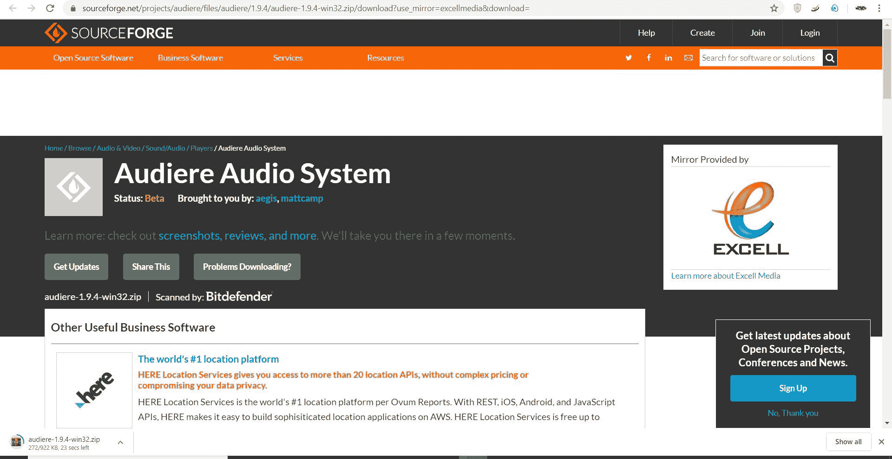
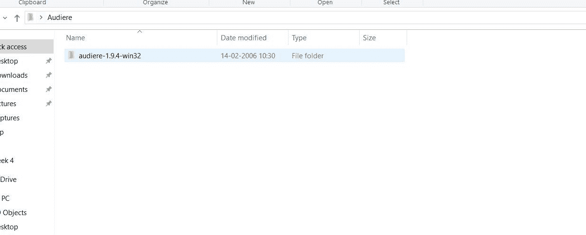
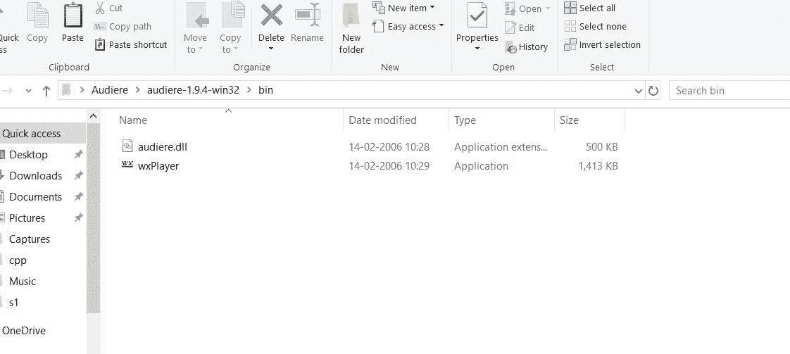
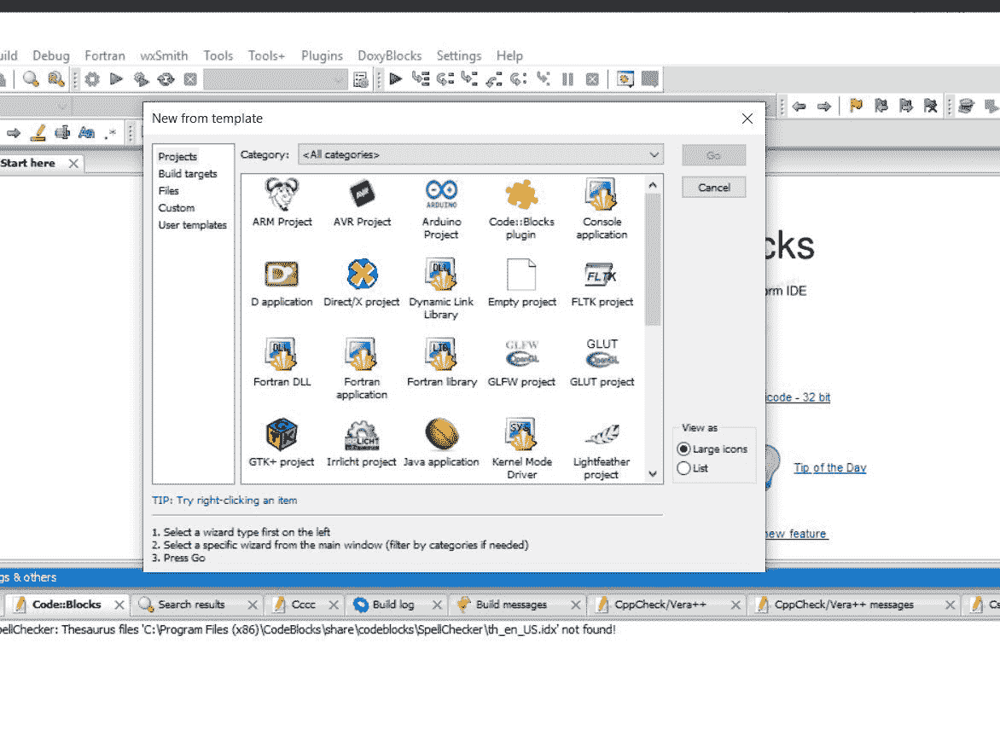
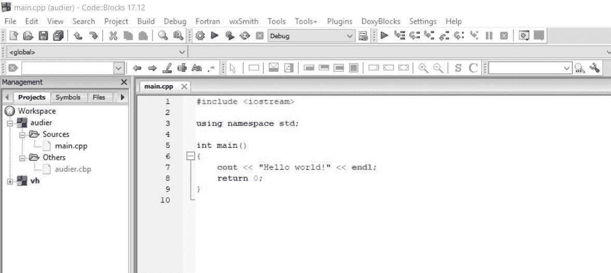
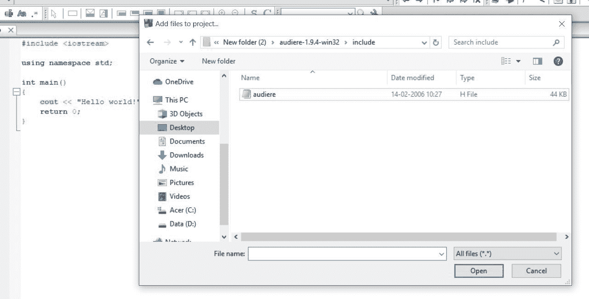
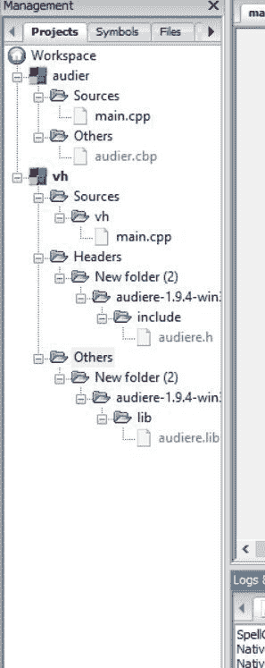

# 奥迪尔图书馆

> 原文:[https://www.geeksforgeeks.org/audiere-library/](https://www.geeksforgeeks.org/audiere-library/)

Audiere 是由**查德·奥斯汀和马修·坎贝尔**开发的高级音频 API。于 2001 年 8 月 6 日**发布。它支持 Windows 和 Linux 中的直接声音。它可以播放像 **WAV** 、 **MP3** 等格式的声音，也可以播放任何格式的声音。可以用在 [C](https://www.geeksforgeeks.org/c/) 、 [C++](https://www.geeksforgeeks.org/c-plus-plus/) 、 [Java](https://www.geeksforgeeks.org/java/) 等多种语言中。**

**安装奥迪车:**

*   **对于 Linux/Windows:** 设置环境可以从[这个](https://sourceforge.net/projects/audiere/files/audiere/1.9.4/audiere-1.9.4.tar.gz/download?use_mirror=excellmedia&download=)网站下载 Audiere 包。
*   **对于 MinGW:** 从下面的命令:

    ```
    ./configure --prefix=/mingw && make && make install

    ```

    为 Audiere 构建所有依赖项，包括 libogg、来自 xiph.org 的 libvorbis、libspeex、libdumb 和 FLAC

**设置环境:**

1.  为 windows 下载 Audiere。
    [](https://media.geeksforgeeks.org/wp-content/uploads/20200522165712/aud1.jpg)
2.  提取下载的文件。
    [](https://media.geeksforgeeks.org/wp-content/uploads/20200522165731/aud2.jpg)
3.  创建新文件夹。
    
4.  放置**audiere.dll**和一些音乐文件让我们说 **.mp3** 文件在里面。
    [](https://media.geeksforgeeks.org/wp-content/uploads/20200522165756/aud3.jpg)
5.  打开 DevCPP 并在目录中启动一个控制台项目。
    [](https://media.geeksforgeeks.org/wp-content/uploads/20200522165824/aud4.jpg)
6.  打开**主。项目的 CPP** 文件。
    [](https://media.geeksforgeeks.org/wp-content/uploads/20200522165849/aud5.jpg)
7.  转到项目选项，在**目录**中声明 **audiere.h** 文件的包含路径，并在参数中添加链接器路径<strong \ lib \ audiere . lib .
    [](https://media.geeksforgeeks.org/wp-content/uploads/20200522165907/aud6.jpg)
    [](https://media.geeksforgeeks.org/wp-content/uploads/20200522165921/aud7.jpg)

**头文件:**

```
#include <audiere.h>

```

<u>以下是该库</u>中使用的一些功能:

1.  **play():** 用于播放音频文件。
2.  **stop():** 用于停止音频文件。
3.  **isPlaying():** 用于检查是否有文件在播放。
4.  **reset():** 用于在播放任何音频文件时，对音频文件进行复位。
5.  **设置音量(浮动音量):**用于设置音频文件的音量。
6.  **设置重复(bool repeat):** 用于设置播放任何音频文件的重复次数。
7.  **设定盘(浮盘):**控制扬声器平衡。-0.1 仅通过左声道(或扬声器)输出声音，而+0.1 仅通过右声道(扬声器)输出声音。
8.  **isSeekable():** 它告诉我们你的音乐文件是否支持设置你声音的位置，可以用 setPosition 方法设置到想要的位置。通过调用 getPosition 函数总是可以知道当前位置
9.  **getLength():** 它给出你的音乐文件的长度
10.  **设定换档(浮动换档):**控制音调。值在 0.5 和 2.0 之间变化，1.0 是默认值。音量范围在 0.0 到 1.0 之间
11.  **getPitchShift():** 用于获取音调值。

下面是在 **audiere.h** 库中使用函数播放音乐的实现:

```
// C++ program to play music using
// audiere file function
#include "audiere.h"
#include <stdio>
#include <string>

// Using Audiere File
using namespace audiere;
using namespace std;

// Driver Code
int main(void)
{
    // Name of the file
    string name = "file1.mp3";

    // Create Object to open device
    AudioDevicePtr device(OpenDevice());

    // Create Object to open the music file
    OutputStreamPtr sound(OpenSound(device,
                                    name.c_str(),
                                    false));

    // Play music using play() function
    sound->play();

    // Repeat music using setRepeat() function
    sound->setRepeat(true);

    // Change volume using setVolume() function
    sound->setVolume(2.0f);

    getchar();
    return 0;
}
```