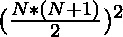
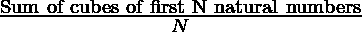
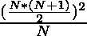
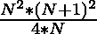
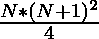

# 前 N 个自然数立方体的平均值

> 原文:[https://www . geeksforgeeks . org/第一个 n 个自然数的立方平均数/](https://www.geeksforgeeks.org/average-of-cubes-of-first-n-natural-numbers/)

给定一个正整数 **N** ，任务是求第一个 **N** 自然数的立方的平均值。
**例:**

> **输入:** N = 2
> **输出:** 4.5
> **解释:**
> 对于整数 N = 2，
> 我们有(1<sup>3</sup>+2<sup>3</sup>)= 1+8 = 9
> 平均值= 9 / 2 即 4.5
> **输入:** N = 3
> **输出:** 12
> 
> 我们有(1<sup>3</sup>+2<sup>3</sup>+2<sup>3</sup>+2<sup>3</sup>+3<sup>3</sup>+2<sup>3</sup>)= 27+8+1 = 36
> 平均值= 36 / 3 也就是 12

**天真法:**天真法是求前 N 个自然数的立方之和[，除以 **N** 。
以下是上述方法的实施:](https://www.geeksforgeeks.org/program-cube-sum-first-n-natural-numbers/)

## C

```
// C program for the above approach
#include <stdio.h>

// Function to find average of cubes
double findAverageOfCube(int n)
{
    // Store sum of cubes of
    // numbers in the sum
    double sum = 0;

    // Calculate sum of cubes
    int i;
    for (i = 1; i <= n; i++) {
        sum += i * i * i;
    }

    // Return average
    return sum / n;
}

// Driver Code
int main()
{
    // Given number
    int n = 3;

    // Function Call
    printf("%lf", findAverageOfCube(n));
    return 0;
}
```

## C++

```
// C++ program for the above approach
#include <bits/stdc++.h>
using namespace std;

// Function to find average of cubes
double findAverageOfCube(int n)
{
    // Storing sum of cubes
    // of numbers in sum
    double sum = 0;

    // Calculate sum of cubes
    for (int i = 1; i <= n; i++) {
        sum += i * i * i;
    }

    // Return average
    return sum / n;
}

// Driver Code
int main()
{
    // Given Number
    int n = 3;

    // Function Call
    cout << findAverageOfCube(n);
}
```

## Java 语言(一种计算机语言，尤用于创建网站)

```
// Java program for the above approach
import java.util.*;
import java.io.*;
class GFG{

// Function to find average of cubes
static double findAverageOfCube(int n)
{
    // Storing sum of cubes
    // of numbers in sum
    double sum = 0;

    // Calculate sum of cubes
    for (int i = 1; i <= n; i++)
    {
        sum += i * i * i;
    }

    // Return average
    return sum / n;
}

// Driver Code
public static void main(String[] args)
{
    // Given Number
    int n = 3;

    // Function Call
    System.out.print(findAverageOfCube(n));
}
}

// This code is contributed by shivanisinghss2110
```

## 蟒蛇 3

```
# Python3 program for the above approach

# Function to find average of cubes
def findAverageOfCube(n):

    # Storing sum of cubes
    # of numbers in sum
    sum = 0

    # Calculate sum of cubes
    for i in range(1, n + 1):
        sum += i * i * i

    # Return average
    return round(sum / n, 6)

# Driver Code
if __name__ == '__main__':

    # Given Number
    n = 3

    # Function Call
    print(findAverageOfCube(n))

# This code is contributed by mohit kumar 29
```

## C#

```
// C# program for the above approach
using System;
class GFG{

// Function to find average of cubes
static double findAverageOfCube(int n)
{
    // Storing sum of cubes
    // of numbers in sum
    double sum = 0;

    // Calculate sum of cubes
    for (int i = 1; i <= n; i++)
    {
        sum += i * i * i;
    }

    // Return average
    return sum / n;
}

// Driver Code
public static void Main()
{
    // Given Number
    int n = 3;

    // Function Call
    Console.Write(findAverageOfCube(n));
}
}

// This code is contributed by Nidhi_biet
```

## java 描述语言

```
<script>
// javascript program for the above approach

// Function to find average of cubes
function findAverageOfCube( n)
{

    // Store sum of cubes of
    // numbers in the sum
    let sum = 0;

    // Calculate sum of cubes
    let i;
    for (i = 1; i <= n; i++) {
        sum += i * i * i;
    }

    // Return average
    return sum / n;
}

// Driver Code

    // Given number
    let n = 3;

    // Function Call
    document.write(findAverageOfCube(n).toFixed(6));

// This code is contributed by todaysgaurav

</script>
```

**Output:** 

```
12.000000
```

**时间复杂度:***O(N)*
T5】高效进场:

> 我们知道，
> 第一个 **N** 自然数的立方之和=
> 
> 
> 
> 的平均值由下式给出:
> =>
> 
> 
> =>
> 
> 
> =>
> 
> 
> =>
> 

因此，第一个 **N 个**自然数的立方和的平均值由


给出，以下是上述方法的实现:

## C

```
// C program for the above approach
#include <stdio.h>

// Function to find average of cubes
double findAverageOfCube(int n)
{
    // Store sum of cubes of
    // numbers in the sum
    double sum = 0;

    // Calculate sum of cubes
    int i;
    for (i = 1; i <= n; i++) {
        sum += i * i * i;
    }

    // Return average
    return sum / n;
}

// Driver Code
int main()
{
    // Given number
    int n = 3;

    // Function Call
    printf("%lf", findAverageOfCube(n));

    return 0;
}
```

## C++

```
// C++ program for the above approach
#include <bits/stdc++.h>
using namespace std;

// function to find an average of cubes
double findAverageofCube(double n)
{
    // Apply the formula n(n+1)^2/4
    int ans = (n * (n + 1) * (n + 1)) / 4;
    return ans;
}

// Driver Code
int main()
{
    // Given Number
    int n = 3;

    // Function Call
    cout << findAverageofCube(n);

    return 0;
}
```

## Java 语言(一种计算机语言，尤用于创建网站)

```
// Java program for the above approach
class GFG{

// function to find an average of cubes
static double findAverageofCube(double n)
{
    // Apply the formula n(n+1)^2/4
    int ans = (int)((n * (n + 1) * (n + 1)) / 4);
    return ans;
}

// Driver Code
public static void main(String[] args)
{
    // Given Number
    int n = 3;

    // Function Call
    System.out.print(findAverageofCube(n));
}
}

// This code is contributed by shivanisinghss2110
```

## 蟒蛇 3

```
# Python3 program for the above approach

# Function to find average of cubes
def findAverageOfCube (n):

    # Apply the formula n*(n+1)^2/4
    ans = (n * (n + 1) * (n + 1)) / 4
    return ans

# Driver code
if __name__ == '__main__':

    # Given number
    n = 3

    # Function call
    print(findAverageOfCube(n))

# This code is contributed by himanshu77
```

## C#

```
// C# program for the above approach
using System;
class GFG{

// function to find an average of cubes
static double findAverageofCube(double n)
{
    // Apply the formula n(n+1)^2/4
    int ans = (int)((n * (n + 1) * (n + 1)) / 4);
    return ans;
}

// Driver Code
public static void Main()
{
    // Given Number
    int n = 3;

    // Function Call
    Console.Write(findAverageofCube(n));
}
}

// This code is contributed by Code_Mech
```

## java 描述语言

```
<script>
// javascript program for the above approach
// function to find an average of cubes
function findAverageofCube(n)
{
    // Apply the formula n(n+1)^2/4
    var ans = parseInt(((n * (n + 1) * (n + 1)) / 4));
    return ans;
}

// Driver Code

// Given Number
var n = 3;

// Function Call
document.write(findAverageofCube(n));

// This code is contributed by Amit Katiyar
</script>
```

**Output:** 

```
12.000000
```

**时间复杂度:** *O(1)*