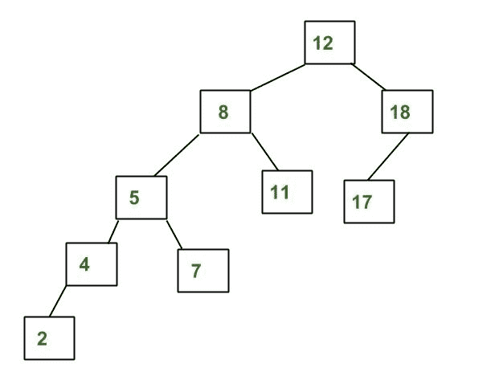
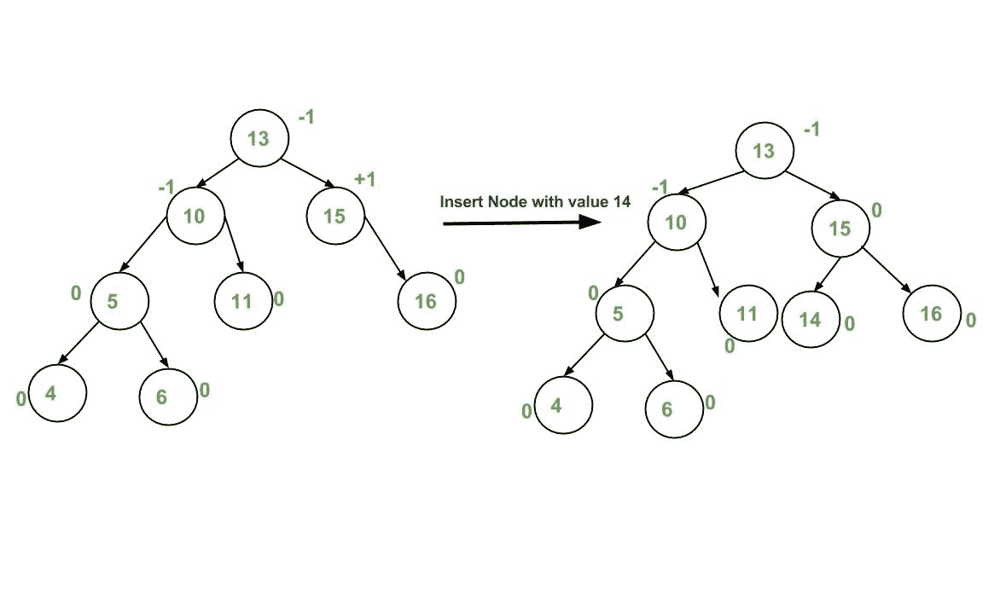
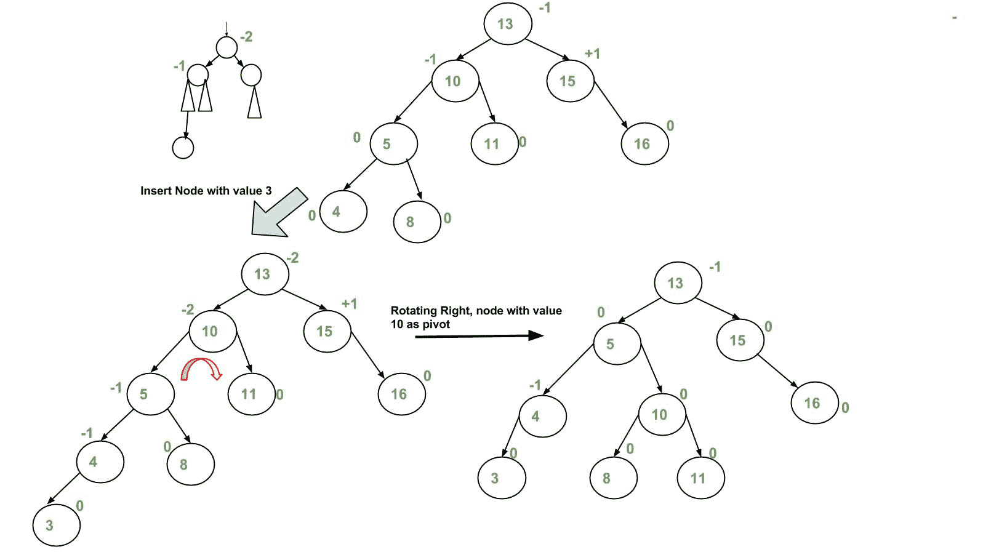
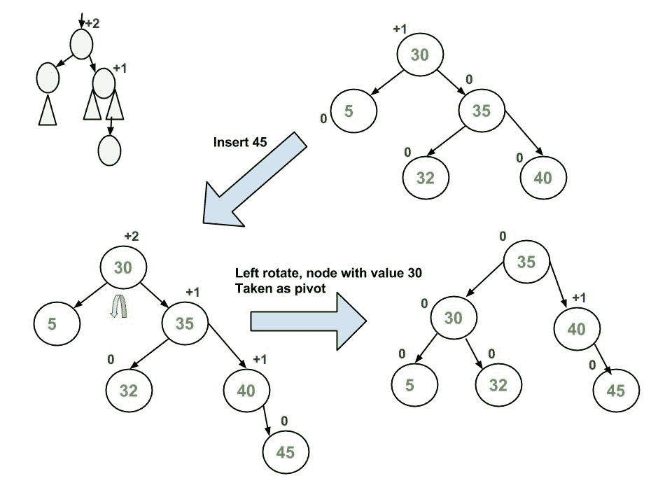
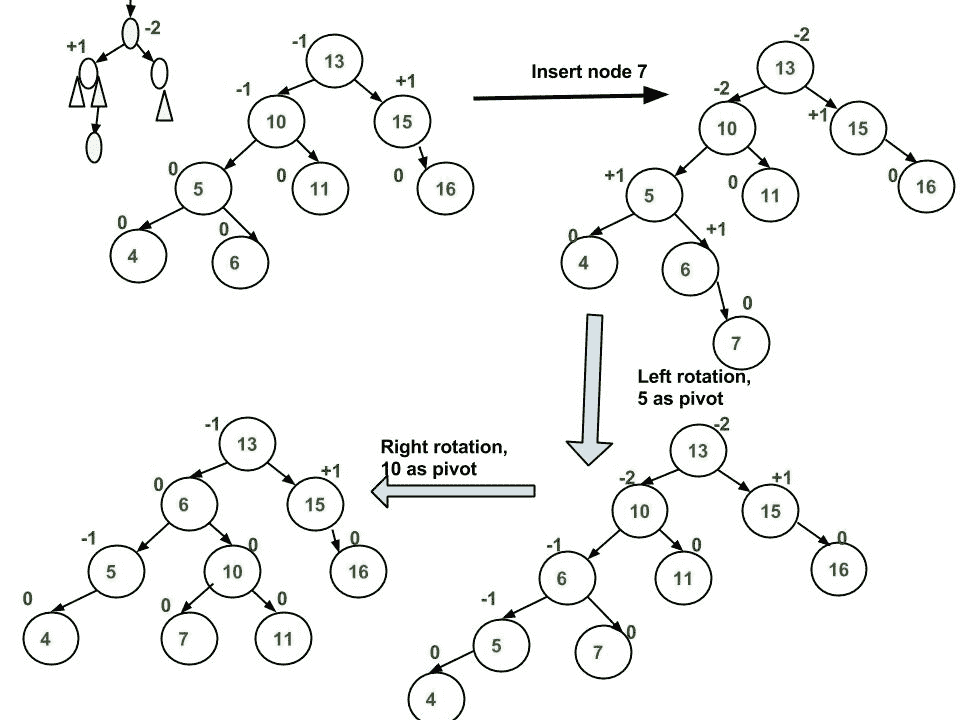
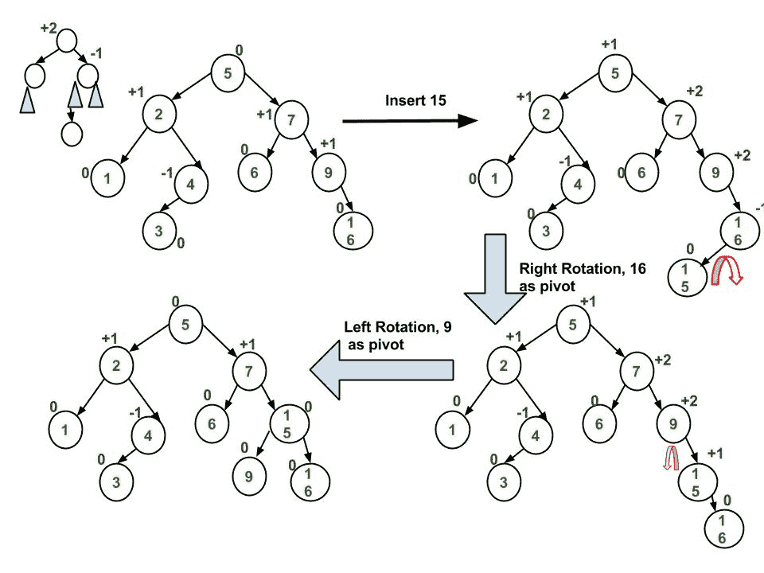

# AVL 树|集合 1(插入)

> 原文:[https://www.geeksforgeeks.org/avl-tree-set-1-insertion/](https://www.geeksforgeeks.org/avl-tree-set-1-insertion/)

AVL 树是一种自平衡二叉查找树树，其中左右子树的高度差对于所有节点不能超过一。
**是 AVL 树的示例树**


上面的树是 AVL 树，因为每个节点的左右子树的高度差小于或等于 1。
**不是 AVL 树的示例树**



上面的树不是 AVL 树，因为 8 和 12 的左右子树的高度差大于 1。
**为什么是 AVL 树？**
大多数 BST 操作(例如，搜索、最大、最小、插入、删除..等等)取 O(h)时间，其中 h 是 BST 的高度。对于倾斜的二叉树，这些操作的代价可能变成 0(n)。如果我们确保在每次插入和删除后树的高度保持为 0(Logn)，那么我们可以保证所有这些操作的 0(Logn)的上限。AVL 树的高度始终为 O(Logn)，其中 n 是树中的节点数(参见[本](http://www.youtube.com/watch?v=TbvhGcf6UJU)视频讲座以获取证明)。

**插入**
为了确保给定的树在每次插入后都保持 AVL，我们必须增加标准的 BST 插入操作来执行一些重新平衡。以下是可以执行的两个基本操作，以在不违反 BST 属性的情况下重新平衡 BST(键(左)<键(根)<键(右))。
1)左旋转
2)右旋转

```
T1, T2 and T3 are subtrees of the tree 
rooted with y (on the left side) or x (on 
the right side)           
     y                               x
    / \     Right Rotation          /  \
   x   T3   - - - - - - - >        T1   y 
  / \       < - - - - - - -            / \
 T1  T2     Left Rotation            T2  T3
Keys in both of the above trees follow the 
following order 
 keys(T1) < key(x) < keys(T2) < key(y) < keys(T3)
So BST property is not violated anywhere.
```

**插入要遵循的步骤**
让新插入的节点为 w
**1)** 对 w 执行标准 BST 插入
**2)** 从 w 开始，向上行进，找到第一个不平衡节点。设 z 为第一个不平衡节点，y 为从 w 到 z 路径上来的 z 的子节点，x 为从 w 到 z 路径上来的 z 的孙节点
**3)** 通过对以 z 为根的子树进行适当的旋转来重新平衡树，可以有 4 种可能的情况需要处理，因为 x、y、z 可以有 4 种排列方式。以下是可能的 4 种排列:
a) y 是 z 的左子代，x 是 y 的左子代(左左例)
b) y 是 z 的左子代，x 是 y 的右子代(左右例)
c) y 是 z 的右子代，x 是 y 的右子代(右右右例)
d) y 是 z 的右子代，x 是 y 的左子代(右左例)
以下是上述 4 种情况下要执行的操作。在所有情况下，我们只需要重新平衡以 z 为根的子树，随着以 z 为根的子树的高度(经过适当的旋转)变得与插入前相同，整个树变得平衡。(见[本](http://www.youtube.com/watch?v=TbvhGcf6UJU)视频讲座求证)
**a)左左案**

```
T1, T2, T3 and T4 are subtrees.
         z                                      y 
        / \                                   /   \
       y   T4      Right Rotate (z)          x      z
      / \          - - - - - - - - ->      /  \    /  \ 
     x   T3                               T1  T2  T3  T4
    / \
  T1   T2
```

**b)左右箱**

```
     z                               z                           x
    / \                            /   \                        /  \ 
   y   T4  Left Rotate (y)        x    T4  Right Rotate(z)    y      z
  / \      - - - - - - - - ->    /  \      - - - - - - - ->  / \    / \
T1   x                          y    T3                    T1  T2 T3  T4
    / \                        / \
  T2   T3                    T1   T2
```

**c)右右壳体**

```
  z                                y
 /  \                            /   \ 
T1   y     Left Rotate(z)       z      x
    /  \   - - - - - - - ->    / \    / \
   T2   x                     T1  T2 T3  T4
       / \
     T3  T4
```

**d)右左箱**

```
   z                            z                            x
  / \                          / \                          /  \ 
T1   y   Right Rotate (y)    T1   x      Left Rotate(z)   z      y
    / \  - - - - - - - - ->     /  \   - - - - - - - ->  / \    / \
   x   T4                      T2   y                  T1  T2  T3  T4
  / \                              /  \
T2   T3                           T3   T4
```

**插入示例:**











**实现**
以下是 AVL 树插入的实现。下面的实现使用递归 BST 插入来插入一个新节点。在递归 BST 插入中，插入后，我们以自下而上的方式一个接一个地获得指向所有祖先的指针。所以我们不需要父指针向上移动。递归代码本身向上运行并访问新插入节点的所有祖先。
1)进行正常的 BST 插入。
2)当前节点必须是新插入节点的祖先节点之一。更新当前节点的高度。
3)获取当前节点的平衡因子(左子树高度–右子树高度)。
4)如果平衡因子大于 1，那么当前节点不平衡，我们不是左左就是左右。要检查是否是左大小写，请将新插入的键与左子树根中的键进行比较。
5)如果平衡因子小于-1，则当前节点不平衡，我们处于右右情况或右左情况。要检查是否是右右大小写，请将新插入的键与右子树根中的键进行比较。

## C++

```
// C++ program to insert a node in AVL tree
#include<bits/stdc++.h>
using namespace std;

// An AVL tree node
class Node
{
    public:
    int key;
    Node *left;
    Node *right;
    int height;
};

// A utility function to get maximum
// of two integers
int max(int a, int b);

// A utility function to get the
// height of the tree
int height(Node *N)
{
    if (N == NULL)
        return 0;
    return N->height;
}

// A utility function to get maximum
// of two integers
int max(int a, int b)
{
    return (a > b)? a : b;
}

/* Helper function that allocates a
   new node with the given key and
   NULL left and right pointers. */
Node* newNode(int key)
{
    Node* node = new Node();
    node->key = key;
    node->left = NULL;
    node->right = NULL;
    node->height = 1; // new node is initially
                      // added at leaf
    return(node);
}

// A utility function to right
// rotate subtree rooted with y
// See the diagram given above.
Node *rightRotate(Node *y)
{
    Node *x = y->left;
    Node *T2 = x->right;

    // Perform rotation
    x->right = y;
    y->left = T2;

    // Update heights
    y->height = max(height(y->left),
                    height(y->right)) + 1;
    x->height = max(height(x->left),
                    height(x->right)) + 1;

    // Return new root
    return x;
}

// A utility function to left
// rotate subtree rooted with x
// See the diagram given above.
Node *leftRotate(Node *x)
{
    Node *y = x->right;
    Node *T2 = y->left;

    // Perform rotation
    y->left = x;
    x->right = T2;

    // Update heights
    x->height = max(height(x->left),   
                    height(x->right)) + 1;
    y->height = max(height(y->left),
                    height(y->right)) + 1;

    // Return new root
    return y;
}

// Get Balance factor of node N
int getBalance(Node *N)
{
    if (N == NULL)
        return 0;
    return height(N->left) - height(N->right);
}

// Recursive function to insert a key
// in the subtree rooted with node and
// returns the new root of the subtree.
Node* insert(Node* node, int key)
{
    /* 1\. Perform the normal BST insertion */
    if (node == NULL)
        return(newNode(key));

    if (key < node->key)
        node->left = insert(node->left, key);
    else if (key > node->key)
        node->right = insert(node->right, key);
    else // Equal keys are not allowed in BST
        return node;

    /* 2\. Update height of this ancestor node */
    node->height = 1 + max(height(node->left),
                        height(node->right));

    /* 3\. Get the balance factor of this ancestor
        node to check whether this node became
        unbalanced */
    int balance = getBalance(node);

    // If this node becomes unbalanced, then
    // there are 4 cases

    // Left Left Case
    if (balance > 1 && key < node->left->key)
        return rightRotate(node);

    // Right Right Case
    if (balance < -1 && key > node->right->key)
        return leftRotate(node);

    // Left Right Case
    if (balance > 1 && key > node->left->key)
    {
        node->left = leftRotate(node->left);
        return rightRotate(node);
    }

    // Right Left Case
    if (balance < -1 && key < node->right->key)
    {
        node->right = rightRotate(node->right);
        return leftRotate(node);
    }

    /* return the (unchanged) node pointer */
    return node;
}

// A utility function to print preorder
// traversal of the tree.
// The function also prints height
// of every node
void preOrder(Node *root)
{
    if(root != NULL)
    {
        cout << root->key << " ";
        preOrder(root->left);
        preOrder(root->right);
    }
}

// Driver Code
int main()
{
    Node *root = NULL;

    /* Constructing tree given in
    the above figure */
    root = insert(root, 10);
    root = insert(root, 20);
    root = insert(root, 30);
    root = insert(root, 40);
    root = insert(root, 50);
    root = insert(root, 25);

    /* The constructed AVL Tree would be
                30
            / \
            20 40
            / \ \
        10 25 50
    */
    cout << "Preorder traversal of the "
            "constructed AVL tree is \n";
    preOrder(root);

    return 0;
}

// This code is contributed by
// rathbhupendra
```

## C

```
// C program to insert a node in AVL tree
#include<stdio.h>
#include<stdlib.h>

// An AVL tree node
struct Node
{
    int key;
    struct Node *left;
    struct Node *right;
    int height;
};

// A utility function to get maximum of two integers
int max(int a, int b);

// A utility function to get the height of the tree
int height(struct Node *N)
{
    if (N == NULL)
        return 0;
    return N->height;
}

// A utility function to get maximum of two integers
int max(int a, int b)
{
    return (a > b)? a : b;
}

/* Helper function that allocates a new node with the given key and
    NULL left and right pointers. */
struct Node* newNode(int key)
{
    struct Node* node = (struct Node*)
                        malloc(sizeof(struct Node));
    node->key   = key;
    node->left   = NULL;
    node->right  = NULL;
    node->height = 1;  // new node is initially added at leaf
    return(node);
}

// A utility function to right rotate subtree rooted with y
// See the diagram given above.
struct Node *rightRotate(struct Node *y)
{
    struct Node *x = y->left;
    struct Node *T2 = x->right;

    // Perform rotation
    x->right = y;
    y->left = T2;

    // Update heights
    y->height = max(height(y->left), height(y->right))+1;
    x->height = max(height(x->left), height(x->right))+1;

    // Return new root
    return x;
}

// A utility function to left rotate subtree rooted with x
// See the diagram given above.
struct Node *leftRotate(struct Node *x)
{
    struct Node *y = x->right;
    struct Node *T2 = y->left;

    // Perform rotation
    y->left = x;
    x->right = T2;

    //  Update heights
    x->height = max(height(x->left), height(x->right))+1;
    y->height = max(height(y->left), height(y->right))+1;

    // Return new root
    return y;
}

// Get Balance factor of node N
int getBalance(struct Node *N)
{
    if (N == NULL)
        return 0;
    return height(N->left) - height(N->right);
}

// Recursive function to insert a key in the subtree rooted
// with node and returns the new root of the subtree.
struct Node* insert(struct Node* node, int key)
{
    /* 1.  Perform the normal BST insertion */
    if (node == NULL)
        return(newNode(key));

    if (key < node->key)
        node->left  = insert(node->left, key);
    else if (key > node->key)
        node->right = insert(node->right, key);
    else // Equal keys are not allowed in BST
        return node;

    /* 2\. Update height of this ancestor node */
    node->height = 1 + max(height(node->left),
                           height(node->right));

    /* 3\. Get the balance factor of this ancestor
          node to check whether this node became
          unbalanced */
    int balance = getBalance(node);

    // If this node becomes unbalanced, then
    // there are 4 cases

    // Left Left Case
    if (balance > 1 && key < node->left->key)
        return rightRotate(node);

    // Right Right Case
    if (balance < -1 && key > node->right->key)
        return leftRotate(node);

    // Left Right Case
    if (balance > 1 && key > node->left->key)
    {
        node->left =  leftRotate(node->left);
        return rightRotate(node);
    }

    // Right Left Case
    if (balance < -1 && key < node->right->key)
    {
        node->right = rightRotate(node->right);
        return leftRotate(node);
    }

    /* return the (unchanged) node pointer */
    return node;
}

// A utility function to print preorder traversal
// of the tree.
// The function also prints height of every node
void preOrder(struct Node *root)
{
    if(root != NULL)
    {
        printf("%d ", root->key);
        preOrder(root->left);
        preOrder(root->right);
    }
}

/* Driver program to test above function*/
int main()
{
  struct Node *root = NULL;

  /* Constructing tree given in the above figure */
  root = insert(root, 10);
  root = insert(root, 20);
  root = insert(root, 30);
  root = insert(root, 40);
  root = insert(root, 50);
  root = insert(root, 25);

  /* The constructed AVL Tree would be
            30
           /  \
         20   40
        /  \     \
       10  25    50
  */

  printf("Preorder traversal of the constructed AVL"
         " tree is \n");
  preOrder(root);

  return 0;
}
```

## Java 语言(一种计算机语言，尤用于创建网站)

```
// Java program for insertion in AVL Tree
class Node {
    int key, height;
    Node left, right;

    Node(int d) {
        key = d;
        height = 1;
    }
}

class AVLTree {

    Node root;

    // A utility function to get the height of the tree
    int height(Node N) {
        if (N == null)
            return 0;

        return N.height;
    }

    // A utility function to get maximum of two integers
    int max(int a, int b) {
        return (a > b) ? a : b;
    }

    // A utility function to right rotate subtree rooted with y
    // See the diagram given above.
    Node rightRotate(Node y) {
        Node x = y.left;
        Node T2 = x.right;

        // Perform rotation
        x.right = y;
        y.left = T2;

        // Update heights
        y.height = max(height(y.left), height(y.right)) + 1;
        x.height = max(height(x.left), height(x.right)) + 1;

        // Return new root
        return x;
    }

    // A utility function to left rotate subtree rooted with x
    // See the diagram given above.
    Node leftRotate(Node x) {
        Node y = x.right;
        Node T2 = y.left;

        // Perform rotation
        y.left = x;
        x.right = T2;

        //  Update heights
        x.height = max(height(x.left), height(x.right)) + 1;
        y.height = max(height(y.left), height(y.right)) + 1;

        // Return new root
        return y;
    }

    // Get Balance factor of node N
    int getBalance(Node N) {
        if (N == null)
            return 0;

        return height(N.left) - height(N.right);
    }

    Node insert(Node node, int key) {

        /* 1.  Perform the normal BST insertion */
        if (node == null)
            return (new Node(key));

        if (key < node.key)
            node.left = insert(node.left, key);
        else if (key > node.key)
            node.right = insert(node.right, key);
        else // Duplicate keys not allowed
            return node;

        /* 2\. Update height of this ancestor node */
        node.height = 1 + max(height(node.left),
                              height(node.right));

        /* 3\. Get the balance factor of this ancestor
              node to check whether this node became
              unbalanced */
        int balance = getBalance(node);

        // If this node becomes unbalanced, then there
        // are 4 cases Left Left Case
        if (balance > 1 && key < node.left.key)
            return rightRotate(node);

        // Right Right Case
        if (balance < -1 && key > node.right.key)
            return leftRotate(node);

        // Left Right Case
        if (balance > 1 && key > node.left.key) {
            node.left = leftRotate(node.left);
            return rightRotate(node);
        }

        // Right Left Case
        if (balance < -1 && key < node.right.key) {
            node.right = rightRotate(node.right);
            return leftRotate(node);
        }

        /* return the (unchanged) node pointer */
        return node;
    }

    // A utility function to print preorder traversal
    // of the tree.
    // The function also prints height of every node
    void preOrder(Node node) {
        if (node != null) {
            System.out.print(node.key + " ");
            preOrder(node.left);
            preOrder(node.right);
        }
    }

    public static void main(String[] args) {
        AVLTree tree = new AVLTree();

        /* Constructing tree given in the above figure */
        tree.root = tree.insert(tree.root, 10);
        tree.root = tree.insert(tree.root, 20);
        tree.root = tree.insert(tree.root, 30);
        tree.root = tree.insert(tree.root, 40);
        tree.root = tree.insert(tree.root, 50);
        tree.root = tree.insert(tree.root, 25);

        /* The constructed AVL Tree would be
             30
            /  \
          20   40
         /  \     \
        10  25    50
        */
        System.out.println("Preorder traversal" +
                        " of constructed tree is : ");
        tree.preOrder(tree.root);
    }
}
// This code has been contributed by Mayank Jaiswal
```

## 蟒蛇 3

```
# Python code to insert a node in AVL tree

# Generic tree node class
class TreeNode(object):
    def __init__(self, val):
        self.val = val
        self.left = None
        self.right = None
        self.height = 1

# AVL tree class which supports the
# Insert operation
class AVL_Tree(object):

    # Recursive function to insert key in
    # subtree rooted with node and returns
    # new root of subtree.
    def insert(self, root, key):

        # Step 1 - Perform normal BST
        if not root:
            return TreeNode(key)
        elif key < root.val:
            root.left = self.insert(root.left, key)
        else:
            root.right = self.insert(root.right, key)

        # Step 2 - Update the height of the
        # ancestor node
        root.height = 1 + max(self.getHeight(root.left),
                           self.getHeight(root.right))

        # Step 3 - Get the balance factor
        balance = self.getBalance(root)

        # Step 4 - If the node is unbalanced,
        # then try out the 4 cases
        # Case 1 - Left Left
        if balance > 1 and key < root.left.val:
            return self.rightRotate(root)

        # Case 2 - Right Right
        if balance < -1 and key > root.right.val:
            return self.leftRotate(root)

        # Case 3 - Left Right
        if balance > 1 and key > root.left.val:
            root.left = self.leftRotate(root.left)
            return self.rightRotate(root)

        # Case 4 - Right Left
        if balance < -1 and key < root.right.val:
            root.right = self.rightRotate(root.right)
            return self.leftRotate(root)

        return root

    def leftRotate(self, z):

        y = z.right
        T2 = y.left

        # Perform rotation
        y.left = z
        z.right = T2

        # Update heights
        z.height = 1 + max(self.getHeight(z.left),
                         self.getHeight(z.right))
        y.height = 1 + max(self.getHeight(y.left),
                         self.getHeight(y.right))

        # Return the new root
        return y

    def rightRotate(self, z):

        y = z.left
        T3 = y.right

        # Perform rotation
        y.right = z
        z.left = T3

        # Update heights
        z.height = 1 + max(self.getHeight(z.left),
                        self.getHeight(z.right))
        y.height = 1 + max(self.getHeight(y.left),
                        self.getHeight(y.right))

        # Return the new root
        return y

    def getHeight(self, root):
        if not root:
            return 0

        return root.height

    def getBalance(self, root):
        if not root:
            return 0

        return self.getHeight(root.left) - self.getHeight(root.right)

    def preOrder(self, root):

        if not root:
            return

        print("{0} ".format(root.val), end="")
        self.preOrder(root.left)
        self.preOrder(root.right)

# Driver program to test above function
myTree = AVL_Tree()
root = None

root = myTree.insert(root, 10)
root = myTree.insert(root, 20)
root = myTree.insert(root, 30)
root = myTree.insert(root, 40)
root = myTree.insert(root, 50)
root = myTree.insert(root, 25)

"""The constructed AVL Tree would be
            30
           /  \
         20   40
        /  \     \
       10  25    50"""

# Preorder Traversal
print("Preorder traversal of the",
      "constructed AVL tree is")
myTree.preOrder(root)
print()

# This code is contributed by Ajitesh Pathak
```

## C#

```
// C# program for insertion in AVL Tree
using System;

class Node
{
    public int key, height;
    public Node left, right;

    public Node(int d)
    {
        key = d;
        height = 1;
    }
}

public class AVLTree
{

    Node root;

    // A utility function to get
    // the height of the tree
    int height(Node N)
    {
        if (N == null)
            return 0;

        return N.height;
    }

    // A utility function to get
    // maximum of two integers
    int max(int a, int b)
    {
        return (a > b) ? a : b;
    }

    // A utility function to right
    // rotate subtree rooted with y
    // See the diagram given above.
    Node rightRotate(Node y)
    {
        Node x = y.left;
        Node T2 = x.right;

        // Perform rotation
        x.right = y;
        y.left = T2;

        // Update heights
        y.height = max(height(y.left),
                    height(y.right)) + 1;
        x.height = max(height(x.left),
                    height(x.right)) + 1;

        // Return new root
        return x;
    }

    // A utility function to left
    // rotate subtree rooted with x
    // See the diagram given above.
    Node leftRotate(Node x)
    {
        Node y = x.right;
        Node T2 = y.left;

        // Perform rotation
        y.left = x;
        x.right = T2;

        // Update heights
        x.height = max(height(x.left),
                    height(x.right)) + 1;
        y.height = max(height(y.left),
                    height(y.right)) + 1;

        // Return new root
        return y;
    }

    // Get Balance factor of node N
    int getBalance(Node N)
    {
        if (N == null)
            return 0;

        return height(N.left) - height(N.right);
    }

    Node insert(Node node, int key)
    {

        /* 1\. Perform the normal BST insertion */
        if (node == null)
            return (new Node(key));

        if (key < node.key)
            node.left = insert(node.left, key);
        else if (key > node.key)
            node.right = insert(node.right, key);
        else // Duplicate keys not allowed
            return node;

        /* 2\. Update height of this ancestor node */
        node.height = 1 + max(height(node.left),
                            height(node.right));

        /* 3\. Get the balance factor of this ancestor
            node to check whether this node became
            unbalanced */
        int balance = getBalance(node);

        // If this node becomes unbalanced, then there
        // are 4 cases Left Left Case
        if (balance > 1 && key < node.left.key)
            return rightRotate(node);

        // Right Right Case
        if (balance < -1 && key > node.right.key)
            return leftRotate(node);

        // Left Right Case
        if (balance > 1 && key > node.left.key)
        {
            node.left = leftRotate(node.left);
            return rightRotate(node);
        }

        // Right Left Case
        if (balance < -1 && key < node.right.key)
        {
            node.right = rightRotate(node.right);
            return leftRotate(node);
        }

        /* return the (unchanged) node pointer */
        return node;
    }

    // A utility function to print preorder traversal
    // of the tree.
    // The function also prints height of every node
    void preOrder(Node node)
    {
        if (node != null)
        {
            Console.Write(node.key + " ");
            preOrder(node.left);
            preOrder(node.right);
        }
    }

    // Driver code
    public static void Main(String[] args)
    {
        AVLTree tree = new AVLTree();

        /* Constructing tree given in the above figure */
        tree.root = tree.insert(tree.root, 10);
        tree.root = tree.insert(tree.root, 20);
        tree.root = tree.insert(tree.root, 30);
        tree.root = tree.insert(tree.root, 40);
        tree.root = tree.insert(tree.root, 50);
        tree.root = tree.insert(tree.root, 25);

        /* The constructed AVL Tree would be
            30
            / \
        20 40
        / \ \
        10 25 50
        */
        Console.Write("Preorder traversal" +
                        " of constructed tree is : ");
        tree.preOrder(tree.root);
    }
}

// This code has been contributed
// by PrinciRaj1992
```

## java 描述语言

```
<script>

      // JavaScript program for insertion in AVL Tree
      class Node {
        constructor(d) {
          this.key = d;
          this.height = 1;
          this.left = null;
          this.right = null;
        }
      }

      class AVLTree {
        constructor() {
          this.root = null;
        }

        // A utility function to get
        // the height of the tree
        height(N) {
          if (N == null) return 0;

          return N.height;
        }

        // A utility function to get
        // maximum of two integers
        max(a, b) {
          return a > b ? a : b;
        }

        // A utility function to right
        // rotate subtree rooted with y
        // See the diagram given above.
        rightRotate(y) {
          var x = y.left;
          var T2 = x.right;

          // Perform rotation
          x.right = y;
          y.left = T2;

          // Update heights
          y.height = this.max(this.height(y.left),
          this.height(y.right)) + 1;
          x.height = this.max(this.height(x.left),
          this.height(x.right)) + 1;

          // Return new root
          return x;
        }

        // A utility function to left
        // rotate subtree rooted with x
        // See the diagram given above.
        leftRotate(x) {
          var y = x.right;
          var T2 = y.left;

          // Perform rotation
          y.left = x;
          x.right = T2;

          // Update heights
          x.height = this.max(this.height(x.left),
          this.height(x.right)) + 1;
          y.height = this.max(this.height(y.left),
          this.height(y.right)) + 1;

          // Return new root
          return y;
        }

        // Get Balance factor of node N
        getBalance(N) {
          if (N == null) return 0;

          return this.height(N.left) - this.height(N.right);
        }

        insert(node, key) {
          /* 1\. Perform the normal BST insertion */
          if (node == null) return new Node(key);

          if (key < node.key)
          node.left = this.insert(node.left, key);
          else if (key > node.key)
          node.right = this.insert(node.right, key);
          // Duplicate keys not allowed
          else return node;

          /* 2\. Update height of this ancestor node */
          node.height =
            1 + this.max(this.height(node.left),
                this.height(node.right));

          /* 3\. Get the balance factor of this ancestor
            node to check whether this node became
            unbalanced */
          var balance = this.getBalance(node);

          // If this node becomes unbalanced, then there
          // are 4 cases Left Left Case
          if (balance > 1 && key < node.left.key)
          return this.rightRotate(node);

          // Right Right Case
          if (balance < -1 && key > node.right.key)
            return this.leftRotate(node);

          // Left Right Case
          if (balance > 1 && key > node.left.key) {
            node.left = this.leftRotate(node.left);
            return this.rightRotate(node);
          }

          // Right Left Case
          if (balance < -1 && key < node.right.key) {
            node.right = this.rightRotate(node.right);
            return this.leftRotate(node);
          }

          /* return the (unchanged) node pointer */
          return node;
        }

        // A utility function to print preorder traversal
        // of the tree.
        // The function also prints height of every node
        preOrder(node) {
          if (node != null) {
            document.write(node.key + " ");
            this.preOrder(node.left);
            this.preOrder(node.right);
          }
        }
      }
      // Driver code
      var tree = new AVLTree();

      /* Constructing tree given in the above figure */
      tree.root = tree.insert(tree.root, 10);
      tree.root = tree.insert(tree.root, 20);
      tree.root = tree.insert(tree.root, 30);
      tree.root = tree.insert(tree.root, 40);
      tree.root = tree.insert(tree.root, 50);
      tree.root = tree.insert(tree.root, 25);

      /* The constructed AVL Tree would be
            30
            / \
           20 40
          / \   \
         10 25  50
        */
      document.write(
      "Preorder traversal of the " + "constructed AVL tree is <br>"
      );
      tree.preOrder(tree.root);

</script>
```

**输出:**

```
  Preorder traversal of the constructed AVL tree is
  30 20 10 25 40 50
```

**时间复杂度:**旋转操作(左右旋转)需要恒定的时间，因为只有几个指针在那里被改变。更新高度和获得平衡系数也需要恒定的时间。所以 AVL 插入的时间复杂度和 BST 插入一样，都是 O(h)，其中 h 是树的高度。由于 AVL 树是平衡的，所以高度为 O(Logn)。所以 AVL 插入的时间复杂度为 0(Logn)。
**与红黑树的对比**
AVL 树和其他像红黑树这样的自平衡搜索树对于在 O(log n)时间内完成所有基本操作非常有用。与红黑树相比，AVL 树更加平衡，但是在插入和删除过程中，它们可能会导致更多的旋转。因此，如果您的应用程序涉及许多频繁的插入和删除，那么红黑树应该是首选。如果插入和删除不太频繁，搜索是更频繁的操作，那么 AVL 树应该优先于[红黑树](https://www.geeksforgeeks.org/red-black-tree-set-1-introduction-2/)。
以下为删除帖子。
[AVL 树|集合 2(删除)](https://www.geeksforgeeks.org/avl-tree-set-2-deletion/)
以下是一些使用了自平衡搜索树的帖子。
[整数(运行整数)流中的中间值](https://www.geeksforgeeks.org/median-of-stream-of-integers-running-integers/)
[k 大小的所有子阵列的最大值](https://www.geeksforgeeks.org/sliding-window-maximum-maximum-of-all-subarrays-of-size-k/)
[计算右侧的较小元素](https://www.geeksforgeeks.org/count-smaller-elements-on-right-side/)

**参考文献:**
[【IITD AVL 树视频讲座简介】](http://www.youtube.com/watch?v=mRGQylRWAsI&feature=relmfu)
[IITD AVL 树插入删除视频讲座](http://www.youtube.com/watch?v=TbvhGcf6UJU)
如发现有不正确的地方，或想分享以上讨论话题的更多信息，请写评论。