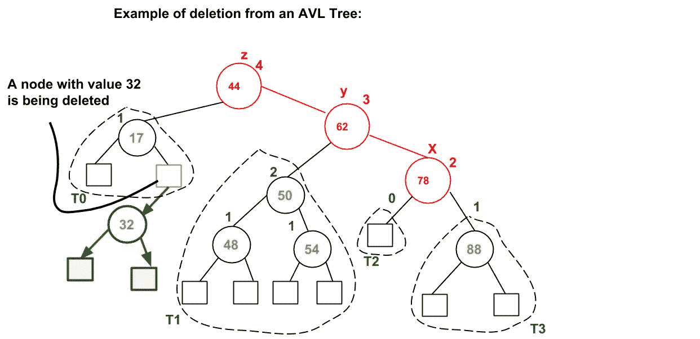
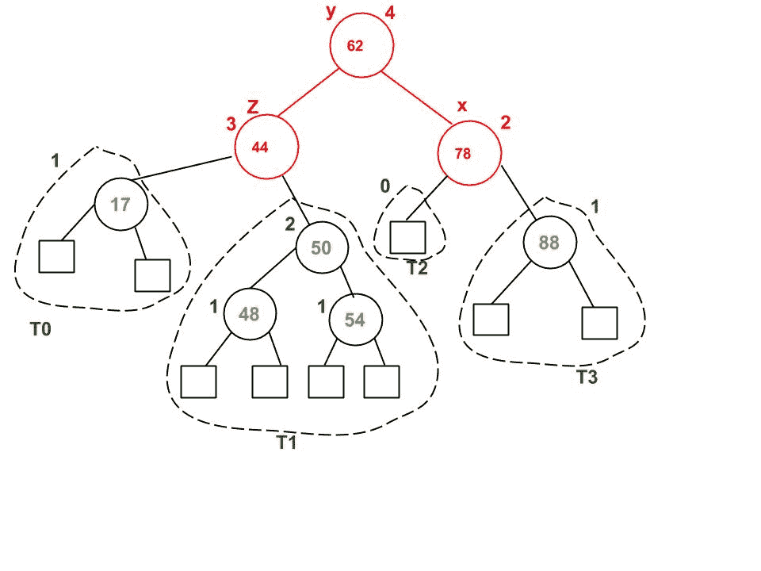

# AVL 树|集合 2(删除)

> 原文:[https://www.geeksforgeeks.org/avl-tree-set-2-deletion/](https://www.geeksforgeeks.org/avl-tree-set-2-deletion/)

我们已经在[之前的帖子](https://www.geeksforgeeks.org/avl-tree-set-1-insertion/)中讨论了 AVL 的插入。在这篇文章中，我们将遵循类似的删除方法。

**删除步骤**。
为了确保在每次删除后给定的树仍然是 AVL 树，我们必须增加标准的 BST 删除操作来执行一些重新平衡。以下是可以执行的两个基本操作，以在不违反 BST 属性的情况下重新平衡 BST(键(左)<键(根)<键(右))。
1)左旋转
2)右旋转

```
T1, T2 and T3 are subtrees of the tree rooted with y (on left side)
or x (on right side)
                y                               x
               / \     Right Rotation          /  \
              x   T3   – - – - – - – >        T1   y
             / \       < - - - - - - -            / \
            T1  T2     Left Rotation            T2  T3
Keys in both of the above trees follow the following order
      keys(T1) < key(x) < keys(T2) < key(y) < keys(T3)
So BST property is not violated anywhere.
```

设 w 为待删除节点
**1)** 对 w 执行标准 BST 删除
**2)** 从 w 开始，向上行进，找到第一个不平衡节点。设 z 为第一个不平衡节点，y 为 z 的大高子，x 为 y 的大高子，注意这里 x 和 y 的定义与[插入](https://www.geeksforgeeks.org/avl-tree-set-1-insertion/)不同。
**3)** 通过对以 z 为根的子树进行适当的旋转来重新平衡树，可以有 4 种可能的情况需要处理，因为 x、y 和 z 可以有 4 种排列方式。以下是可能的 4 种排列:
a) y 是 z 的左子代，x 是 y 的左子代(左左格)
b) y 是 z 的左子代，x 是 y 的右子代(左右格)
c) y 是 z 的右子代，x 是 y 的右子代(右右右格)
d) y 是 z 的右子代，x 是 y 的左子代(右左格)
与插入一样，以下是上述 4 种情况下要执行的操作。请注意，与插入不同，修复节点 z 不会修复完整的 AVL 树。固定 z 之后，我们可能还要固定 z 的祖先(见[本视频讲座](http://www.youtube.com/watch?v=TbvhGcf6UJU)为证)

**a)左箱体**

```
T1, T2, T3 and T4 are subtrees.
         z                                      y 
        / \                                   /   \
       y   T4      Right Rotate (z)          x      z
      / \          - - - - - - - - ->      /  \    /  \ 
     x   T3                               T1  T2  T3  T4
    / \
  T1   T2
```

**b)左右箱**

```
     z                               z                           x
    / \                            /   \                        /  \ 
   y   T4  Left Rotate (y)        x    T4  Right Rotate(z)    y      z
  / \      - - - - - - - - ->    /  \      - - - - - - - ->  / \    / \
T1   x                          y    T3                    T1  T2 T3  T4
    / \                        / \
  T2   T3                    T1   T2
```

**c)右右壳体**

```
  z                                y
 /  \                            /   \ 
T1   y     Left Rotate(z)       z      x
    /  \   - - - - - - - ->    / \    / \
   T2   x                     T1  T2 T3  T4
       / \
     T3  T4
```

**d)右左箱**

```
   z                            z                            x
  / \                          / \                          /  \ 
T1   y   Right Rotate (y)    T1   x      Left Rotate(z)   z      y
    / \  - - - - - - - - ->     /  \   - - - - - - - ->  / \    / \
   x   T4                      T2   y                  T1  T2  T3  T4
  / \                              /  \
T2   T3                           T3   T4
```

与插入不同，在删除中，在 z 处执行旋转之后，我们可能必须在 z 的祖先处执行旋转。因此，我们必须继续跟踪路径，直到到达根。

**示例:**




值为 32 的节点正在被删除。删除 32 后，我们向上行进，找到第一个不平衡节点，即 44。我们把它标为 z，它的高个子标为 y，是 62，y 的高个子标为 x，可能是 78，也可能是 50，因为两者的高度相同。我们考虑了 78 个。现在的情况是右向右，所以我们执行左旋转。

**C 实现**
以下是 AVL 树删除的 C 实现。下面的 C 实现使用递归的 BST 删除作为基础。在递归 BST 删除中，删除后，我们以自下而上的方式逐个获取指向所有祖先的指针。所以我们不需要父指针向上移动。递归代码本身向上运行并访问被删除节点的所有祖先。
**1)** 执行正常的 BST 删除。
**2)** 当前节点必须是被删除节点的祖先节点之一。更新当前节点的高度。
**3)** 获取当前节点的平衡因子(左子树高度–右子树高度)。
**(4)**如果平衡因子大于 1，那么当前节点不平衡，我们不是左左就是左右。检查是左左格还是左右格，得到左子树的平衡因子。如果左子树的平衡因子大于等于 0，则为左左格，否则为左右格。
**(5)**如果平衡因子小于-1，那么当前节点不平衡，我们不是右右就是右左。检查是右右格还是右左格，得到右子树的平衡因子。如果右子树的平衡因子小于等于 0，则为右右格，否则为右左格。

## C++

```
// C++ program to delete a node from AVL Tree
#include<bits/stdc++.h>
using namespace std;

// An AVL tree node
class Node
{
    public:
    int key;
    Node *left;
    Node *right;
    int height;
};

// A utility function to get maximum
// of two integers
int max(int a, int b);

// A utility function to get height
// of the tree
int height(Node *N)
{
    if (N == NULL)
        return 0;
    return N->height;
}

// A utility function to get maximum
// of two integers
int max(int a, int b)
{
    return (a > b)? a : b;
}

/* Helper function that allocates a
   new node with the given key and
   NULL left and right pointers. */
Node* newNode(int key)
{
    Node* node = new Node();
    node->key = key;
    node->left = NULL;
    node->right = NULL;
    node->height = 1; // new node is initially
                      // added at leaf
    return(node);
}

// A utility function to right
// rotate subtree rooted with y
// See the diagram given above.
Node *rightRotate(Node *y)
{
    Node *x = y->left;
    Node *T2 = x->right;

    // Perform rotation
    x->right = y;
    y->left = T2;

    // Update heights
    y->height = max(height(y->left),
                    height(y->right)) + 1;
    x->height = max(height(x->left),
                    height(x->right)) + 1;

    // Return new root
    return x;
}

// A utility function to left
// rotate subtree rooted with x
// See the diagram given above.
Node *leftRotate(Node *x)
{
    Node *y = x->right;
    Node *T2 = y->left;

    // Perform rotation
    y->left = x;
    x->right = T2;

    // Update heights
    x->height = max(height(x->left),
                    height(x->right)) + 1;
    y->height = max(height(y->left),
                    height(y->right)) + 1;

    // Return new root
    return y;
}

// Get Balance factor of node N
int getBalance(Node *N)
{
    if (N == NULL)
        return 0;
    return height(N->left) -
           height(N->right);
}

Node* insert(Node* node, int key)
{
    /* 1\. Perform the normal BST rotation */
    if (node == NULL)
        return(newNode(key));

    if (key < node->key)
        node->left = insert(node->left, key);
    else if (key > node->key)
        node->right = insert(node->right, key);
    else // Equal keys not allowed
        return node;

    /* 2\. Update height of this ancestor node */
    node->height = 1 + max(height(node->left),
                           height(node->right));

    /* 3\. Get the balance factor of this
        ancestor node to check whether
        this node became unbalanced */
    int balance = getBalance(node);

    // If this node becomes unbalanced,
    // then there are 4 cases

    // Left Left Case
    if (balance > 1 && key < node->left->key)
        return rightRotate(node);

    // Right Right Case
    if (balance < -1 && key > node->right->key)
        return leftRotate(node);

    // Left Right Case
    if (balance > 1 && key > node->left->key)
    {
        node->left = leftRotate(node->left);
        return rightRotate(node);
    }

    // Right Left Case
    if (balance < -1 && key < node->right->key)
    {
        node->right = rightRotate(node->right);
        return leftRotate(node);
    }

    /* return the (unchanged) node pointer */
    return node;
}

/* Given a non-empty binary search tree,
return the node with minimum key value
found in that tree. Note that the entire
tree does not need to be searched. */
Node * minValueNode(Node* node)
{
    Node* current = node;

    /* loop down to find the leftmost leaf */
    while (current->left != NULL)
        current = current->left;

    return current;
}

// Recursive function to delete a node
// with given key from subtree with
// given root. It returns root of the
// modified subtree.
Node* deleteNode(Node* root, int key)
{

    // STEP 1: PERFORM STANDARD BST DELETE
    if (root == NULL)
        return root;

    // If the key to be deleted is smaller
    // than the root's key, then it lies
    // in left subtree
    if ( key < root->key )
        root->left = deleteNode(root->left, key);

    // If the key to be deleted is greater
    // than the root's key, then it lies
    // in right subtree
    else if( key > root->key )
        root->right = deleteNode(root->right, key);

    // if key is same as root's key, then
    // This is the node to be deleted
    else
    {
        // node with only one child or no child
        if( (root->left == NULL) ||
            (root->right == NULL) )
        {
            Node *temp = root->left ?
                         root->left :
                         root->right;

            // No child case
            if (temp == NULL)
            {
                temp = root;
                root = NULL;
            }
            else // One child case
            *root = *temp; // Copy the contents of
                           // the non-empty child
            free(temp);
        }
        else
        {
            // node with two children: Get the inorder
            // successor (smallest in the right subtree)
            Node* temp = minValueNode(root->right);

            // Copy the inorder successor's
            // data to this node
            root->key = temp->key;

            // Delete the inorder successor
            root->right = deleteNode(root->right,
                                     temp->key);
        }
    }

    // If the tree had only one node
    // then return
    if (root == NULL)
    return root;

    // STEP 2: UPDATE HEIGHT OF THE CURRENT NODE
    root->height = 1 + max(height(root->left),
                           height(root->right));

    // STEP 3: GET THE BALANCE FACTOR OF
    // THIS NODE (to check whether this
    // node became unbalanced)
    int balance = getBalance(root);

    // If this node becomes unbalanced,
    // then there are 4 cases

    // Left Left Case
    if (balance > 1 &&
        getBalance(root->left) >= 0)
        return rightRotate(root);

    // Left Right Case
    if (balance > 1 &&
        getBalance(root->left) < 0)
    {
        root->left = leftRotate(root->left);
        return rightRotate(root);
    }

    // Right Right Case
    if (balance < -1 &&
        getBalance(root->right) <= 0)
        return leftRotate(root);

    // Right Left Case
    if (balance < -1 &&
        getBalance(root->right) > 0)
    {
        root->right = rightRotate(root->right);
        return leftRotate(root);
    }

    return root;
}

// A utility function to print preorder
// traversal of the tree.
// The function also prints height
// of every node
void preOrder(Node *root)
{
    if(root != NULL)
    {
        cout << root->key << " ";
        preOrder(root->left);
        preOrder(root->right);
    }
}

// Driver Code
int main()
{
Node *root = NULL;

    /* Constructing tree given in
    the above figure */
    root = insert(root, 9);
    root = insert(root, 5);
    root = insert(root, 10);
    root = insert(root, 0);
    root = insert(root, 6);
    root = insert(root, 11);
    root = insert(root, -1);
    root = insert(root, 1);
    root = insert(root, 2);

    /* The constructed AVL Tree would be
            9
        / \
        1 10
        / \ \
    0 5 11
    / / \
    -1 2 6
    */

    cout << "Preorder traversal of the "
            "constructed AVL tree is \n";
    preOrder(root);

    root = deleteNode(root, 10);

    /* The AVL Tree after deletion of 10
            1
        / \
        0 9
        / / \
    -1 5     11
        / \
        2 6
    */

    cout << "\nPreorder traversal after"
         << " deletion of 10 \n";
    preOrder(root);

    return 0;
}

// This code is contributed by rathbhupendra
```

## C

```
// C program to delete a node from AVL Tree
#include<stdio.h>
#include<stdlib.h>

// An AVL tree node
struct Node
{
    int key;
    struct Node *left;
    struct Node *right;
    int height;
};

// A utility function to get maximum of two integers
int max(int a, int b);

// A utility function to get height of the tree
int height(struct Node *N)
{
    if (N == NULL)
        return 0;
    return N->height;
}

// A utility function to get maximum of two integers
int max(int a, int b)
{
    return (a > b)? a : b;
}

/* Helper function that allocates a new node with the given key and
    NULL left and right pointers. */
struct Node* newNode(int key)
{
    struct Node* node = (struct Node*)
                        malloc(sizeof(struct Node));
    node->key   = key;
    node->left   = NULL;
    node->right  = NULL;
    node->height = 1;  // new node is initially added at leaf
    return(node);
}

// A utility function to right rotate subtree rooted with y
// See the diagram given above.
struct Node *rightRotate(struct Node *y)
{
    struct Node *x = y->left;
    struct Node *T2 = x->right;

    // Perform rotation
    x->right = y;
    y->left = T2;

    // Update heights
    y->height = max(height(y->left), height(y->right))+1;
    x->height = max(height(x->left), height(x->right))+1;

    // Return new root
    return x;
}

// A utility function to left rotate subtree rooted with x
// See the diagram given above.
struct Node *leftRotate(struct Node *x)
{
    struct Node *y = x->right;
    struct Node *T2 = y->left;

    // Perform rotation
    y->left = x;
    x->right = T2;

    //  Update heights
    x->height = max(height(x->left), height(x->right))+1;
    y->height = max(height(y->left), height(y->right))+1;

    // Return new root
    return y;
}

// Get Balance factor of node N
int getBalance(struct Node *N)
{
    if (N == NULL)
        return 0;
    return height(N->left) - height(N->right);
}

struct Node* insert(struct Node* node, int key)
{
    /* 1.  Perform the normal BST rotation */
    if (node == NULL)
        return(newNode(key));

    if (key < node->key)
        node->left  = insert(node->left, key);
    else if (key > node->key)
        node->right = insert(node->right, key);
    else // Equal keys not allowed
        return node;

    /* 2\. Update height of this ancestor node */
    node->height = 1 + max(height(node->left),
                           height(node->right));

    /* 3\. Get the balance factor of this ancestor
          node to check whether this node became
          unbalanced */
    int balance = getBalance(node);

    // If this node becomes unbalanced, then there are 4 cases

    // Left Left Case
    if (balance > 1 && key < node->left->key)
        return rightRotate(node);

    // Right Right Case
    if (balance < -1 && key > node->right->key)
        return leftRotate(node);

    // Left Right Case
    if (balance > 1 && key > node->left->key)
    {
        node->left =  leftRotate(node->left);
        return rightRotate(node);
    }

    // Right Left Case
    if (balance < -1 && key < node->right->key)
    {
        node->right = rightRotate(node->right);
        return leftRotate(node);
    }

    /* return the (unchanged) node pointer */
    return node;
}

/* Given a non-empty binary search tree, return the
   node with minimum key value found in that tree.
   Note that the entire tree does not need to be
   searched. */
struct Node * minValueNode(struct Node* node)
{
    struct Node* current = node;

    /* loop down to find the leftmost leaf */
    while (current->left != NULL)
        current = current->left;

    return current;
}

// Recursive function to delete a node with given key
// from subtree with given root. It returns root of
// the modified subtree.
struct Node* deleteNode(struct Node* root, int key)
{
    // STEP 1: PERFORM STANDARD BST DELETE

    if (root == NULL)
        return root;

    // If the key to be deleted is smaller than the
    // root's key, then it lies in left subtree
    if ( key < root->key )
        root->left = deleteNode(root->left, key);

    // If the key to be deleted is greater than the
    // root's key, then it lies in right subtree
    else if( key > root->key )
        root->right = deleteNode(root->right, key);

    // if key is same as root's key, then This is
    // the node to be deleted
    else
    {
        // node with only one child or no child
        if( (root->left == NULL) || (root->right == NULL) )
        {
            struct Node *temp = root->left ? root->left :
                                             root->right;

            // No child case
            if (temp == NULL)
            {
                temp = root;
                root = NULL;
            }
            else // One child case
             *root = *temp; // Copy the contents of
                            // the non-empty child
            free(temp);
        }
        else
        {
            // node with two children: Get the inorder
            // successor (smallest in the right subtree)
            struct Node* temp = minValueNode(root->right);

            // Copy the inorder successor's data to this node
            root->key = temp->key;

            // Delete the inorder successor
            root->right = deleteNode(root->right, temp->key);
        }
    }

    // If the tree had only one node then return
    if (root == NULL)
      return root;

    // STEP 2: UPDATE HEIGHT OF THE CURRENT NODE
    root->height = 1 + max(height(root->left),
                           height(root->right));

    // STEP 3: GET THE BALANCE FACTOR OF THIS NODE (to
    // check whether this node became unbalanced)
    int balance = getBalance(root);

    // If this node becomes unbalanced, then there are 4 cases

    // Left Left Case
    if (balance > 1 && getBalance(root->left) >= 0)
        return rightRotate(root);

    // Left Right Case
    if (balance > 1 && getBalance(root->left) < 0)
    {
        root->left =  leftRotate(root->left);
        return rightRotate(root);
    }

    // Right Right Case
    if (balance < -1 && getBalance(root->right) <= 0)
        return leftRotate(root);

    // Right Left Case
    if (balance < -1 && getBalance(root->right) > 0)
    {
        root->right = rightRotate(root->right);
        return leftRotate(root);
    }

    return root;
}

// A utility function to print preorder traversal of
// the tree.
// The function also prints height of every node
void preOrder(struct Node *root)
{
    if(root != NULL)
    {
        printf("%d ", root->key);
        preOrder(root->left);
        preOrder(root->right);
    }
}

/* Driver program to test above function*/
int main()
{
  struct Node *root = NULL;

  /* Constructing tree given in the above figure */
    root = insert(root, 9);
    root = insert(root, 5);
    root = insert(root, 10);
    root = insert(root, 0);
    root = insert(root, 6);
    root = insert(root, 11);
    root = insert(root, -1);
    root = insert(root, 1);
    root = insert(root, 2);

    /* The constructed AVL Tree would be
            9
           /  \
          1    10
        /  \     \
       0    5     11
      /    /  \
     -1   2    6
    */

    printf("Preorder traversal of the constructed AVL "
           "tree is \n");
    preOrder(root);

    root = deleteNode(root, 10);

    /* The AVL Tree after deletion of 10
            1
           /  \
          0    9
        /     /  \
       -1    5     11
           /  \
          2    6
    */

    printf("\nPreorder traversal after deletion of 10 \n");
    preOrder(root);

    return 0;
}
```

## Java 语言(一种计算机语言，尤用于创建网站)

```
// Java program for deletion in AVL Tree

class Node
{
    int key, height;
    Node left, right;

    Node(int d)
    {
        key = d;
        height = 1;
    }
}

class AVLTree
{
    Node root;

    // A utility function to get height of the tree
    int height(Node N)
    {
        if (N == null)
            return 0;
        return N.height;
    }

    // A utility function to get maximum of two integers
    int max(int a, int b)
    {
        return (a > b) ? a : b;
    }

    // A utility function to right rotate subtree rooted with y
    // See the diagram given above.
    Node rightRotate(Node y)
    {
        Node x = y.left;
        Node T2 = x.right;

        // Perform rotation
        x.right = y;
        y.left = T2;

        // Update heights
        y.height = max(height(y.left), height(y.right)) + 1;
        x.height = max(height(x.left), height(x.right)) + 1;

        // Return new root
        return x;
    }

    // A utility function to left rotate subtree rooted with x
    // See the diagram given above.
    Node leftRotate(Node x)
    {
        Node y = x.right;
        Node T2 = y.left;

        // Perform rotation
        y.left = x;
        x.right = T2;

        // Update heights
        x.height = max(height(x.left), height(x.right)) + 1;
        y.height = max(height(y.left), height(y.right)) + 1;

        // Return new root
        return y;
    }

    // Get Balance factor of node N
    int getBalance(Node N)
    {
        if (N == null)
            return 0;
        return height(N.left) - height(N.right);
    }

    Node insert(Node node, int key)
    {
        /* 1\. Perform the normal BST rotation */
        if (node == null)
            return (new Node(key));

        if (key < node.key)
            node.left = insert(node.left, key);
        else if (key > node.key)
            node.right = insert(node.right, key);
        else // Equal keys not allowed
            return node;

        /* 2\. Update height of this ancestor node */
        node.height = 1 + max(height(node.left),
                            height(node.right));

        /* 3\. Get the balance factor of this ancestor
        node to check whether this node became
        Wunbalanced */
        int balance = getBalance(node);

        // If this node becomes unbalanced, then
        // there are 4 cases Left Left Case
        if (balance > 1 && key < node.left.key)
            return rightRotate(node);

        // Right Right Case
        if (balance < -1 && key > node.right.key)
            return leftRotate(node);

        // Left Right Case
        if (balance > 1 && key > node.left.key)
        {
            node.left = leftRotate(node.left);
            return rightRotate(node);
        }

        // Right Left Case
        if (balance < -1 && key < node.right.key)
        {
            node.right = rightRotate(node.right);
            return leftRotate(node);
        }

        /* return the (unchanged) node pointer */
        return node;
    }

    /* Given a non-empty binary search tree, return the
    node with minimum key value found in that tree.
    Note that the entire tree does not need to be
    searched. */
    Node minValueNode(Node node)
    {
        Node current = node;

        /* loop down to find the leftmost leaf */
        while (current.left != null)
        current = current.left;

        return current;
    }

    Node deleteNode(Node root, int key)
    {
        // STEP 1: PERFORM STANDARD BST DELETE
        if (root == null)
            return root;

        // If the key to be deleted is smaller than
        // the root's key, then it lies in left subtree
        if (key < root.key)
            root.left = deleteNode(root.left, key);

        // If the key to be deleted is greater than the
        // root's key, then it lies in right subtree
        else if (key > root.key)
            root.right = deleteNode(root.right, key);

        // if key is same as root's key, then this is the node
        // to be deleted
        else
        {

            // node with only one child or no child
            if ((root.left == null) || (root.right == null))
            {
                Node temp = null;
                if (temp == root.left)
                    temp = root.right;
                else
                    temp = root.left;

                // No child case
                if (temp == null)
                {
                    temp = root;
                    root = null;
                }
                else // One child case
                    root = temp; // Copy the contents of
                                // the non-empty child
            }
            else
            {

                // node with two children: Get the inorder
                // successor (smallest in the right subtree)
                Node temp = minValueNode(root.right);

                // Copy the inorder successor's data to this node
                root.key = temp.key;

                // Delete the inorder successor
                root.right = deleteNode(root.right, temp.key);
            }
        }

        // If the tree had only one node then return
        if (root == null)
            return root;

        // STEP 2: UPDATE HEIGHT OF THE CURRENT NODE
        root.height = max(height(root.left), height(root.right)) + 1;

        // STEP 3: GET THE BALANCE FACTOR OF THIS NODE (to check whether
        // this node became unbalanced)
        int balance = getBalance(root);

        // If this node becomes unbalanced, then there are 4 cases
        // Left Left Case
        if (balance > 1 && getBalance(root.left) >= 0)
            return rightRotate(root);

        // Left Right Case
        if (balance > 1 && getBalance(root.left) < 0)
        {
            root.left = leftRotate(root.left);
            return rightRotate(root);
        }

        // Right Right Case
        if (balance < -1 && getBalance(root.right) <= 0)
            return leftRotate(root);

        // Right Left Case
        if (balance < -1 && getBalance(root.right) > 0)
        {
            root.right = rightRotate(root.right);
            return leftRotate(root);
        }

        return root;
    }

    // A utility function to print preorder traversal of
    // the tree. The function also prints height of every
    // node
    void preOrder(Node node)
    {
        if (node != null)
        {
            System.out.print(node.key + " ");
            preOrder(node.left);
            preOrder(node.right);
        }
    }

    public static void main(String[] args)
    {
        AVLTree tree = new AVLTree();

        /* Constructing tree given in the above figure */
        tree.root = tree.insert(tree.root, 9);
        tree.root = tree.insert(tree.root, 5);
        tree.root = tree.insert(tree.root, 10);
        tree.root = tree.insert(tree.root, 0);
        tree.root = tree.insert(tree.root, 6);
        tree.root = tree.insert(tree.root, 11);
        tree.root = tree.insert(tree.root, -1);
        tree.root = tree.insert(tree.root, 1);
        tree.root = tree.insert(tree.root, 2);

        /* The constructed AVL Tree would be
        9
        / \
        1 10
        / \ \
        0 5 11
        / / \
        -1 2 6
        */
        System.out.println("Preorder traversal of "+
                            "constructed tree is : ");
        tree.preOrder(tree.root);

        tree.root = tree.deleteNode(tree.root, 10);

        /* The AVL Tree after deletion of 10
        1
        / \
        0 9
        /     / \
        -1 5 11
        / \
        2 6
        */
        System.out.println("");
        System.out.println("Preorder traversal after "+
                        "deletion of 10 :");
        tree.preOrder(tree.root);
    }
}

// This code has been contributed by Mayank Jaiswal
```

## 蟒蛇 3

```
# Python code to delete a node in AVL tree
# Generic tree node class
class TreeNode(object):
    def __init__(self, val):
        self.val = val
        self.left = None
        self.right = None
        self.height = 1

# AVL tree class which supports insertion,
# deletion operations
class AVL_Tree(object):

    def insert(self, root, key):

        # Step 1 - Perform normal BST
        if not root:
            return TreeNode(key)
        elif key < root.val:
            root.left = self.insert(root.left, key)
        else:
            root.right = self.insert(root.right, key)

        # Step 2 - Update the height of the
        # ancestor node
        root.height = 1 + max(self.getHeight(root.left),
                          self.getHeight(root.right))

        # Step 3 - Get the balance factor
        balance = self.getBalance(root)

        # Step 4 - If the node is unbalanced,
        # then try out the 4 cases
        # Case 1 - Left Left
        if balance > 1 and key < root.left.val:
            return self.rightRotate(root)

        # Case 2 - Right Right
        if balance < -1 and key > root.right.val:
            return self.leftRotate(root)

        # Case 3 - Left Right
        if balance > 1 and key > root.left.val:
            root.left = self.leftRotate(root.left)
            return self.rightRotate(root)

        # Case 4 - Right Left
        if balance < -1 and key < root.right.val:
            root.right = self.rightRotate(root.right)
            return self.leftRotate(root)

        return root

    # Recursive function to delete a node with
    # given key from subtree with given root.
    # It returns root of the modified subtree.
    def delete(self, root, key):

        # Step 1 - Perform standard BST delete
        if not root:
            return root

        elif key < root.val:
            root.left = self.delete(root.left, key)

        elif key > root.val:
            root.right = self.delete(root.right, key)

        else:
            if root.left is None:
                temp = root.right
                root = None
                return temp

            elif root.right is None:
                temp = root.left
                root = None
                return temp

            temp = self.getMinValueNode(root.right)
            root.val = temp.val
            root.right = self.delete(root.right,
                                      temp.val)

        # If the tree has only one node,
        # simply return it
        if root is None:
            return root

        # Step 2 - Update the height of the
        # ancestor node
        root.height = 1 + max(self.getHeight(root.left),
                            self.getHeight(root.right))

        # Step 3 - Get the balance factor
        balance = self.getBalance(root)

        # Step 4 - If the node is unbalanced,
        # then try out the 4 cases
        # Case 1 - Left Left
        if balance > 1 and self.getBalance(root.left) >= 0:
            return self.rightRotate(root)

        # Case 2 - Right Right
        if balance < -1 and self.getBalance(root.right) <= 0:
            return self.leftRotate(root)

        # Case 3 - Left Right
        if balance > 1 and self.getBalance(root.left) < 0:
            root.left = self.leftRotate(root.left)
            return self.rightRotate(root)

        # Case 4 - Right Left
        if balance < -1 and self.getBalance(root.right) > 0:
            root.right = self.rightRotate(root.right)
            return self.leftRotate(root)

        return root

    def leftRotate(self, z):

        y = z.right
        T2 = y.left

        # Perform rotation
        y.left = z
        z.right = T2

        # Update heights
        z.height = 1 + max(self.getHeight(z.left),
                         self.getHeight(z.right))
        y.height = 1 + max(self.getHeight(y.left),
                         self.getHeight(y.right))

        # Return the new root
        return y

    def rightRotate(self, z):

        y = z.left
        T3 = y.right

        # Perform rotation
        y.right = z
        z.left = T3

        # Update heights
        z.height = 1 + max(self.getHeight(z.left),
                          self.getHeight(z.right))
        y.height = 1 + max(self.getHeight(y.left),
                          self.getHeight(y.right))

        # Return the new root
        return y

    def getHeight(self, root):
        if not root:
            return 0

        return root.height

    def getBalance(self, root):
        if not root:
            return 0

        return self.getHeight(root.left) - self.getHeight(root.right)

    def getMinValueNode(self, root):
        if root is None or root.left is None:
            return root

        return self.getMinValueNode(root.left)

    def preOrder(self, root):

        if not root:
            return

        print("{0} ".format(root.val), end="")
        self.preOrder(root.left)
        self.preOrder(root.right)

myTree = AVL_Tree()
root = None
nums = [9, 5, 10, 0, 6, 11, -1, 1, 2]

for num in nums:
    root = myTree.insert(root, num)

# Preorder Traversal
print("Preorder Traversal after insertion -")
myTree.preOrder(root)
print()

# Delete
key = 10
root = myTree.delete(root, key)

# Preorder Traversal
print("Preorder Traversal after deletion -")
myTree.preOrder(root)
print()

# This code is contributed by Ajitesh Pathak
```

## C#

```
// C# program for deletion in AVL Tree
using System;

public class Node
{
    public int key, height;
    public Node left, right;

    public Node(int d)
    {
        key = d;
        height = 1;
    }
}

public class AVLTree
{
    Node root;

    // A utility function to get height of the tree
    int height(Node N)
    {
        if (N == null)
            return 0;
        return N.height;
    }

    // A utility function to
    // get maximum of two integers
    int max(int a, int b)
    {
        return (a > b) ? a : b;
    }

    // A utility function to right
    // rotate subtree rooted with y
    // See the diagram given above.
    Node rightRotate(Node y)
    {
        Node x = y.left;
        Node T2 = x.right;

        // Perform rotation
        x.right = y;
        y.left = T2;

        // Update heights
        y.height = max(height(y.left), height(y.right)) + 1;
        x.height = max(height(x.left), height(x.right)) + 1;

        // Return new root
        return x;
    }

    // A utility function to left
    // rotate subtree rooted with x
    // See the diagram given above.
    Node leftRotate(Node x)
    {
        Node y = x.right;
        Node T2 = y.left;

        // Perform rotation
        y.left = x;
        x.right = T2;

        // Update heights
        x.height = max(height(x.left), height(x.right)) + 1;
        y.height = max(height(y.left), height(y.right)) + 1;

        // Return new root
        return y;
    }

    // Get Balance factor of node N
    int getBalance(Node N)
    {
        if (N == null)
            return 0;
        return height(N.left) - height(N.right);
    }

    Node insert(Node node, int key)
    {
        /* 1\. Perform the normal BST rotation */
        if (node == null)
            return (new Node(key));

        if (key < node.key)
            node.left = insert(node.left, key);
        else if (key > node.key)
            node.right = insert(node.right, key);
        else // Equal keys not allowed
            return node;

        /* 2\. Update height of this ancestor node */
        node.height = 1 + max(height(node.left),
                            height(node.right));

        /* 3\. Get the balance factor of this ancestor
        node to check whether this node became
        Wunbalanced */
        int balance = getBalance(node);

        // If this node becomes unbalanced, then
        // there are 4 cases Left Left Case
        if (balance > 1 && key < node.left.key)
            return rightRotate(node);

        // Right Right Case
        if (balance < -1 && key > node.right.key)
            return leftRotate(node);

        // Left Right Case
        if (balance > 1 && key > node.left.key)
        {
            node.left = leftRotate(node.left);
            return rightRotate(node);
        }

        // Right Left Case
        if (balance < -1 && key < node.right.key)
        {
            node.right = rightRotate(node.right);
            return leftRotate(node);
        }

        /* return the (unchanged) node pointer */
        return node;
    }

    /* Given a non-empty binary search tree, return the
    node with minimum key value found in that tree.
    Note that the entire tree does not need to be
    searched. */
    Node minValueNode(Node node)
    {
        Node current = node;

        /* loop down to find the leftmost leaf */
        while (current.left != null)
        current = current.left;

        return current;
    }

    Node deleteNode(Node root, int key)
    {
        // STEP 1: PERFORM STANDARD BST DELETE
        if (root == null)
            return root;

        // If the key to be deleted is smaller than
        // the root's key, then it lies in left subtree
        if (key < root.key)
            root.left = deleteNode(root.left, key);

        // If the key to be deleted is greater than the
        // root's key, then it lies in right subtree
        else if (key > root.key)
            root.right = deleteNode(root.right, key);

        // if key is same as root's key, then this is the node
        // to be deleted
        else
        {

            // node with only one child or no child
            if ((root.left == null) || (root.right == null))
            {
                Node temp = null;
                if (temp == root.left)
                    temp = root.right;
                else
                    temp = root.left;

                // No child case
                if (temp == null)
                {
                    temp = root;
                    root = null;
                }
                else // One child case
                    root = temp; // Copy the contents of
                                // the non-empty child
            }
            else
            {

                // node with two children: Get the inorder
                // successor (smallest in the right subtree)
                Node temp = minValueNode(root.right);

                // Copy the inorder successor's data to this node
                root.key = temp.key;

                // Delete the inorder successor
                root.right = deleteNode(root.right, temp.key);
            }
        }

        // If the tree had only one node then return
        if (root == null)
            return root;

        // STEP 2: UPDATE HEIGHT OF THE CURRENT NODE
        root.height = max(height(root.left),
                    height(root.right)) + 1;

        // STEP 3: GET THE BALANCE FACTOR
        // OF THIS NODE (to check whether
        // this node became unbalanced)
        int balance = getBalance(root);

        // If this node becomes unbalanced,
        // then there are 4 cases
        // Left Left Case
        if (balance > 1 && getBalance(root.left) >= 0)
            return rightRotate(root);

        // Left Right Case
        if (balance > 1 && getBalance(root.left) < 0)
        {
            root.left = leftRotate(root.left);
            return rightRotate(root);
        }

        // Right Right Case
        if (balance < -1 && getBalance(root.right) <= 0)
            return leftRotate(root);

        // Right Left Case
        if (balance < -1 && getBalance(root.right) > 0)
        {
            root.right = rightRotate(root.right);
            return leftRotate(root);
        }

        return root;
    }

    // A utility function to print preorder traversal of
    // the tree. The function also prints height of every
    // node
    void preOrder(Node node)
    {
        if (node != null)
        {
            Console.Write(node.key + " ");
            preOrder(node.left);
            preOrder(node.right);
        }
    }

    // Driver code
    public static void Main()
    {
        AVLTree tree = new AVLTree();

        /* Constructing tree given in the above figure */
        tree.root = tree.insert(tree.root, 9);
        tree.root = tree.insert(tree.root, 5);
        tree.root = tree.insert(tree.root, 10);
        tree.root = tree.insert(tree.root, 0);
        tree.root = tree.insert(tree.root, 6);
        tree.root = tree.insert(tree.root, 11);
        tree.root = tree.insert(tree.root, -1);
        tree.root = tree.insert(tree.root, 1);
        tree.root = tree.insert(tree.root, 2);

        /* The constructed AVL Tree would be
        9
        / \
        1 10
        / \ \
        0 5 11
        / / \
        -1 2 6
        */
        Console.WriteLine("Preorder traversal of "+
                            "constructed tree is : ");
        tree.preOrder(tree.root);

        tree.root = tree.deleteNode(tree.root, 10);

        /* The AVL Tree after deletion of 10
        1
        / \
        0 9
        /     / \
        -1 5 11
        / \
        2 6
        */
        Console.WriteLine("");
        Console.WriteLine("Preorder traversal after "+
                        "deletion of 10 :");
        tree.preOrder(tree.root);
    }
}

/* This code contributed by PrinciRaj1992 */
```

## java 描述语言

```
<script>

    // JavaScript program for deletion in AVL Tree

    class Node
    {
        constructor(d) {
           this.left = null;
           this.right = null;
           this.key = d;
           this.height = 1;
        }
    }

    let root;

    // A utility function to get height of the tree
    function height(N)
    {
        if (N == null)
            return 0;
        return N.height;
    }

    // A utility function to get maximum of two integers
    function max(a, b)
    {
        return (a > b) ? a : b;
    }

    // A utility function to right rotate subtree rooted with y
    // See the diagram given above.
    function rightRotate(y)
    {
        let x = y.left;
        let T2 = x.right;

        // Perform rotation
        x.right = y;
        y.left = T2;

        // Update heights
        y.height = max(height(y.left), height(y.right)) + 1;
        x.height = max(height(x.left), height(x.right)) + 1;

        // Return new root
        return x;
    }

    // A utility function to left rotate subtree rooted with x
    // See the diagram given above.
    function leftRotate(x)
    {
        let y = x.right;
        let T2 = y.left;

        // Perform rotation
        y.left = x;
        x.right = T2;

        // Update heights
        x.height = max(height(x.left), height(x.right)) + 1;
        y.height = max(height(y.left), height(y.right)) + 1;

        // Return new root
        return y;
    }

    // Get Balance factor of node N
    function getBalance(N)
    {
        if (N == null)
            return 0;
        return height(N.left) - height(N.right);
    }

    function insert(node, key)
    {
        /* 1\. Perform the normal BST rotation */
        if (node == null)
            return (new Node(key));

        if (key < node.key)
            node.left = insert(node.left, key);
        else if (key > node.key)
            node.right = insert(node.right, key);
        else // Equal keys not allowed
            return node;

        /* 2\. Update height of this ancestor node */
        node.height = 1 + max(height(node.left),
                            height(node.right));

        /* 3\. Get the balance factor of this ancestor
        node to check whether this node became
        Wunbalanced */
        let balance = getBalance(node);

        // If this node becomes unbalanced, then
        // there are 4 cases Left Left Case
        if (balance > 1 && key < node.left.key)
            return rightRotate(node);

        // Right Right Case
        if (balance < -1 && key > node.right.key)
            return leftRotate(node);

        // Left Right Case
        if (balance > 1 && key > node.left.key)
        {
            node.left = leftRotate(node.left);
            return rightRotate(node);
        }

        // Right Left Case
        if (balance < -1 && key < node.right.key)
        {
            node.right = rightRotate(node.right);
            return leftRotate(node);
        }

        /* return the (unchanged) node pointer */
        return node;
    }

    /* Given a non-empty binary search tree, return the
    node with minimum key value found in that tree.
    Note that the entire tree does not need to be
    searched. */
    function minValueNode(node)
    {
        let current = node;

        /* loop down to find the leftmost leaf */
        while (current.left != null)
            current = current.left;

        return current;
    }

    function deleteNode(root, key)
    {
        // STEP 1: PERFORM STANDARD BST DELETE
        if (root == null)
            return root;

        // If the key to be deleted is smaller than
        // the root's key, then it lies in left subtree
        if (key < root.key)
            root.left = deleteNode(root.left, key);

        // If the key to be deleted is greater than the
        // root's key, then it lies in right subtree
        else if (key > root.key)
            root.right = deleteNode(root.right, key);

        // if key is same as root's key, then this is the node
        // to be deleted
        else
        {

            // node with only one child or no child
            if ((root.left == null) || (root.right == null))
            {
                let temp = null;
                if (temp == root.left)
                    temp = root.right;
                else
                    temp = root.left;

                // No child case
                if (temp == null)
                {
                    temp = root;
                    root = null;
                }
                else // One child case
                    root = temp; // Copy the contents of
                                // the non-empty child
            }
            else
            {

                // node with two children: Get the inorder
                // successor (smallest in the right subtree)
                let temp = minValueNode(root.right);

                // Copy the inorder successor's data to this node
                root.key = temp.key;

                // Delete the inorder successor
                root.right = deleteNode(root.right, temp.key);
            }
        }

        // If the tree had only one node then return
        if (root == null)
            return root;

        // STEP 2: UPDATE HEIGHT OF THE CURRENT NODE
        root.height = max(height(root.left), height(root.right)) + 1;

        // STEP 3: GET THE BALANCE FACTOR OF THIS NODE (to check whether
        // this node became unbalanced)
        let balance = getBalance(root);

        // If this node becomes unbalanced, then there are 4 cases
        // Left Left Case
        if (balance > 1 && getBalance(root.left) >= 0)
            return rightRotate(root);

        // Left Right Case
        if (balance > 1 && getBalance(root.left) < 0)
        {
            root.left = leftRotate(root.left);
            return rightRotate(root);
        }

        // Right Right Case
        if (balance < -1 && getBalance(root.right) <= 0)
            return leftRotate(root);

        // Right Left Case
        if (balance < -1 && getBalance(root.right) > 0)
        {
            root.right = rightRotate(root.right);
            return leftRotate(root);
        }

        return root;
    }

    // A utility function to print preorder traversal of
    // the tree. The function also prints height of every
    // node
    function preOrder(node)
    {
        if (node != null)
        {
            document.write(node.key + " ");
            preOrder(node.left);
            preOrder(node.right);
        }
    }

    /* Constructing tree given in the above figure */
    root = insert(root, 9);
    root = insert(root, 5);
    root = insert(root, 10);
    root = insert(root, 0);
    root = insert(root, 6);
    root = insert(root, 11);
    root = insert(root, -1);
    root = insert(root, 1);
    root = insert(root, 2);

    /* The constructed AVL Tree would be
          9
          / \
          1 10
          / \ \
          0 5 11
          / / \
          -1 2 6
          */
    document.write(
    "Preorder traversal of the constructed AVL tree is : " +
    "</br>");
    preOrder(root);

    root = deleteNode(root, 10);

    /* The AVL Tree after deletion of 10
          1
          / \
          0 9
          /     / \
          -1 5 11
          / \
          2 6
          */
    document.write("</br>");
    document.write("Preorder traversal after "+
                       "deletion of 10 :" + "</br>");
    preOrder(root);

</script>
```

**输出:**

```
Preorder traversal of the constructed AVL tree is 
9 1 0 -1 5 2 6 10 11 
Preorder traversal after deletion of 10 
1 0 -1 9 5 2 6 11 
```

**时间复杂度:**旋转操作(左右旋转)需要恒定的时间，因为只有很少的指针在那里被改变。更新高度和获得平衡系数也需要恒定的时间。因此，AVL 删除的时间复杂度与 BST 删除相同，BST 删除是 O(h)，其中 h 是树的高度。由于 AVL 树是平衡的，所以高度为 O(Logn)。所以 AVL 删除的时间复杂度是 O(Log n)。

&t=7s

**参考文献:**
[【https://www.cs.purdue.edu/homes/ayg/CS251/slides/chap7b.pdf】](https://www.cs.purdue.edu/homes/ayg/CS251/slides/chap7b.pdf)
[IITD 视频讲座 AVL 树插入和删除](http://www.youtube.com/watch?v=TbvhGcf6UJU)
如发现有不正确的地方请写评论，或者想分享更多以上讨论话题的信息。