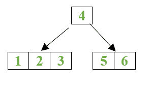
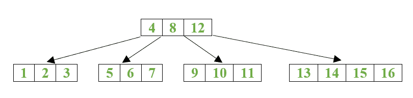
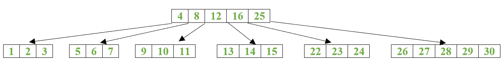
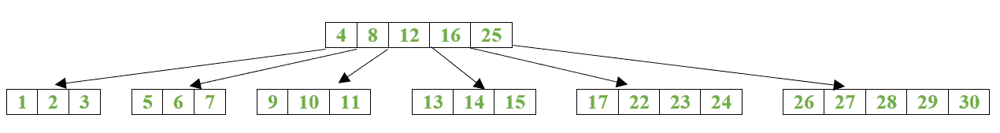
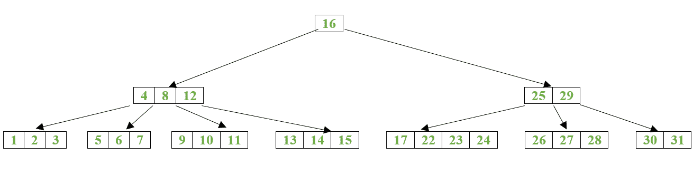

# 无攻击性分裂的 B 树插入

> 原文:[https://www . geesforgeks . org/B- tree-insert-不带攻击性-拆分/](https://www.geeksforgeeks.org/b-tree-insert-without-aggressive-splitting/)

无激进分裂的 b 树插入
这个插入算法获取一个条目，找到它所属的叶节点，并将其插入到那里。我们通过在适当的子节点上调用插入算法来递归地插入条目。这个过程导致进入条目所属的叶节点，将条目放在那里，然后一直返回到根节点。
有时节点已满，即它包含 2 * t–1 个条目，其中 t 是最小度。在这种情况下，必须拆分节点。在这种情况下，一个键成为父键，并创建一个新节点。我们首先插入新的密钥，使总密钥为 2*t。我们在原始节点中保留前 t 个条目，将最后(t-1)个条目转移到新节点，并将第(t+1)个节点设置为这些节点的父节点。如果被拆分的节点是非子节点，那么我们也必须拆分子指针。具有 2*t 个键的节点有 2*t + 1 个子指针。第一个(t+1)指针保留在原始节点中，其余的 t 指针指向新节点。

> 该算法仅在必要时拆分节点。我们首先递归地为节点的适当子节点(在非叶节点的情况下)调用 insert，或者将其插入节点(对于叶节点)。如果节点已满，我们将其拆分，在 newEntry 中存储新的子条目，在 val 中存储新的父键。然后将这些值插入到父级中，父级递归地拆分自身，以防它也已满。
> **例:**
> 我们在树中插入数字 1–5。这棵树变成了:
> 
> 
> 
> 然后我们插入 6，节点满了。因此，它被分成两个节点，使 4 成为父节点。
> 
> 
> 
> 我们插入数字 7-16，树变成:
> 
> 
> 
> 我们插入 22–30，树变成:
> 
> 
> 
> 请注意，现在根已满。如果我们现在插入 17，那么根不会像插入 17 的叶节点那样分裂。如果我们遵循积极的分裂，根会在我们去叶节点之前分裂。
> 
> 
> 
> 但是如果我们插入 31，叶节点分裂，递归地向根添加新条目。但由于根已满，因此需要拆分。这棵树现在变成了。
> 
> 

以下是上述方法的实现:

## 卡片打印处理机（Card Print Processor 的缩写）

```
// C++ implementation of the approach
#include <iostream>
#include <vector>
using namespace std;

class BTreeNode {

    // Vector of keys
    vector<int> keys;

    // Minimum degree
    int t;

    // Vector of child pointers
    vector<BTreeNode*> C;

    // Is true when node is leaf, else false
    bool leaf;

public:
    // Constructor
    BTreeNode(int t, bool leaf);

    // Traversing the node and print its content
    // with tab number of tabs before
    void traverse(int tab);

    // Insert key into given node. If child is split, we
    // have to insert *val entry into keys vector and
    // newEntry pointer into C vector of this node
    void insert(int key, int* val,
                BTreeNode*& newEntry);

    // Split this node and store the new parent value in
    // *val and new node pointer in newEntry
    void split(int* val, BTreeNode*& newEntry);

    // Returns true if node is full
    bool isFull();

    // Makes new root, setting current root as its child
    BTreeNode* makeNewRoot(int val, BTreeNode* newEntry);
};

bool BTreeNode::isFull()
{
    // returns true if node is full
    return (this->keys.size() == 2 * t - 1);
}

BTreeNode::BTreeNode(int t, bool leaf)
{
    // Constructor to set value of t and leaf
    this->t = t;
    this->leaf = leaf;
}

// Function to print the nodes of B-Tree
void BTreeNode::traverse(int tab)
{
    int i;
    string s;

    // Print 'tab' number of tabs
    for (int j = 0; j < tab; j++) {
        s += '\t';
    }
    for (i = 0; i < keys.size(); i++) {

        // If this is not leaf, then before printing key[i]
        // traverse the subtree rooted with child C[i]
        if (leaf == false)
            C[i]->traverse(tab + 1);
        cout << s << keys[i] << endl;
    }

    // Print the subtree rooted with last child
    if (leaf == false) {
        C[i]->traverse(tab + 1);
    }
}

// Function to split the current node and store the new
// parent value is *val and new child pointer in &newEntry
// called only for splitting non-leaf node
void BTreeNode::split(int* val, BTreeNode*& newEntry)
{

    // Create new non leaf node
    newEntry = new BTreeNode(t, false);

    //(t+1)th becomes parent
    *val = this->keys[t];

    // Last (t-1) entries will go to new node
    for (int i = t + 1; i < 2 * t; i++) {
        newEntry->keys.push_back(this->keys[i]);
    }

    // This node stores first t entries
    this->keys.resize(t);

    // Last t entries will go to new node
    for (int i = t + 1; i <= 2 * t; i++) {
        newEntry->C.push_back(this->C[i]);
    }

    // This node stores first (t+1) entries
    this->C.resize(t + 1);
}

// Function to insert a new key in given node.
// If child of this node is split, we have to insert *val
// into keys vector and newEntry pointer into C vector
void BTreeNode::insert(int new_key, int* val,
                       BTreeNode*& newEntry)
{

    // Non leaf node
    if (leaf == false) {
        int i = 0;

        // Find first key greater than new_key
        while (i < keys.size() && new_key > keys[i])
            i++;

        // We have to insert new_key into left child of
        // Node with index i
        C[i]->insert(new_key, val, newEntry);

        // No split was done
        if (newEntry == NULL)
            return;
        if (keys.size() < 2 * t - 1) {

            // This node can accommodate a new key
            // and child pointer entry
            // Insert *val into key vector
            keys.insert(keys.begin() + i, *val);

            // Insert newEntry into C vector
            C.insert(C.begin() + i + 1, newEntry);

            // As this node was not split, set newEntry
            // to NULL
            newEntry = NULL;
        }
        else {

            // Insert *val and newentry
            keys.insert(keys.begin() + i, *val);
            C.insert(C.begin() + i + 1, newEntry);

            // Current node has 2*t keys, so split it
            split(val, newEntry);
        }
    }
    else {

        // Insert new_key in this node
        vector<int>::iterator it;

        // Find correct position
        it = lower_bound(keys.begin(), keys.end(),
                         new_key);

        // Insert in correct position
        keys.insert(it, new_key);

        // If node is full
        if (keys.size() == 2 * t) {

            // Create new node
            newEntry = new BTreeNode(t, true);

            // Set (t+1)th key as parent
            *val = this->keys[t];

            // Insert last (t-1) keys into new node
            for (int i = t + 1; i < 2 * t; i++) {
                newEntry->keys.push_back(this->keys[i]);
            }

            // This node stores first t keys
            this->keys.resize(t);
        }
    }
}

// Function to create a new root
// setting current node as its child
BTreeNode* BTreeNode::makeNewRoot(int val, BTreeNode* newEntry)
{
    // Create new root
    BTreeNode* root = new BTreeNode(t, false);

    // Stores keys value
    root->keys.push_back(val);

    // Push child pointers
    root->C.push_back(this);
    root->C.push_back(newEntry);
    return root;
}

class BTree {

    // Root of B-Tree
    BTreeNode* root;

    // Minimum degree
    int t;

public:
    // Constructor
    BTree(int t);

    // Insert key
    void insert(int key);

    // Display the tree
    void display();
};

// Function to create a new BTree with
// minimum degree t
BTree::BTree(int t)
{
    root = new BTreeNode(t, true);
}

// Function to insert a node in the B-Tree
void BTree::insert(int key)
{
    BTreeNode* newEntry = NULL;
    int val = 0;

    // Insert in B-Tree
    root->insert(key, &val, newEntry);

    // If newEntry is not Null then root needs to be
    // split. Create new root
    if (newEntry != NULL) {
        root = root->makeNewRoot(val, newEntry);
    }
}

// Prints BTree
void BTree::display()
{
    root->traverse(0);
}

// Driver code
int main()
{

    // Create B-Tree
    BTree* tree = new BTree(3);
    cout << "After inserting 1 and 2" << endl;
    tree->insert(1);
    tree->insert(2);
    tree->display();

    cout << "After inserting 5 and 6" << endl;
    tree->insert(5);
    tree->insert(6);
    tree->display();

    cout << "After inserting 3 and 4" << endl;
    tree->insert(3);
    tree->insert(4);
    tree->display();

    return 0;
}
```

**Output:** 

```
After inserting 1 and 2
1
2
After inserting 5 and 6
1
2
5
6
After inserting 3 and 4
    1
    2
    3
4
    5
    6
```