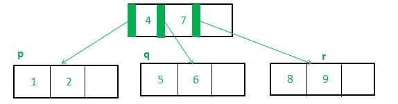
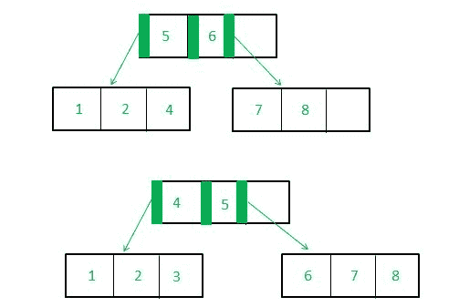

# b*-c++中的树实现

> 原文:[https://www.geeksforgeeks.org/b-trees-implementation-in-c/](https://www.geeksforgeeks.org/b-trees-implementation-in-c/)

b*-m 阶树是一个搜索树，它要么是空的，要么满足三个性质:

*   根节点至少有两层，最多有两层((2m-2)/3) +1 个子节点
*   其他内部节点具有最小楼层((2m-1)/3)和最大 m 个子节点
*   所有外部节点都在同一层。

使用 B*树优于使用 [B 树的**优势**是一个独特的功能，称为“二对三”分割。这样，每个节点中的最小键数不是最大键数的一半，而是三分之二，使数据更加紧凑。然而**的劣势**这是一个复杂的删除操作。](https://www.geeksforgeeks.org/b-tree-set-1-introduction-2/)

实际实现 B-star 算法的困难导致了为什么它不像 B and B+算法那样经常被使用。
下面是 B 星插入函数的一个基本实现——只是为了展示它与 B 星的对比(完整的实现会长得多，也复杂得多)。

**b*树插入算法的独特之处如下:**

**二三分**

**1。**如果插入到一个完整的叶节点(不是根节点)，并且它有一个完全正确的同级节点(并且它的父节点至少有一个空闲键):

*   取一个数组(“marray”)，该数组由完整叶节点的“m-1”键、该节点的父键、要插入的新键及其右同级的“m-1”键组成(总共 m-1+1+m-1 = 2m 个键)
*   把这些钥匙分类
*   创建三个新节点:
    *   p–其键是“marray”
        的前(2m–2)/3 个元素。索引(2m–2)/3 处的元素存储为“parent1”
    *   q–谁的键是 parent1
        之后“marray”的下一个(2m–1)/3 元素索引(4m)/3 处的元素存储为“parent2”
    *   r–其键是 parent2 之后“marray”的最后(2m)/3 个元素
*   该叶的父级中指向该叶的键应该将其值替换为“parent1”
*   如果 iv)中的父键有任何相邻的键，它们应该向右移动。在剩余的空间中，放置“parent2”。
*   p、q 和 r 必须成为 parent1 和 parent2 的子键(如果“parent1”和“parent2”是父节点中的前两个键)，否则 p、q、r 必须分别成为父节点 1、父节点 1 和父节点 2 之前的键的子键。

**插入前:**


**插入后:**



**2。**如果插入到具有空/非全右同级的全叶节点(不是根)。

*   Simply shift the last element of the current node to the position of the parent, shift all the keys in the right sibling to the right, and insert the previous parent. Now, use the gap in your own node to rearrange and fit in the new key.

    

    **3。**其他情况与 B-Trees 相同。

    **示例:**

    > **输入:**加 4 至 1 2 3 L 5 R 7 8 9
    > **输出:** 1 2 L 3 7 R 4 5 R 8 9
    > 3 和 7 通过 2-3 分割成为父键
    > 
    > **输入:**加 5 至 2 3 4 L 6 R 8 9 11
    > 输出: 2 3 L 4 8 R 5 6 R 9 11
    > 3 和 6 通过二三分割成为父键

    下面是上述方法的实现:

    ```
    // CPP program to implement B* tree
    #include <bits/stdc++.h>
    using namespace std;

    // This can be changed to any value - 
    // it is the order of the B* Tree
    #define N 4 

    struct node {

        // key of N-1 nodes
        int key[N - 1];

        // Child array of 'N' length
        struct node* child[N];

        // To state whether a leaf or not; if node 
        // is a leaf, isleaf=1 else isleaf=0
        int isleaf;

        // Counts the number of filled keys in a node
        int n;

        // Keeps track of the parent node
        struct node* parent;
    };

    // This function searches for the leaf 
    // into which to insert element 'k'
    struct node* searchforleaf(struct node* root, int k, 
                         struct node* parent, int chindex)
    {
        if (root) {

            // If the passed root is a leaf node, then
            // k can be inserted in this node itself
            if (root->isleaf == 1)
                return root;

            // If the passed root is not a leaf node, 
            // implying there are one or more children
            else {
                int i;

              /*If passed root's initial key is itself g
                reater than the element to be inserted,
                we need to insert to a new leaf left of the root*/
                if (k < root->key[0])
                    root = searchforleaf(root->child[0], k, root, 0);

                else 
                {
                    // Find the first key whose value is greater 
                    // than the insertion value
                    // and insert into child of that key
                    for (i = 0; i < root->n; i++)
                        if (root->key[i] > k)
                            root = searchforleaf(root->child[i], k, root, i);

                    // If all the keys are less than the insertion 
                    // key value, insert to the right of last key
                    if (root->key[i - 1] < k)
                        root = searchforleaf(root->child[i], k, root, i);
                }
            }
        }
        else {

            // If the passed root is NULL (there is no such 
            // child node to search), then create a new leaf 
            // node in that location
            struct node* newleaf = new struct node;
            newleaf->isleaf = 1;
            newleaf->n = 0;
            parent->child[chindex] = newleaf;
            newleaf->parent = parent;
            return newleaf;
        }
    }

    struct node* insert(struct node* root, int k)
    {
        if (root) {
            struct node* p = searchforleaf(root, k, NULL, 0);
            struct node* q = NULL;
            int e = k;

            // If the leaf node is empty, simply 
            // add the element and return
            for (int e = k; p; p = p->parent) { 
                if (p->n == 0) {
                    p->key[0] = e;
                    p->n = 1;
                    return root;
                }
                // If number of filled keys is less than maximum
                if (p->n < N - 1) {
                    int i;
                    for (i = 0; i < p->n; i++) {
                        if (p->key[i] > e) {
                            for (int j = p->n - 1; j >= i; j--)
                                p->key[j + 1] = p->key[j];
                            break;
                        }
                    }
                    p->key[i] = e;
                    p->n = p->n + 1;
                    return root;
                }

                // If number of filled keys is equal to maximum 
                // and it's not root and there is space in the parent
                if (p->n == N - 1 && p->parent && p->parent->n < N) {
                    int m;
                    for (int i = 0; i < p->parent->n; i++)
                        if (p->parent->child[i] == p) {
                            m = i;
                            break;
                        }

                    // If right sibling is possible
                    if (m + 1 <= N - 1) 
                    {
                        // q is the right sibling
                        q = p->parent->child[m + 1];

                        if (q) {

                            // If right sibling is full
                            if (q->n == N - 1) {
                                struct node* r = new struct node;
                                int* z = new int[((2 * N) / 3)];
                                int parent1, parent2;
                                int* marray = new int[2 * N];
                                int i;
                                for (i = 0; i < p->n; i++)
                                    marray[i] = p->key[i];
                                int fege = i;
                                marray[i] = e;
                                marray[i + 1] = p->parent->key[m];
                                for (int j = i + 2; j < ((i + 2) + (q->n)); j++)
                                    marray[j] = q->key[j - (i + 2)];

                                // marray=bubblesort(marray, 2*N)
                                // a more rigorous implementation will 
                                // sort these elements

                                // Put first (2*N-2)/3 elements into keys of p
                                for (int i = 0; i < (2 * N - 2) / 3; i++)
                                    p->key[i] = marray[i];
                                parent1 = marray[(2 * N - 2) / 3];

                                // Put next (2*N-1)/3 elements into keys of q
                                for (int j = ((2 * N - 2) / 3) + 1; j < (4 * N) / 3; j++)
                                    q->key[j - ((2 * N - 2) / 3 + 1)] = marray[j];
                                parent2 = marray[(4 * N) / 3];

                                // Put last (2*N)/3 elements into keys of r
                                for (int f = ((4 * N) / 3 + 1); f < 2 * N; f++)
                                    r->key[f - ((4 * N) / 3 + 1)] = marray[f];

                                // Because m=0 and m=1 are children of the same key,
                                // a special case is made for them
                                if (m == 0 || m == 1) {
                                    p->parent->key[0] = parent1;
                                    p->parent->key[1] = parent2;
                                    p->parent->child[0] = p;
                                    p->parent->child[1] = q;
                                    p->parent->child[2] = r;
                                    return root;
                                }

                                else {
                                    p->parent->key[m - 1] = parent1;
                                    p->parent->key[m] = parent2;
                                    p->parent->child[m - 1] = p;
                                    p->parent->child[m] = q;
                                    p->parent->child[m + 1] = r;
                                    return root;
                                }
                            }
                        }
                        else // If right sibling is not full
                        {
                            int put;
                            if (m == 0 || m == 1)
                                put = p->parent->key[0];
                            else
                                put = p->parent->key[m - 1];
                            for (int j = (q->n) - 1; j >= 1; j--)
                                q->key[j + 1] = q->key[j];
                            q->key[0] = put;
                            p->parent->key[m == 0 ? m : m - 1] = p->key[p->n - 1];
                        }
                    }
                }
            }

            /*Cases of root splitting, etc. are omitted 
             as this implementation is just to demonstrate 
             the two-three split operation*/
        }
        else 
        {
            // Create new node if root is NULL
            struct node* root = new struct node;
            root->key[0] = k;
            root->isleaf = 1;
            root->n = 1;
            root->parent = NULL;
        }
    }

    // Driver code
    int main()
    {
        /* Consider the following tree that has been obtained 
           from some root split:
                    6             
                    / \             
                1 2 4 7 8 9

                We wish to add 5\. This makes the B*-tree:
                    4 7             
                    / \ \         
                1 2 5 6 8 9 

            Contrast this with the equivalent B-tree, in which
            some nodes are less than half full

                4 6 
                / \ \
                1 2 5 7 8 9

                */

        // Start with an empty root
        struct node* root = NULL;
        // Insert 6
        root = insert(root, 6);

        // Insert 1, 2, 4 to the left of 6
        root->child[0] = insert(root->child[0], 1);
        root->child[0] = insert(root->child[0], 2);
        root->child[0] = insert(root->child[0], 4);
        root->child[0]->parent = root;

        // Insert 7, 8, 9 to the right of 6
        root->child[1] = insert(root->child[1], 7);
        root->child[1] = insert(root->child[1], 8);
        root->child[1] = insert(root->child[1], 9);
        root->child[1]->parent = root;

        cout << "Original tree: " << endl;
        for (int i = 0; i < root->n; i++)
            cout << root->key[i] << " ";
        cout << endl;
        for (int i = 0; i < 2; i++) {
            cout << root->child[i]->key[0] << " ";
            cout << root->child[i]->key[1] << " ";
            cout << root->child[i]->key[2] << " ";
        }
        cout << endl;

        cout << "After adding 5: " << endl;

        // Inserting element '5':

        root->child[0] = insert(root->child[0], 5);

        // Printing nodes

        for (int i = 0; i <= root->n; i++)
            cout << root->key[i] << " ";
        cout << endl;
        for (int i = 0; i < N - 1; i++) {
            cout << root->child[i]->key[0] << " ";
            cout << root->child[i]->key[1] << " ";
        }

        return 0;
    }
    ```

    **输出:**

    ```
    Original Tree:
    6
    1 2 4 7 8 9
    After adding 5:
    4 7
    1 2 5 6 8 9

    ```