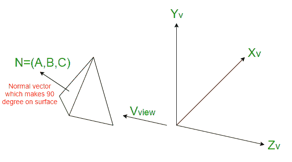
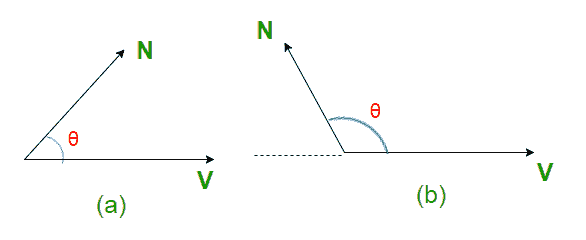

# 背面检测方法

> 原文:[https://www.geeksforgeeks.org/back-face-detection-method/](https://www.geeksforgeeks.org/back-face-detection-method/)

当我们在二维屏幕上投影三维物体时，我们需要检测隐藏在 2D 上的人脸。
**背面检测**，也称**平面方程法，**是一种物体空间法，将物体和物体的一部分进行比较，找出可见的表面。让我们考虑一个三角形表面，它的可见度需要决定。这个想法是检查三角形是否会背对观看者。如果是这样，则在当前帧中丢弃它，并移动到下一帧。每个曲面都有一个法向量。如果这个法向量指向投影中心的方向，那么它就是一个正面，观众可以看到。如果这个法向量指向远离投影中心的方向，那么它就是一个背面，观察者看不到。

**左手系统的算法:**

```
1) Compute N for every face of object.
2) If (C.(Z component) > 0)
        then a back face and don't draw
   else
        front face and draw

```

背面检测方法非常简单。对于左手系统，如果法向量的 [Z 分量为正，则为背面。如果向量的 Z 分量是负的，那么它就是一个正面。](http://mathworld.wolfram.com/NormalVector.html)

**右手系统的算法:**

```
1) Compute N for every face of object.
2) If (C.(Z component) < 0)
        then a back face and don't draw
   else
        front face and draw

```

因此，对于右手系统，如果法向量的 Z 分量是负的，那么它就是一个背面。如果向量的 Z 分量是正的，那么它就是一个正面。

背面检测可以识别场景中包含非重叠凸多面体的所有隐藏表面。



回顾多边形曲面方程:

```
Ax + By + Cz + D < 0

```

在确定表面是背面还是正面时，还要考虑观察方向。曲面的法线由下式给出:

```
N = (A, B, C)

```

如果 V <sub>视图</sub>，多边形就是背面。> 0。但是应该记住，在应用观看变换之后，观看者正在向下观看负 Z 轴。因此，如果满足以下条件，多边形就是背面:

```
(0, 0, -1).N > 0
or if C < 0

```

查看器也将无法看到 C = 0 的表面，因此，如果:C <= 0，则将多边形表面识别为背面。



考虑到(a)，

```
V.N = |V||N|Cos(angle)
if 0 <= angle  0 and V.N > 0
Hence, Back-face.

```

考虑到(b)，

```
V.N = |V||N|Cos(angle)
if 90 < angle <= 180, then
cos(angle) < 0 and V.N < 0
Hence, Front-face.

```

**限制:**
**1)** 这种方法对凸多面体很有效，但对凹多面体不一定有效。
**2)** 此方法只能用于建模为多边形网格的实体对象。