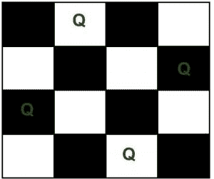

# 回溯|介绍

> 原文:[https://www.geeksforgeeks.org/backtracking-introduction/](https://www.geeksforgeeks.org/backtracking-introduction/)

**先决条件**:

*   [递归](https://www.geeksforgeeks.org/recursion/)
*   [复杂度分析](https://www.geeksforgeeks.org/analysis-of-algorithms-set-1-asymptotic-analysis/)

回溯是一种递归解决问题的算法技术，通过尝试逐步构建一个解决方案，一次一个，移除那些在任何时间点都不能满足问题约束的解决方案(这里的时间指的是到达搜索树的任何级别所经过的时间)。

根据维基的定义，

> **回溯**可以定义为一种通用的算法技术，考虑搜索每一个可能的组合，以解决一个计算问题。

回溯中有三种类型的问题–

1.  决策问题——在这种情况下，我们寻找可行的解决方案。
2.  优化问题——在这种情况下，我们寻找最佳解决方案。
3.  枚举问题——在这里，我们找到了所有可行的解决方案。

**如何确定一个问题是否可以用回溯法解决？**

一般来说，每个[约束满足问题](https://en.wikipedia.org/wiki/Constraint_satisfaction_problem)都可以通过回溯来解决，该问题对任何目标解都有明确定义的约束，该问题对解递增地构建候选项，并且一旦确定候选项不可能完成到有效解就放弃该候选项(“回溯”)。然而，所讨论的大多数问题可以使用其他已知算法来解决，如*动态规划*或*贪婪算法*在对数、线性、线性-对数时间复杂度上按照输入大小的顺序，因此，在各个方面都胜过回溯算法(因为回溯算法通常在时间和空间上都是指数的)。然而，一些问题仍然存在，直到现在只有回溯算法来解决它们。

假设你面前有三个盒子，其中只有一个盒子里有金币，但你不知道是哪一个。所以，为了得到硬币，你必须一个接一个地打开所有的盒子。你将首先检查第一个盒子，如果它不包含硬币，你将不得不关闭它，检查第二个盒子，以此类推，直到你找到硬币。这就是回溯，即逐个解决所有子问题，以达到最好的可能解。

考虑下面的例子来更正式地理解回溯方法，

给定任何计算问题的一个实例和对应于该实例的数据，为了解决该问题需要满足的所有约束都由表示。回溯算法的工作原理如下:

算法开始建立一个解决方案，从一个空的解决方案集开始。 **S = {}**

1.  加到第一个还剩下的招式(所有可能的招式都一一加到)。这将在算法的搜索树中创建新的子树。
2.  检查是否满足中的每个约束。
    *   如果是，那么子树是“合格”的，可以添加更多的“孩子”。
    *   否则，整个子树都没有用，所以使用参数返回到步骤 1。
3.  如果新形成的子树具有“合格性”，则使用参数返回步骤 1。
4.  如果对的检查返回它是整个数据的解决方案。输出并终止程序。
    如果没有，则返回当前没有解决方案，因此将其丢弃。

#### 递归和回溯的区别:

在递归中，函数调用自己，直到到达基本情况。在回溯中，我们使用递归来探索所有的可能性，直到我们得到问题的最佳结果。

**回溯伪码**:

1.递归回溯解法。

```
void findSolutions(n, other params) :
    if (found a solution) :
        solutionsFound = solutionsFound + 1;
        displaySolution();
        if (solutionsFound >= solutionTarget) : 
            System.exit(0);
        return

    for (val = first to last) :
        if (isValid(val, n)) :
            applyValue(val, n);
            findSolutions(n+1, other params);
            removeValue(val, n);
```

2.发现解决方案是否存在

```
boolean findSolutions(n, other params) :
    if (found a solution) :
        displaySolution();
        return true;

    for (val = first to last) :
        if (isValid(val, n)) :
            applyValue(val, n);
            if (findSolutions(n+1, other params))
                return true;
            removeValue(val, n);
        return false;
```

让我们尝试解决一个标准的回溯问题 **N 皇后问题**。
N 皇后就是把 N 个象棋皇后放在 N×N 的棋盘上，这样就不会有两个皇后互相攻击的问题。例如，以下是 4 皇后问题的解决方案。



预期的输出是一个二进制矩阵，其中皇后所在的块有 1。例如，以下是上述 4 皇后解决方案的输出矩阵。

```
{ 0,  1,  0,  0}
{ 0,  0,  0,  1}
{ 1,  0,  0,  0}
{ 0,  0,  1,  0}
```

**回溯算法**:思路是从最左边一列开始，将皇后一个个放在不同的列中。当我们在一列中放置一个皇后时，我们检查与已经放置的皇后的冲突。在当前列中，如果我们找到没有冲突的行，我们将该行和列标记为解决方案的一部分。如果由于冲突我们没有找到这样的行，那么我们回溯并返回 false。

```
1) Start in the leftmost column
2) If all queens are placed
    return true
3) Try all rows in the current column.  Do following for every tried row.
    a) If the queen can be placed safely in this row then mark this [row, 
        column] as part of the solution and recursively check if placing  
        queen here leads to a solution.
    b) If placing the queen in [row, column] leads to a solution then return 
        true.
    c) If placing queen doesn't lead to a solution then unmark this [row, 
        column] (Backtrack) and go to step (a) to try other rows.
4) If all rows have been tried and nothing worked, return false to trigger 
    backtracking.
```

上述方法的完整实现可以参考[回溯|集合 3 (N 皇后问题)](https://www.geeksforgeeks.org/backtracking-set-3-n-queen-problem/)一文。
T3】更多回溯问题:

*   [回溯|第一集(骑士之旅问题)](https://www.geeksforgeeks.org/backtracking-set-1-the-knights-tour-problem/)
*   [回溯|第二集(迷宫中的老鼠)](http://Backtracking | Set 2 (Rat in a Maze))
*   [回溯|集合 4(子集和)](https://www.geeksforgeeks.org/backttracking-set-4-subset-sum/)
*   [回溯|集合 5 (m 着色问题)](https://www.geeksforgeeks.org/backttracking-set-5-m-coloring-problem/)
*   [–>点击此处了解更多](https://www.geeksforgeeks.org/backtracking-algorithms/)