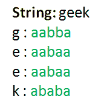

# 归纳密码

> 原文:[https://www.geeksforgeeks.org/baconian-cipher/](https://www.geeksforgeeks.org/baconian-cipher/)

培根密码是弗朗西斯·培根在 1605 年发明的一种隐写术(一种隐藏秘密信息的方法，而不仅仅是一种密码)。信息隐藏在文本的呈现中，而不是其内容中。
Baconian 密码是一种替换密码，其中每个字母由 5 个字符的序列代替。在原始密码中，这些是“A”和“B”的序列，例如字母“D”被“aabb”代替，字母“O”被“abbab”代替等。每个字母被分配给一个由五个二进制数字组成的字符串。这些可以是字母“A”和“B”，数字 0 和 1 或任何你想要的东西。
有两种培根密码–

1.  **24 字母密码:**其中 2 对字母(I，J) & (U，V)具有相同的密文。
    T52T55【baab】T56

    |  |
    | 信函】 | 代码】 | 二进制 |
    |  | 【yyyy】g | 【aabba】 | 【00110】 |
    |  | 【aabbb】 |  |
    |  |
    | 信函】 | 代码】 | 二进制 |
    |  | 【ABBA】t | baaba | 10010 |
    | u，v | tT59T62 |

2.  **26 字母密码:**其中所有字母都有唯一的密文。T57T60】

    |  |
    | 信函】 | 代码】 | 二进制 |
    |  | 【yyyy】g | 【aabba】 | 【00110】 |
    |  | 【aabbb】 |  |
    |  |
    | 信函】 | 代码】 | 二进制 |
    |  | 【abb】t | 【baab】T47 | 【10011】 |
    |  | 【Baba】T54【10100】 |

**加密**

我们将从字符串中提取一个字符，如果它不是一个空格，那么我们将根据我们使用的密码用它对应的密文替换它，否则我们将添加一个空格并重复它，直到我们到达字符串的末尾。例如“A”被替换为“aaaaaa”


**解密**

我们将从加密的字符串中提取每组 5 个字符，并检查该组 5 个字符中的第一个字符是否是空格。如果不是，我们将从密码中查找其对应的明文字母，替换它，并将字符索引增加 5(以获得接下来的 5 个字符的集合)，否则，如果是空格，我们添加一个空格，并通过将当前字符索引增加 1 来重复该过程

**接近**

在 Python 中，我们可以使用名为字典的数据结构来映射键值对。我们将只使用一个字典，其中我们将明文-密文对映射为键值对。
对于加密，我们将简单地通过使用相应的明文字符作为密钥访问该值来查找相应的密文。
在解密中，我们将提取每 5 组密文字符，并使用它们作为相应的值从字典中检索它们的密钥。为了精确解密，我们将使用 26 个字母的密码。如果你不是用 python 编码，那么你可以想出你自己的方法。

```
# Python program to implement Baconian cipher

'''This script uses a dictionary instead of 'chr()' & 'ord()' function'''

'''
Dictionary to map plaintext with ciphertext
(key:value) => (plaintext:ciphertext)
This script uses the 26 letter baconian cipher
in which I, J & U, V have distinct patterns
'''
lookup = {'A':'aaaaa', 'B':'aaaab', 'C':'aaaba', 'D':'aaabb', 'E':'aabaa',
        'F':'aabab', 'G':'aabba', 'H':'aabbb', 'I':'abaaa', 'J':'abaab',
        'K':'ababa', 'L':'ababb', 'M':'abbaa', 'N':'abbab', 'O':'abbba',
        'P':'abbbb', 'Q':'baaaa', 'R':'baaab', 'S':'baaba', 'T':'baabb',
        'U':'babaa', 'V':'babab', 'W':'babba', 'X':'babbb', 'Y':'bbaaa', 'Z':'bbaab'}

# Function to encrypt the string according to the cipher provided
def encrypt(message):
    cipher = ''
    for letter in message:
        # checks for space
        if(letter != ' '):
            # adds the ciphertext corresponding to the 
            # plaintext from the dictionary
            cipher += lookup[letter]
        else:
            # adds space
            cipher += ' '

    return cipher

# Function to decrypt the string 
# according to the cipher provided
def decrypt(message):
    decipher = ''
    i = 0

    # emulating a do-while loop
    while True :
        # condition to run decryption till 
        # the last set of ciphertext
        if(i < len(message)-4):
            # extracting a set of ciphertext
            # from the message
            substr = message[i:i + 5]
            # checking for space as the first 
            # character of the substring
            if(substr[0] != ' '):
                '''
                This statement gets us the key(plaintext) using the values(ciphertext)
                Just the reverse of what we were doing in encrypt function
                '''
                decipher += list(lookup.keys())[list(lookup.values()).index(substr)]
                i += 5 # to get the next set of ciphertext

            else:
                # adds space
                decipher += ' '
                i += 1 # index next to the space
        else:
            break # emulating a do-while loop

    return decipher

def main():
    message = "Geeks for Geeks"
    result = encrypt(message.upper())
    print (result)

    message = "AABAAABBABABAABABBBABBAAA"
    result = decrypt(message.lower())
    print (result)

#Executes the main function
if __name__ == '__main__':
    main()
```

```
Output
aabbaaabaaaabaaabababaaba aabababbbabaaab aabbaaabaaaabaaabababaaba
ENJOY

```

**分析:**这个密码提供的通信安全性非常低，因为它是一个替代密码。因此，所有用于对替代密码进行密码分析的方法都可以用来破解培根密码。这种密码的主要优点是，它可以隐藏秘密信息已经发送的事实。

**参考文献:** [实用密码学](http://practicalcryptography.com/ciphers/classical-era/baconian/)

本文由 [Palash Nigam](https://www.linkedin.com/in/palash25) 供稿。如果你喜欢 GeeksforGeeks 并想投稿，你也可以使用[contribute.geeksforgeeks.org](http://www.contribute.geeksforgeeks.org)写一篇文章或者把你的文章邮寄到 contribute@geeksforgeeks.org。看到你的文章出现在极客博客主页上，帮助其他极客。

如果你发现任何不正确的地方，或者你想分享更多关于上面讨论的话题的信息，请写评论。