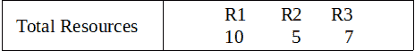
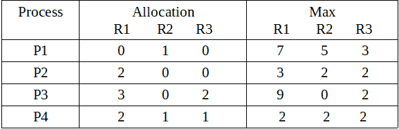
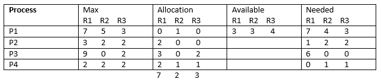

# 操作系统中的银行家算法

> 原文:[https://www . geesforgeks . org/bankers-操作系统中的算法/](https://www.geeksforgeeks.org/bankers-algorithm-in-operating-system/)

先决条件–[资源分配图(RAG)](https://www.geeksforgeeks.org/operating-system-resource-allocation-graph-rag/) 、[银行家算法](https://www.geeksforgeeks.org/operating-system-bankers-algorithm/)、[银行家算法程序](https://www.geeksforgeeks.org/program-bankers-algorithm-set-1-safety-algorithm/)、
银行家算法是一种资源分配和避免死锁的算法。该算法测试安全性，模拟所有资源的预定最大可能量的分配，然后进行“s 状态”检查以测试可能的活动，然后决定是否允许继续分配。

简而言之，它检查任何资源的分配是否会导致死锁，或者将资源分配给进程是否安全，如果不安全，则资源不会分配给该进程。确定一个安全序列(即使只有 1 个)将确保系统不会陷入死锁。

银行家算法通常用于发现安全序列是否存在。但是在这里，我们将确定安全序列的总数，并打印所有安全序列。

使用的数据结构是:

*   可用向量
*   最大矩阵
*   分配矩阵
*   需求矩阵

**例:**
**输入:**





```
Output: Safe sequences are:
P2--> P4--> P1--> P3
P2--> P4--> P3--> P1
P4--> P2--> P1--> P3
P4--> P2--> P3--> P1

There are total 4 safe-sequences 
```

**说明:**
总资源为 R1 = 10，R2 = 5，R3 = 7，分配资源为 R1 = (0+2+3+2 =) 7，R2 = (1+0+0+1 =) 2，R3 = (0+0+2+1 =) 3。因此，剩余资源为 R1 =(10–7 =)3、R2 =(5–2 =)3、R3 =(7–3 =)4。
剩余可用=总资源-已分配资源
和
剩余需求=最大-已分配



所以，我们可以从 P2 或 P4 开始。在银行家算法的第一步或第二步尝试中，我们无法从 P1 或 P3 的可用资源中满足剩余需求。只有四种可能的安全序列。这些是:
P2–>P4–>P1–>P3
P2–>P4–>P3–>P1
P4–>P2–>P1–>P3
P4–>P2–>P3–>P1

**实施:**

。

**输出:**

```
Safe sequences are:
P2--> P4--> P1--> P3
P2--> P4--> P3--> P1
P4--> P2--> P1--> P3
P4--> P2--> P3--> P1

There are total 4 safe-sequences
```