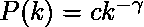
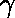
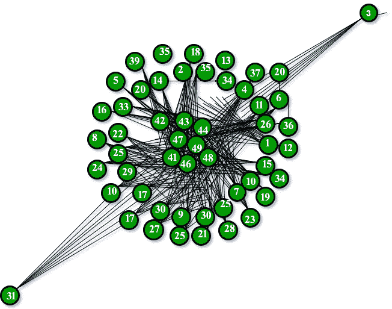

# 巴拉巴斯艾伯特图(用于无标度模型)

> 原文:[https://www . geesforgeks . org/bara basi-Albert-graph-scale-free-models/](https://www.geeksforgeeks.org/barabasi-albert-graph-scale-free-models/)

本文将使用 python 库 Networkx 处理复杂网络的相关概念。这是一个 Python 语言软件包，用于创建、操作和研究复杂网络的结构、动力学和功能。使用 NetworkX，您可以以标准和非标准数据格式加载和存储网络，生成多种类型的随机和经典网络，分析网络结构，构建网络模型，设计新的网络算法，绘制网络等等。

本文将讨论使用优先连接模型生成随机无标度网络的算法。这种模型背后的兴趣可以追溯到 20 世纪 90 年代，当时阿尔伯特·拉兹洛·巴拉巴斯和雷卡·艾伯特发表了开创性的研究，描述了世界各地无标度网络遵循的模型。他们提出，包括互联网、万维网、引文网络和一些社交网络在内的一些自然和人工系统被认为是近似无标度网络。
无标度网络是度分布至少渐近地遵循幂律的网络。也就是说，网络中具有到其他节点的 k 个连接的节点的分数 P (k)取 k 的大值 as


是一个参数，其值通常在范围 2 <  < 3 内，尽管有时它可能位于这些界限之外，c 是一个比例常数。

巴拉巴希-阿尔伯特模型是产生无标度网络的几种模型之一。它包含了两个重要的一般概念:成长和优先依附。成长和优先依恋在现实网络中广泛存在。增长意味着网络中的节点数量会随着时间的推移而增加。
优先附着是指节点连接越多，越有可能收到新的链接。度越高的节点，抓取加入网络的链路的能力越强。直觉上，如果我们从连接人们的社交网络的角度来思考，这种优先依恋是可以理解的。这里 A 到 B 的链接表示人 A“认识”或“认识”人 B，重链接节点代表关系很多的知名人士。当一个新来的人进入社区时，他/她更有可能认识那些更显眼的人，而不是一个相对不知名的人。BA 模型是这样提出的:假设在万维网中，新页面优先链接到中心，即像谷歌这样非常知名的网站，而不是几乎没有人知道的页面。如果有人通过随机选择一个现有的链接来选择一个新的链接页面，那么选择一个特定页面的概率将与其程度成正比。

下图将描述优先连接模型后面有 50 个节点的 BA 模型图。

*上图完全满足了富人越来越富，穷人越来越穷的逻辑。*

**代码:**
下面的代码是我们最终将使用 networkx 库实现的函数的一部分。

```
def barabasi_albert_graph(n, m, seed=None):
    """Returns a random graph according to the Barabási–Albert preferential
    Attachment model.

    A graph of ``n`` nodes is grown by attaching new nodes each with ``m``
    Edges that are preferentially attached to existing nodes with high degree.

    Parameters
    ----------
    n : int
        Number of nodes
    m : int
        Number of edges to attach from a new node to existing nodes
    seed : int, optional
        Seed for random number generator (default=None).

    Returns
    -------
    G : Graph

    Raises
    ------
    NetworkXError
        If ``m`` does not satisfy ``1 <= m < n``.

    if m < 1 or  m >=n:
        raise nx.NetworkXError("Barabási–Albert network must have m >= 1"
                               " and m < n, m = %d, n = %d" % (m, n))
    if seed is not None:
        random.seed(seed)

    # Add m initial nodes (m0 in barabasi-speak)
    G=empty_graph(m)
    G.name="barabasi_albert_graph(%s,%s)"%(n,m)
    # Target nodes for new edges
    targets=list(range(m))
    # List of existing nodes, with nodes repeated once for each adjacent edge
    repeated_nodes=[]
    # Start adding the other n-m nodes. The first node is m.
    source=m
    while source<n:
        # Add edges to m nodes from the source.
        G.add_edges_from(zip(*m,targets))
        # Add one node to the list for each new edge just created.
        repeated_nodes.extend(targets)
        # And the new node "source" has m edges to add to the list.
        repeated_nodes.extend(*m)
        # Now choose m unique nodes from the existing nodes
        # Pick uniformly from repeated_nodes (preferential attachement)
        targets = _random_subset(repeated_nodes,m)
        source += 1
    return G
```

上面的代码是用于在 python 中有效处理随机图的 networkx 库的一部分。在运行以下代码之前，必须安装它。

```
>>> import networkx as nx
>>> G= nx.barabasi_albert_graph(50,40)
>>> nx.draw(G, with_labels=True)
```

为了显示上面的图表，我使用了 matplotlib 库。我们需要在执行以下代码之前安装它。

```
>>> import matplotlib.pyplot as plt
>>> plt.show()
```

**所以最终代码看起来像:**

```
>>> import networkx as nx
>>> import matplotlib.pyplot as plt

>>> G= nx.barabasi_albert_graph(40,15)
>>> nx.draw(G, with_labels=True)
>>> plt.show()
```

输出:


40 节点的 BA 模型

因此，我想进一步描述更多关于 networkx 库和 it 模块的内容，这些模块主要关注网络的中心性度量(尤其是无标度模型)。

***参考文献***
你可以在

*   [https://en . Wikipedia . org/wiki/barab % C3 % a1 si %和 2%80%93Albert_model](https://en.wikipedia.org/wiki/Barab%C3%A1si%E2%80%93Albert_model)*   [http://networkx.readthedocs.io/en/networkx-1.10/index.html](http://networkx.readthedocs.io/en/networkx-1.10/index.html)

    。