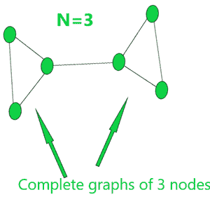
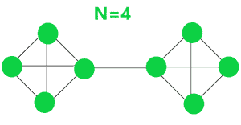
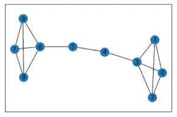
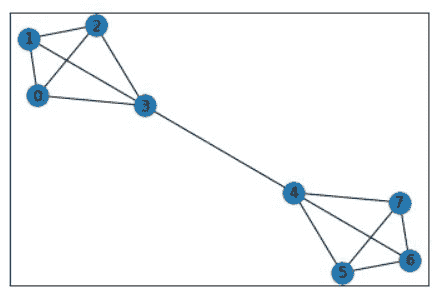

# 使用 Python 网络的杠铃图

> 原文:[https://www . geesforgeks . org/barbell-graph-use-python-networkx/](https://www.geeksforgeeks.org/barbell-graph-using-python-networkx/)

**先决条件:** [**网络**](https://www.geeksforgeeks.org/networkx-python-software-package-study-complex-networks/)

杠铃图有很多种定义。最常用的是 n-杠铃图，这是一个简单的图，通过连接一个完整的图的两个副本与 n 个节点获得。在本文中，我们将看到如何使用 python 使用杠铃图。

**n 杠铃图示例:**

**例 1:**

如果 N=3 个节点，则图表将显示为图形:



**例 2:**

如果 N=4 个节点，则图表将显示为图形:



#### 分析:

1.节点总数(在 n-杠铃图中):

```
The Total number of Nodes = 2*N
```

2.总边数(在 n-杠铃图中):

```
Total number of edges = 2*number of edgesin complete graph + 1
=2*(n*(n-1)/2)+1 = n*(n-1) + 1
```

**属性:**

1.  杠铃图包含循环。
2.  杠铃图是连接每两个节点之间有一条路径。
3.  它在两个完全图之间有一个桥梁。
4.  桥中可能有节点，也可能没有节点。

**使用 Python 的杠铃图:**

它是使用 networkx 库和 matplotlib 库的 barbell_graph(n，m)函数在 python 中实现的。

*   **python 中的 networkx 库**库，用于实现和分析 python 中不同种类的图形(数据结构)。对于安装，请使用以下命令:

```
pip install networkx
```

*   **matplotlib 库:**python 中的库，用于实现和分析 python 中不同种类的函数。对于安装，请使用以下命令:

```
pip install matplotlib
```

**barbell_graph(n，m)** :它返回一个 Barbell Graph，其中有两个由 n 个节点组成的完全图，这两个节点之间通过 m 个节点桥连接。

**进场:**

*   导入 networkx 和 matplotlib 库。
*   如上所述，使用 nx.barbell_graph(n，m)函数创建一个 networkx 图形对象 G。
*   使用 nx.draw_networkx(G)函数打印图形。

**例 1:**

## 计算机编程语言

```
# import module
import networkx as nx  
import matplotlib.pyplot as plt 

# graph created
res = nx.barbell_graph(4, 2) 
nx.draw_networkx(res)
```



Python 中的杠铃图

**说明:**

当我们将(4，2)作为参数传递给 nx 时，barbell_graph()函数被分配了一个由 2 个节点的桥连接的 4 个节点簇的图。最后，我们使用 draw_networkx(G)函数得到了作为图 G 的视图的输出。

**例 2:**

## 蟒蛇 3

```
import networkx as nx  
import matplotlib.pyplot as plt

res = nx.barbell_graph(4, 0) 
nx.draw_networkx(res)
```

**输出:**

