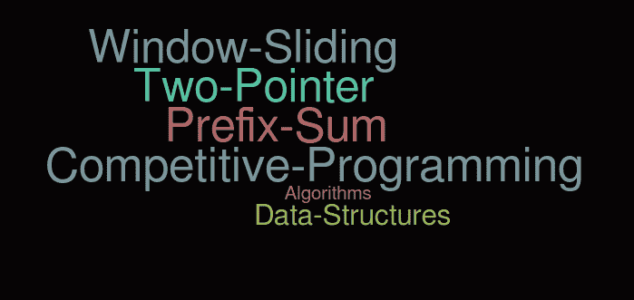

# 学术中未教授的基本算法技术

> 原文:[https://www . geesforgeks . org/basic-algorithm-technologies-not-in-learning/](https://www.geeksforgeeks.org/basic-algorithm-techniques-not-taught-in-academics/)

我们一般学习学术上的大部分算法技术，比如[搜索](https://www.geeksforgeeks.org/searching-algorithms/)、[排序](https://www.geeksforgeeks.org/sorting-algorithms/)、[动态规划](https://www.geeksforgeeks.org/dynamic-programming/)、[贪婪算法](https://www.geeksforgeeks.org/greedy-algorithms/)、[分治](https://www.geeksforgeeks.org/divide-and-conquer-algorithm-introduction/)、[回溯](https://www.geeksforgeeks.org/backtracking-algorithms/)等。但是下面的技巧一般不会被教授，在面试和竞争性编程中经常被用来解决问题。

**[前缀求和技术](https://www.geeksforgeeks.org/prefix-sum-array-implementation-applications-competitive-programming/)**

在这种技术中，我们对数组进行预处理，并制作另一个数组，称为前缀求和数组。前缀和数组计算从索引 0 到当前索引的元素的和。

*   [阵列的平衡指数](https://www.geeksforgeeks.org/equilibrium-index-of-an-array/)
*   [查找是否有总和为 0 的子阵列](https://www.geeksforgeeks.org/find-if-there-is-a-subarray-with-0-sum/)
*   [最大子阵列大小，使得该大小的所有子阵列的总和小于 k :](https://www.geeksforgeeks.org/maximum-subarray-size-subarrays-size-sum-less-k/)
*   [可以写成最连续素数之和的素数](https://www.geeksforgeeks.org/find-prime-number-can-written-sum-consecutive-primes/)。
*   [两个二进制数组中具有相同和的最大跨度:](https://www.geeksforgeeks.org/longest-span-sum-two-binary-arrays/)
*   [最大子阵列和模 m](https://www.geeksforgeeks.org/maximum-subarray-sum-modulo-m/)
*   [最大子阵列大小，使得该大小的所有子阵列的总和小于 k](https://www.geeksforgeeks.org/maximum-subarray-size-subarrays-size-sum-less-k/)
*   [n 个范围内出现的最大整数:](https://www.geeksforgeeks.org/maximum-occurred-integer-n-ranges/)
*   [获得所有硬币的最低成本，每枚硬币允许有 k 个额外硬币:](https://www.geeksforgeeks.org/minimum-cost-for-acquiring-all-coins-with-k-extra-coins-allowed-with-every-coin/)
*   [任意概率分布方式的随机数发生器:](https://www.geeksforgeeks.org/random-number-generator-in-arbitrary-probability-distribution-fashion/)

重要链接:
[前缀和练习题](https://practice.geeksforgeeks.org/explore/?category%5B%5D=prefix-sum&page=1)
[前缀和近期文章](https://www.geeksforgeeks.org/tag/prefix-sum/)

**[双指针算法](https://www.geeksforgeeks.org/two-pointers-technique/)**

双指针确实是一种简单有效的技术，通常用于在排序数组中搜索对。

*   [从两个排序的数组中找到最接近的一对](https://www.geeksforgeeks.org/given-two-sorted-arrays-number-x-find-pair-whose-sum-closest-x/)
*   [找出数组中和最接近 x 的对](https://www.geeksforgeeks.org/given-sorted-array-number-x-find-pair-array-whose-sum-closest-x/)
*   [找到所有零和的三胞胎](https://www.geeksforgeeks.org/find-triplets-array-whose-sum-equal-zero/)
*   [找到一个和给定值相加的三元组](https://www.geeksforgeeks.org/find-a-triplet-that-sum-to-a-given-value/)
*   [找到一个三元组，使得两个之和等于第三个元素](https://www.geeksforgeeks.org/find-triplet-sum-two-equals-third-element/)
*   [找出四个元素相加得到一个给定值](https://www.geeksforgeeks.org/find-four-numbers-with-sum-equal-to-given-sum/)

重要链接:
[二指针近期文章](https://www.geeksforgeeks.org/tag/two-pointer-algorithm/)
[二指针练习题](https://practice.geeksforgeeks.org/explore/?category%5B%5D=two-pointer-algorithm&page=1)

**[窗口滑动技术](https://www.geeksforgeeks.org/window-sliding-technique/)**

该技术展示了如何将一些问题中的嵌套 for 循环转换为单 for 循环，以降低时间复杂度。

*   [大小为 k 的所有子阵列的最大值](https://www.geeksforgeeks.org/sliding-window-maximum-maximum-of-all-subarrays-of-size-k/)
*   [求给定和的子阵|集合 1(非负数)](https://www.geeksforgeeks.org/find-subarray-with-given-sum/)
*   [字谜子串搜索(或搜索所有排列)](https://www.geeksforgeeks.org/anagram-substring-search-search-permutations/)
*   [计算到达第 n 级楼梯的方式](https://www.geeksforgeeks.org/count-ways-reach-nth-stair/)
*   [给定和的 k 尺寸子阵列](https://www.geeksforgeeks.org/subarray-of-size-k-with-given-sum/)

重要链接:
[滑动窗口练习题](https://practice.geeksforgeeks.org/explore/?category%5B%5D=sliding-window&page=1)
[滑动窗口近期文章](https://www.geeksforgeeks.org/tag/sliding-window/)

除了这些之外，C++中的[STL](https://www.geeksforgeeks.org/the-c-standard-template-library-stl/)和 Java 中的[集合](https://www.geeksforgeeks.org/collections-in-java-2/)不是在学术中教授的，如果你的程序分别是 C++和 Java，这些是非常重要的。

额外提示:每当你解决一个问题时，确保你正确地分析它。在这里，分析不是关于它的效率，“而是关于在一个问题中找到一个模式。”在一类模式下练习分组问题会让你变得更好。这是因为当你再次看到类似的问题时，你的大脑会立即识别出这个模式，并把它捡起来交给你。这似乎很快，也让你感到有点自信..快乐编码！！！