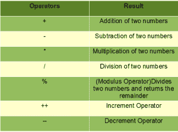
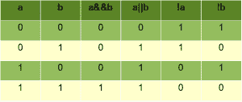
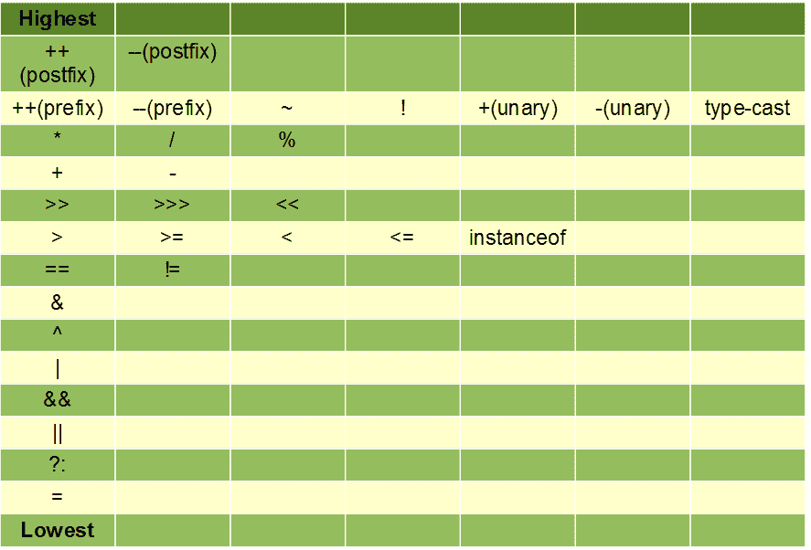

# Java 中的基本运算符

> 原文:[https://www.geeksforgeeks.org/basic-operators-java/](https://www.geeksforgeeks.org/basic-operators-java/)

Java 提供了丰富的操作环境。我们可以将 java 中的基本运算符分为以下几组:

*   算术运算符
*   关系运算符
*   按位运算符
*   赋值运算符
*   逻辑运算符

现在让我们详细了解一下这些操作符。

**1。算术运算符**:算术运算符用于对操作数进行算术/数学运算。

*   **加法('+')** :相加两个操作数
*   **减法('-')** :减去两个操作数
*   **乘法(' *)**:将两个操作数相乘
*   **除法('/')** :第一个操作数除以第二个操作数。
*   **模数(“%”)**:当第一个操作数除以第二个操作数时，返回余数
*   **增量('++')** :增加一个整数的值。当放在变量名(也称为预递增运算符)之前时，其值会立即递增。例如 **++x** 。当它被放在变量名(也称为后递增运算符)之后时，它的值会被暂时保留，直到执行这个语句，并且在执行下一个语句之前得到更新。例如， **x++。**
*   **递减('–')**:递减整数值。当放在变量名(也称为预递减运算符)之前时，其值会立即递减。例如，**–x**。
    当它被放在变量名(也称为后减量操作符)之后时，它的值会被暂时保留，直到执行这个语句，并在执行下一个语句之前被更新。例如，**x–**。

**注**:递增和递减运算符在处理单个操作数时称为一元算术运算符，而其余算术运算符在处理两个操作数时称为二进制算术运算符。



## Java 语言(一种计算机语言，尤用于创建网站)

```
//Java program to explain arithmetic operators
import java.util.*;
class A{

    public static void main(String args[])
    {

    int a = 10, b = 4, res;

    //printing a and b
    System.out.println("a is "+a+ " and b is "+ b);

    res = a+b; //addition
    System.out.println("a+b is "+res);

    res = a-b; //subtraction
    System.out.println("a-b is "+res);

    res = a*b; //multiplication
    System.out.println("a*b is "+res);

    res = a/b; //division
    System.out.println("a/b is "+res);

    res = a%b; //modulus
    System.out.println("a%b is "+res);

    }
}
```

**输出**:

```
a is 10 and b is 4
a+b is 14
a-b is 6
a*b is 40
a/b is 2
a%b is 2
```

**2。关系运算符**:关系运算符决定一个操作数与另一个操作数之间的关系。关系运算符评估两个操作之间的关系，如果关系存在，则返回*真*否则返回*假*。

*   **'== '运算符:**检查两个给定的操作数是否相等。如果是，它返回真。否则返回假。例如， **5==5** 将返回真。
*   **’！= '运算符:**检查两个给定的操作数是否相等。如果不是，它返回真。否则返回假。它是“==”运算符的精确布尔补码。比如， **5！=5** 将返回假。
*   **“>”运算符:**检查第一个操作数是否大于第二个操作数。如果是，它返回真。否则返回假。比如 **6 > 5** 会回真。
*   **“<”运算符:**检查第一个操作数是否小于第二个操作数。如果是，它返回真。否则返回假。比如 **6 < 5** 会回假。
*   **' > = '运算符:**检查第一个操作数是否大于或等于第二个操作数。如果是，它返回真。否则返回假。比如 **5 > =5** 会回真。
*   **' < = '运算符:**检查第一个操作数是否小于或等于第二个操作数。如果是，它返回真。否则返回假。比如 **5 < =5** 也会回真。

## Java 语言(一种计算机语言，尤用于创建网站)

```
//Java program for relational operators
import java.util.*;
class A{

    public static void main(String args[])
    {

    int a=10, b=4;

    // relational operators
    // greater than example
    if (a > b)
        System.out.println("a is greater than b");
    else System.out.println("a is less than or equal to b");

    // greater than equal to
    if (a >= b)
        System.out.println("a is greater than or equal to b");
    else System.out.println("a is lesser than b");

    // less than example
    if (a < b)
        System.out.println("a is less than b");
    else System.out.println("a is greater than or equal to b");

    // lesser than equal to
    if (a <= b)
        System.out.println("a is lesser than or equal to b");
    else System.out.println("a is greater than b");

    // equal to
    if (a == b)
        System.out.println("a is equal to b");
    else System.out.println("a and b are not equal");

    // not equal to
    if (a != b)
        System.out.println("a is not equal to b");
    else System.out.println("a is equal b");

    }
}
```

**输出**:

```
a is greater than b
a is greater than or equal to b
a is greater than or equal to b
a is greater than b
a and b are not equal
a is not equal to b
```

**3。按位运算符** : Java 提供了几种按位运算符来处理整数类型，**长**、 **int** 、**短**、 **char** 、**字节**。按位运算符对整数的二进制表示执行逐位运算。这些运算符作用于操作数的各个位。

例如:

```
Assume a = 9 and b = 7.
In binary form,
a = 1001
b = 0111
----------
a & b = 0001
```

Java 中可用的不同按位运算符有:

*   **&(按位 and)** :按位&运算符对操作数按位执行二进制 and 运算。a & b = 0001 也就是 1
*   **|(按位 or)** :按位|运算符对操作数按位执行二进制或运算。a|b = 1111，也就是 15
*   **^(按位异或)**:按位^算子对操作数按位执行二进制异或运算。a^b = 1110，也就是 14
*   **~(按位**补码 **)** :按位~运算符对操作数逐位执行二进制非运算。~b = 1000，也就是 8
*   **< <(左移)**:该运算符将左操作数的位左移右操作数指定的次数。一<T5】1 = 10010 = 18
*   **> >(右移)**:此运算符将左操作数的位向右移动右操作数指定的次数。一>T5】1 = 0100 = 4
*   **> > >(零补右移)**:右移零补符。左操作数值向右移动由右操作数指定的位数，移动的位数将被零替换。a > > > 2 = 0010 = 2

**4。赋值运算符**:赋值运算符用于给变量赋值。赋值运算符的一般形式是:

**var =表达式**

使用赋值运算符的不同方式:

*   **'='** :这是最简单的赋值运算符。它将左操作数的值赋给右操作数。例如，a = 3。
*   **'+='** :该运算符首先将左右操作数相加，然后将结果赋给左操作数。例如，a += b 相当于 a = a + b。
*   **'-='** :该运算符首先从左操作数中减去右操作数，然后将结果赋给左操作数。例如，a -= b 相当于 a = a–b。
*   **'*='** :该运算符首先将右操作数和左操作数相乘，然后将结果赋给左操作数。例如，a *= b 相当于 a = a * b
*   **'/='** :该运算符首先将左操作数除以右操作数，然后将结果赋给左操作数。例如，a /= b 相当于 a = a / b
*   **'%='** :该运算符使用左右操作数计算模数，然后将结果赋给左操作数。例如，a %= b 相当于 a = a % b

同样、我们也可以使用像、 **^=** 、 **& =** 、 **|=** 这样的运算符。

**5。逻辑运算符**:逻辑运算符执行逻辑运算，如逻辑与、逻辑或等。让我们假设变量 **a** 保存布尔值*真*和 **b** 保存布尔值*假*。以下是我们可以使用的一些逻辑运算符:

*   **逻辑“与”(&&)**:如果左右操作数都为真，则该运算符返回真，否则返回假。比如**a&T9】b**就是*假*。
*   **逻辑或(' ||')** :如果左右操作数中的任何一个为真，该运算符将返回真。当左右操作数都为假时，它将返回假。比如**甲||乙**就是*真*。
*   **逻辑非(！))**:这是一元运算符，可以和单个操作数一起使用。如果操作数为假，则返回真；如果操作数为真，则返回假。比如**！一**是*假*和**！b** 为*真*。

包含两个变量的样本真值表:



**6。其他操作员**

*   **运算符实例** :
    顾名思义，该运算符用于检查对象或引用变量是否属于特定的类类型或接口类型。使用 instanceof 运算符的语法:

```
(Object or reference variable ) instanceof  (class or interface type)
```

该运算符返回真或假的布尔值。如果运算符左侧的对象属于运算符右侧的类类型，则运算符将为真，否则为假。

## Java 语言(一种计算机语言，尤用于创建网站)

```
//Java program for instanceof operator

public class InstanceOf {

public static void main(String args[]) {

    String name = "GeeksforGeeks";

    //instanceof operator will return true here
    //as the object name is of type String
    boolean res = name instanceof String;
    System.out.println( res );
}
}
```

**输出:**

```
true
```

*   **条件运算符**:我们通常使用 if-then-else 语句来评估条件。Java 包含一个特殊的运算符“？”它可以代替 if-then-else 语句来评估条件。的一般形式？操作员是:

```
*expression1 ? expression2 : expression3*

expression1: expression that evaluates to a boolean value i.e. either true or false.
expression2: if expression1 evaluates to true then expression2 is evaluated
expression3: if expression1 evaluates to false then expression3 is evaluated.
```

## Java 语言(一种计算机语言，尤用于创建网站)

```
//Java program to illustrate conditional operators

class Conditional
{
    public static void main(String args[])
    {
        int num1 = 4;
        int num2 = 5;

        //using conditional operator
        num1 = num1>num2 ? num1 - num2 : num1 + num2;

        //num1 stores the value after evaluation of either second
        // or third expression depending on the condition
        //provided in the first expression
        //num1 becomes 4+5 = 9

        //printing num1
        System.out.println(num1);

    }
}
```

**输出:**

```
9

```

**优先图表**

下表显示了运算符从最高到最低的优先顺序。同一行中的运算符具有相同的优先级。



本文由 [**哈什·阿加瓦尔**](https://www.facebook.com/harsh.agarwal.16752) 供稿。如果你喜欢 GeeksforGeeks 并想投稿，你也可以使用[write.geeksforgeeks.org](https://write.geeksforgeeks.org)写一篇文章或者把你的文章邮寄到 review-team@geeksforgeeks.org。看到你的文章出现在极客博客主页上，帮助其他极客。
如果发现有不正确的地方，或者想分享更多关于上述话题的信息，请写评论。