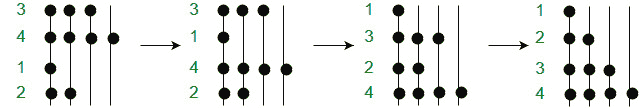
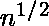
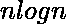

# 珠子排序|一种自然排序算法

> 原文:[https://www . geesforgeks . org/bead-sort-natural-sorting-algorithm/](https://www.geeksforgeeks.org/bead-sort-natural-sorting-algorithm/)

也被称为重力排序，这种算法的灵感来自自然现象，设计时考虑到物体(或珠子)在重力的影响下下落。

**想法:**正数是用一组像算盘上的珠子来表示的。


使用珠子排序对{7，2，1，4，2}进行排序。如果下面有空间，珠子会一颗一颗掉下来。

1.  像上图一样，珠子从上到下代表以下数字:7，2，1，4，2。现在，假设这是珠子在时间 **t = 0** 的位置，并且随着每一秒的流逝，珠子将下落一级，只要它们下面没有珠子已经存在。在这种情况下，它们只是停留在它们下面的珠子上。(杆从左到右编号，水平从底部编号为 1、2、…………。n)
2.  现在，在时间 **t = 1** 时，左侧前两根杆中的底部 2 个珠子停留在它们的位置上，而第二根杆的顶部的第二个珠子下降一个高度，停留在它下面的珠子上。等级 2 的第三和第四棒中的珠子下降到等级 1。同时，杆 3 至 7 中的珠子下降一级。现在，从上到下的数字变成:2，6，2，2，4。
3.  这一直持续到时间 **t = 4** ，在这里我们得到了从上到下排序的数字序列:1，2，2，4，7。

**为什么这么叫？**

当人们试图想象这种算法时，就好像珠子在重力的影响下下落到它们能到达的最底层，导致珠子组从地面开始以降序排列。如果您在可视化此访问时遇到问题，请点击[链接](http://mgs.spatial-computing.org/ImageGallery/EXEMPLES/BeadSort/index.html)

假设我们必须对数字 3、4、1、2 进行排序。上面的算法是这样工作的。



珠子分类工作

下面是代码，在看代码之前尝试自己实现。

**代码:**

```
// C++ program to implement gravity/bead sort
#include <bits/stdc++.h>
using namespace std;

#define BEAD(i, j) beads[i * max + j]

// function to perform the above algorithm
void beadSort(int *a, int len)
{
    // Find the maximum element
    int max = a[0];
    for (int i = 1; i < len; i++)
        if (a[i] > max)
           max = a[i];

    // allocating memory
    unsigned char beads[max*len];
    memset(beads, 0, sizeof(beads));

    // mark the beads
    for (int i = 0; i < len; i++)
        for (int j = 0; j < a[i]; j++)
            BEAD(i, j) = 1;

    for (int j = 0; j < max; j++)
    {
        // count how many beads are on each post
        int sum = 0;
        for (int i=0; i < len; i++)
        {
            sum += BEAD(i, j);
            BEAD(i, j) = 0;
        }

        // Move beads down
        for (int i = len - sum; i < len; i++)
            BEAD(i, j) = 1;
    }

    // Put sorted values in array using beads
    for (int i = 0; i < len; i++)
    {
        int j;
        for (j = 0; j < max && BEAD(i, j); j++);

        a[i] = j;
    }
}

// driver function to test the algorithm
int main()
{
    int a[] = {5, 3, 1, 7, 4, 1, 1, 20};
    int len = sizeof(a)/sizeof(a[0]);

    beadSort(a, len);

    for (int i = 0; i < len; i++)
        printf("%d ", a[i]);

    return 0;
}
```

输出:

```
1 1 1 3 4 5 7 20

```

**时间复杂度:**
算法的运行时间复杂度从 O(1)到 O(S) (S 是输入整数之和)不等，具体取决于用户的视角。最后，提出了三种可能的实现方式。

1.  **O(1)** :将所有珠子一起作为单个(同时)操作落下。这种复杂性在实践中无法实现。
2.  ****O(**** ):在一个利用重力的逼真物理模型中，让珠子下落的时间与最大高度的平方根成正比，而最大高度与 n 成正比。
3.  **O(n)** :由于行数等于 n，因此将珠子行放入框架(代表一个数字)中是一个独特的操作
4.  **O(S)** :将每一个珠子作为单独的操作落下，因为 S 是所有珠子的总和。

像[鸽子洞排序](https://www.geeksforgeeks.org/pigeonhole-sort/)一样，珠子排序是不寻常的，因为在最坏的情况下，它可以比 O( )执行得更快，O 是在最坏情况下比较排序可能的最快性能。这是可能的，因为珠排序的键总是正整数，珠排序利用其结构。

**空间复杂性:**珠粒分类是废物分类的记录保持者。额外内存的成本超过了存储阵列本身的成本。它的记忆复杂性是 **O(** )

**参考文献:**

*   [https://www . wikiwall . com/en/bead _ sort](https://www.wikiwand.com/en/Bead_sort)
*   [https://kukuruku.co/post/bead-sort/](https://kukuruku.co/post/bead-sort/)
*   [https://rosettacode.org/wiki/Sorting_algorithms/Bead_sort](https://rosettacode.org/wiki/Sorting_algorithms/Bead_sort)
*   [https://www.cs.auckland.ac.nz/~mjd/misc/BeadSort5.pdf](https://www.cs.auckland.ac.nz/~mjd/misc/BeadSort5.pdf)

本文由 [Palash Nigam](https://www.linkedin.com/in/palash25) 供稿。如果你喜欢 GeeksforGeeks 并想投稿，你也可以使用[contribute.geeksforgeeks.org](http://www.contribute.geeksforgeeks.org)写一篇文章或者把你的文章邮寄到 contribute@geeksforgeeks.org。看到你的文章出现在极客博客主页上，帮助其他极客。

如果你发现任何不正确的地方，或者你想分享更多关于上面讨论的话题的信息，请写评论。