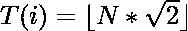
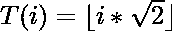

# 比提序列

> 原文:[https://www.geeksforgeeks.org/beatty-sequence/](https://www.geeksforgeeks.org/beatty-sequence/)

**比提序列**(或**齐次比提序列**)是取一个正无理数的正倍数的地板而得到的整数序列。
比提序列的第 N <sup>个</sup>术语:

> 

### 找到贝蒂序列的 N 项

给定一个整数 **N** ，任务是打印 Beatty 序列的第一个 **N** 项。
**例:**

> **输入:** N = 5
> **输出:** 1、2、4、5、7
> **输入:** N = 10
> **输出:** 1、2、4、5、7、8、9、11、12、

**方法:**想法是使用循环从 1 迭代到 N，以找到序列的项。比提序列的项由
给出

> 

以下是上述方法的实现:

## C++

```
// C++ implementation of the
// above approach

#include <bits/stdc++.h>
using namespace std;

// Function to print the first N terms
// of the Beatty sequence
void BeattySequence(int n)
{
    for (int i = 1; i <= n; i++) {
        double ans = floor(i * sqrt(2));
        cout << ans << ", ";
    }
}

// Driver code
int main()
{
    int n = 5;

    BeattySequence(n);

    return 0;
}
```

## Java 语言(一种计算机语言，尤用于创建网站)

```
// Java implementation of the
// above approach
import java.util.*;
class GFG{

// Function to print the first N terms
// of the Beatty sequence
static void BeattySequence(int n)
{
    for(int i = 1; i <= n; i++)
    {
        int ans = (int)Math.floor(i * Math.sqrt(2));
        System.out.print(ans + ", ");
    }
}

// Driver code
public static void main(String args[])
{
    int n = 5;

    BeattySequence(n);
}
}

// This code is contributed by Code_Mech
```

## 蟒蛇 3

```
# Python3 implementation of the
# above approach
import math

# Function to print the first N terms
# of the Beatty sequence
def BeattySequence(n):
    for i in range(1, n + 1):
        ans = math.floor(i * math.sqrt(2))
        print(ans, end = ', ')

# Driver code
n = 5
BeattySequence(n)

# This code is contributed by yatin
```

## C#

```
// C# implementation of the
// above approach
using System;
class GFG{

// Function to print the first N terms
// of the Beatty sequence
static void BeattySequence(int n)
{
    for(int i = 1; i <= n; i++)
    {
       double ans = Math.Floor(i * Math.Sqrt(2));
       Console.Write(ans + ", ");
    }
}

// Driver code
public static void Main()
{
    int n = 5;

    BeattySequence(n);
}
}

// This code is contributed by Code_Mech
```

## java 描述语言

```
<script>
// Javascript implementation of the
// above approach

    // Function to print the first N terms
    // of the Beatty sequence
    function BeattySequence( n) {
        for ( let i = 1; i <= n; i++) {
            let ans = parseInt( Math.floor(i * Math.sqrt(2)));
            document.write(ans + ", ");
        }
    }

    // Driver code

        let n = 5;

        BeattySequence(n);
// This code contributed by Rajput-Ji
</script>
```

**Output:** 

```
1, 2, 4, 5, 7,
```

***时间复杂度:** O(n <sup>1/2</sup> )*

***辅助空间:** O(1)*

**参考:**T2https://oeis.org/A001951