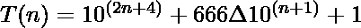

# 贝尔法戈数

> 哎哎哎:# t0]https://www . geeksforgeeks . org/belpheger-number/

贝尔菲戈尔数是一个回文数，因此该数具有形式

```
1(0...)666(0...)1
```

第 n 个贝尔菲戈尔数由下式给出:

> 

### 检查 N 是否是贝尔菲戈尔数

给定一个数字 **N** ，任务是检查 **N** 是否为**贝尔菲戈尔数字**。如果 **N** 是**贝尔菲戈尔号**，则打印**“是”**否则打印**“否”**。

**示例:**

> **输入:** N = 16661
> **输出:**是
> **说明:**
> 此数为回文，形式为 1(0…)666(0…)1。
> 
> **输入:**N = 1661
> T3】输出:否

**方法:**思路是检查号码是不是**回文**如果是回文那么检查号码的形式应该是 **1(0…)666(0…)1** ，如果号码是这个形式那么打印**“是”**，否则打印**“否”**。

下面是上述方法的实现:

## 蟒蛇 3

```
# Python3 implementation 
# of the above approach

# Function to check if the number 
# N is in the form 
# 1(0...)666(0...)1
def isinform(n):
    temp = str(n)

    Len = len(temp)

    # basic case
    if "666" not in temp or\
       Len<5 or Len % 2 == 0:
        return False

    mid = Len//2
    if not (temp[mid-1] == temp[mid]\
       and temp[mid-1] == '6' and\
                     temp[0] == '1'):
        return False
    for i in range(mid + 2, Len-1):
        if temp[i] != '0':
            return False
    return True

# Function to check if the number 
# N is palindrome
def ispalindrome(n):
    temp = str(n)
    if temp == temp[::-1]:
        return True
    return False

# Function to check if a number 
# N is Belphegor
def isBelphegor(n):       
    if ispalindrome(n):
        if isinform(n):
            return True
    return False 

# Driver Code  
n = 100666001;   
if isBelphegor(n):
    print("Yes")
else:
    print("No")
```

**Output:**

```
Yes

```