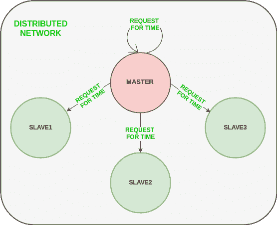
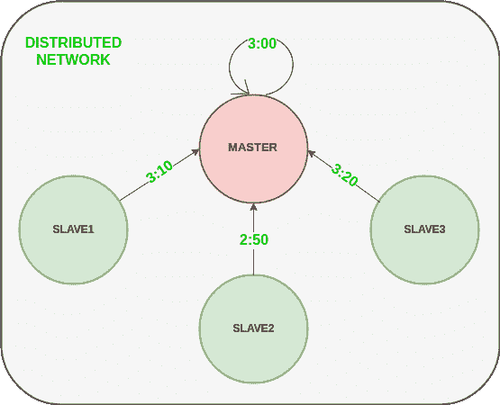
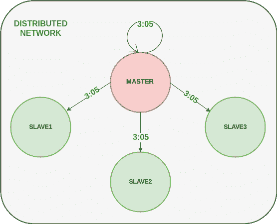
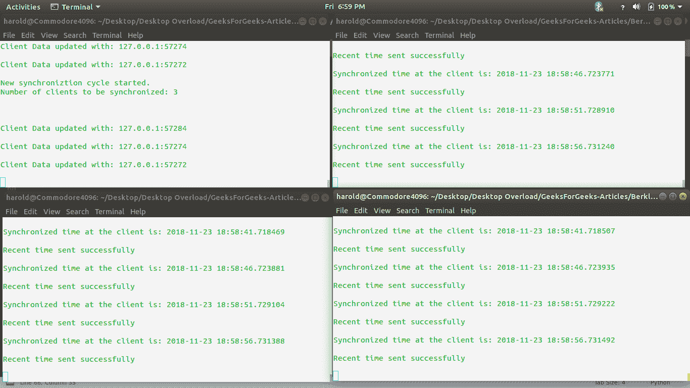

# 伯克利算法

> 原文:[https://www.geeksforgeeks.org/berkeleys-algorithm/](https://www.geeksforgeeks.org/berkeleys-algorithm/)

伯克利算法是一种用于分布式系统的时钟同步技术。该算法假设网络中的每个机器节点要么没有准确的时间源，要么没有世界协调时服务器。
**算法**
1)从网络中的池节点中选择单个节点作为主节点。该节点是网络中充当主节点的主节点，其余节点充当从节点。使用选举过程/领导者选举算法来选择主节点。
2)主节点定期 pings 从节点，并使用[克里斯蒂安算法](https://www.geeksforgeeks.org/cristians-algorithm/)获取它们的时钟时间。
下图说明了主节点如何向从节点发送请求。



下图说明了从节点如何发回系统时钟给出的时间。



3)主节点计算接收到的所有时钟时间与主节点系统时钟本身给出的时钟时间之间的平均时间差。这个平均时间差被加到主系统时钟的当前时间上，并通过网络广播。
上述步骤的伪代码:

下图说明了伯克利算法的最后一步。



**改进范围**

*   克里斯蒂安算法准确性的改进。
*   忽略平均时差计算中的显著异常值
*   如果主节点出现故障/损坏，必须准备/预先选择一个辅助领导者来代替主节点，以减少由于主节点不可用而导致的停机时间。
*   主节点不是发送同步时间，而是广播相对反向时间差，这导致在从节点计算时间时，网络中遍历时间引起的延迟减少。

下面的代码是一个 python 脚本，可以用来触发主时钟服务器。

## 蟒蛇 3

```
# Python3 program imitating a clock server

from functools import reduce
from dateutil import parser
import threading
import datetime
import socket
import time

# datastructure used to store client address and clock data
client_data = {}

''' nested thread function used to receive 
    clock time from a connected client '''
def startReceivingClockTime(connector, address):

    while True:
        # receive clock time
        clock_time_string = connector.recv(1024).decode()
        clock_time = parser.parse(clock_time_string)
        clock_time_diff = datetime.datetime.now() - \
                                                 clock_time

        client_data[address] = {
                       "clock_time"      : clock_time,
                       "time_difference" : clock_time_diff,
                       "connector"       : connector
                       }

        print("Client Data updated with: "+ str(address),
                                              end = "\n\n")
        time.sleep(5)

''' master thread function used to open portal for 
    accepting clients over given port '''
def startConnecting(master_server):

    # fetch clock time at slaves / clients
    while True:
        # accepting a client / slave clock client
        master_slave_connector, addr = master_server.accept()
        slave_address = str(addr[0]) + ":" + str(addr[1])

        print(slave_address + " got connected successfully")

        current_thread = threading.Thread(
                         target = startReceivingClockTime,
                         args = (master_slave_connector,
                                           slave_address, ))
        current_thread.start()

# subroutine function used to fetch average clock difference
def getAverageClockDiff():

    current_client_data = client_data.copy()

    time_difference_list = list(client['time_difference'] 
                                for client_addr, client 
                                    in client_data.items())

    sum_of_clock_difference = sum(time_difference_list, \
                                   datetime.timedelta(0, 0))

    average_clock_difference = sum_of_clock_difference \
                                         / len(client_data)

    return  average_clock_difference

''' master sync thread function used to generate 
    cycles of clock synchronization in the network '''
def synchronizeAllClocks():

    while True:

        print("New synchroniztion cycle started.")
        print("Number of clients to be synchronized: " + \
                                     str(len(client_data)))

        if len(client_data) > 0:

            average_clock_difference = getAverageClockDiff()

            for client_addr, client in client_data.items():
                try:
                    synchronized_time = \
                         datetime.datetime.now() + \
                                    average_clock_difference

                    client['connector'].send(str(
                               synchronized_time).encode())

                except Exception as e:
                    print("Something went wrong while " + \
                          "sending synchronized time " + \
                          "through " + str(client_addr))

        else :
            print("No client data." + \
                        " Synchronization not applicable.")

        print("\n\n")

        time.sleep(5)

# function used to initiate the Clock Server / Master Node
def initiateClockServer(port = 8080):

    master_server = socket.socket()
    master_server.setsockopt(socket.SOL_SOCKET,
                                   socket.SO_REUSEADDR, 1)

    print("Socket at master node created successfully\n")

    master_server.bind(('', port))

    # Start listening to requests
    master_server.listen(10)
    print("Clock server started...\n")

    # start making connections
    print("Starting to make connections...\n")
    master_thread = threading.Thread(
                        target = startConnecting,
                        args = (master_server, ))
    master_thread.start()

    # start synchroniztion
    print("Starting synchronization parallelly...\n")
    sync_thread = threading.Thread(
                          target = synchronizeAllClocks,
                          args = ())
    sync_thread.start()

# Driver function
if __name__ == '__main__':

    # Trigger the Clock Server
    initiateClockServer(port = 8080)
```

**输出:**

```
New synchroniztion cycle started.
Number of clients to be synchronized: 3

Client Data updated with: 127.0.0.1:57284

Client Data updated with: 127.0.0.1:57274

Client Data updated with: 127.0.0.1:57272
```

下面的代码是一个 python 脚本，可以用来触发从属/客户端。

## 蟒蛇 3

```
# Python3 program imitating a client process

from timeit import default_timer as timer
from dateutil import parser
import threading
import datetime
import socket 
import time

# client thread function used to send time at client side
def startSendingTime(slave_client):

    while True:
        # provide server with clock time at the client
        slave_client.send(str(
                       datetime.datetime.now()).encode())

        print("Recent time sent successfully",
                                          end = "\n\n")
        time.sleep(5)

# client thread function used to receive synchronized time
def startReceivingTime(slave_client):

    while True:
        # receive data from the server
        Synchronized_time = parser.parse(
                          slave_client.recv(1024).decode())

        print("Synchronized time at the client is: " + \
                                    str(Synchronized_time),
                                    end = "\n\n")

# function used to Synchronize client process time
def initiateSlaveClient(port = 8080):

    slave_client = socket.socket()          

    # connect to the clock server on local computer 
    slave_client.connect(('127.0.0.1', port)) 

    # start sending time to server 
    print("Starting to receive time from server\n")
    send_time_thread = threading.Thread(
                      target = startSendingTime,
                      args = (slave_client, ))
    send_time_thread.start()

    # start receiving synchronized from server
    print("Starting to receiving " + \
                         "synchronized time from server\n")
    receive_time_thread = threading.Thread(
                       target = startReceivingTime,
                       args = (slave_client, ))
    receive_time_thread.start()

# Driver function
if __name__ == '__main__':

    # initialize the Slave / Client
    initiateSlaveClient(port = 8080)
```

**输出:**

```
Recent time sent successfully
Synchronized time at the client is: 2018-11-23 18:49:31.166449
```

下面是上面 python 脚本运行时的截图，其中左上角的控制台代表主线程，而其他控制台代表从线程。



> **注意:上面的脚本详细描述了伯克利算法的工作，但可能与基于生产的分布式网络系统中算法的实际实现不同。端口 8080 的可用性取决于机器。如果端口 8080 不可用，请在主脚本和从脚本中相应地更改端口号。**

**参考文献:**

1.  [https://en.wikipedia.org/wiki/Berkeley_algorithm](https://en.wikipedia.org/wiki/Berkeley_algorithm)
2.  [https://www . geesforgeks . org/socket-编程-多线程-python/](https://www.geeksforgeeks.org/socket-programming-multi-threading-python/)
3.  [https://www.geeksforgeeks.org/cristians-algorithm/](https://www.geeksforgeeks.org/cristians-algorithm/)