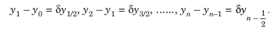
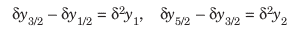
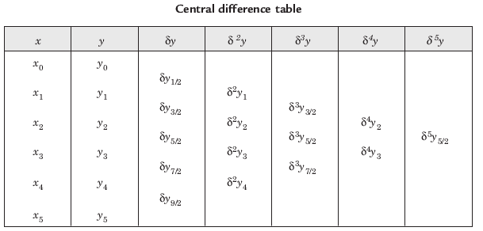
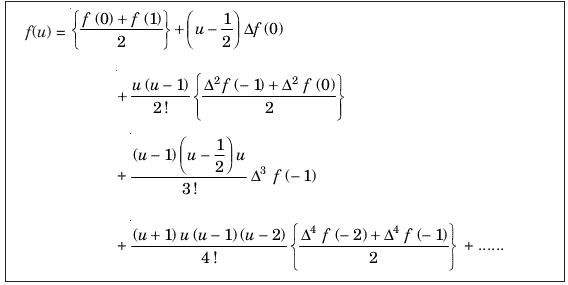
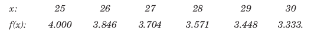
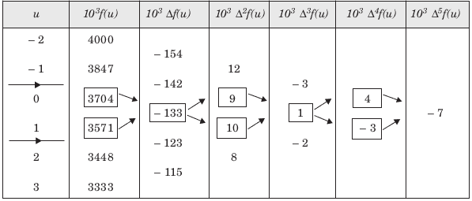

# 贝塞尔插值

> 原文:[https://www.geeksforgeeks.org/bessels-interpolation/](https://www.geeksforgeeks.org/bessels-interpolation/)

**内插**是针对自变量的任何中间值估计函数值的技术，而计算给定范围之外的函数值的过程称为**外推**。

**中心差分**:中心差分算子 d 由以下关系定义:



同样，高阶中心差定义为:



**注–**同一水平线的中心差有相同的后缀



**贝塞尔插值公式–**



当 **u = 1/2** 时非常有用。当 **1/4 < u < 3/4**
这里 f(0)是原点，通常被认为是中点，因为贝塞尔用于在中心附近插值。
h 称为差的区间，u =(x–f(0))/h，这里 f(0)是所选原点的项。

**示例–**
输入:值为 27.4？



输出:



27.4 时的值为 3.64968

**贝塞尔插值的实现–**

## C++

```
// CPP Program to interpolate using Bessel's interpolation
#include <bits/stdc++.h>
using namespace std;

// calculating u mentioned in the formula
float ucal(float u, int n)
{
    if (n == 0)
        return 1;

    float temp = u;
    for (int i = 1; i <= n / 2; i++)
        temp = temp * (u - i);

    for (int i = 1; i < n / 2; i++)
        temp = temp * (u + i);

    return temp;
}

// calculating factorial of given number n
int fact(int n)
{
    int f = 1;
    for (int i = 2; i <= n; i++)
        f *= i;

    return f;
}

int main()
{
    // Number of values given
    int n = 6;
    float x[] = { 25, 26, 27, 28, 29, 30 };

    // y[][] is used for difference table
    // with y[][0] used for input
    float y[n][n];
    y[0][0] = 4.000;
    y[1][0] = 3.846;
    y[2][0] = 3.704;
    y[3][0] = 3.571;
    y[4][0] = 3.448;
    y[5][0] = 3.333;

    // Calculating the central difference table
    for (int i = 1; i < n; i++)
        for (int j = 0; j < n - i; j++)
            y[j][i] = y[j + 1][i - 1] - y[j][i - 1];

    // Displaying the central difference table
    for (int i = 0; i < n; i++) {
        for (int j = 0; j < n - i; j++)
            cout << setw(4) << y[i][j] << "\t";
        cout << endl;
    }

    // value to interpolate at
    float value = 27.4;

    // Initializing u and sum
    float sum = (y[2][0] + y[3][0]) / 2;

    // k is origin thats is f(0)
    int k;
    if (n % 2) // origin for odd
        k = n / 2;
    else
        k = n / 2 - 1; // origin for even

    float u = (value - x[k]) / (x[1] - x[0]);

    // Solving using bessel's formula
    for (int i = 1; i < n; i++) {
        if (i % 2)
            sum = sum + ((u - 0.5) *
                  ucal(u, i - 1) * y[k][i]) / fact(i);
        else
            sum = sum + (ucal(u, i) *
                  (y[k][i] + y[--k][i]) / (fact(i) * 2));
    }

    cout << "Value at " << value << " is " << sum << endl;

    return 0;
}
```

## Java 语言(一种计算机语言，尤用于创建网站)

```
// Java Program to interpolate using Bessel's interpolation
import java.text.*;
class GFG{
// calculating u mentioned in the formula
static double ucal(double u, int n)
{
    if (n == 0)
        return 1;

    double temp = u;
    for (int i = 1; i <= n / 2; i++)
        temp = temp * (u - i);

    for (int i = 1; i < n / 2; i++)
        temp = temp * (u + i);

    return temp;
}

// calculating factorial of given number n
static int fact(int n)
{
    int f = 1;
    for (int i = 2; i <= n; i++)
        f *= i;

    return f;
}

public static void main(String[] args)
{
    // Number of values given
    int n = 6;
    double x[] = { 25, 26, 27, 28, 29, 30 };

    // y[][] is used for difference table
    // with y[][0] used for input
    double[][] y=new double[n][n];
    y[0][0] = 4.000;
    y[1][0] = 3.846;
    y[2][0] = 3.704;
    y[3][0] = 3.571;
    y[4][0] = 3.448;
    y[5][0] = 3.333;

    // Calculating the central difference table
    for (int i = 1; i < n; i++)
        for (int j = 0; j < n - i; j++)
            y[j][i] = y[j + 1][i - 1] - y[j][i - 1];

    // Displaying the central difference table
    DecimalFormat df = new DecimalFormat("#.########");
    for (int i = 0; i < n; i++) {
        for (int j = 0; j < n - i; j++)
            System.out.print(y[i][j]+"\t");
        System.out.println("");
    }

    // value to interpolate at
    double value = 27.4;

    // Initializing u and sum
    double sum = (y[2][0] + y[3][0]) / 2;

    // k is origin thats is f(0)
    int k;
    if ((n % 2)>0) // origin for odd
        k = n / 2;
    else
        k = n / 2 - 1; // origin for even

    double u = (value - x[k]) / (x[1] - x[0]);

    // Solving using bessel's formula
    for (int i = 1; i < n; i++) {
        if ((i % 2)>0)
            sum = sum + ((u - 0.5) *
                ucal(u, i - 1) * y[k][i]) / fact(i);
        else
            sum = sum + (ucal(u, i) *
                (y[k][i] + y[--k][i]) / (fact(i) * 2));
    }

    System.out.printf("Value at "+value+" is %.5f",sum);

}
}
// This code is contributed by mits
```

## 蟒蛇 3

```
# Python3 Program to interpolate
# using Bessel's interpolation

# calculating u mentioned in the
# formula
def ucal(u, n):

    if (n == 0):
        return 1;

    temp = u;
    for i in range(1, int(n / 2 + 1)):
        temp = temp * (u - i);

    for i in range(1, int(n / 2)):
        temp = temp * (u + i);

    return temp;

# calculating factorial of
# given number n
def fact(n):

    f = 1;
    for i in range(2, n + 1):
        f *= i;

    return f;

# Number of values given
n = 6;
x = [25, 26, 27, 28, 29, 30];

# y[][] is used for difference
# table with y[][0] used for input
y = [[0 for i in range(n)]
        for j in range(n)];
y[0][0] = 4.000;
y[1][0] = 3.846;
y[2][0] = 3.704;
y[3][0] = 3.571;
y[4][0] = 3.448;
y[5][0] = 3.333;

# Calculating the central
# difference table
for i in range(1, n):
    for j in range(n - i):
        y[j][i] = y[j + 1][i - 1] - y[j][i - 1];

# Displaying the central
# difference table
for i in range(n):
    for j in range(n - i):
        print(y[i][j], "\t", end = " ");
    print("");

# value to interpolate at
value = 27.4;

# Initializing u and sum
sum = (y[2][0] + y[3][0]) / 2;

# k is origin thats is f(0)
k = 0;
if ((n % 2) > 0): # origin for odd
    k = int(n / 2);
else:
    k = int(n / 2 - 1); # origin for even

u = (value - x[k]) / (x[1] - x[0]);

# Solving using bessel's formula
for i in range(1, n):

    if (i % 2):
        sum = sum + ((u - 0.5) *
                 ucal(u, i - 1) *
              y[k][i]) / fact(i);
    else:
        sum = sum + (ucal(u, i) * (y[k][i] +
                     y[k - 1][i]) / (fact(i) * 2));
        k -= 1;

print("Value at", value, "is", round(sum, 5));

# This code is contributed by mits
```

## C#

```
// C# Program to interpolate using Bessel's interpolation

class GFG{
// calculating u mentioned in the formula
static double ucal(double u, int n)
{
    if (n == 0)
        return 1;

    double temp = u;
    for (int i = 1; i <= n / 2; i++)
        temp = temp * (u - i);

    for (int i = 1; i < n / 2; i++)
        temp = temp * (u + i);

    return temp;
}

// calculating factorial of given number n
static int fact(int n)
{
    int f = 1;
    for (int i = 2; i <= n; i++)
        f *= i;

    return f;
}

public static void Main()
{
    // Number of values given
    int n = 6;
    double []x = { 25, 26, 27, 28, 29, 30 };

    // y[,] is used for difference table
    // with y[,0] used for input
    double[,] y=new double[n,n];
    y[0,0] = 4.000;
    y[1,0] = 3.846;
    y[2,0] = 3.704;
    y[3,0] = 3.571;
    y[4,0] = 3.448;
    y[5,0] = 3.333;

    // Calculating the central difference table
    for (int i = 1; i < n; i++)
        for (int j = 0; j < n - i; j++)
            y[j,i] = y[j + 1,i - 1] - y[j,i - 1];

    // Displaying the central difference table
    for (int i = 0; i < n; i++) {
        for (int j = 0; j < n - i; j++)
            System.Console.Write(y[i,j]+"\t");
        System.Console.WriteLine("");
    }

    // value to interpolate at
    double value = 27.4;

    // Initializing u and sum
    double sum = (y[2,0] + y[3,0]) / 2;

    // k is origin thats is f(0)
    int k;
    if ((n % 2)>0) // origin for odd
        k = n / 2;
    else
        k = n / 2 - 1; // origin for even

    double u = (value - x[k]) / (x[1] - x[0]);

    // Solving using bessel's formula
    for (int i = 1; i < n; i++) {
        if ((i % 2)>0)
            sum = sum + ((u - 0.5) *
                ucal(u, i - 1) * y[k,i]) / fact(i);
        else
            sum = sum + (ucal(u, i) *
                (y[k,i] + y[--k,i]) / (fact(i) * 2));
    }

    System.Console.WriteLine("Value at "+value+" is "+System.Math.Round(sum,5));

}
}
// This code is contributed by mits
```

## 服务器端编程语言（Professional Hypertext Preprocessor 的缩写）

```
<?php
// PHP Program to interpolate
// using Bessel's interpolation

// calculating u mentioned
// in the formula
function ucal($u, $n)
{
    if ($n == 0)
        return 1;

    $temp = $u;
    for ($i = 1;
         $i <= (int)($n / 2); $i++)
        $temp = $temp *
               ($u - $i);

    for ($i = 1;
         $i < (int)($n / 2); $i++)
        $temp = $temp * ($u + $i);

    return $temp;
}

// calculating factorial
// of given number n
function fact($n)
{
    $f = 1;
    for ($i = 2; $i <= $n; $i++)
        $f *= $i;

    return $f;
}

// Number of values given
$n = 6;
$x = array(25, 26, 27,
           28, 29, 30);

// y[][] is used for difference
// table with y[][0] used for input
$y;
for($i = 0; $i < $n; $i++)
for($j = 0; $j < $n; $j++)
$y[$i][$j] = 0.0;
$y[0][0] = 4.000;
$y[1][0] = 3.846;
$y[2][0] = 3.704;
$y[3][0] = 3.571;
$y[4][0] = 3.448;
$y[5][0] = 3.333;

// Calculating the central
// difference table
for ($i = 1; $i < $n; $i++)
    for ($j = 0; $j < $n - $i; $j++)
        $y[$j][$i] = $y[$j + 1][$i - 1] -
                     $y[$j][$i - 1];

// Displaying the central
// difference table
for ($i = 0; $i < $n; $i++)
{
    for ($j = 0; $j < $n - $i; $j++)
        echo str_pad($y[$i][$j], 4) . "\t";
    echo "\n";
}

// value to interpolate at
$value = 27.4;

// Initializing u and sum
$sum = ($y[2][0] +
        $y[3][0]) / 2;

// k is origin thats is f(0)
$k;
if ($n % 2) // origin for odd
    $k = $n / 2;
else
    $k = $n / 2 - 1; // origin for even

$u = ($value - $x[$k]) /
     ($x[1] - $x[0]);

// Solving using
// bessel's formula
for ($i = 1; $i < $n; $i++)
{
    if ($i % 2)
        $sum = $sum + (($u - 0.5) *
                   ucal($u, $i - 1) *
                     $y[$k][$i]) / fact($i);
    else
        $sum = $sum + (ucal($u, $i) *
                      ($y[$k][$i] +
                       $y[--$k][$i]) /
                       (fact($i) * 2));
}

echo "Value at " . $value .
     " is " . $sum . "\n";

// This code is contributed by mits
?>
```

## java 描述语言

```
<script>

// Javascript Program to interpolate
// using Bessel's interpolation

// Calculating u mentioned in the formula
function ucal(u, n)
{
    if (n == 0)
        return 1;

    var temp = u;
    for(var i = 1; i <= n / 2; i++)
        temp = temp * (u - i);

    for(var i = 1; i < n / 2; i++)
        temp = temp * (u + i);

    return temp;
}

// Calculating factorial of given number n
function fact(n)
{
    var f = 1;
    for(var i = 2; i <= n; i++)
        f *= i;

    return f;
}

// Driver code

// Number of values given
var n = 6;
var x = [ 25, 26, 27, 28, 29, 30 ];

// y is used for difference table
// with y[0] used for input
var y = Array(n).fill(0.0).map(x => Array(n).fill(0.0));;
y[0][0] = 4.000;
y[1][0] = 3.846;
y[2][0] = 3.704;
y[3][0] = 3.571;
y[4][0] = 3.448;
y[5][0] = 3.333;

// Calculating the central difference table
for(var i = 1; i < n; i++)
    for(var j = 0; j < n - i; j++)
        y[j][i] = y[j + 1][i - 1] - y[j][i - 1];

// Displaying the central difference table
for(var i = 0; i < n; i++)
{
    for(var j = 0; j < n - i; j++)
        document.write(y[i][j].toFixed(6) +
                      "    ");

    document.write('<br>');
}

// Value to interpolate at
var value = 27.4;

// Initializing u and sum
var sum = (y[2][0] + y[3][0]) / 2;

// k is origin thats is f(0)
var k;

// Origin for odd
if ((n % 2) > 0)
    k = n / 2;
else

    // Origin for even
    k = n / 2 - 1;

var u = (value - x[k]) / (x[1] - x[0]);

// Solving using bessel's formula
for(var i = 1; i < n; i++)
{
    if ((i % 2) > 0)
        sum = sum + ((u - 0.5) *
        ucal(u, i - 1) * y[k][i]) / fact(i);
    else
        sum = sum + (ucal(u, i) *
         (y[k][i] + y[--k][i]) / (fact(i) * 2));
}

document.write("Value at " + value.toFixed(6) +
                      " is " + sum.toFixed(6));

// This code is contributed by Princi Singh

</script>
```

**输出:**

```
    4    -0.154    0.0120001    -0.00300002    0.00399971    -0.00699902    
3.846    -0.142    0.00900006    0.000999689    -0.00299931    
3.704    -0.133    0.00999975    -0.00199962    
3.571    -0.123    0.00800014    
3.448    -0.115    
3.333    
Value at 27.4 is 3.64968
```

本文由 [**舒巴姆拉纳**](https://auth.geeksforgeeks.org/profile.php?user=shubham_rana_77) 供稿。如果你喜欢 GeeksforGeeks 并想投稿，你也可以使用[write.geeksforgeeks.org](https://write.geeksforgeeks.org)写一篇文章或者把你的文章邮寄到 contribute@geeksforgeeks.org。看到你的文章出现在极客博客主页上，帮助其他极客。
如果发现有不正确的地方，或者想分享更多关于上述话题的信息，请写评论。