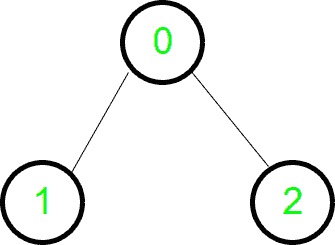
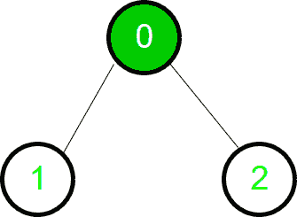

# BFS 使用向量&按照 CLRS

的算法排队

> 原文:[https://www . geesforgeks . org/bfs-使用向量-每算法队列-clrs/](https://www.geeksforgeeks.org/bfs-using-vectors-queue-per-algorithm-clrs/)

[广度优先搜索](https://www.geeksforgeeks.org/breadth-first-traversal-for-a-graph/)使用 [CLRS 书籍](https://www.amazon.in/Introduction-Algorithms-Eastern-Economy-Thomas/dp/8120340078?tag=googinhydr18418-21)中给出的算法遍历图形。
BFS 是遍历图的方法之一。之所以这样命名，是因为它在边界的宽度上均匀地扩展了已发现和未发现顶点之间的边界。它的意思是，算法首先发现距离为 k 的所有与“u”相连的顶点，然后再发现距离为 k+1 的顶点，CLRS 中给出的算法使用“颜色”的概念来检查一个顶点是否被完全或部分发现或未被发现。它还跟踪顶点 u 离源 s 的距离

```
BFS(G,s)
1  for each vertex u in G.V - {s}
2     u.color = white
3     u.d = INF
4     u.p = NIL
5  s.color = green
6  s.d = 0
7  s.p = NIL
8  Q = NULL
9  ENQUEUE(Q,s)
10 while Q != NULL
11    u = DEQUEUE(Q)
12    for each v in G.Adj[u]
13       if v.color == white
14          v.color = green
15          v.d = u.d + 1
16          v.p = u
17          ENQUEUE(Q,v)
18    u.color = dark_green
```

它产生了一个“广度优先树”，其根包含所有可到达的顶点。让我们举一个简单的有向图，看看 BFS 是如何穿越它的。



图表



遍历的开始


第一次遍历


第一次遍历完成

## C++

```
// CPP program to implement BFS as per CLRS 
// algorithm.
#include <bits/stdc++.h>
using namespace std;

// Declaring the vectors to store color, distance
// and parent
vector<string> colour;
vector<int> d;
vector<int> p;

/* This function adds an edge to the graph.
It is an undirected graph. So edges are 
added for both the nodes. */
void addEdge(vector <int> g[], int u, int v)
{
    g[u].push_back(v);
    g[v].push_back(u);
}

/* This function does the Breadth First Search*/
void BFSSingleSource(vector <int> g[], int s)
{
    // The Queue used for the BFS operation
    queue<int> q;

    // Pushing the root node inside the queue
    q.push(s); 

    /* Distance of root node is 0 & colour
    is gray as it is visited partially now */
    d[s] = 0;
    colour[s] = "green";

    /* Loop to traverse the graph. Traversal
    will happen traverse until the queue is 
    not empty.*/
    while (!q.empty())
    {
        /* Extracting the front element(node) 
        and poping it out of queue. */
        int u = q.front();
        q.pop();

        cout << u << " ";

        /* This loop traverses all the child nodes of u */
        for (auto i = g[u].begin(); i != g[u].end(); i++)
        {
            /* If the colour is white then the said node
            is not traversed. */
            if (colour[*i] == "white")
            {
                colour[*i] = "green";
                d[*i] = d[u] + 1;
                p[*i] = u;

                /* Pushing the node inside queue
                to traverse its children. */
                q.push(*i); 
            }
        }

        /* Now the node u is completely traversed
        and colour is changed to black. */
        colour[u] = "dark_green";
    }
}

void BFSFull(vector <int> g[], int n)
{
    /* Initially all nodes are not traversed.
    Therefore, the colour is white. */
    colour.assign(n, "white");
    d.assign(n, 0);
    p.assign(n, -1);

    // Calling BFSSingleSource() for all white
    // vertices.
    for (int i = 0; i < n; i++)     
        if (colour[i] == "white")
            BFSSingleSource(g, i); 
}

// Driver Function
int main()
{
    // Graph with 7 nodes and 6 edges.
    int n = 7;

    // The Graph vector
    vector <int> g[n];

    addEdge(g, 0, 1);
    addEdge(g, 0, 2);
    addEdge(g, 1, 3);
    addEdge(g, 1, 4);
    addEdge(g, 2, 5);
    addEdge(g, 2, 6);

    BFSFull(g, n);

    return 0;
}
```

## 蟒蛇 3

```
# Python3 program to implement BFS as 
# per CLRS algorithm. 
import queue 

# This function adds an edge to the graph. 
# It is an undirected graph. So edges 
# are added for both the nodes. 
def addEdge(g, u, v):
    g[u].append(v) 
    g[v].append(u)

# This function does the Breadth
# First Search
def BFSSingleSource(g, s):

    # The Queue used for the BFS operation 
    q = queue.Queue()

    # Pushing the root node inside 
    # the queue 
    q.put(s) 

    # Distance of root node is 0 & colour is  
    # gray as it is visited partially now 
    d[s] = 0
    colour[s] = "green"

    # Loop to traverse the graph. Traversal 
    # will happen traverse until the queue 
    # is not empty.
    while (not q.empty()):

        # Extracting the front element(node) 
        # and poping it out of queue. 
        u = q.get() 

        print(u, end = " ")

        # This loop traverses all the child
        # nodes of u
        i = 0
        while i < len(g[u]):

            # If the colour is white then 
            # the said node is not traversed. 
            if (colour[g[u][i]] == "white"):
                colour[g[u][i]] = "green"
                d[g[u][i]] = d[u] + 1
                p[g[u][i]] = u 

                # Pushing the node inside queue 
                # to traverse its children. 
                q.put(g[u][i])
            i += 1

        # Now the node u is completely traversed 
        # and colour is changed to black. 
        colour[u] = "dark_green"

def BFSFull(g, n):

    # Initially all nodes are not traversed. 
    # Therefore, the colour is white. 
    colour = ["white"] * n 
    d = [0] * n 
    p = [-1] * n 

    # Calling BFSSingleSource() for all 
    # white vertices
    for i in range(n):
        if (colour[i] == "white"): 
            BFSSingleSource(g, i)

# Driver Code

# Graph with 7 nodes and 6 edges. 
n = 7

# Declaring the vectors to store color, 
# distance and parent 
colour = [None] * n
d = [None] * n
p = [None] * n

# The Graph vector 
g = [[] for i in range(n)] 

addEdge(g, 0, 1) 
addEdge(g, 0, 2) 
addEdge(g, 1, 3) 
addEdge(g, 1, 4) 
addEdge(g, 2, 5) 
addEdge(g, 2, 6) 

BFSFull(g, n)

# This code is contributed by Pranchalk
```

## java 描述语言

```
<script>
// Javascript program to implement BFS as per CLRS 
// algorithm.

// Declaring the vectors to store color, distance
// and parent
var colour = [];
var d = [];
var p = [];

/* This function adds an edge to the graph.
It is an undirected graph. So edges are 
added for both the nodes. */
function addEdge(g, u, v)
{
    g[u].push(v);
    g[v].push(u);
}

/* This function does the Breadth First Search*/
function BFSSingleSource(g, s)
{
    // The Queue used for the BFS operation
    var q = [];

    // Pushing the root node inside the queue
    q.push(s); 

    /* Distance of root node is 0 & colour
    is gray as it is visited partially now */
    d[s] = 0;
    colour[s] = "green";

    /* Loop to traverse the graph. Traversal
    will happen traverse until the queue is 
    not empty.*/
    while (q.length!=0)
    {
        /* Extracting the front element(node) 
        and poping it out of queue. */
        var u = q[0];
        q.shift();

        document.write( u + " ");

        /* This loop traverses all the child nodes of u */
        for(var i of g[u])
        {
            /* If the colour is white then the said node
            is not traversed. */
            if (colour[i] == "white")
            {
                colour[i] = "green";
                d[i] = d[u] + 1;
                p[i] = u;

                /* Pushing the node inside queue
                to traverse its children. */
                q.push(i); 
            }
        }

        /* Now the node u is completely traversed
        and colour is changed to black. */
        colour[u] = "dark_green";
    }
}

function BFSFull(g, n)
{
    /* Initially all nodes are not traversed.
    Therefore, the colour is white. */
    colour = Array(n).fill("white");
    d = Array(n).fill(0);
    p = Array(n).fill(0);

    // Calling BFSSingleSource() for all white
    // vertices.
    for (var i = 0; i < n; i++)     
        if (colour[i] == "white")
            BFSSingleSource(g, i); 
}

// Driver Function
// Graph with 7 nodes and 6 edges.
var n = 7;

// The Graph vector
var g = Array.from(Array(n), ()=>Array());

addEdge(g, 0, 1);
addEdge(g, 0, 2);
addEdge(g, 1, 3);
addEdge(g, 1, 4);
addEdge(g, 2, 5);
addEdge(g, 2, 6);
BFSFull(g, n);

// This code is contributed by rutvik_56.
</script>
```

**输出:**

```
0 1 2 3 4 5 6
```