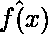
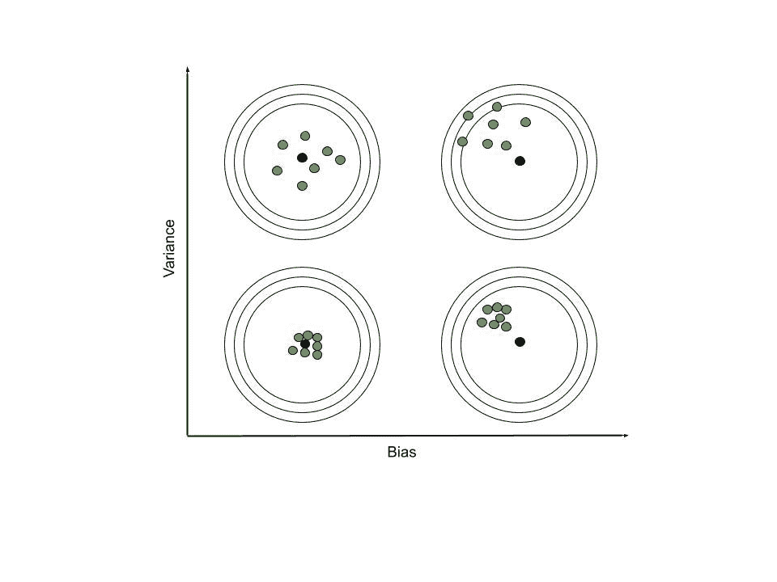
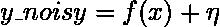
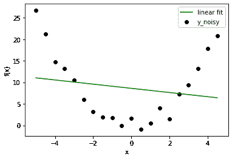
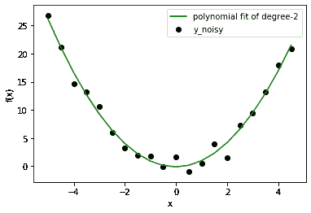
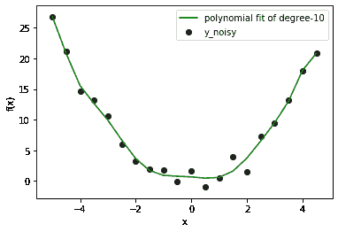
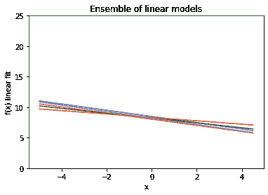
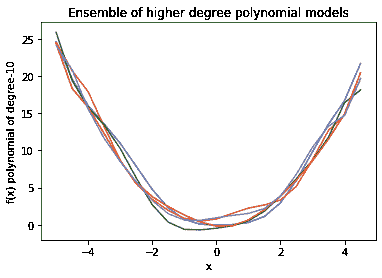

# ML |偏差与方差

> 原文:[https://www . geesforgeks . org/bias-vs-机器学习中的差异/](https://www.geeksforgeeks.org/bias-vs-variance-in-machine-learning/)

在本文中，我们将学习‘机器学习模型的偏差和方差是什么，它们的最优状态应该是什么。

有各种方法来评估机器学习模型。我们可以使用均方误差进行回归；带有绝对误差的分类问题的精度、召回率和 ROC。以类似的方式，偏差和方差帮助我们调整参数，并在几个构建的模型中决定更适合的模型。

偏差是由于对数据的错误假设而产生的一种错误，例如假设数据是线性的，而实际上，数据遵循复杂的函数。另一方面，方差的引入对训练数据的变化非常敏感。这也是一种类型的错误，因为我们希望使我们的模型对噪声具有鲁棒性。

在进入数学定义之前，我们需要了解随机变量和函数。假设 f(x)是我们给定的数据所遵循的函数。我们将建立几个可以表示为的模型。这个函数上的每个点都是一个随机变量，其值的数量等于模型的数量。为了正确地近似真实函数 f(x)，我们取期望值为

<center>![f\hat(x) : E[f\hat(x)]](img/cb210acdfb117f68d350168195482924.png "Rendered by QuickLaTeX.com")</center>

```
Bias : 
Variance : 

```

让我们看看这两个术语的重要性。


这些图像不言自明。尽管如此，我们还是要谈谈需要注意的事情。当偏差较大时，预测函数组的焦点远离真实函数。然而，当方差较高时，预测函数组中的函数彼此相差很大。

让我们举一个机器学习的例子。这里获取的数据遵循特征(x)的二次函数来预测目标列(y _ noisy)。在现实场景中，数据包含有噪声的信息，而不是正确的值。因此，我们向二次函数值添加了 0 均值，1 方差高斯噪声。

<center></center>

<center>

| x | y | y _ 嘈杂 |
| --- | --- | --- |
| -5 | Twenty-five | 2.67595670e+01 |
| -4.5 | Twenty point two five | 2.11632561e+01 |
| -4 | Sixteen | 1.46802434e+01 |
| -3.5 | Twelve point two five | 1.31647290e+01 |
| -3 | nine | 1.05460668e+01 |
| -2.5 | Six point two five | 5.95794282e+00 |
| -2 | four | 3.25487498e+00 |
| -1.5 | Two point two five | 1.97478968e+00 |
| -1 | one | 1.73960283e+00 |
| -0.5 | Zero point two five | -1.13112086e-02 |
| Zero | Zero | 1.64552536e+00 |
| Zero point five | Zero point two five | -9.60938656e-01 |
| one | one | 4.46816845e-01 |
| One point five | Two point two five | 4.01016081e+00 |
| Two | four | 1.54342469e+00 |
| Two point five | Six point two five | 7.27654456e+00 |
| three | nine | 9.37684917e+00 |
| Three point five | Twelve point two five | 1.32076198e+01 |
| four | Sixteen | 1.79133242e+01 |
| Four point five | Twenty point two five | 2.08601281e+01 |

</center>


数据可视化

现在我们有一个回归问题，让我们试着拟合几个不同阶的多项式模型。这里给出的结果是 1 度，2 度，10 度。





在这种情况下，我们已经知道正确的模型是度=2。但是一旦你从一个玩具问题中拓宽视野，你就会面临事先不知道数据分布的情况。因此，如果您选择一个较低程度的模型，您可能无法正确拟合数据行为(让数据远离线性拟合)。如果你选择更高的学位，也许你是在拟合噪音而不是数据。低度模型无论如何都会给你高误差，但是高度模型在低误差下仍然是不正确的。那么，我们该怎么办呢？我们可以使用可视化方法，也可以使用偏差和方差来寻找更好的设置。(数据科学家仅使用一部分数据来训练模型，然后使用剩余数据来检查广义行为。)

现在，如果我们绘制模型集合来计算每个多项式模型的偏差和方差:





我们可以看到，在线性模型中，每一条线彼此非常接近，但距离实际数据却很远。另一方面，高次多项式曲线仔细地跟随数据，但是它们之间有很大的差异。因此，线性偏差高，高次多项式方差高。这一事实也反映在计算的数量上。

```
Linear Model:-
Bias : 6.3981120643436356
Variance : 0.09606406047494431

Higher Degree Polynomial Model:-
Bias : 0.31310660249287225
Variance : 0.565414017195101

```

完成这项任务后，我们可以得出结论，简单模型倾向于具有高偏差，而复杂模型具有高方差。我们可以用这些特征来确定欠拟合或过拟合。

再次回到数学部分:偏差和方差与目标值和预测值之间的经验误差(由于数据中添加了噪声而不是真实误差的均方误差)有什么关系。

![ \begin{align*} MSE =& E[(f-f\hat)^2]\\ =& E[f^2 - 2ff\hat + f\hat^2]\\ =& f^2E[1] - 2fE[f\hat] + E[f\hat^2]\\ =& f^2 - 2fE[f\hat] + E[f\hat^2]\\ \end{align*} ](img/cc3a3f56ea6a43a14e19bd2cccc5f909.png "Rendered by QuickLaTeX.com")

现在，让我们计算另一个量:

![ \begin{align*} bias^2 + variance =& (f-E[f\hat])^2 + E[f\hat^2] - {(E[f\hat])}^2\\ =& f^2 - 2fE[f\hat] + (E[f\hat])^2 + E[f\hat^2] - (E[f\hat])^2\\ =& f^2 - 2fE[f\hat] +E[f\hat^]\\ =& MSE \end{align*} ](img/173abed409eb8cde80f00ea52d2f63a4.png "Rendered by QuickLaTeX.com")

现在，我们到达结论阶段。重要的是要记住偏差和方差是有权衡的，为了最小化误差，我们需要减少两者。这意味着我们希望我们的模型预测接近数据(低偏差)，并确保预测点不会因 w.r.t .变化噪声(低方差)而变化太大。