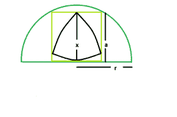

# 内接半圆的正方形内的最大三角形

> 原文:[https://www . geesforgeks . org/maximum-reuleaux-triangle-in circride-in square-内接半圆/](https://www.geeksforgeeks.org/biggest-reuleaux-triangle-inscirbed-within-a-square-inscribed-in-a-semicircle/)

这里给定的是一个半径为 **r** 的半圆，它刻下一个正方形，正方形又刻下一个[三角形](https://en.wikipedia.org/wiki/Reuleaux_triangle)。任务是找到这个 [reuleaux 三角](https://en.wikipedia.org/wiki/Reuleaux_triangle)的最大可能面积。
**举例:**

```
Input : x = 5  
Output : 14.0954

Input : x = 8
Output : 36.0842
```



**逼近**:我们知道，半圆内接正方形的边是， **a = 2r/√5** 。[(请参考此处)](https://www.geeksforgeeks.org/largest-square-that-can-be-inscribed-in-a-semicircle/)
同样，在 reuleaux 三角中， **x = a** 。
So， **x = 2*r/√5**
So，[Reuleaux 三角](https://www.geeksforgeeks.org/area-of-reuleaux-triangle/)面积:

```
A = 0.70477*x^2 = 0.70477*(r^2/5)
```

以下是上述方法的实现:

## C++

```
// C++ Program to find the biggest Reuleaux triangle
// inscribed within in a square which in turn
// is inscribed within a semicircle

#include <bits/stdc++.h>
using namespace std;

// Function to find the biggest reuleaux triangle
float Area(float r)
{

    // radius cannot be negative
    if (r < 0)
        return -1;

    // height of the reuleaux triangle
    float x = (2 * r) / sqrt(5);

    // area of the reuleaux triangle
    float A = 0.70477 * pow(x, 2);

    return A;
}

// Driver code
int main()
{
    float r = 5;
    cout << Area(r) << endl;

    return 0;
}
```

## Java 语言(一种计算机语言，尤用于创建网站)

```
// Java Program to find the biggest
// Reuleaux triangle inscribed within
// in a square which in turn is
// inscribed within a semicircle
import java.lang.Math;

class GFG
{

// Function to find the biggest reuleaux triangle
static float Area(float r)
{

    // radius cannot be negative
    if (r < 0)
        return -1;

    // height of the reuleaux triangle
    float x = (2 * r) /(float)(Math.sqrt(5));

    // area of the reuleaux triangle
    float A = 0.70477f *(float)(Math.pow(x, 2));

    return A;
}

// Driver code
public static void main(String[] args)
{
    float r = 5;
    System.out.println(Area(r));
}
}

// This code is contributed by Mukul Singh.
```

## 蟒蛇 3

```
# Python3 Program to find the biggest
# Reuleaux triangle inscribed within
# in a square which in turn is inscribed
# within a semicircle
import math as mt

# Function to find the biggest
# reuleaux triangle
def Area(r):

    # radius cannot be negative
    if (r < 0):
        return -1

    # height of the reuleaux triangle
    x = (2 * r) / mt.sqrt(5)

    # area of the reuleaux triangle
    A = 0.70477 * pow(x, 2)

    return A

# Driver code
r = 5
print(Area(r))

# This code is contributed by
# Mohit Kumar 29
```

## C#

```
// C# Program to find the biggest
// Reuleaux triangle inscribed within
// in a square which in turn is
// inscribed within a semicircle
using System;

class GFG
{

// Function to find the biggest reuleaux triangle
static double Area(double r)
{

    // radius cannot be negative
    if (r < 0)
        return -1;

    // height of the reuleaux triangle
    double x = (2 * r) / (double)(Math.Sqrt(5));

    // area of the reuleaux triangle
    double A = 0.70477  * (double)(Math.Pow(x, 2));

    return A;
}

// Driver code
public static void Main()
{
    double r = 5;
    Console.WriteLine(Area(r));
}
}

// This code is contributed by chandan_jnu
```

## 服务器端编程语言（Professional Hypertext Preprocessor 的缩写）

```
<?php
// PHP Program to find the biggest Reuleaux
// triangle inscribed within in a square
// which in turn is inscribed within a semicircle

// Function to find the biggest
// reuleaux triangle
function Area($r)
{

    // radius cannot be negative
    if ($r < 0)
        return -1;

    // height of the reuleaux triangle
    $x = (2 * $r) / sqrt(5);

    // area of the reuleaux triangle
    $A = 0.70477 * pow($x, 2);

    return $A ;
}

// Driver code
$r = 5;

echo Area($r);

// This code is contributed by Ryuga
?>
```

## java 描述语言

```
<script>
// javascript Program to find the biggest
// Reuleaux triangle inscribed within
// in a square which in turn is
// inscribed within a semicircle

// Function to find the biggest reuleaux triangle
function Area(r)
{

    // radius cannot be negative
    if (r < 0)
        return -1;

    // height of the reuleaux triangle
    var x = (2 * r) /(Math.sqrt(5));

    // area of the reuleaux triangle
    var A = 0.70477 *(Math.pow(x, 2));
    return A;
}

// Driver code
var r = 5;
document.write(Area(r).toFixed(4));

// This code is contributed by Princi Singh
</script>
```

**Output:** 

```
14.0954
```