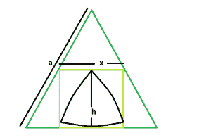

# 内接在等边三角形内接的正方形内的最大三角形

> 原文:[https://www . geesforgeks . org/maximum-reuleaux-triangle-内接正方形-内接等边三角形/](https://www.geeksforgeeks.org/biggest-reuleaux-triangle-inscribed-within-a-square-inscribed-in-an-equilateral-triangle/)

这里给定的是一个边长为**的等边三角形**，它刻出一个正方形，正方形又刻出一个[三角形](https://en.wikipedia.org/wiki/Reuleaux_triangle)。任务是找到这个 [reuleaux 三角](https://en.wikipedia.org/wiki/Reuleaux_triangle)的最大可能面积。
**举例:**

```
Input : a = 5 
Output : 3.79335

Input : a = 9
Output : 12.2905
```



**逼近**:我们知道内接在边长等边三角形内的正方形的边是，**x = 0.464 * a**T5(请参考此处)。
同样，在 reuleaux 三角形中， **h = x** 。
所以，[勒乌三角的面积](https://www.geeksforgeeks.org/area-of-reuleaux-triangle/) :

```
A = 0.70477*h2 
  = 0.70477*(0.464*a)2
```

以下是上述方法的实现:

## C++

```
// C++ Program to find the biggest Reuleaux triangle
// inscribed within in a square which in turn
// is inscribed within an equilateral triangle
#include <bits/stdc++.h>
using namespace std;

// Function to find the biggest reuleaux triangle
float Area(float a)
{

    // side cannot be negative
    if (a < 0)
        return -1;

    // height of the reuleaux triangle
    float x = 0.464 * a;

    // area of the reuleaux triangle
    float A = 0.70477 * pow(x, 2);

    return A;
}

// Driver code
int main()
{
    float a = 5;
    cout << Area(a) << endl;

    return 0;
}
```

## Java 语言(一种计算机语言，尤用于创建网站)

```
// Java Program to find the biggest Reuleaux triangle
// inscribed within in a square which in turn
// is inscribed within an equilateral triangle

class GFG
{

// Function to find the biggest reuleaux triangle
static float Area(float a)
{

    // side cannot be negative
    if (a < 0)
        return -1;

    // height of the reuleaux triangle
    float x = 0.464f * a;

    // area of the reuleaux triangle
    float A = 0.70477f * (float)Math.pow(x, 2);

    return A;
}

// Driver code
public static void main (String[] args)
{
    float a = 5;
    System.out.println(String.format("%.5f", Area(a)));
}
}

// This code is contributed by chandan_jnu
```

## 蟒蛇 3

```
# Python3 Program to find the biggest
# Reuleaux triangle inscribed within
# in a square which in turn is inscribed
# within an equilateral triangle
import math as mt

# Function to find the biggest
# reuleaux triangle
def Area(a):

    # side cannot be negative
    if (a < 0):
        return -1

    # height of the reuleaux triangle
    x = 0.464 * a

    # area of the reuleaux triangle
    A = 0.70477 * pow(x, 2)

    return A

# Driver code
a = 5
print(Area(a))

# This code is contributed by
# Mohit Kumar 29
```

## C#

```
// C# Program to find the biggest Reuleaux
// triangle inscribed within in a square
// which in turn is inscribed within an
// equilateral triangle
using System;

class GFG
{

// Function to find the biggest
// reuleaux triangle
static float Area(float a)
{

    // side cannot be negative
    if (a < 0)
        return -1;

    // height of the reuleaux triangle
    float x = 0.464f * a;

    // area of the reuleaux triangle
    float A = 0.70477f * (float)Math.Pow(x, 2);

    return A;
}

// Driver code
public static void Main ()
{
    float a = 5;
    Console.WriteLine(String.Format("{0,0:#.00000}",
                                          Area(a)));
}
}

// This code is contributed by Akanksha Rai
```

## 服务器端编程语言（Professional Hypertext Preprocessor 的缩写）

```
<?php
// PHP Program to find the biggest Reuleaux
// triangle inscribed within in a square
// which in turn is inscribed within an
// equilateral triangle

// Function to find the biggest
// reuleaux triangle
function Area($a)
{

    // side cannot be negative
    if ($a < 0)
        return -1;

    // height of the reuleaux triangle
    $x = 0.464 * $a;

    // area of the reuleaux triangle
    $A = 0.70477 * pow($x, 2);

    return $A;
}

// Driver code
$a = 5;
echo Area($a) . "\n";

// This code is contributed
// by Akanksha Rai
```

## java 描述语言

```
<script>

// Javascript Program to find the biggest Reuleaux triangle
// inscribed within in a square which in turn
// is inscribed within an equilateral triangle

// Function to find the biggest reuleaux triangle
function Area( a)
{

    // side cannot be negative
    if (a < 0)
        return -1;

    // height of the reuleaux triangle
    let x = 0.464 * a;

    // area of the reuleaux triangle
    let A = 0.70477 * Math.pow(x, 2);

    return A;
}

// Driver code

    let a = 5;
    document.write( Area(a).toFixed(5));

// This code contributed by Rajput-Ji

</script>
```

**Output:** 

```
3.79335
```