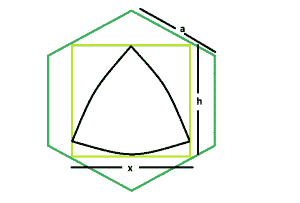

# 内切圆内接六边形的最大三角形

> 原文:[https://www . geeksforgeeks . org/big-reuleaux-三角形-内切圆-内切圆-内切圆-内切圆/](https://www.geeksforgeeks.org/biggest-reuleaux-triangle-inscribed-within-a-square-which-is-inscribed-within-a-hexagon/)

给定一个边长为**的正六边形，一个**画出一个正方形，正方形又画出一个三角形。任务是找到这个 reuleaux 三角形的最大可能面积。
**例:**

```
Input: a = 5
Output: 28.3287

Input: a = 9
Output: 91.7848
```



**接近**:内切圆的边是 **x = 1.268a** 。请参考[六边形内接的最大正方形。](https://www.geeksforgeeks.org/largest-square-that-can-be-inscribed-within-a-hexagon/)
同样，在 reuleaux 三角形中， **h = x = 1.268a** 。
所以，[地区的 reuleaux 三角](https://www.geeksforgeeks.org/area-of-reuleaux-triangle/)，**a = 0.70477*h^2 = 0.70477*(1.268a)^2**。
以下是上述方法的实施:

## C++

```
// C++ Program to find the biggest Reuleaux triangle
// inscribed within in a square which in turn
// is inscribed within a hexagon
#include <bits/stdc++.h>
using namespace std;

// Function to find the biggest reuleaux triangle
float Area(float a)
{

    // side cannot be negative
    if (a < 0)
        return -1;

    // height of the reuleaux triangle
    float h = 1.268 * a;

    // area of the reuleaux triangle
    float A = 0.70477 * pow(h, 2);

    return A;
}

// Driver code
int main()
{
    float a = 5;
    cout << Area(a) << endl;

    return 0;
}
```

## Java 语言(一种计算机语言，尤用于创建网站)

```
// Java Program to find the biggest Reuleaux triangle
// inscribed within in a square which in turn
// is inscribed within a hexagon

import java.io.*;

class GFG
{

// Function to find the biggest reuleaux triangle
static float Area(float a)
{

    // side cannot be negative
    if (a < 0)
        return -1;

    // height of the reuleaux triangle
    float h =(float) 1.268 * a;

    // area of the reuleaux triangle
    float A = (float)(0.70477 * Math.pow(h, 2));

    return A;
}

    // Driver code
    public static void main (String[] args)
    {
        float a = 5;
    System.out.println( Area(a));
    }
}

// This code is contributed by anuj_67
```

## 蟒蛇 3

```
# Python3 Program to find the biggest
# Reuleaux triangle inscribed within
# in a square which in turn is
# inscribed within a hexagon
import math

# Function to find the biggest
# reuleaux triangle
def Area(a):

    # side cannot be negative
    if (a < 0):
        return -1

    # height of the reuleaux triangle
    h = 1.268 * a

    # area of the reuleaux triangle
    A = 0.70477 * math.pow(h, 2)

    return A

# Driver code
a = 5
print(Area(a),end = "\n")

# This code is contributed
# by Akanksha Rai
```

## C#

```
// C# Program to find the biggest Reuleaux
// triangle inscribed within in a square
// which in turn is inscribed within a hexagon
using System;

class GFG
{

// Function to find the biggest reuleaux triangle
static float Area(float a)
{

    // side cannot be negative
    if (a < 0)
        return -1;

    // height of the reuleaux triangle
    float h =(float) 1.268 * a;

    // area of the reuleaux triangle
    float A = (float)(0.70477 * Math.Pow(h, 2));

    return A;
}

// Driver code
public static void Main ()
{
    float a = 5;
    Console.WriteLine(Area(a));
}
}

// This code is contributed
// by Akanksha Rai
```

## 服务器端编程语言（Professional Hypertext Preprocessor 的缩写）

```
<?php
// PHP Program to find the biggest Reuleaux
// triangle inscribed within in a square
// which in turn is inscribed within a hexagon

// Function to find the biggest
// reuleaux triangle
function Area($a)
{

    // side cannot be negative
    if ($a < 0)
        return -1;

    // height of the reuleaux triangle
    $h = 1.268 * $a;

    // area of the reuleaux triangle
    $A = 0.70477 * pow($h, 2);

    return $A;
}

// Driver code
$a = 5;
echo round(Area($a), 4);

// This code is contributed by Ryuga
?>
```

## java 描述语言

```
<script>

// Javascript Program to find the biggest Reuleaux triangle
// inscribed within in a square which in turn
// is inscribed within a hexagon

// Function to find the biggest reuleaux triangle
function Area(a)
{

    // side cannot be negative
    if (a < 0)
        return -1;

    // height of the reuleaux triangle
    let h = 1.268 * a;

    // area of the reuleaux triangle
    let A = 0.70477 * Math.pow(h, 2);

    return A;
}

// Driver code
    let a = 5;
    document.write(Area(a) + "<br>");

// This code is contributed by Mayank Tyagi

</script>
```

**Output:** 

```
28.3287
```