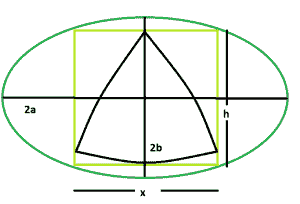

# 内接在正方形内的最大三角形，该正方形内接在椭圆内

> 原文:[https://www . geesforgeks . org/maximum-reuleaux-三角形-内接正方形-内接椭圆/](https://www.geeksforgeeks.org/biggest-reuleaux-triangle-inscribed-within-a-square-which-is-inscribed-within-an-ellipse/)

给定一个椭圆，其长轴和短轴分别为 **2a** & **2b** ，该椭圆画出一个正方形，该正方形又画出一个三角形。任务是找到这个 reuleaux 三角形的最大可能面积。
**例:**

```
Input: a = 5, b = 4
Output: 0.0722389

Input: a = 7, b = 11
Output: 0.0202076
```



**逼近** : As，椭圆内接正方形的边为， **x = √(a^2 + b^2)/ab.**请参考[椭圆内接最大正方形的面积。](https://www.geeksforgeeks.org/area-of-the-largest-square-that-can-be-inscribed-in-an-ellipse/)
同样，在 reuleaux 三角中， **h = x = √(a^2 + b^2)/ab** 。
所以，[地区的 reuleaux 三角](https://www.geeksforgeeks.org/area-of-reuleaux-triangle/)，**a = 0.70477*h^2 = 0.70477*((a^2+b^2)/a^2b^2)**。
以下是上述方法的实施:

## C++

```
// C++ Program to find the biggest Reuleaux triangle
// inscribed within in a square which in turn
// is inscribed within an ellipse
#include <bits/stdc++.h>
using namespace std;

// Function to find the biggest reuleaux triangle
float Area(float a, float b)
{

    // length of the axes cannot be negative
    if (a < 0 && b < 0)
        return -1;

    // height of the reuleaux triangle
    float h = sqrt(((pow(a, 2) + pow(b, 2))
                    / (pow(a, 2) * pow(b, 2))));

    // area of the reuleaux triangle
    float A = 0.70477 * pow(h, 2);

    return A;
}

// Driver code
int main()
{
    float a = 5, b = 4;
    cout << Area(a, b) << endl;

    return 0;
}
```

## Java 语言(一种计算机语言，尤用于创建网站)

```
// Java Program to find the biggest Reuleaux triangle
// inscribed within in a square which in turn
// is inscribed within an ellipse
import java.io.*;

class GFG
{

// Function to find the biggest reuleaux triangle
static float Area(float a, float b)
{

    // length of the axes cannot be negative
    if (a < 0 && b < 0)
        return -1;

    // height of the reuleaux triangle
    float h = (float)Math.sqrt(((Math.pow(a, 2) + Math.pow(b, 2))
                / (Math.pow(a, 2) * Math.pow(b, 2))));

    // area of the reuleaux triangle
    float A = (float)(0.70477 * Math.pow(h, 2));

    return A;
}

// Driver code
public static void main (String[] args)
{
    float a = 5, b = 4;
    System.out.println(Area(a, b));
}
}

// This code is contributed by anuj_67..
```

## 蟒蛇 3

```
# Python3 Program to find the biggest Reuleaux
# triangle inscribed within in a square
# which in turn is inscribed within an ellipse
import math;

# Function to find the biggest
# reuleaux triangle
def Area(a, b):

    # length of the axes cannot
    # be negative
    if (a < 0 and b < 0):
        return -1;

    # height of the reuleaux triangle
    h = math.sqrt(((pow(a, 2) + pow(b, 2)) /
                   (pow(a, 2) * pow(b, 2))));

    # area of the reuleaux triangle
    A = 0.70477 * pow(h, 2);

    return A;

# Driver code
a = 5;
b = 4;
print(round(Area(a, b), 7));

# This code is contributed by chandan_jnu
```

## C#

```
// C# Program to find the biggest Reuleaux triangle
// inscribed within in a square which in turn
// is inscribed within an ellipse
using System;

class GFG
{

// Function to find the biggest reuleaux triangle
static double Area(double a, double b)
{

    // length of the axes cannot be negative
    if (a < 0 && b < 0)
        return -1;

    // height of the reuleaux triangle
    double h = (double)Math.Sqrt(((Math.Pow(a, 2) +
                                    Math.Pow(b, 2)) /
                                   (Math.Pow(a, 2) *
                                   Math.Pow(b, 2))));

    // area of the reuleaux triangle
    double A = (double)(0.70477 * Math.Pow(h, 2));

    return A;
}

// Driver code
static void Main()
{
    double a = 5, b = 4;
    Console.WriteLine(Math.Round(Area(a, b),7));
}
}

// This code is contributed by chandan_jnu
```

## 服务器端编程语言（Professional Hypertext Preprocessor 的缩写）

```
<?php
// PHP Program to find the biggest Reuleaux
// triangle inscribed within in a square
// which in turn is inscribed within an ellipse

// Function to find the biggest
// reuleaux triangle
function Area($a, $b)
{

    // length of the axes cannot
    // be negative
    if ($a < 0 && $b < 0)
        return -1;

    // height of the reuleaux triangle
    $h = sqrt(((pow($a, 2) + pow($b, 2)) /
               (pow($a, 2) * pow($b, 2))));

    // area of the reuleaux triangle
    $A = 0.70477 * pow($h, 2);

    return $A;
}

// Driver code
$a = 5;
$b = 4;
echo round(Area($a, $b), 7);

// This code is contributed by Ryuga
?>
```

## java 描述语言

```
<script>

// Javascript Program to find the biggest Reuleaux triangle
// inscribed within in a square which in turn
// is inscribed within an ellipse

// Function to find the biggest reuleaux triangle
function Area(a, b)
{

    // length of the axes cannot be negative
    if (a < 0 && b < 0)
        return -1;

    // height of the reuleaux triangle
    let h = Math.sqrt(((Math.pow(a, 2) + Math.pow(b, 2))
                    / (Math.pow(a, 2) * Math.pow(b, 2))));

    // area of the reuleaux triangle
    let A = 0.70477 * Math.pow(h, 2);

    return A;
}

// Driver code
    let a = 5, b = 4;
    document.write(Area(a, b) + "<br>");

// This code is contributed by Mayank Tyagi

</script>
```

**Output:** 

```
0.0722389
```