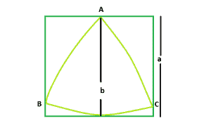

# 正方形内最大的三角形

> 原文:[https://www . geesforgeks . org/big-reuleaux-triangle-in-a-sqaure/](https://www.geeksforgeeks.org/biggest-reuleaux-triangle-within-a-sqaure/)

给定一个整数**和一个**，这是一个正方形的边，任务是找到最大的[勒乌三角](https://en.wikipedia.org/wiki/Reuleaux_triangle)，它可以被内接在里面。



**示例:**

> **输入:**a = 6
> T3】输出: 25.3717
> 
> **输入:**a = 8
> T3】输出: 45.1053

**逼近**:我们知道勒乌三角的[区域为**0.70477 * b<sup>2</sup>T7【其中 **b** 为支撑勒乌三角的平行线之间的距离。
从图中可以清楚的看到，支撑勒鲁三角的平行线之间的距离=正方形的边即 **a**
所以，勒鲁三角的面积， **A = 0.70477 * a <sup>2</sup>****](https://www.geeksforgeeks.org/area-of-reuleaux-triangle/)

下面是上述方法的实现:

## C++

```
// C++ Program to find the area
// of the biggest Reuleaux triangle
// that can be inscribed within a square
#include <bits/stdc++.h>
using namespace std;

// Function to find the Area
// of the Reuleaux triangle
float ReuleauxArea(float a)
{

    // Side cannot be negative
    if (a < 0)
        return -1;

    // Area of the Reuleaux triangle
    float A = 0.70477 * pow(a, 2);
    return A;
}

// Driver code
int main()
{
    float a = 6;
    cout << ReuleauxArea(a) << endl;
    return 0;
}
```

## Java 语言(一种计算机语言，尤用于创建网站)

```
// Java Program to find the area
// of the biggest Reuleaux triangle
// that can be inscribed within a square
import java.lang.Math;
class cfg
{
// Function to find the Area
// of the Reuleaux triangle
 static double ReuleauxArea(double a)
{

    // Side cannot be negative
    if (a < 0)
        return -1;

    // Area of the Reuleaux triangle
    double A = 0.70477 * Math.pow(a, 2);
    return A;
}

// Driver code
public static void main(String[] args)
{
    double a= 6;
    System.out.println(ReuleauxArea(a) );

}
}//This code is contributed by Mukul Singh.
```

## 蟒蛇 3

```
# Python3 Program to find the area
# of the biggest Reuleaux triangle
# that can be inscribed within a square

# Function to find the Area
# of the Reuleaux triangle
def ReuleauxArea(a) :

    # Side cannot be negative
    if (a < 0) :
        return -1

    # Area of the Reuleaux triangle
    A = 0.70477 * pow(a, 2);
    return A

# Driver code
if __name__ == "__main__" :

    a = 6
    print(ReuleauxArea(a))

# This code is contributed by Ryuga
```

## C#

```
// C# program to find area of the
//biggest  Reuleaux triangle that can be inscribed
//within a square
using System;

class GFG {

    // Function to find the area
    // of the reuleaux triangle
    static double reuleauxArea(double a)
    {

     //Side cannot be negative
     if (a<0)
        return -1;

        // Area of the reauleaux triangle
        double A=0.70477*Math.Pow(a,2);
        return A;
    }

    // Driver code
    static public void Main()
    {
        double a= 6;
        Console.WriteLine(reuleauxArea( a));
    }
}
//This code is contributed by Mohit kumar 29
```

## 服务器端编程语言（Professional Hypertext Preprocessor 的缩写）

```
<?php
// PHP Program to find the area of the
// biggest Reuleaux triangle that can
// be inscribed within a square

// Function to find the Area
// of the Reuleaux triangle
function ReuleauxArea($a)
{

    // Side cannot be negative
    if ($a < 0)
        return -1;

    // Area of the Reuleaux triangle
    $A = 0.70477 * pow($a, 2);
    return $A;
}

// Driver code
$a = 6;
echo ReuleauxArea($a) . "\n";

// This code is contributed by ita_c
?>
```

## java 描述语言

```
<script>
// javascript Program to find the area
// of the biggest Reuleaux triangle
// that can be inscribed within a square

// Function to find the Area
// of the Reuleaux triangle
 function ReuleauxArea(a)
{

    // Side cannot be negative
    if (a < 0)
        return -1;

    // Area of the Reuleaux triangle
    var A = 0.70477 * Math.pow(a, 2);
    return A;
}

// Driver code
var a= 6;
document.write(ReuleauxArea(a) );

// This code is contributed by Princi Singh
</script>
```

**Output:** 

```
25.3717
```