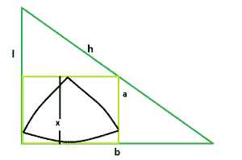

# 直角三角形内接的正方形内最大的三角形

> 原文:[https://www . geesforgeks . org/big-reuleaux-直角三角形内接三角形/](https://www.geeksforgeeks.org/biggest-reuleaux-triangle-within-a-square-which-is-inscribed-within-a-right-angle-triangle/)

这里给出的是一个直角三角形，其高度为 **l** ，底边为 **b** &斜边为 **h** ，上面刻有一个正方形，正方形又刻有一个三角形。任务是找到这个 reuleaux 三角形的最大可能面积。
**举例:**

```
Input: l = 5, b = 12, h = 13
Output: 8.77914

Input: l = 3, b = 4, h = 5
Output: 2.07116
```



**逼近**:我们知道，直角三角形内接正方形的边是， **a = (l*b)/(l+b)** ，请参考[直角三角形内最大正方形的面积拟合](https://www.geeksforgeeks.org/area-of-a-largest-square-fit-in-a-right-angle-triangle/)。
同样，在 reuleaux 三角形中， **x = a** 。
所以， **x = (l*b)/(l+b)** 。
所以，勒鲁三角的[面积为**，a = 0.70477*x^2 = 0.70477*((l*b)/(l+b))^2**。
以下是上述方法的实施:](https://www.geeksforgeeks.org/area-of-reuleaux-triangle/) 

## C++

```
// C++ Program to find the biggest Reuleaux triangle
// inscribed within in a square which in turn
// is inscribed within a circle
#include <bits/stdc++.h>
using namespace std;

// Function to find the biggest reuleaux triangle
float Area(float l, float b, float h)
{

    // the height or base or hypotenuse
    // cannot be negative
    if (l < 0 || b < 0 || h < 0)
        return -1;

    // height of the reuleaux triangle
    float x = (l * b) / (l + b);

    // area of the reuleaux triangle
    float A = 0.70477 * pow(x, 2);

    return A;
}

// Driver code
int main()
{
    float l = 5, b = 12, h = 13;
    cout << Area(l, b, h) << endl;

    return 0;
}
```

## Java 语言(一种计算机语言，尤用于创建网站)

```
// Java Program to find the biggest Reuleaux triangle
// inscribed within in a square which in turn
// is inscribed within a circle
import java.util.*;
import java.text.DecimalFormat;

class GFG
{

// Function to find the biggest reuleaux triangle
static double Area(double l, double b, double h)
{

    // the height or base or hypotenuse
    // cannot be negative
    if (l < 0 || b < 0 || h < 0)
        return -1;

    // height of the reuleaux triangle
    double x = (l * b) / (l + b);

    // area of the reuleaux triangle
    double A = 0.70477 * Math.pow(x, 2);

    return A;
}

// Driver code
public static void main(String args[])
{
    double l = 5, b = 12, h = 13;
    DecimalFormat df = new DecimalFormat("#,###,##0.00000");
    System.out.println(df.format(Area(l, b, h)));
}
}

// This code is contributed by
// Shashank_Sharma
```

## 蟒蛇 3

```
# Python3 Program to find the biggest
# Reuleaux triangle inscribed within
# in a square which in turn is inscribed
# within a circle
import math as mt

# Function to find the biggest
# reuleaux triangle
def Area(l, b, h):

    # the height or base or hypotenuse
    # cannot be negative
    if (l < 0 or b < 0 or h < 0):
        return -1

    # height of the reuleaux triangle
    x = (l * b) /(l + b)

    # area of the reuleaux triangle
    A = 0.70477 * pow(x, 2)

    return A

# Driver code
l, b, h = 5, 12, 13
print(Area(l, b, h))

# This code is contributed by
# Mohit kumar 29
```

## C#

```
// C# Program to find the biggest Reuleaux triangle
// inscribed within in a square which in turn
// is inscribed within a circle
using System;

class GFG
{

// Function to find the biggest reuleaux triangle
static double Area(double l, double b, double h)
{

    // the height or base or hypotenuse
    // cannot be negative
    if (l < 0 || b < 0 || h < 0)
        return -1;

    // height of the reuleaux triangle
    double x = (l * b) / (l + b);

    // area of the reuleaux triangle
    double A = 0.70477 * Math.Pow(x, 2);

    return A;
}

// Driver code
public static void Main()
{
    double l = 5, b = 12, h = 13;
    Console.WriteLine((Area(l, b, h)));
}
}

// This code is contributed by
// Mukul Singh
```

## 服务器端编程语言（Professional Hypertext Preprocessor 的缩写）

```
<?php
// PHP Program to find the biggest
// Reuleaux triangle inscribed within
// in a square which in turn is
// inscribed within a circle

// Function to find the biggest
// reuleaux triangle
function Area($l, $b, $h)
{

    // the height or base or hypotenuse
    // cannot be negative
    if ($l < 0 or $b < 0 or $h < 0)
        return -1;

    // height of the reuleaux triangle
    $x = ($l * $b) / ($l + $b);

    // area of the reuleaux triangle
    $A = 0.70477 * pow($x, 2);

    return $A;
}

// Driver code
$l = 5; $b = 12; $h = 13;
echo Area($l, $b, $h);

// This code is contributed by
// anuj_67
?>
```

## java 描述语言

```
<script>

// Javascript Program to find the biggest Reuleaux triangle
// inscribed within in a square which in turn
// is inscribed within a circle

// Function to find the biggest reuleaux triangle
function Area(l,b,h)
{

    // the height or base or hypotenuse
    // cannot be negative
    if (l < 0 || b < 0 || h < 0)
        return -1;

    // height of the reuleaux triangle
    let x = (l * b) / (l + b);

    // area of the reuleaux triangle
    let A = 0.70477 * Math.pow(x, 2);

    return A;
}

// Driver code
let l = 5, b = 12, h = 13;

    document.write( Area(l,b,h).toFixed(5));

// This code contributed by Rajput-Ji

</script>
```

**Output:** 

```
8.77914
```