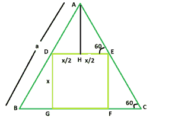

# 等边三角形内可内接的最大正方形

> 原文:[https://www . geesforgeks . org/等边三角形内可内接的最大正方形/](https://www.geeksforgeeks.org/biggest-square-that-can-be-inscribed-within-an-equilateral-triangle/)

这里给出的是边长为 **a** 的等边三角形。任务是找到最大的正方形的可以被刻在里面的一边。
**例:**

```
Input: a = 5 
Output: 2.32

Input: a = 7
Output: 3.248
```



**接近**:让正方形的一边为 **x** 。
现在， **AH** 垂直于 **DE** 。
**DE** 与 **BC** 平行，所以，角度 **AED =角度 ACB = 60**

```
In triangle EFC,
              => Sin60 = x/ EC
              => √3 / 2 = x/EC
              => EC = 2x/√3
In triangle AHE,
              => Cos 60 = x/2AE
              => 1/2 = x/2AE
              => AE = x
```

所以，三角形的边**AC**=**2x/√3+x**。现在，
**a = 2x/√3 + x**
因此， **x = a/(1 + 2/√3) = 0.464a**
以下是上述做法的实施:

## C++

```
// C++ Program to find the biggest square
// which can be inscribed within the equilateral triangle
#include <bits/stdc++.h>
using namespace std;

// Function to find the side
// of the square
float square(float a)
{

    // the side cannot be negative
    if (a < 0)
        return -1;

    // side of the square
    float x = 0.464 * a;

    return x;
}

// Driver code
int main()
{
    float a = 5;
    cout << square(a) << endl;

    return 0;
}
```

## Java 语言(一种计算机语言，尤用于创建网站)

```
// Java Program to find the
// the biggest square which
// can be inscribed within
// the equilateral triangle

class GFG
{
    // Function to find the side
    // of the square
    static double square(double a)
    {

        // the side cannot be negative
        if (a < 0)
            return -1;

        // side of the square
        double x = 0.464 * a;
        return x;
    }

    // Driver code
    public static void main(String []args)
    {
        double a = 5;
        System.out.println(square(a));
    }
}

// This code is contributed by ihritik
```

## 蟒蛇 3

```
# Python3 Program to find the biggest square
# which can be inscribed within the equilateral triangle

# Function to find the side
# of the square
def square( a ):

    # the side cannot be negative
    if (a < 0):
        return -1

    # side of the square
    x = 0.464 * a

    return x

# Driver code
a = 5
print(square(a))

# This code is contributed by ihritik
```

## C#

```
// C# Program to find the biggest
// square which can be inscribed
// within the equilateral triangle
using System;

class GFG
{
    // Function to find the side
    // of the square
    static double square(double a)
    {

        // the side cannot be negative
        if (a < 0)
            return -1;

        // side of the square
        double x = 0.464 * a;
        return x;
    }

    // Driver code
    public static void Main()
    {
        double a = 5;
        Console.WriteLine(square(a));
    }
}

// This code is contributed by ihritik
```

## 服务器端编程语言（Professional Hypertext Preprocessor 的缩写）

```
<?php
// PHP Program to find the biggest
//  square which can be inscribed
// within the equilateral triangle

// Function to find the side
// of the square
function square($a )
{

    // the side cannot be negative
    if ($a < 0)
        return -1;

    // side of the square
    $x = 0.464 * $a;
    return $x;
}

// Driver code
$a = 5;
echo square($a);

// This code is contributed by ihritik

?>
```

## java 描述语言

```
<script>
// javascript Program to find the
// the biggest square which
// can be inscribed within
// the equilateral triangle

// Function to find the side
// of the square
function square(a)
{

    // the side cannot be negative
    if (a < 0)
        return -1;

    // side of the square
    var x = 0.464 * a;
    return x;
}

// Driver code
    var a = 5;
    document.write(square(a).toFixed(2));

// This code contributed by Princi Singh

</script>
```

**Output:** 

```
2.32
```