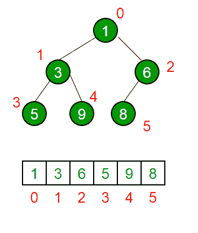

# 二进制堆

> 原文:[https://www.geeksforgeeks.org/binary-heap/](https://www.geeksforgeeks.org/binary-heap/)

二进制堆是具有以下属性的二叉树。
1)它是一个完整的树(除了可能的最后一级，所有级别都被完全填充，最后一级尽可能地保留所有键)。二进制堆的这个属性使它们适合存储在数组中。

2)二进制堆是最小堆还是最大堆。在最小二进制堆中，根的键必须是二进制堆中所有键中最小的。对于二叉树中的所有节点，相同的属性必须递归为真。最大二进制堆类似于 MinHeap。

**最小堆示例:**

```
            10                      10
         /      \               /       \  
       20        100          15         30  
      /                      /  \        /  \
    30                     40    50    100   40

```

**二进制堆是如何表示的？**
二进制堆是一棵完整的二叉树。二进制堆通常表示为数组。

*   根元素将位于 Arr[0]。
*   Below table shows indexes of other nodes for the i<sup>th</sup> node, i.e., Arr[i]:

    | Arr[(i-1)/2] | 返回父节点 |
    | Arr[(2*i)+1] | 返回左边的子节点 |
    | Arr[(2*i)+2] | 返回右边的子节点 |

    用于实现数组表示遍历方法是**级次**
    

    详见[二进制堆的数组表示](https://www.geeksforgeeks.org/array-representation-of-binary-heap/)。

    **堆的应用:**
    **1)** [堆排序](https://www.geeksforgeeks.org/heap-sort/):堆排序使用二进制堆在 O(nLogn)时间内对数组进行排序。

    **2)** 优先级队列:优先级队列可以使用 Binary Heap 高效实现，因为它支持 O(logn)时间内的 insert()、delete()和 extractmax()、decreaseKey()操作。二项式堆和斐波那契堆是二进制堆的变体。这些变化也有效地执行联合。

    **3)** 图算法:优先级队列特别用于图算法，如[迪克斯特拉最短路径](https://www.geeksforgeeks.org/greedy-algorithms-set-7-dijkstras-algorithm-for-adjacency-list-representation/)和[普里姆最小生成树](https://www.geeksforgeeks.org/greedy-algorithms-set-5-prims-minimum-spanning-tree-mst-2/)。

    **4)** 使用 Heaps 可以高效解决很多问题。参见以下示例。
    a) [阵中第 K 大元素](https://www.geeksforgeeks.org/k-largestor-smallest-elements-in-an-array/)。
    b) [排序一个差不多排序的数组/](https://www.geeksforgeeks.org/nearly-sorted-algorithm/)
    c) [合并 K 个排序的数组](https://www.geeksforgeeks.org/merge-k-sorted-arrays/)。

    **Min Heap 上的操作:**
    **1)** getMini():返回 Min Heap 的根元素。该操作的时间复杂度为 0(1)。

    **2)** extractMin():从 MinHeap 中移除最小元素。此操作的时间复杂度为 0(Logn)，因为此操作需要在移除根后维护堆属性(通过调用 heapify())。

    **3)** 递减键():减少键的值。这个操作的时间复杂度是 O(Logn)。如果一个节点的递减键值大于该节点的父节点，那么我们就不需要做任何事情。否则，我们需要遍历以修复违反的堆属性。

    **4)** insert():插入新密钥需要 O(Logn)时间。我们在树的末端添加一个新的键。如果新密钥大于它的父密钥，那么我们不需要做任何事情。否则，我们需要遍历以修复违反的堆属性。

    **5)** delete():删除一个键也需要 O(Logn)时间。我们通过调用 decreaseKey()用 minum infinite 替换要删除的键。在 decreaseKey()之后，负无穷大的值必须到达根，所以我们调用 extractMin()来移除这个键。

    下面是基本堆操作的实现。

    ## C++

    ```
    // A C++ program to demonstrate common Binary Heap Operations
    #include<iostream>
    #include<climits>
    using namespace std;

    // Prototype of a utility function to swap two integers
    void swap(int *x, int *y);

    // A class for Min Heap
    class MinHeap
    {
        int *harr; // pointer to array of elements in heap
        int capacity; // maximum possible size of min heap
        int heap_size; // Current number of elements in min heap
    public:
        // Constructor
        MinHeap(int capacity);

        // to heapify a subtree with the root at given index
        void MinHeapify(int );

        int parent(int i) { return (i-1)/2; }

        // to get index of left child of node at index i
        int left(int i) { return (2*i + 1); }

        // to get index of right child of node at index i
        int right(int i) { return (2*i + 2); }

        // to extract the root which is the minimum element
        int extractMin();

        // Decreases key value of key at index i to new_val
        void decreaseKey(int i, int new_val);

        // Returns the minimum key (key at root) from min heap
        int getMin() { return harr[0]; }

        // Deletes a key stored at index i
        void deleteKey(int i);

        // Inserts a new key 'k'
        void insertKey(int k);
    };

    // Constructor: Builds a heap from a given array a[] of given size
    MinHeap::MinHeap(int cap)
    {
        heap_size = 0;
        capacity = cap;
        harr = new int[cap];
    }

    // Inserts a new key 'k'
    void MinHeap::insertKey(int k)
    {
        if (heap_size == capacity)
        {
            cout << "\nOverflow: Could not insertKey\n";
            return;
        }

        // First insert the new key at the end
        heap_size++;
        int i = heap_size - 1;
        harr[i] = k;

        // Fix the min heap property if it is violated
        while (i != 0 && harr[parent(i)] > harr[i])
        {
           swap(&harr[i], &harr[parent(i)]);
           i = parent(i);
        }
    }

    // Decreases value of key at index 'i' to new_val.  It is assumed that
    // new_val is smaller than harr[i].
    void MinHeap::decreaseKey(int i, int new_val)
    {
        harr[i] = new_val;
        while (i != 0 && harr[parent(i)] > harr[i])
        {
           swap(&harr[i], &harr[parent(i)]);
           i = parent(i);
        }
    }

    // Method to remove minimum element (or root) from min heap
    int MinHeap::extractMin()
    {
        if (heap_size <= 0)
            return INT_MAX;
        if (heap_size == 1)
        {
            heap_size--;
            return harr[0];
        }

        // Store the minimum value, and remove it from heap
        int root = harr[0];
        harr[0] = harr[heap_size-1];
        heap_size--;
        MinHeapify(0);

        return root;
    }

    // This function deletes key at index i. It first reduced value to minus
    // infinite, then calls extractMin()
    void MinHeap::deleteKey(int i)
    {
        decreaseKey(i, INT_MIN);
        extractMin();
    }

    // A recursive method to heapify a subtree with the root at given index
    // This method assumes that the subtrees are already heapified
    void MinHeap::MinHeapify(int i)
    {
        int l = left(i);
        int r = right(i);
        int smallest = i;
        if (l < heap_size && harr[l] < harr[i])
            smallest = l;
        if (r < heap_size && harr[r] < harr[smallest])
            smallest = r;
        if (smallest != i)
        {
            swap(&harr[i], &harr[smallest]);
            MinHeapify(smallest);
        }
    }

    // A utility function to swap two elements
    void swap(int *x, int *y)
    {
        int temp = *x;
        *x = *y;
        *y = temp;
    }

    // Driver program to test above functions
    int main()
    {
        MinHeap h(11);
        h.insertKey(3);
        h.insertKey(2);
        h.deleteKey(1);
        h.insertKey(15);
        h.insertKey(5);
        h.insertKey(4);
        h.insertKey(45);
        cout << h.extractMin() << " ";
        cout << h.getMin() << " ";
        h.decreaseKey(2, 1);
        cout << h.getMin();
        return 0;
    }
    ```

    ## 计算机编程语言

    ```
    # A Python program to demonstrate common binary heap operations

    # Import the heap functions from python library
    from heapq import heappush, heappop, heapify 

    # heappop - pop and return the smallest element from heap
    # heappush - push the value item onto the heap, maintaining
    #             heap invarient
    # heapify - transform list into heap, in place, in linear time

    # A class for Min Heap
    class MinHeap:

        # Constructor to initialize a heap
        def __init__(self):
            self.heap = [] 

        def parent(self, i):
            return (i-1)/2

        # Inserts a new key 'k'
        def insertKey(self, k):
            heappush(self.heap, k)           

        # Decrease value of key at index 'i' to new_val
        # It is assumed that new_val is smaller than heap[i]
        def decreaseKey(self, i, new_val):
            self.heap[i]  = new_val 
            while(i != 0 and self.heap[self.parent(i)] > self.heap[i]):
                # Swap heap[i] with heap[parent(i)]
                self.heap[i] , self.heap[self.parent(i)] = (
                self.heap[self.parent(i)], self.heap[i])

        # Method to remove minium element from min heap
        def extractMin(self):
            return heappop(self.heap)

        # This functon deletes key at index i. It first reduces
        # value to minus infinite and then calls extractMin()
        def deleteKey(self, i):
            self.decreaseKey(i, float("-inf"))
            self.extractMin()

        # Get the minimum element from the heap
        def getMin(self):
            return self.heap[0]

    # Driver pgoratm to test above function
    heapObj = MinHeap()
    heapObj.insertKey(3)
    heapObj.insertKey(2)
    heapObj.deleteKey(1)
    heapObj.insertKey(15)
    heapObj.insertKey(5)
    heapObj.insertKey(4)
    heapObj.insertKey(45)

    print heapObj.extractMin(),
    print heapObj.getMin(),
    heapObj.decreaseKey(2, 1)
    print heapObj.getMin()

    # This code is contributed by Nikhil Kumar Singh(nickzuck_007)
    ```

    ## C#

    ```
    // C# program to demonstrate common 
    // Binary Heap Operations - Min Heap
    using System;

    // A class for Min Heap 
    class MinHeap{

    // To store array of elements in heap
    public int[] heapArray{ get; set; }

    // max size of the heap
    public int capacity{ get; set; }

    // Current number of elements in the heap
    public int current_heap_size{ get; set; }

    // Constructor 
    public MinHeap(int n)
    {
        capacity = n;
        heapArray = new int[capacity];
        current_heap_size = 0;
    }

    // Swapping using reference 
    public static void Swap<T>(ref T lhs, ref T rhs)
    {
        T temp = lhs;
        lhs = rhs;
        rhs = temp;
    }

    // Get the Parent index for the given index
    public int Parent(int key) 
    {
        return (key - 1) / 2;
    }

    // Get the Left Child index for the given index
    public int Left(int key)
    {
        return 2 * key + 1;
    }

    // Get the Right Child index for the given index
    public int Right(int key)
    {
        return 2 * key + 2;
    }

    // Inserts a new key
    public bool insertKey(int key)
    {
        if (current_heap_size == capacity)
        {

            // heap is full
            return false;
        }

        // First insert the new key at the end 
        int i = current_heap_size;
        heapArray[i] = key;
        current_heap_size++;

        // Fix the min heap property if it is violated 
        while (i != 0 && heapArray[i] < 
                         heapArray[Parent(i)])
        {
            Swap(ref heapArray[i],
                 ref heapArray[Parent(i)]);
            i = Parent(i);
        }
        return true;
    }

    // Decreases value of given key to new_val. 
    // It is assumed that new_val is smaller 
    // than heapArray[key]. 
    public void decreaseKey(int key, int new_val)
    {
        heapArray[key] = new_val;

        while (key != 0 && heapArray[key] < 
                           heapArray[Parent(key)])
        {
            Swap(ref heapArray[key], 
                 ref heapArray[Parent(key)]);
            key = Parent(key);
        }
    }

    // Returns the minimum key (key at
    // root) from min heap 
    public int getMin()
    {
        return heapArray[0];
    }

    // Method to remove minimum element 
    // (or root) from min heap 
    public int extractMin()
    {
        if (current_heap_size <= 0)
        {
            return int.MaxValue;
        }

        if (current_heap_size == 1)
        {
            current_heap_size--;
            return heapArray[0];
        }

        // Store the minimum value, 
        // and remove it from heap 
        int root = heapArray[0];

        heapArray[0] = heapArray[current_heap_size - 1];
        current_heap_size--;
        MinHeapify(0);

        return root;
    }

    // This function deletes key at the 
    // given index. It first reduced value 
    // to minus infinite, then calls extractMin()
    public void deleteKey(int key)
    {
        decreaseKey(key, int.MinValue);
        extractMin();
    }

    // A recursive method to heapify a subtree 
    // with the root at given index 
    // This method assumes that the subtrees
    // are already heapified
    public void MinHeapify(int key)
    {
        int l = Left(key);
        int r = Right(key);

        int smallest = key;
        if (l < current_heap_size && 
            heapArray[l] < heapArray[smallest])
        {
            smallest = l;
        }
        if (r < current_heap_size && 
            heapArray[r] < heapArray[smallest])
        {
            smallest = r;
        }

        if (smallest != key)
        {
            Swap(ref heapArray[key], 
                 ref heapArray[smallest]);
            MinHeapify(smallest);
        }
    }

    // Increases value of given key to new_val.
    // It is assumed that new_val is greater 
    // than heapArray[key]. 
    // Heapify from the given key
    public void increaseKey(int key, int new_val)
    {
        heapArray[key] = new_val;
        MinHeapify(key);
    }

    // Changes value on a key
    public void changeValueOnAKey(int key, int new_val)
    {
        if (heapArray[key] == new_val)
        {
            return;
        }
        if (heapArray[key] < new_val)
        {
            increaseKey(key, new_val);
        } else
        {
            decreaseKey(key, new_val);
        }
    }
    }

    static class MinHeapTest{

    // Driver code
    public static void Main(string[] args)
    {
        MinHeap h = new MinHeap(11);
        h.insertKey(3);
        h.insertKey(2);
        h.deleteKey(1);
        h.insertKey(15);
        h.insertKey(5);
        h.insertKey(4);
        h.insertKey(45);

        Console.Write(h.extractMin() + " ");
        Console.Write(h.getMin() + " ");

        h.decreaseKey(2, 1);
        Console.Write(h.getMin());
    }
    }

    // This code is contributed by 
    // Dinesh Clinton Albert(dineshclinton)
    ```

    Output:

    ```
    2 4 1
    ```

    [堆上的编码练习](https://practice.geeksforgeeks.org/tag-page.php?tag=heap&isCmp=0)
    [堆上的所有文章](https://www.geeksforgeeks.org/heap/)
    [堆上的测验](https://www.geeksforgeeks.org/data-structure-gq/heap-gq/)
    [优先级队列:Java 库中的二进制堆实现](https://www.geeksforgeeks.org/priority-queue-class-in-java-2/)

    如果你发现任何不正确的地方，或者你想分享更多关于上面讨论的话题的信息，请写评论。