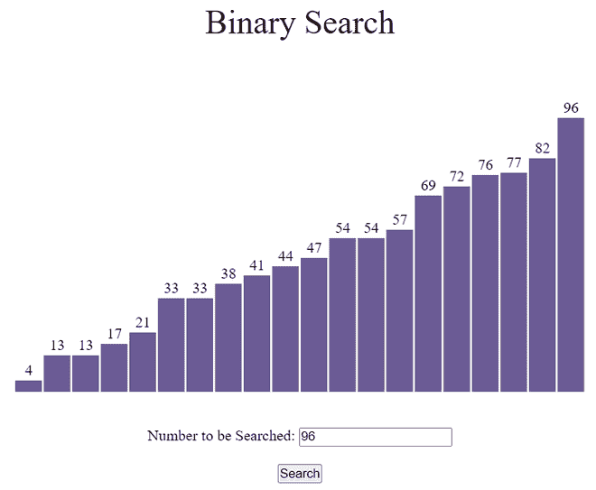
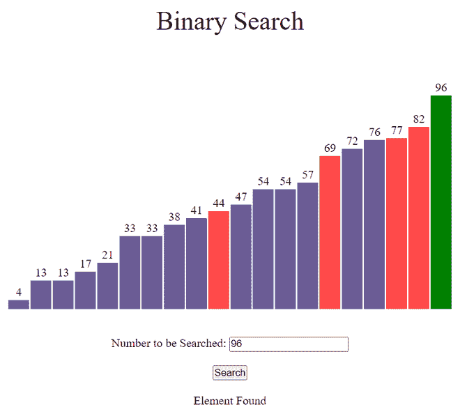
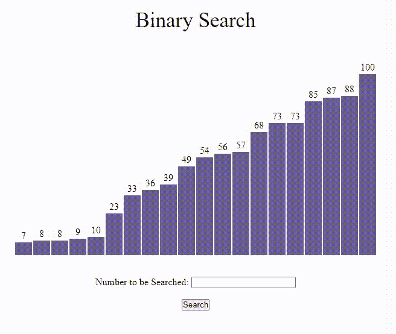

# 使用 JavaScript 的二分搜索法可视化

> 原文:[https://www . geesforgeks . org/binary-search-visualization-use-JavaScript/](https://www.geeksforgeeks.org/binary-search-visualization-using-javascript/)

**GUI(图形用户界面)**比程序更有助于理解。在本文中，我们将使用 JavaScript 可视化二分搜索法。我们将看到元素是如何在二分搜索法遍历的，直到找到给定的元素。我们还将想象二分搜索法的时间复杂性。

**参考:**

*   [二分搜索法](https://www.geeksforgeeks.org/binary-search/)
*   [JavaScript 中的异步函数](https://www.geeksforgeeks.org/how-to-create-an-asynchronous-function-in-javascript/)

**进场:**

*   首先，我们将使用 [Math.random()](https://www.geeksforgeeks.org/javascript-math-random-method/) 函数生成一个随机数组，然后使用 [sort()](https://www.geeksforgeeks.org/javascript-array-sort-method/) 函数对其进行排序。
*   不同的颜色用于指示当前时间哪个元素正在被**遍历**。
*   由于算法的运算速度非常快， [setTimeout()](https://www.geeksforgeeks.org/java-script-settimeout-setinterval-method/) 功能被用来减缓进程。
*   按**“Ctrl+R”**键可生成新数组。
*   使用 BinarySearch()函数执行搜索。

**示例:**



搜索前



搜索后

下面是可视化 [**【二分搜索法】**](https://www.geeksforgeeks.org/binary-search/) 算法的程序。

**文件名:index.html**

## 超文本标记语言

```
<!DOCTYPE html>
<html lang="en">
  <head>
    <meta charset="UTF-8" />
    <meta name="viewport"
          content="width=device-width, initial-scale=1.0" />
    <link rel="stylesheet" href="style.css" />
  </head>

  <body>
    <br />
    <p class="header">Binary Search</p>

    <div id="array"></div>
    <br /><br />

    <div style="text-align: center">
      <label for="fname">
        Number to be Searched:
      </label>
      <input type="text" id="fname"
             name="fname" />
      <br /><br />
      <button id="btn"
              onclick="BinarySearch()">Search</button>
      <br />
      <br />
      <div id="text"></div>
    </div>

    <script src="script.js"></script>
  </body>
</html>
```

**文件名:style.css**

## 半铸钢ˌ钢性铸铁(Cast Semi-Steel)

```
* {
  margin: 0px;
  padding: 0px;
  box-sizing: border-box;
}

.header {
  font-size: 35px;
  text-align: center;
}

#array {
  background-color: white;
  height: 305px;
  width: 598px;
  margin: auto;
  position: relative;
  margin-top: 64px;
}

.block {
  width: 28px;
  background-color: #6b5b95;
  position: absolute;
  bottom: 0px;
  transition: 0.2s all ease;
}

.block_id {
  position: absolute;
  color: black;
  margin-top: -20px;
  width: 100%;
  text-align: center;
}
```

**文件名:script.js**

## java 描述语言

```
var container = document.getElementById("array");

// Function to generate the array of blocks
function generatearray() {

  // Creating an array
  var arr = [];

  // Filling array with random values
  for (var i = 0; i < 20; i++) {
    // Return a value from 1 to 100 (both inclusive)
    var val = Number(Math.ceil(Math.random() * 100));
    arr.push(val);
  }

  // Sorting Array in ascending order
  arr.sort(function (a, b) {
    return a - b;
  });

  for (var i = 0; i < 20; i++) {
    var value = arr[i];

    // Creating element div
    var array_ele = document.createElement("div");

    // Adding class 'block' to div
    array_ele.classList.add("block");

    // Adding style to div
    array_ele.style.height = `${value * 3}px`;
    array_ele.style.transform = `translate(${i * 30}px)`;

    // Creating label element for displaying
    // size of particular block
    var array_ele_label = document.createElement("label");
    array_ele_label.classList.add("block_id");
    array_ele_label.innerText = value;

    // Appending created elements to index.html
    array_ele.appendChild(array_ele_label);
    container.appendChild(array_ele);
  }
}

// Asynchronous BinarySearch function
async function BinarySearch(delay = 300) {
  var blocks = document.querySelectorAll(".block");
  var output = document.getElementById("text");

  //Extracting the value of the element to be searched
  var num = document.getElementById("fname").value;

  //Colouring all the blocks voilet
  for (var i = 0; i < blocks.length; i += 1) {
    blocks[i].style.backgroundColor = "#6b5b95";
  }

  output.innerText = "";

  // BinarySearch Algorithm

  var start = 0;
  var end = 19;
  var flag = 0;
  while (start <= end) {
    //Middle index
    var mid = Math.floor((start + end) / 2);
    blocks[mid].style.backgroundColor = "#FF4949";

    //Value at mid index
    var value = Number(blocks[mid].childNodes[0].innerHTML);

    // To wait for .1 sec
    await new Promise((resolve) =>
      setTimeout(() => {
        resolve();
      }, delay)
    );

    //Current element is equal to the element
    //entered by the user
    if (value == num) {
      output.innerText = "Element Found";
      blocks[mid].style.backgroundColor = "#13CE66";
      flag = 1;
      break;
    }
    //Current element is greater than the element
    //entered by the user
    if (value > num) {
      end = mid - 1;
      blocks[mid].style.backgroundColor = "#6b5b95";
    } else {
      start = mid + 1;
      blocks[mid].style.backgroundColor = "#6b5b95";
    }
  }
  if (flag === 0) {
    output.innerText = "Element Not Found";
  }
}

// Calling generatearray function
generatearray();
```

**输出:**

