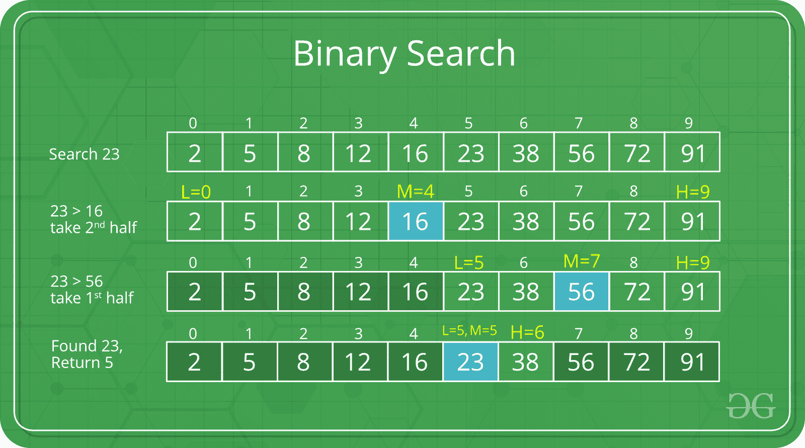
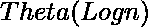

# 二分搜索法

> 原文:[https://www.geeksforgeeks.org/binary-search/](https://www.geeksforgeeks.org/binary-search/)

给定 n 个元素的排序数组 arr[]，编写一个函数来搜索 arr[]中的给定元素 x。
一个简单的方法就是做一个 [**线性搜索**](https://www.geeksforgeeks.org/linear-search/)T5。上述算法的时间复杂度为 O(n)。执行相同任务的另一种方法是使用二分搜索法。
**二分搜索法:**通过重复将搜索间隔减半来搜索排序后的数组。从覆盖整个数组的间隔开始。如果搜索关键字的值小于间隔中间的项目，请将间隔缩小到下半部分。否则，缩小到上半部分。反复检查，直到找到值或间隔为空。

示例:



二分搜索法的思想是利用数组排序的信息，将时间复杂度降低到 O(Log n)。

经过一次比较，我们基本上忽略了一半的元素。

1.  将 x 与中间元素进行比较。
2.  如果 x 与中间元素匹配，我们返回中间索引。
3.  否则如果 x 大于中间元素，那么 x 只能位于中间元素之后的右半子阵列中。所以我们重复右半部分。
4.  否则(x 较小)在左半部分重复出现。

**递归**实现二分搜索法

## C++

```
// C++ program to implement recursive Binary Search
#include <bits/stdc++.h>
using namespace std;

// A recursive binary search function. It returns
// location of x in given array arr[l..r] is present,
// otherwise -1
int binarySearch(int arr[], int l, int r, int x)
{
    if (r >= l) {
        int mid = l + (r - l) / 2;

        // If the element is present at the middle
        // itself
        if (arr[mid] == x)
            return mid;

        // If element is smaller than mid, then
        // it can only be present in left subarray
        if (arr[mid] > x)
            return binarySearch(arr, l, mid - 1, x);

        // Else the element can only be present
        // in right subarray
        return binarySearch(arr, mid + 1, r, x);
    }

    // We reach here when element is not
    // present in array
    return -1;
}

int main(void)
{
    int arr[] = { 2, 3, 4, 10, 40 };
    int x = 10;
    int n = sizeof(arr) / sizeof(arr[0]);
    int result = binarySearch(arr, 0, n - 1, x);
    (result == -1)
        ? cout << "Element is not present in array"
        : cout << "Element is present at index " << result;
    return 0;
}
```

## C

```
// C program to implement recursive Binary Search
#include <stdio.h>

// A recursive binary search function. It returns
// location of x in given array arr[l..r] is present,
// otherwise -1
int binarySearch(int arr[], int l, int r, int x)
{
    if (r >= l) {
        int mid = l + (r - l) / 2;

        // If the element is present at the middle
        // itself
        if (arr[mid] == x)
            return mid;

        // If element is smaller than mid, then
        // it can only be present in left subarray
        if (arr[mid] > x)
            return binarySearch(arr, l, mid - 1, x);

        // Else the element can only be present
        // in right subarray
        return binarySearch(arr, mid + 1, r, x);
    }

    // We reach here when element is not
    // present in array
    return -1;
}

int main(void)
{
    int arr[] = { 2, 3, 4, 10, 40 };
    int n = sizeof(arr) / sizeof(arr[0]);
    int x = 10;
    int result = binarySearch(arr, 0, n - 1, x);
    (result == -1)
        ? printf("Element is not present in array")
        : printf("Element is present at index %d", result);
    return 0;
}
```

## Java 语言(一种计算机语言，尤用于创建网站)

```
// Java implementation of recursive Binary Search
class BinarySearch {
    // Returns index of x if it is present in arr[l..
    // r], else return -1
    int binarySearch(int arr[], int l, int r, int x)
    {
        if (r >= l) {
            int mid = l + (r - l) / 2;

            // If the element is present at the
            // middle itself
            if (arr[mid] == x)
                return mid;

            // If element is smaller than mid, then
            // it can only be present in left subarray
            if (arr[mid] > x)
                return binarySearch(arr, l, mid - 1, x);

            // Else the element can only be present
            // in right subarray
            return binarySearch(arr, mid + 1, r, x);
        }

        // We reach here when element is not present
        // in array
        return -1;
    }

    // Driver method to test above
    public static void main(String args[])
    {
        BinarySearch ob = new BinarySearch();
        int arr[] = { 2, 3, 4, 10, 40 };
        int n = arr.length;
        int x = 10;
        int result = ob.binarySearch(arr, 0, n - 1, x);
        if (result == -1)
            System.out.println("Element not present");
        else
            System.out.println("Element found at index "
                               + result);
    }
}
/* This code is contributed by Rajat Mishra */
```

## 蟒蛇 3

```
# Python3 Program for recursive binary search.

# Returns index of x in arr if present, else -1

def binarySearch(arr, l, r, x):

    # Check base case
    if r >= l:

        mid = l + (r - l) // 2

        # If element is present at the middle itself
        if arr[mid] == x:
            return mid

        # If element is smaller than mid, then it
        # can only be present in left subarray
        elif arr[mid] > x:
            return binarySearch(arr, l, mid-1, x)

        # Else the element can only be present
        # in right subarray
        else:
            return binarySearch(arr, mid + 1, r, x)

    else:
        # Element is not present in the array
        return -1

# Driver Code
arr = [2, 3, 4, 10, 40]
x = 10

# Function call
result = binarySearch(arr, 0, len(arr)-1, x)

if result != -1:
    print("Element is present at index % d" % result)
else:
    print("Element is not present in array")
```

## C#

```
// C# implementation of recursive Binary Search
using System;

class GFG {
    // Returns index of x if it is present in
    // arr[l..r], else return -1
    static int binarySearch(int[] arr, int l, int r, int x)
    {
        if (r >= l) {
            int mid = l + (r - l) / 2;

            // If the element is present at the
            // middle itself
            if (arr[mid] == x)
                return mid;

            // If element is smaller than mid, then
            // it can only be present in left subarray
            if (arr[mid] > x)
                return binarySearch(arr, l, mid - 1, x);

            // Else the element can only be present
            // in right subarray
            return binarySearch(arr, mid + 1, r, x);
        }

        // We reach here when element is not present
        // in array
        return -1;
    }

    // Driver method to test above
    public static void Main()
    {

        int[] arr = { 2, 3, 4, 10, 40 };
        int n = arr.Length;
        int x = 10;

        int result = binarySearch(arr, 0, n - 1, x);

        if (result == -1)
            Console.WriteLine("Element not present");
        else
            Console.WriteLine("Element found at index "
                              + result);
    }
}

// This code is contributed by Sam007.
```

## 服务器端编程语言（Professional Hypertext Preprocessor 的缩写）

```
<?php
// PHP program to implement
// recursive Binary Search

// A recursive binary search
// function. It returns location
// of x in given array arr[l..r]
// is present, otherwise -1
function binarySearch($arr, $l, $r, $x)
{
if ($r >= $l)
{
        $mid = ceil($l + ($r - $l) / 2);

        // If the element is present
        // at the middle itself
        if ($arr[$mid] == $x)
            return floor($mid);

        // If element is smaller than
        // mid, then it can only be
        // present in left subarray
        if ($arr[$mid] > $x)
            return binarySearch($arr, $l,
                                $mid - 1, $x);

        // Else the element can only
        // be present in right subarray
        return binarySearch($arr, $mid + 1,
                            $r, $x);
}

// We reach here when element
// is not present in array
return -1;
}

// Driver Code
$arr = array(2, 3, 4, 10, 40);
$n = count($arr);
$x = 10;
$result = binarySearch($arr, 0, $n - 1, $x);
if(($result == -1))
echo "Element is not present in array";
else
echo "Element is present at index ",
                            $result;

// This code is contributed by anuj_67.
?>
```

## java 描述语言

```
<script>
// JavaScript program to implement recursive Binary Search

// A recursive binary search function. It returns
// location of x in given array arr[l..r] is present,
// otherwise -1
function binarySearch(arr, l, r, x){
    if (r >= l) {
        let mid = l + Math.floor((r - l) / 2);

        // If the element is present at the middle
        // itself
        if (arr[mid] == x)
            return mid;

        // If element is smaller than mid, then
        // it can only be present in left subarray
        if (arr[mid] > x)
            return binarySearch(arr, l, mid - 1, x);

        // Else the element can only be present
        // in right subarray
        return binarySearch(arr, mid + 1, r, x);
    }

    // We reach here when element is not
    // present in array
    return -1;
}

let arr = [ 2, 3, 4, 10, 40 ];
let x = 10;
let n = arr.length
let result = binarySearch(arr, 0, n - 1, x);
(result == -1) ? document.write( "Element is not present in array")
                   : document.write("Element is present at index " +result);
</script>
```

**输出:**

```
Element is present at index 3
```

在这里，您可以创建一个检查函数，以便于实现。

这是带有 check 函数的递归实现，我觉得它更容易实现:

## C++

```
#include <bits/stdc++.h>
using namespace std;

// define array globally
const int N = 1e6 + 4;

int a[N];
int n; // array size

// element to be searched in array
int k;

bool check(int dig)
{
    // element at dig position in array
    int ele = a[dig];

    // if k is less than
    // element at dig position
    // then we need to bring our higher ending to dig
    // and then continue further
    if (k <= ele) {
        return 1;
    }
    else {
        return 0;
    }
}
void binsrch(int lo, int hi)
{
    while (lo < hi) {
        int mid = (lo + hi) / 2;
        if (check(mid)) {
            hi = mid;
        }
        else {
            lo = mid + 1;
        }
    }
    // if a[lo] is k
    if (a[lo] == k)
        cout << "Element found at index "
             << lo; // 0 based indexing
    else
        cout
            << "Element doesnt exist in array"; // element
                                                // was not in
                                                // our array
}

int main()
{
    cin >> n;
    for (int i = 0; i < n; i++) {
        cin >> a[i];
    }
    cin >> k;

    // it is being given array is sorted
    // if not then we have to sort it

    // minimum possible point where our k can be is starting
    // index so lo=0 also k cannot be outside of array so end
    // point hi=n

    binsrch(0, n);

    return 0;
}
```

**迭代**实现二分搜索法

## C++

```
// C++ program to implement recursive Binary Search
#include <bits/stdc++.h>
using namespace std;

// A iterative binary search function. It returns
// location of x in given array arr[l..r] if present,
// otherwise -1
int binarySearch(int arr[], int l, int r, int x)
{
    while (l <= r) {
        int m = l + (r - l) / 2;

        // Check if x is present at mid
        if (arr[m] == x)
            return m;

        // If x greater, ignore left half
        if (arr[m] < x)
            l = m + 1;

        // If x is smaller, ignore right half
        else
            r = m - 1;
    }

    // if we reach here, then element was
    // not present
    return -1;
}

int main(void)
{
    int arr[] = { 2, 3, 4, 10, 40 };
    int x = 10;
    int n = sizeof(arr) / sizeof(arr[0]);
    int result = binarySearch(arr, 0, n - 1, x);
    (result == -1) ? cout << "Element is not present in array"
                   : cout << "Element is present at index " << result;
    return 0;
}
```

## C

```
// C program to implement iterative Binary Search
#include <stdio.h>

// A iterative binary search function. It returns
// location of x in given array arr[l..r] if present,
// otherwise -1
int binarySearch(int arr[], int l, int r, int x)
{
    while (l <= r) {
        int m = l + (r - l) / 2;

        // Check if x is present at mid
        if (arr[m] == x)
            return m;

        // If x greater, ignore left half
        if (arr[m] < x)
            l = m + 1;

        // If x is smaller, ignore right half
        else
            r = m - 1;
    }

    // if we reach here, then element was
    // not present
    return -1;
}

int main(void)
{
    int arr[] = { 2, 3, 4, 10, 40 };
    int n = sizeof(arr) / sizeof(arr[0]);
    int x = 10;
    int result = binarySearch(arr, 0, n - 1, x);
    (result == -1) ? printf("Element is not present"
                            " in array")
                   : printf("Element is present at "
                            "index %d",
                            result);
    return 0;
}
```

## Java 语言(一种计算机语言，尤用于创建网站)

```
// Java implementation of iterative Binary Search
class BinarySearch {
    // Returns index of x if it is present in arr[],
    // else return -1
    int binarySearch(int arr[], int x)
    {
        int l = 0, r = arr.length - 1;
        while (l <= r) {
            int m = l + (r - l) / 2;

            // Check if x is present at mid
            if (arr[m] == x)
                return m;

            // If x greater, ignore left half
            if (arr[m] < x)
                l = m + 1;

            // If x is smaller, ignore right half
            else
                r = m - 1;
        }

        // if we reach here, then element was
        // not present
        return -1;
    }

    // Driver method to test above
    public static void main(String args[])
    {
        BinarySearch ob = new BinarySearch();
        int arr[] = { 2, 3, 4, 10, 40 };
        int n = arr.length;
        int x = 10;
        int result = ob.binarySearch(arr, x);
        if (result == -1)
            System.out.println("Element not present");
        else
            System.out.println("Element found at "
                               + "index " + result);
    }
}
```

## 蟒蛇 3

```
# Python3 code to implement iterative Binary
# Search.

# It returns location of x in given array arr
# if present, else returns -1
def binarySearch(arr, l, r, x):

    while l <= r:

        mid = l + (r - l) // 2;

        # Check if x is present at mid
        if arr[mid] == x:
            return mid

        # If x is greater, ignore left half
        elif arr[mid] < x:
            l = mid + 1

        # If x is smaller, ignore right half
        else:
            r = mid - 1

    # If we reach here, then the element
    # was not present
    return -1

# Driver Code
arr = [ 2, 3, 4, 10, 40 ]
x = 10

# Function call
result = binarySearch(arr, 0, len(arr)-1, x)

if result != -1:
    print ("Element is present at index % d" % result)
else:
    print ("Element is not present in array")
```

## C#

```
// C# implementation of iterative Binary Search
using System;

class GFG {
    // Returns index of x if it is present in arr[],
    // else return -1
    static int binarySearch(int[] arr, int x)
    {
        int l = 0, r = arr.Length - 1;
        while (l <= r) {
            int m = l + (r - l) / 2;

            // Check if x is present at mid
            if (arr[m] == x)
                return m;

            // If x greater, ignore left half
            if (arr[m] < x)
                l = m + 1;

            // If x is smaller, ignore right half
            else
                r = m - 1;
        }

        // if we reach here, then element was
        // not present
        return -1;
    }

    // Driver method to test above
    public static void Main()
    {
        int[] arr = { 2, 3, 4, 10, 40 };
        int n = arr.Length;
        int x = 10;
        int result = binarySearch(arr, x);
        if (result == -1)
            Console.WriteLine("Element not present");
        else
            Console.WriteLine("Element found at "
                              + "index " + result);
    }
}
// This code is contributed by Sam007
```

## 服务器端编程语言（Professional Hypertext Preprocessor 的缩写）

```
<?php
// PHP program to implement
// iterative Binary Search

// A iterative binary search
// function. It returns location
// of x in given array arr[l..r]
// if present, otherwise -1
function binarySearch($arr, $l,
                      $r, $x)
{
    while ($l <= $r)
    {
        $m = $l + ($r - $l) / 2;

        // Check if x is present at mid
        if ($arr[$m] == $x)
            return floor($m);

        // If x greater, ignore
        // left half
        if ($arr[$m] < $x)
            $l = $m + 1;

        // If x is smaller,
        // ignore right half
        else
            $r = $m - 1;
    }

    // if we reach here, then
    // element was not present
    return -1;
}

// Driver Code
$arr = array(2, 3, 4, 10, 40);
$n = count($arr);
$x = 10;
$result = binarySearch($arr, 0,
                       $n - 1, $x);
if(($result == -1))
echo "Element is not present in array";
else
echo "Element is present at index ",
                            $result;

// This code is contributed by anuj_67.
?>
```

## java 描述语言

```
<script>
// Program to implement iterative Binary Search

// A iterative binary search function. It returns
// location of x in given array arr[l..r] is present,
// otherwise -1

 function binarySearch(arr, x)
{   
    let l = 0;
    let r = arr.length - 1;
    let mid;
    while (r >= l) {
         mid = l + Math.floor((r - l) / 2);

        // If the element is present at the middle
        // itself
        if (arr[mid] == x)
            return mid;

        // If element is smaller than mid, then
        // it can only be present in left subarray
        if (arr[mid] > x)
            r = mid - 1;

        // Else the element can only be present
        // in right subarray
        else
            l = mid + 1;
    }

    // We reach here when element is not
    // present in array
    return -1;
}

    arr =new Array(2, 3, 4, 10, 40);
    x = 10;
    n = arr.length;
    result = binarySearch(arr, x);

(result == -1) ? document.write("Element is not present in array")
               : document.write ("Element is present at index " + result);

// This code is contributed by simranarora5sos and rshuklabbb
</script>
```

**输出:**

```
Element is present at index 3
```

**“逐位二分搜索法”**

想法:

> 每个数都可以表示为 2 的幂的和。
> 
> 示例包括:
> 
> 1.  76 = 64 + 8 + 4
> 2.  10 = 8  + 2
> 3.  7 = 4 + 2 + 1

**进场:**

计算大于或等于数组大小的 2 的一次幂。

将索引初始化为 0。

当计算的功率大于 0 时循环，每次除以 2。

每次位置[索引+幂] <= target 处的元素，我们都会将相应的幂值添加到索引变量中。(计算总和)

在 for 循环之后，检查位置[index] ==处的元素是否是目标。如果是，那么目标元素存在于数组中，否则不存在。

(不需要除法，只需要加法和按位移位)

## C++

```
// C++ program to implement Bitwise Binary Search

#include<iostream>

using namespace std;

int binary_search(int *arr,int size,int target)
{
    int index, power;

    //Compute the first power of 2 that is >= size
    for (power = 1; power < size; power <<= 1);

      //loop while(power > 0)
      //and divide power by two each iteration
    for (index = 0; power; power >>= 1){

          //if the next condition is true
          //it means that the power value can contribute to the "sum"(a closer index where target might be)
        if (index + power < size && arr[index + power] <= target)
           index += power;

    }

    //if the element at position [index] == target,
      //the target value is present in the array
    if(arr[index] == target)
        return index;

      //else the value is not present in the array
    return -1;
}

int main(){
    int arr[5] = {1, 3, 5, 7, 8};
    int size = 5;
    int x = 3;
    int answer = binary_search(arr, size, x);
    if(answer == -1)
        cout << "Element not found";
    else
        cout << "Element found at position " << answer;
}
  // This code is contributed
  // by Gatea David
```

## Java 语言(一种计算机语言，尤用于创建网站)

```
// Java program to implement Bitwise Binary Search
import java.util.*;

class GFG{

  static int binary_search(int []arr,int size,int target)
  {
    int index, power;

    // Compute the first power of 2 that is >= size
    for (power = 1; power < size; power <<= 1);

    // loop while(power > 0)
    // and divide power by two each iteration
    for (index = 0; power>0; power >>= 1){

      // if the next condition is true
      // it means that the power value can
      // contribute to the "sum"(a closer index where target might be)
      if (index + power < size && arr[index + power] <= target)
        index += power;

    }

    // if the element at position [index] == target,
    // the target value is present in the array
    if(arr[index] == target)
      return index;

    // else the value is not present in the array
    return -1;
  }

  // Driver code
  public static void main(String[] args)
  {
    int []arr = {1, 3, 5, 7, 8};
    int size = 5;
    int x = 3;
    int answer = binary_search(arr, size, x);
    if(answer == -1)
      System.out.print("Element not found");
    else
      System.out.print("Element found at position " +  answer);
  }
}

// This code is contributed by Rajput-Ji
```

**时间复杂度:**

二分搜索法的时间复杂度可以写成:

```
T(n) = T(n/2) + c 
```

上述递归可以使用递归树方法或主方法来解决。属于主法第二种情况，复发的解决方法是。
**辅助空间:** O(1)在迭代实现的情况下。在递归实现的情况下，O(Logn)递归调用堆栈空间。
**算法范式:** [减少并征服](https://www.geeksforgeeks.org/decrease-and-conquer/)。

**注:**

我们在这里使用

> int mid = low +(高–低)/2；

也许，你会奇怪我们为什么要计算 ***中间指数*** 这样，我们就可以简单地将*较低和较高的指数相加，然后除以 2。*

> *int mid =(低+高)/2；*

但是如果我们像这样计算***中间指数*** 就意味着我们的代码不是 100%正确的，它包含 bug。

也就是说，对于较大的 int 变量低和高值，它会失败。具体来说，如果低和高之和大于最大正 int 值(2<sup>31</sup>–1<sup>)，则失败。</sup>

总和溢出为负值，该值除以 2 后仍为负值。在 java 中，它抛出*ArrayIndexOutOfBoundException。*

> int mid = low +(高–低)/2；

所以还是这样用比较好。这个错误同样适用于合并排序和其他分治算法。

### [Geeksforgeeks 课程:](https://practice.geeksforgeeks.org/courses)

**1。语言基础课程【**[】T3】c++](https://practice.geeksforgeeks.org/courses/CPP-Foundation)**/**[**JAVA**](https://practice.geeksforgeeks.org/courses/Java-Foundation)**/**[**Python**](https://practice.geeksforgeeks.org/courses/Python-Foundation)**】**
在 GeeksforGeeks 语言基础课程–[JAVA 基础](https://practice.geeksforgeeks.org/courses/Java-Foundation) | [Python 基础](https://practice.geeksforgeeks.org/courses/Python-Foundation)的帮助下，从头开始学习任何编程语言，并了解其所有基础概念，以获得强大的编程基础 [**极客课堂直播**](https://practice.geeksforgeeks.org/courses/geeks-classes-live)
从任何地理位置获得以面试为中心的数据结构和算法在线直播课程，学习和掌握 DSA 概念，用于增强您的问题解决能力&编程技能，并破解任何基于产品的公司的面试–[极客课堂:直播会话](https://practice.geeksforgeeks.org/courses/geeks-classes-live)
**3。** [**完整面试准备**](https://practice.geeksforgeeks.org/courses/complete-interview-preparation)
通过 [*完整面试准备课程*](https://practice.geeksforgeeks.org/courses/complete-interview-preparation) 在一个地方满足您所有的面试准备需求，该课程以最实惠的价格为任何产品型、服务型或初创型公司提供所有所需的准备材料。
**4。** [**DSA 自定进度**](https://practice.geeksforgeeks.org/courses/dsa-self-paced)
开始学习数据结构和算法，为微软、亚马逊、Adobe 等顶级 IT 巨头的面试做准备。借助 [*DSA 自定进度课程*](https://practice.geeksforgeeks.org/courses/dsa-self-paced) ，您可以按照自己的进度和方便程度学习和掌握 DSA，从基础到高级。
T64】5。公司特定课程–[**亚马逊**](https://practice.geeksforgeeks.org/courses/Amazon-Test-Series)**[**微软**T75**T78**TCS**T81**&T84**Wipro******](https://practice.geeksforgeeks.org/courses/microsoft-test-series)**T88】通过专门准备问题破解任何产品型巨头公司的面试参考 GeeksforGeeks 公司特定课程:[亚马逊 SDE 测试系列](https://practice.geeksforgeeks.org/courses/Amazon-Test-Series)等。****