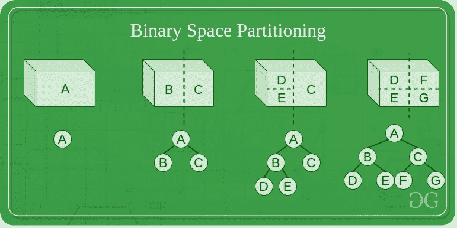

# 二进制空间划分

> 原文:[https://www.geeksforgeeks.org/binary-space-partitioning/](https://www.geeksforgeeks.org/binary-space-partitioning/)

**二进制空间划分**是针对[递归](https://www.geeksforgeeks.org/recursion/)使用超平面作为划分将空间细分为两个凸集而实现的。这种细分过程产生了空间中对象的表示，其形式是被称为 BSP 树的树数据结构。
二进制空间划分产生于 1969 年 3D [计算机图形学](https://www.geeksforgeeks.org/computer-graphics-2/)的背景下，其中 BSP 树的结构允许快速访问场景中对渲染有用的对象的空间信息，例如相对于给定位置的观看者从前到后排序的对象。

### 二进制空间划分的需求

二元空间划分源于[计算机图形学](https://www.geeksforgeeks.org/computer-graphics-2/)需要快速绘制由多边形组成的三维场景。画这种场景的一个简单方法是画家的算法，它按照离观察者的距离从后到前的顺序生成多边形，在背景上绘画，以及每个更近的对象的先前多边形。这种方法有两个缺点:按从后到前的顺序对多边形进行排序所需的时间，以及重叠多边形出错的可能性。Fuchs 和合著者表明，构建 BSP 树解决了这两个问题，提供了一种相对于给定视点对多边形进行排序的快速方法(场景中多边形数量呈线性)，并通过细分重叠的多边形来避免画家算法可能出现的错误。

### BSP 概述

二进制空间划分被视为[递归地](https://www.geeksforgeeks.org/recursion/)将场景分成两部分直到划分满足一个或多个要求的一般过程。它可以被视为其他空间树结构(如 k-d 树和四叉树)的推广，其中划分空间的超平面可以具有任何方向，而不是像在 [k-d 树](https://www.geeksforgeeks.org/k-dimensional-tree/)或[四叉树](https://www.geeksforgeeks.org/quad-tree/)中那样与坐标轴对齐。
当在计算机图形中实现以渲染由平面多边形组成的场景时，分割平面经常被选择为与场景中由多边形定义的平面一致。分区平面的具体选择和完成分区过程的标准因 BSP 树的目的而异。
**例如:**在计算机图形渲染中，场景被划分，直到并且除非 BSP 树的每个节点仅由可以以任意顺序渲染的多边形组成。因此，当实现背面剔除时，每个节点由一组凸多边形组成，而当渲染双面多边形时，BSP 树的每个节点仅由单个平面中的多边形组成。

### 从多边形列表生成平衡树的算法

*   从列表中选择一个多边形。
*   在 BSP 树中创建一个节点 N，并将 P 添加到该节点的多边形列表中。
*   对于列表中的每个其他多边形:
    *   如果该多边形完全位于包含 P 的平面前面，则将该多边形移动到 P 前面的节点列表中
    *   如果该多边形完全位于包含 P 的平面后面，则将该多边形移动到 P 后面的节点列表中
    *   如果该多边形与包含 P 的平面相交，将其分割成两个多边形，并将其移动到 P 后面和前面的相应多边形列表中
    *   如果该多边形位于包含 P 的平面中，将其添加到节点 n 处的多边形列表中
*   将此算法应用于 p 前面的多边形列表。
*   将此算法应用于 p 后面的多边形列表。

### BSP 的缺点

*   生成 BSP 树可能很耗时。
*   BSP 没有解决可见表面确定的问题。

### 平衡计分卡的用途

*   它用于 3D 视频游戏和机器人技术中的碰撞检测。
*   它用于光线追踪
*   它涉及复杂空间场景的处理。