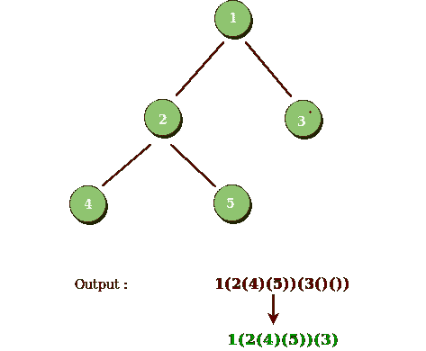

# 用括号串起来的二叉树

> 原文:[https://www.geeksforgeeks.org/binary-tree-string-brackets/](https://www.geeksforgeeks.org/binary-tree-string-brackets/)

用前序遍历方式从二叉树构造一个由括号和整数组成的字符串。
空节点需要用空括号对“()”表示。省略所有不影响字符串和原始二叉树之间一对一映射关系的空括号对。
**例:**

```
Input : Preorder: [1, 2, 3, 4]
       1
     /   \
    2     3
   /    
  4     
Output: "1(2(4))(3)"
Explanation: Originally it needs to be "1(2(4)
())(3()())", but we need to omit all the 
unnecessary empty parenthesis pairs. 
And it will be "1(2(4))(3)".

Input : Preorder: [1, 2, 3, null, 4]
       1
     /   \
    2     3
     \  
      4 
Output: "1(2()(4))(3)"
```

这与[用括号表示的字符串](https://www.geeksforgeeks.org/construct-binary-tree-string-bracket-representation/)
构造二叉树相反，思路是对给定的二叉树进行预序遍历，同时需要在适当的位置使用大括号。但是，我们也需要确保省略不必要的大括号。我们打印当前节点，并按此顺序为节点的左、右子节点调用相同的给定函数(如果它们存在的话)。对于遇到的每个节点，以下情况都是可能的。
**案例 1:** 当前节点存在左右两个子节点。在这种情况下，我们需要将大括号()放在左孩子的前序遍历输出和右孩子的前序遍历输出周围。
**情况 2:** 当前节点不存在左右子节点。在这种情况下，如下图所示，为空的左右子代考虑空括号是多余的。因此，我们不需要为它们中的任何一个安装支架。



**情况 3:** 当前节点只有左边的子节点存在。如下图所示，在这种情况下，在考虑前序遍历时，没有必要为右边的子节点放置空括号。这是因为在前序遍历中，右子级总是在左子级之后。因此，省略右边子级的空括号也会导致字符串和二叉树之间的映射相同。


**情况 4:** 当前节点只存在合适的子节点。在这种情况下，我们需要考虑左边孩子的空括号。这是因为，在前序遍历期间，需要首先考虑左边的子节点。因此，为了表明当前节点后面的子节点是右子节点，我们需要为左子节点放置一对空括号。


## C++

```
/* C++ program to construct string from binary tree*/
#include <bits/stdc++.h>
using namespace std;

/* A binary tree node has data, pointer to left
   child and a pointer to right child */
struct Node {
    int data;
    Node *left, *right;
};

/* Helper function that allocates a new node */
Node* newNode(int data)
{
    Node* node = (Node*)malloc(sizeof(Node));
    node->data = data;
    node->left = node->right = NULL;
    return (node);
}

// Function to construct string from binary tree
void treeToString(Node* root, string& str)
{
    // bases case
    if (root == NULL)
        return;

    // push the root data as character
    str.push_back(root->data + '0');

    // if leaf node, then return
    if (!root->left && !root->right)
        return;

    // for left subtree
    str.push_back('(');
    treeToString(root->left, str);
    str.push_back(')');

    // only if right child is present to
    // avoid extra parenthesis
    if (root->right) {
        str.push_back('(');
        treeToString(root->right, str);
        str.push_back(')');
    }
}

// Driver Code
int main()
{
    /* Let us construct below tree
                1
               / \
              2   3
             / \   \
            4   5   6    */
    struct Node* root = newNode(1);
    root->left = newNode(2);
    root->right = newNode(3);
    root->left->left = newNode(4);
    root->left->right = newNode(5);
    root->right->right = newNode(6);
    string str = "";
    treeToString(root, str);
    cout << str;
}
```

## Java 语言(一种计算机语言，尤用于创建网站)

```
// Java program to construct string from binary tree
class GFG
{

/* A binary tree node has data, pointer to left
child and a pointer to right child */
static class Node
{
    int data;
    Node left, right;
};
static String str;

/* Helper function that allocates a new node */
static Node newNode(int data)
{
    Node node = new Node();
    node.data = data;
    node.left = node.right = null;
    return (node);
}

// Function to construct string from binary tree
static void treeToString(Node root)
{
    // bases case
    if (root == null)
        return;

    // push the root data as character
    str += (Character.valueOf((char)
           (root.data + '0')));

    // if leaf node, then return
    if (root.left == null && root.right == null)
        return;

    // for left subtree
    str += ('(');
    treeToString(root.left);
    str += (')');

    // only if right child is present to
    // avoid extra parenthesis
    if (root.right != null)
    {
        str += ('(');
        treeToString(root.right);
        str += (')');
    }
}

// Driver Code
public static void main(String[] args)
{

    /* Let us construct below tree
             1
            / \
            2 3
            / \ \
            4 5 6 */
    Node root = newNode(1);
    root.left = newNode(2);
    root.right = newNode(3);
    root.left.left = newNode(4);
    root.left.right = newNode(5);
    root.right.right = newNode(6);
    str = "";
    treeToString(root);
    System.out.println(str);
}
}

// This code is contributed by 29AjayKumar
```

## 蟒蛇 3

```
# Python3 program to construct string from binary tree

# A binary tree node has data, pointer to left
# child and a pointer to right child
class Node:
    def __init__(self, data):
        self.data = data
        self.left = None
        self.right = None

# Function to construct string from binary tree
def treeToString(root: Node, string: list):

    # base case
    if root is None:
        return

    # push the root data as character
    string.append(str(root.data))

    # if leaf node, then return
    if not root.left and not root.right:
        return

    # for left subtree
    string.append('(')
    treeToString(root.left, string)
    string.append(')')

    # only if right child is present to
    # avoid extra parenthesis
    if root.right:
        string.append('(')
        treeToString(root.right, string)
        string.append(')')

# Driver Code
if __name__ == "__main__":

    # Let us construct below tree
    #         1
    #     / \
    #     2     3
    #     / \     \
    # 4 5     6

    root = Node(1)
    root.left = Node(2)
    root.right = Node(3)
    root.left.left = Node(4)
    root.left.right = Node(5)
    root.right.right = Node(6)
    string = []
    treeToString(root, string)
    print(''.join(string))

# This code is contributed by
# sanjeev2552
```

## C#

```
// C# program to construct string from binary tree
using System;

class GFG
{

/* A binary tree node has data, pointer to left
child and a pointer to right child */
public class Node
{
    public int data;
    public Node left, right;
};
static String str;

/* Helper function that allocates a new node */
static Node newNode(int data)
{
    Node node = new Node();
    node.data = data;
    node.left = node.right = null;
    return (node);
}

// Function to construct string from binary tree
static void treeToString(Node root)
{
    // bases case
    if (root == null)
        return;

    // push the root data as character
    str += (char)(root.data + '0');

    // if leaf node, then return
    if (root.left == null && root.right == null)
        return;

    // for left subtree
    str += ('(');
    treeToString(root.left);
    str += (')');

    // only if right child is present to
    // avoid extra parenthesis
    if (root.right != null)
    {
        str += ('(');
        treeToString(root.right);
        str += (')');
    }
}

// Driver Code
public static void Main(String[] args)
{

    /* Let us construct below tree
            1
            / \
            2 3
            / \ \
            4 5 6 */
    Node root = newNode(1);
    root.left = newNode(2);
    root.right = newNode(3);
    root.left.left = newNode(4);
    root.left.right = newNode(5);
    root.right.right = newNode(6);
    str = "";
    treeToString(root);
    Console.WriteLine(str);
}
}

// This code is contributed by Princi Singh
```

## java 描述语言

```
<script>

    // JavaScript program to construct string from binary tree

    class Node
    {
        constructor(data) {
           this.left = null;
           this.right = null;
           this.data = data;
        }
    }

    let str;

    /* Helper function that allocates a new node */
    function newNode(data)
    {
        let node = new Node(data);
        return (node);
    }

    // Function to construct string from binary tree
    function treeToString(root)
    {
        // bases case
        if (root == null)
            return;

        // push the root data as character
        str += String.fromCharCode(root.data + '0'.charCodeAt());

        // if leaf node, then return
        if (root.left == null && root.right == null)
            return;

        // for left subtree
        str += ('(');
        treeToString(root.left);
        str += (')');

        // only if right child is present to
        // avoid extra parenthesis
        if (root.right != null)
        {
            str += ('(');
            treeToString(root.right);
            str += (')');
        }
    }

    /* Let us construct below tree
             1
            / \
            2 3
            / \ \
            4 5 6 */
    let root = newNode(1);
    root.left = newNode(2);
    root.right = newNode(3);
    root.left.left = newNode(4);
    root.left.right = newNode(5);
    root.right.right = newNode(6);
    str = "";
    treeToString(root);
    document.write(str);

</script>
```

**输出:**

```
1(2(4)(5))(3()(6))
```

**时间复杂度:O(n)** 前序遍历在 n 个节点上完成。
**空间复杂度:O(n)** 。在树倾斜的情况下，递归树的深度可以达到。