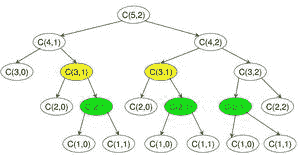

# 二项式系数| DP-9

> 原文:[https://www.geeksforgeeks.org/binomial-coefficient-dp-9/](https://www.geeksforgeeks.org/binomial-coefficient-dp-9/)

以下是[二项式系数](http://en.wikipedia.org/wiki/Binomial_coefficient)的常用定义。

> A [二项式系数](http://en.wikipedia.org/wiki/Binomial_coefficient) C(n，k)可以定义为(1 + x)^n.)展开式中的 x^k 系数

> 二项式系数 C(n，k)也给出了从 n 个对象中选择 k 个对象的方法的数量，更正式地说，是 n 元素集合的 k 元素子集(或 k 组合)的数量。

**问题**
*写一个函数，取两个参数 n 和 k，返回二项式系数 C(n，k)的值。*比如你的函数 n = 4，k = 2 应该返回 6，对于 **n = 5** 和 **k = 2** 应该返回 **10** 。

**1)最优子结构**
C(n，k)的值可以使用以下二项式系数的标准公式递归计算。

```
   C(n, k) = C(n-1, k-1) + C(n-1, k)
   C(n, 0) = C(n, n) = 1
```

下面是一个简单的递归实现，简单地遵循上面提到的递归结构。

## C++

```
// A naive recursive C++ implementation
#include <bits/stdc++.h>
using namespace std;

// Returns value of Binomial Coefficient C(n, k)
int binomialCoeff(int n, int k)
{
    // Base Cases
    if (k > n)
        return 0;
    if (k == 0 || k == n)
        return 1;

    // Recur
    return binomialCoeff(n - 1, k - 1)
           + binomialCoeff(n - 1, k);
}

/* Driver code*/
int main()
{
    int n = 5, k = 2;
    cout << "Value of C(" << n << ", " << k << ") is "
         << binomialCoeff(n, k);
    return 0;
}

// This is code is contributed by rathbhupendra
```

## C

```
// A Naive Recursive Implementation
#include <stdio.h>

// Returns value of Binomial Coefficient C(n, k)
int binomialCoeff(int n, int k)
{
    // Base Cases
    if (k > n)
        return 0;
    if (k == 0 || k == n)
        return 1;

    // Recur
    return binomialCoeff(n - 1, k - 1)
           + binomialCoeff(n - 1, k);
}

/* Driver program to test above function*/
int main()
{
    int n = 5, k = 2;
    printf("Value of C(%d, %d) is %d ", n, k,
           binomialCoeff(n, k));
    return 0;
}
```

## Java 语言(一种计算机语言，尤用于创建网站)

```
// JAVA Code for Dynamic Programming |
// Set 9 (Binomial Coefficient)
import java.util.*;

class GFG {

    // Returns value of Binomial
    // Coefficient C(n, k)
    static int binomialCoeff(int n, int k)
    {

        // Base Cases
        if (k > n)
            return 0;
        if (k == 0 || k == n)
            return 1;

        // Recur
        return binomialCoeff(n - 1, k - 1)
            + binomialCoeff(n - 1, k);
    }

    /* Driver program to test above function */
    public static void main(String[] args)
    {
        int n = 5, k = 2;
        System.out.printf("Value of C(%d, %d) is %d ", n, k,
                          binomialCoeff(n, k));
    }
}

// This code is contributed by Arnav Kr. Mandal.
```

## 计算机编程语言

```
# A naive recursive Python implementation

def binomialCoeff(n, k):

    if k > n:
        return 0
    if k == 0 or k == n:
        return 1

    # Recursive Call
    return binomialCoeff(n-1, k-1) + binomialCoeff(n-1, k)

# Driver Program to test ht above function
n = 5
k = 2
print "Value of C(%d,%d) is (%d)" % (n, k,
                                     binomialCoeff(n, k))

# This code is contributed by Nikhil Kumar Singh (nickzuck_007)
```

## C#

```
// C# Code for Dynamic Programming |
// Set 9 (Binomial Coefficient)
using System;

class GFG {

    // Returns value of Binomial
    // Coefficient C(n, k)
    static int binomialCoeff(int n, int k)
    {

        // Base Cases
        if (k > n)
            return 0;
        if (k == 0 || k == n)
            return 1;

        // Recur
        return binomialCoeff(n - 1, k - 1)
            + binomialCoeff(n - 1, k);
    }

    /* Driver program to test above function */
    public static void Main()
    {
        int n = 5, k = 2;
        Console.Write("Value of C(" + n + "," + k + ") is "
                      + binomialCoeff(n, k));
    }
}

// This code is contributed by Sam007.
```

## 服务器端编程语言（Professional Hypertext Preprocessor 的缩写）

```
<?php
// PHP Code for Dynamic Programming |
// Set 9 (Binomial Coefficient)

// Returns value of 
// Binomial Coefficient C(n, k)
function binomialCoeff($n, $k)
{
    // Base Cases
    if ($k > $n)
        return 0;
    if ($k==0 || $k==$n)
        return 1;

    // Recur
    return binomialCoeff($n - 1, $k - 1) + 
               binomialCoeff($n - 1, $k);
}

    // Driver Code
    $n = 5; 
    $k = 2;
    echo "Value of C","(",$n ,$k,") is "
               , binomialCoeff($n, $k);

// This code is contributed by aj_36
?>
```

## java 描述语言

```
<script>
// javascript Code for Dynamic Programming |
// Set 9 (Binomial Coefficient)

   // Returns value of Binomial
// Coefficient C(n, k)
function binomialCoeff(n , k)
{

    // Base Cases
    if (k > n)
        return 0;
    if (k == 0 || k == n)
        return 1;

    // Recur
    return binomialCoeff(n - 1, k - 1)
        + binomialCoeff(n - 1, k);
}

/* Driver program to test above function */
var n = 5, k = 2;
document.write("Value of C("+n+", "+k+") is "+binomialCoeff(n, k));

// This code is contributed by Amit Katiyar 
</script>
```

**Output**

```
Value of C(5, 2) is 10
```

**2)重叠子问题**
需要注意的是，上面的函数一次又一次地计算相同的子问题。n = 5 和 k = 2 见下面的递归树。函数 C(3，1)被调用两次。对于大的 n 值，会有很多常见的子问题。



C(5，2)的二项式系数递归树

由于相同的子问题被再次调用，这个问题具有重叠子问题属性。所以二项式系数问题同时具有动态规划问题的两个性质(见[这个](https://www.geeksforgeeks.org/overlapping-subproblems-property-in-dynamic-programming-dp-1/)和[这个](https://www.geeksforgeeks.org/optimal-substructure-property-in-dynamic-programming-dp-2/))。像其他典型的[动态规划(DP)问题](https://www.geeksforgeeks.org/archives/tag/dynamic-programming)一样，相同子问题的重新计算可以通过以自下而上的方式构建临时 2D 数组 C[][]来避免。下面是基于动态编程的实现。

## C++

```
// A Dynamic Programming based solution that uses
// table C[][] to calculate the Binomial Coefficient
#include <bits/stdc++.h>
using namespace std;

// Prototype of a utility function that
// returns minimum of two integers
int min(int a, int b);

// Returns value of Binomial Coefficient C(n, k)
int binomialCoeff(int n, int k)
{
    int C[n + 1][k + 1];
    int i, j;

    // Calculate value of Binomial Coefficient
    // in bottom up manner
    for (i = 0; i <= n; i++) {
        for (j = 0; j <= min(i, k); j++) {
            // Base Cases
            if (j == 0 || j == i)
                C[i][j] = 1;

            // Calculate value using previously
            // stored values
            else
                C[i][j] = C[i - 1][j - 1] + C[i - 1][j];
        }
    }

    return C[n][k];
}

// A utility function to return
// minimum of two integers
int min(int a, int b) { return (a < b) ? a : b; }

// Driver Code
int main()
{
    int n = 5, k = 2;
    cout << "Value of C[" << n << "][" << k << "] is "
         << binomialCoeff(n, k);
}

// This code is contributed by Shivi_Aggarwal
```

## C

```
// A Dynamic Programming based solution
// that uses table C[][] to
// calculate the Binomial Coefficient
#include <stdio.h>

// Prototype of a utility function that
// returns minimum of two integers
int min(int a, int b);

// Returns value of Binomial Coefficient C(n, k)
int binomialCoeff(int n, int k)
{
    int C[n + 1][k + 1];
    int i, j;

    // Calculate value of Binomial Coefficient
    // in bottom up manner
    for (i = 0; i <= n; i++) {
        for (j = 0; j <= min(i, k); j++) {
            // Base Cases
            if (j == 0 || j == i)
                C[i][j] = 1;

            // Calculate value using
            // previously stored values
            else
                C[i][j] = C[i - 1][j - 1] + C[i - 1][j];
        }
    }

    return C[n][k];
}

// A utility function to return
// minimum of two integers
int min(int a, int b) { return (a < b) ? a : b; }

/* Drier program to test above function*/
int main()
{
    int n = 5, k = 2;
    printf("Value of C(%d, %d) is %d ", n, k,
           binomialCoeff(n, k));
    return 0;
}
```

## Java 语言(一种计算机语言，尤用于创建网站)

```
// A Dynamic Programming based
// solution that uses table C[][] to
// calculate the Binomial Coefficient

class BinomialCoefficient {
    // Returns value of Binomial
    // Coefficient C(n, k)
    static int binomialCoeff(int n, int k)
    {
        int C[][] = new int[n + 1][k + 1];
        int i, j;

        // Calculate  value of Binomial
        // Coefficient in bottom up manner
        for (i = 0; i <= n; i++) {
            for (j = 0; j <= min(i, k); j++) {
                // Base Cases
                if (j == 0 || j == i)
                    C[i][j] = 1;

                // Calculate value using
                // previously stored values
                else
                    C[i][j] = C[i - 1][j - 1] + C[i - 1][j];
            }
        }

        return C[n][k];
    }

    // A utility function to return
    // minimum of two integers
    static int min(int a, int b) { return (a < b) ? a : b; }

    /* Driver program to test above function*/
    public static void main(String args[])
    {
        int n = 5, k = 2;
        System.out.println("Value of C(" + n + "," + k
                           + ") is " + binomialCoeff(n, k));
    }
}
/*This code is contributed by Rajat Mishra*/
```

## 计算机编程语言

```
# A Dynamic Programming based Python
# Program that uses table C[][]
# to calculate the Binomial Coefficient

# Returns value of Binomial Coefficient C(n, k)

def binomialCoef(n, k):
    C = [[0 for x in range(k+1)] for x in range(n+1)]

    # Calculate value of Binomial
    # Coefficient in bottom up manner
    for i in range(n+1):
        for j in range(min(i, k)+1):
            # Base Cases
            if j == 0 or j == i:
                C[i][j] = 1

            # Calculate value using
            # previously stored values
            else:
                C[i][j] = C[i-1][j-1] + C[i-1][j]

    return C[n][k]

# Driver program to test above function
n = 5
k = 2
print("Value of C[" + str(n) + "][" + str(k) + "] is "
      + str(binomialCoef(n, k)))

# This code is contributed by Bhavya Jain
```

## C#

```
// A Dynamic Programming based solution that
// uses table C[][] to calculate the Binomial
// Coefficient
using System;

class GFG {

    // Returns value of Binomial Coefficient
    // C(n, k)
    static int binomialCoeff(int n, int k)
    {
        int[, ] C = new int[n + 1, k + 1];
        int i, j;

        // Calculate value of Binomial
        // Coefficient in bottom up manner
        for (i = 0; i <= n; i++) {
            for (j = 0; j <= Math.Min(i, k); j++) {
                // Base Cases
                if (j == 0 || j == i)
                    C[i, j] = 1;

                // Calculate value using previously
                // stored values
                else
                    C[i, j] = C[i - 1, j - 1] + C[i - 1, j];
            }
        }

        return C[n, k];
    }

    // A utility function to return minimum
    // of two integers
    static int min(int a, int b) { return (a < b) ? a : b; }

    /* Driver program to test above function*/
    public static void Main()
    {
        int n = 5, k = 2;
        Console.WriteLine("Value of C(" + n + "," + k
                          + ") is " + binomialCoeff(n, k));
    }
}

// This code is contributed by anuj_67.
```

## 服务器端编程语言（Professional Hypertext Preprocessor 的缩写）

```
<?php
// A Dynamic Programming based 
// solution that uses table C[][] to
// calculate the Binomial Coefficient

// Returns value of Binomial 
// Coefficient C(n, k)
function binomialCoeff( $n, $k)
{
    $C = array(array());
    $i; $j;

    // Calculate value of Binomial
    // Coefficient in bottom up manner
    for ($i = 0; $i <= $n; $i++)
    {
        for ($j = 0; $j <= min($i, $k); $j++)
        {

            // Base Cases
            if ($j == 0 || $j == $i)
                $C[$i][$j] = 1;

            // Calculate value using 
            // previously stored values
            else
                $C[$i][$j] = $C[$i - 1][$j - 1] + 
                                 $C[$i - 1][$j];
        }
    }

    return $C[$n][$k];
}

    // Driver Code
    $n = 5; 
    $k = 2;
    echo "Value of C(" ,$n," ",$k, ") is"," "
                 , binomialCoeff($n, $k) ;

// This code is contributed by anuj_67.
?>
```

## java 描述语言

```
<script>

// A Dynamic Programming based
// solution that uses table C to
// calculate the Binomial Coefficient

// Returns value of Binomial
// Coefficient C(n, k)
function binomialCoeff(n, k)
{
    var C = Array(n + 1).fill(0).map(
      x => Array(k + 1).fill(0));;
    var i, j;

    // Calculate  value of Binomial
    // Coefficient in bottom up manner
    for(i = 0; i <= n; i++)
    {
        for(j = 0; j <= min(i, k); j++)
        {

            // Base Cases
            if (j == 0 || j == i)
                C[i][j] = 1;

            // Calculate value using
            // previously stored values
            else
                C[i][j] = C[i - 1][j - 1] + 
                          C[i - 1][j];
        }
    }
    return C[n][k];
}

// A utility function to return
// minimum of two integers
function min(a, b) 
{ 
    return (a < b) ? a : b; 
}

// Driver code
var n = 5, k = 2;
document.write("Value of C(" + n + "," + k + 
                     ") is " + binomialCoeff(n, k));

// This code is contributed by 29AjayKumar 

</script>
```

**Output**

```
Value of C[5][2] is 10
```

**时间复杂度:**O(n * k)
T3】辅助空间: O(n*k)

以下是上述代码的空间优化版本。下面的代码只使用了 O(k)。感谢 **AK** 提出这个方法。

## C++

```
// C++ program for space optimized Dynamic Programming
// Solution of Binomial Coefficient
#include <bits/stdc++.h>
using namespace std;

int binomialCoeff(int n, int k)
{
    int C[k + 1];
    memset(C, 0, sizeof(C));

    C[0] = 1; // nC0 is 1

    for (int i = 1; i <= n; i++)
    {

        // Compute next row of pascal triangle using
        // the previous row
        for (int j = min(i, k); j > 0; j--)
            C[j] = C[j] + C[j - 1];
    }
    return C[k];
}

/* Driver code*/
int main()
{
    int n = 5, k = 2;
    cout << "Value of C(" << n << "," << k << ")"<< "is " <<binomialCoeff(n, k);
    return 0;
}

// This code is contributed by shivanisinghss2110
```

## C

```
// C++ program for space optimized Dynamic Programming
// Solution of Binomial Coefficient
#include <stdio.h>

int binomialCoeff(int n, int k)
{
    int C[k + 1];
    memset(C, 0, sizeof(C));

    C[0] = 1; // nC0 is 1

    for (int i = 1; i <= n; i++) {
        // Compute next row of pascal triangle using
        // the previous row
        for (int j = min(i, k); j > 0; j--)
            C[j] = C[j] + C[j - 1];
    }
    return C[k];
}

/* Driver code*/
int main()
{
    int n = 5, k = 2;
    printf("Value of C(%d, %d) is %d ", n, k,
           binomialCoeff(n, k));
    return 0;
}
```

## Java 语言(一种计算机语言，尤用于创建网站)

```
// JAVA Code for Dynamic Programming |
// Set 9 (Binomial Coefficient)
import java.util.*;

class GFG {

    static int binomialCoeff(int n, int k)
    {
        int C[] = new int[k + 1];

        // nC0 is 1
        C[0] = 1;

        for (int i = 1; i <= n; i++) {
            // Compute next row of pascal
            // triangle using the previous row
            for (int j = Math.min(i, k); j > 0; j--)
                C[j] = C[j] + C[j - 1];
        }
        return C[k];
    }

    /* Driver code  */
    public static void main(String[] args)
    {
        int n = 5, k = 2;
        System.out.printf("Value of C(%d, %d) is %d ", n, k,
                          binomialCoeff(n, k));
    }
}
```

## 计算机编程语言

```
# Python program for Optimized
# Dynamic Programming solution to
# Binomial Coefficient. This one
# uses the concept of pascal
# Triangle and less memory

def binomialCoeff(n, k):

    # Declaring an empty array
    C = [0 for i in xrange(k+1)]
    C[0] = 1  # since nC0 is 1

    for i in range(1, n+1):

        # Compute next row of pascal triangle using
        # the previous row
        j = min(i, k)
        while (j > 0):
            C[j] = C[j] + C[j-1]
            j -= 1

    return C[k]

# Driver Code
n = 5
k = 2
print "Value of C(%d,%d) is %d" % (n, k, binomialCoeff(n, k))

# This code is contribtued by Nikhil Kumar Singh(nickzuck_007)
```

## C#

```
// C# Code for Dynamic Programming |
// Set 9 (Binomial Coefficient)
using System;

class GFG {

    static int binomialCoeff(int n, int k)
    {
        int[] C = new int[k + 1];

        // nC0 is 1
        C[0] = 1;

        for (int i = 1; i <= n; i++) {
            // Compute next row of pascal
            // triangle using the previous
            // row
            for (int j = Math.Min(i, k); j > 0; j--)
                C[j] = C[j] + C[j - 1];
        }
        return C[k];
    }

    /* Driver Code */
    public static void Main()
    {
        int n = 5, k = 2;
        Console.WriteLine("Value of C(" + n + " " + k
                          + ") is " + binomialCoeff(n, k));
    }
}

// This code is contributed by anuj_67.
```

## 服务器端编程语言（Professional Hypertext Preprocessor 的缩写）

```
<?php
// PHP program for space optimized 
// Dynamic Programming Solution of 
// Binomial Coefficient
function binomialCoeff($n, $k)
{
    $C = array_fill(0, $k + 1, 0);

    $C[0] = 1; // nC0 is 1

    for ($i = 1; $i <= $n; $i++)
    {
        // Compute next row of pascal 
        // triangle using the previous row
        for ($j = min($i, $k); $j > 0; $j--)
            $C[$j] = $C[$j] + $C[$j - 1];
    }
    return $C[$k];
}

// Driver Code
$n = 5; $k = 2;
echo "Value of C[$n, $k] is ". 
        binomialCoeff($n, $k);

// This code is contributed by mits.
?>
```

## java 描述语言

```
<script>

// Javascript program for space optimized
// Dynamic Programming
// Solution of Binomial Coefficient
function binomialCoeff(n, k)
{
    let C = new Array(k + 1);
    C.fill(0);

    // nC0 is 1
    C[0] = 1;

    for(let i = 1; i <= n; i++)
    {

        // Compute next row of pascal
        // triangle using the previous
        // row
        for(let j = Math.min(i, k); j > 0; j--)
            C[j] = C[j] + C[j - 1];
    }
    return C[k];
}

// Driver code
let n = 5, k = 2;
document.write("Value of C(" + n + " " +
               k + ") is " + binomialCoeff(n, k));

// This code is contributed by divyesh072019

</script>
```

**Output**

```
Value of C(5, 2) is 10 
```

**时间复杂度:**O(n * k)
T3】辅助空间: O(k)

**解释:**
1 = = = = = = = = = = =>T13】n = 0，C(0，0) = 1
1–1 = = = = = = = =>T15】n = 1，C(1，0) = 1，C(1，1)= 1
1–2–1 = = = = = = =>T17】n = 2，C(2，0)= 1，C(2，1) = 2，C(2，2) = 1 【T5 C(4，4)=1
所以在这里，I 上的每个循环，使用(i-1)行
构建帕斯卡三角形的第 I 行。在任何时候，数组 C 的每个元素都会有一些值(零或更多)，在下一次迭代中，这些元素的值来自上一次迭代。
在语句中，
C[j] = C[j] + C[j-1]
右侧表示来自前一次迭代的值(帕斯卡三角形的一行取决于前一行)。左侧表示当前迭代的值，该值将通过该语句获得。

```
Let's say we want to calculate C(4, 3), 
i.e. n=4, k=3:

All elements of array C of size 4 (k+1) are
initialized to ZERO.

i.e. C[0] = C[1] = C[2] = C[3] = C[4] = 0;
Then C[0] is set to 1

For i = 1:
C[1] = C[1] + C[0] = 0 + 1 = 1 ==>> C(1,1) = 1

For i = 2:
C[2] = C[2] + C[1] = 0 + 1 = 1 ==>> C(2,2) = 1
C[1] = C[1] + C[0] = 1 + 1 = 2 ==>> C(2,1) = 2

For i=3:
C[3] = C[3] + C[2] = 0 + 1 = 1 ==>> C(3,3) = 1
C[2] = C[2] + C[1] = 1 + 2 = 3 ==>> C(3,2) = 3
C[1] = C[1] + C[0] = 2 + 1 = 3 ==>> C(3,1) = 3

For i=4:
C[4] = C[4] + C[3] = 0 + 1 = 1 ==>> C(4,4) = 1
C[3] = C[3] + C[2] = 1 + 3 = 4 ==>> C(4,3) = 4
C[2] = C[2] + C[1] = 3 + 3 = 6 ==>> C(4,2) = 6
C[1] = C[1] + C[0] = 3 + 1 = 4 ==>> C(4,1) = 4

C(4,3) = 4 is would be the answer in our example.
```

**记忆化方法:**想法是创建一个查找表，并遵循递归的自顶向下的方法。在计算任何值之前，我们检查它是否已经在查找表中。如果是，我们返回值。否则，我们计算该值并将其存储在查找表中。下面是动态规划的自顶向下的方法来寻找二项式系数的值。

## C++

```
// A Dynamic Programming based 
// solution that uses
// table dp[][] to calculate 
// the Binomial Coefficient
// A naive recursive approach 
// with table C++ implementation
#include <bits/stdc++.h>
using namespace std;

// Returns value of Binomial Coefficient C(n, k)
int binomialCoeffUtil(int n, int k, int** dp)
{
    // If value in lookup table then return
    if (dp[n][k] != -1) //     
        return dp[n][k];

    // store value in a table before return
    if (k == 0) {
        dp[n][k] = 1;
        return dp[n][k];
    }

    // store value in table before return
    if (k == n) {
        dp[n][k] = 1; 
        return dp[n][k];
    }

    // save value in lookup table before return
    dp[n][k] = binomialCoeffUtil(n - 1, k - 1, dp) +
               binomialCoeffUtil(n - 1, k, dp);
    return dp[n][k];
}

int binomialCoeff(int n, int k)
{
    int** dp; // make a temporary lookup table
    dp = new int*[n + 1];

    // loop to create table dynamically
    for (int i = 0; i < (n + 1); i++) {
        dp[i] = new int[k + 1];
    }

    // nested loop to initialise the table with -1
    for (int i = 0; i < (n + 1); i++) {
        for (int j = 0; j < (k + 1); j++) {
            dp[i][j] = -1;
        }
    }

    return binomialCoeffUtil(n, k, dp);
}

/* Driver code*/
int main()
{
    int n = 5, k = 2;
    cout << "Value of C(" << n << ", " << k << ") is "
         << binomialCoeff(n, k) << endl;
    return 0;
}

// This is code is contributed by MOHAMMAD MUDASSIR
```

## Java 语言(一种计算机语言，尤用于创建网站)

```
// A Dynamic Programming based 
// solution that uses
// table dp[][] to calculate 
// the Binomial Coefficient
// A naive recursive approach 
// with table Java implementation
import java.util.*;
class GFG{

// Returns value of Binomial 
// Coefficient C(n, k)
static int binomialCoeffUtil(int n, int k, 
                             Vector<Integer> []dp)
{
  // If value in lookup table 
  // then return
  if (dp[n].get(k) != -1)     
    return dp[n].get(k);

  // store value in a table 
  // before return
  if (k == 0) 
  {
    dp[n].add(k, 1);
    return dp[n].get(k);
  }

  // store value in table 
  // before return
  if (k == n) 
  {
    dp[n].add(k, 1); 
    return dp[n].get(k);
  }

  // save value in lookup table
  // before return
  dp[n].add(k, binomialCoeffUtil(n - 1, 
                                 k - 1, dp) +
               binomialCoeffUtil(n - 1, 
                                 k, dp));
  return dp[n].get(k);
}

static int binomialCoeff(int n, int k)
{
  // Make a temporary lookup table
  Vector<Integer> []dp = new Vector[n+1];

  // Loop to create table dynamically
  for (int i = 0; i < (n + 1); i++) 
  {
    dp[i] = new Vector<Integer>();
    for(int j = 0; j <= k; j++)
      dp[i].add(-1);
  }
  return binomialCoeffUtil(n, k, dp);
}

// Driver code
public static void main(String[] args)
{
  int n = 5, k = 2;
  System.out.print("Value of C(" + n + 
                   ", " + k + ") is " + 
                   binomialCoeff(n, k) + "\n");
}
}

// This code is contributed by Rajput-Ji
```

## 蟒蛇 3

```
# A Dynamic Programming based solution 
# that uses table dp[][] to calculate 
# the Binomial Coefficient. A naive 
# recursive approach with table 
# Python3 implementation 

# Returns value of Binomial 
# Coefficient C(n, k) 
def binomialCoeffUtil(n, k, dp):

    # If value in lookup table then return 
    if dp[n][k] != -1: 
        return dp[n][k] 

    # Store value in a table before return 
    if k == 0:
        dp[n][k] = 1
        return dp[n][k] 

    # Store value in table before return 
    if k == n: 
        dp[n][k] = 1
        return dp[n][k] 

    # Save value in lookup table before return 
    dp[n][k] = (binomialCoeffUtil(n - 1, k - 1, dp) + 
                binomialCoeffUtil(n - 1, k, dp))

    return dp[n][k] 

def binomialCoeff(n, k):

    # Make a temporary lookup table 
    dp = [ [ -1 for y in range(k + 1) ] 
                for x in range(n + 1) ] 

    return binomialCoeffUtil(n, k, dp)

# Driver code
n = 5
k = 2

print("Value of C(" + str(n) +
               ", " + str(k) + ") is",
               binomialCoeff(n, k)) 

# This is code is contributed by Prateek Gupta 
```

## C#

```
// C# program for the 
// above approach

// A Dynamic Programming based 
// solution that uses
// table [,]dp to calculate 
// the Binomial Coefficient
// A naive recursive approach 
// with table C# implementation
using System;
using System.Collections.Generic;
class GFG{

// Returns value of Binomial 
// Coefficient C(n, k)
static int binomialCoeffUtil(int n, int k, 
                             List<int> []dp)
{
  // If value in lookup table 
  // then return
  if (dp[n][k] != -1)     
    return dp[n][k];

  // store value in a table 
  // before return
  if (k == 0) 
  {
    dp[n][k] = 1;
    return dp[n][k];
  }

  // store value in table 
  // before return
  if (k == n) 
  {
    dp[n][k] = 1;
    return dp[n][k];
  }

  // save value in lookup table
  // before return
  dp[n][k] = binomialCoeffUtil(n - 1, 
                               k - 1, dp) +
             binomialCoeffUtil(n - 1, 
                               k, dp);
  return dp[n][k];
}

static int binomialCoeff(int n, int k)
{
  // Make a temporary lookup table
  List<int> []dp = new List<int>[n + 1];

  // Loop to create table dynamically
  for (int i = 0; i < (n + 1); i++) 
  {
    dp[i] = new List<int>();

    for(int j = 0; j <= k; j++)
      dp[i].Add(-1);
  }
  return binomialCoeffUtil(n, k, dp);
}

// Driver code
public static void Main(String[] args)
{
  int n = 5, k = 2;
  Console.Write("Value of C(" + n + 
                ", " + k + ") is " + 
                binomialCoeff(n, k) + "\n");
}
}

// This code is contributed by 29AjayKumar
```

## java 描述语言

```
<script>

// A Dynamic Programming based solution that
// uses table dp[][] to calculate the 
// Binomial Coefficient. A naive recursive
// approach with table Javascript implementation

// Returns value of Binomial
// Coefficient C(n, k)
function binomialCoeffUtil(n, k, dp)
{

    // If value in lookup table
    // then return
    if (dp[n][k] != -1)    
        return dp[n][k];

    // Store value in a table
    // before return
    if (k == 0)
    {
        dp[n][k] = 1;
        return dp[n][k];
    }

    // Store value in table
    // before return
    if (k == n)
    {
        dp[n][k] = 1;
        return dp[n][k];
    }

    // Save value in lookup table
    // before return
    dp[n][k] = binomialCoeffUtil(n - 1,
                                 k - 1, dp) +
               binomialCoeffUtil(n - 1,
                                 k, dp);
    return dp[n][k];
}

function binomialCoeff(n, k)
{

    // Make a temporary lookup table
    let dp = new Array(n + 1);

    // Loop to create table dynamically
    for(let i = 0; i < (n + 1); i++)
    {
        dp[i] = [];
        for(let j = 0; j <= k; j++)
            dp[i].push(-1);
    }
    return binomialCoeffUtil(n, k, dp);
}

// Driver code
let n = 5, k = 2;
document.write("Value of C(" + n +
               ", " + k + ") is " +
               binomialCoeff(n, k) + "\n");

// This code is contributed by avanitrachhadiya2155

</script>
```

**Output**

```
Value of C(5, 2) is 10
```

**分子和分母之间因子的取消:**

nCr = (n-r+1)*(n-r+2)*…。*n / (r！)

创建一个从 n-r+1 到 n 的数组 arr，数组大小为 r。由于 nCr 总是一个整数，分母中的所有数字都应该与分子的乘积相抵消(由 arr 表示)。

对于 i = 1 到 i = r，

搜索 arr，如果 arr[j]和我的 gcd>1，除以 gcd，当我变成 1 时，停止搜索

现在，答案只是 arr 的乘积，它的值 mod 10^9+7 可以用一次通过找到，公式使用(a*b)%mod = (a%mod * b%mod)%mod

## C++

```
// C++ program to find gcd of
// two numbers in O(log(min(a,b)))

#include <bits/stdc++.h>
using namespace std;

int gcd(int a, int b)
{
    if (b == 0)
        return a;
    return gcd(b, a % b);
}

int nCr(int n, int r)
{
    // base case
    if (r > n)
        return 0;

    // C(n,r) = C(n,n-r)
    if (r > n - r)
        r = n - r;

    int mod = 1000000007;

    // array of elements from n-r+1 to n
    int arr[r];

    for (int i = n - r + 1; i <= n; i++) {
        arr[i + r - n - 1] = i;
    }

    long int ans = 1;
    // for numbers from 1 to r find arr[j],
    // such that gcd(i,arr[j])>1
    for (int k = 1; k < r + 1; k++) {
        int j = 0, i = k;
        while (j < r) {
            int x = gcd(i, arr[j]);
            if (x > 1) {
                // if gcd>1, divide both by gcd
                arr[j] /= x;
                i /= x;
            }

            // if i becomes 1, no need to search arr
            if (i == 1)
                break;
            j += 1;
        }
    }

    // single pass to multiply the numerator
    for (int i : arr)
        ans = (ans * i) % mod;
    return (int)ans;
}

int main()
{
    int n = 5, r = 2;
    cout << "Value of C(" << n << ", " << r << ") is "
         << nCr(n, r) << "\n";
    return 0;
}

// This code is contributed by rajsanghavi9.
```

## Java 语言(一种计算机语言，尤用于创建网站)

```
import java.util.*;
class GFG
{
    static int gcd(int a, int b) // function to find gcd of two numbers in O(log(min(a,b)))
    {
        if(b==0) return a;
        return gcd(b,a%b);
    }
    static int nCr(int n, int r)
    {
        if(r>n) // base case
            return 0;
        if(r>n-r) // C(n,r) = C(n,n-r) better time complexity for lesser r value
            r = n-r;
        int mod = 1000000007;
        int[] arr = new int[r]; // array of elements from n-r+1 to n
        for(int i=n-r+1; i<=n; i++)
        {
            arr[i+r-n-1] = i;
        }
        long ans = 1;
        for(int k=1;k<r+1;k++) // for numbers from 1 to r find arr[j] such that gcd(i,arr[j])>1
        {
            int j=0, i=k;
            while(j<arr.length)
            {
                int x = gcd(i,arr[j]);
                if(x>1)
                {
                    arr[j] /= x; // if gcd>1, divide both by gcd
                    i /= x;
                }
                if(i==1)
                    break; // if i becomes 1, no need to search arr
                j += 1;
            }
        }
        for(int i : arr) // single pass to multiply the numerator
            ans = (ans*i)%mod;
        return (int)ans;
    }
    // Driver code
    public static void main(String[] args)
    {
        int n = 5, r = 2;
        System.out.print("Value of C(" +  n+ ", " +  r+ ") is "
             +nCr(n, r) +"\n");
    }
}
// This code is contributed by Gautam Wadhwani
```

## 蟒蛇 3

```
import math
class GFG:
    def nCr(self, n, r):
        def gcd(a,b): # function to find gcd of two numbers in O(log(min(a,b)))
            if b==0: # base case
                return a
            return gcd(b,a%b)
        if r>n:
            return 0
        if r>n-r: # C(n,r) = C(n,n-r) better time complexity for lesser r value
            r = n-r
        mod = 10**9 + 7
        arr = list(range(n-r+1,n+1)) # array of elements from n-r+1 to n
        ans = 1
        for i in range(1,r+1): # for numbers from 1 to r find arr[j] such that gcd(i,arr[j])>1
            j=0
            while j<len(arr):
                x = gcd(i,arr[j])
                if x>1:
                    arr[j] //= x # if gcd>1, divide both by gcd
                    i //= x
                if arr[j]==1: # if element becomes 1, its of no use anymore so delete from arr
                    del arr[j]
                    j -= 1
                if i==1:
                    break # if i becomes 1, no need to search arr
                j += 1
        for i in arr: # single pass to multiply the numerator
            ans = (ans*i)%mod
        return ans
     # Driver code
n = 5
k = 2
ob = GFG()
print("Value of C(" + str(n) +
               ", " + str(k) + ") is",
               ob.nCr(n, k))

# This is code is contributed by Gautam Wadhwani
```

## C#

```
using System;

class GFG{

// Function to find gcd of two numbers
// in O(log(min(a,b)))   
static int gcd(int a, int b) 
{
    if (b == 0) 
        return a;

    return gcd(b, a % b);
}

static int nCr(int n, int r)
{

    // Base case
    if (r > n) 
        return 0;

    // C(n,r) = C(n,n-r) better time
    // complexity for lesser r value
    if (r > n - r) 
        r = n - r;

    int mod = 1000000007;

    // Array of elements from n-r+1 to n
    int[] arr = new int[r]; 
    for(int i = n - r + 1; i <= n; i++)
    {
        arr[i + r - n - 1] = i;
    }
    long ans = 1;

    // For numbers from 1 to r find arr[j] 
    // such that gcd(i,arr[j])>1
    for(int k = 1; k < r + 1; k++) 
    {
        int j = 0, i = k;
        while (j < arr.Length)
        {
            int x = gcd(i,arr[j]);
            if (x > 1)
            {

                // If gcd>1, divide both by gcd
                arr[j] /= x; 
                i /= x;
            }

            if (i == 1)

                // If i becomes 1, no need
                // to search arr
                break; 

            j += 1;
        }
    }

    // Single pass to multiply the numerator
    foreach(int i in arr) 
        ans = (ans * i) % mod;

    return (int)ans;
}

// Driver code
static public void Main()
{
    int n = 5, r = 2;
    Console.WriteLine("Value of C(" +  n + 
                      ", " +  r + ") is " + 
                      nCr(n, r) + "\n");
}
}

// This code is contributed by rag2127
```

## java 描述语言

```
<script>

// Javascript program to find gcd of
// two numbers in O(log(min(a,b)))
function gcd(a, b) 
{
    if (b == 0) 
        return a;

    return gcd(b, a % b);
}

function nCr(n, r)
{

    // Base case
    if (r > n) 
        return 0;

    // C(n,r) = C(n,n-r) better time 
    // complexity for lesser r value
    if (r > n - r) 
        r = n - r;

     mod = 1000000007;

    // Array of elements from n-r+1 to n
    var arr = new Array(r); 
    for(var i = n - r + 1; i <= n; i++)
    {
        arr[i + r - n - 1] = i;
    }
    var ans = 1;

    // For numbers from 1 to r find arr[j] 
    // such that gcd(i,arr[j])>1
    for(var k = 1; k < r + 1 ; k++) 
    {
        var j = 0, i = k;
        while (j < arr.length)
        {
            var x = gcd(i, arr[j]);
            if (x > 1)
            {

                // If gcd>1, divide both by gcd
                arr[j] /= x; 
                i /= x;
            }

            // If i becomes 1, no need to search arr
            if (i == 1)
                break; 

            j += 1;
        }
    }

    // Single pass to multiply the numerator
    arr.forEach(function (i)
    {
        ans = (ans * i) % mod;
    });

    return ans;
}

// Driver code
var n = 5, r = 2;
document.write("Value of C(" + n + ", " +
               r + ") is " + nCr(n, r) + "\n");

// This code is contributed by shivanisinghss2110

</script>
```

**Output**

```
Value of C(5, 2) is 10
```

**时间复杂度:** O(( min(r，n-r)^2 ) * log(n))，**在 n > > r 或 n > > (n-r)** 时有用

**辅助空间:** O(最小(r，n-r))

对数时间的 [GCD 见此](https://www.geeksforgeeks.org/c-program-find-gcd-hcf-two-numbers/)

**利用厄拉多塞筛对从 1 到 n 的每个数进行素因子分解:**

1.创建一个大小为 n+1 的数组 SPF，取 1 到 n 之间每个数字的最小质因数

```
Set SPF[i] = i for all i = 1 to i = n
```

2.使用厄拉多塞筛子:

```
for i = 2 to i = n:
    if i is prime,
       for all multiples j of i, j<=n:
           if SPF[j] equals j, set SPF[j] = i
```

3.一旦我们知道了从 1 到 n 的每个数的 SPF，我们就可以利用 SPF 的递归除法在 O(log(n))时间内找到从 1 到 n 的任何数的素因子分解，直到数变成 1

```
Now, nCr  =  (n-r+1)*(r+2)* ... *(n) / (r)!
```

4.创建一个字典(或 hashmap)来存储每个素数在 nCr 实际值的素数因式分解中的频率。

5.因此，只需计算 nCr 中每个质数的频率，并将其乘以频率的幂。

6.对于分子，迭代 i = n-r+1 到 i = n，对于 I 的所有质因数，将它们的频率存储在字典中。

```
( prime_pow[prime_factor] += freq_in_i )
```

7.对于分母，迭代 i = 1 到 i = r，现在减去频率，而不是相加。

8.现在，遍历字典，将答案乘以(素数^ prime_pow[prime]) % (10^9 + 7)

```
ans = (ans * pow(prime, prime_pow[prime], mod) ) % mod
```

## C++

```
#include <bits/stdc++.h>
using namespace std;

// pow(base,exp,mod) is used to find
// (base^exp)%mod fast -> O(log(exp))
long int pow(long int b, long int exp, long int mod)
{
    long int ret = 1;

    while (exp > 0) {
        if ((exp & 1) > 0)
            ret = (ret * b) % mod;
        b = (b * b) % mod;
        exp >>= 1;
    }

    return ret;
}

int nCr(int n, int r)
{
    // base case
    if (r > n)
        return 0;

    // C(n,r) = C(n,n-r) Complexity for
    // this code is lesser for lower n-r
    if (n - r > r)
        r = n - r;

    // list to smallest prime factor
    // of each number from 1 to n
    int SPF[n + 1];

    // set smallest prime factor of each
    // number as itself
    for (int i = 1; i <= n; i++)
        SPF[i] = i;

    // set smallest prime factor of all
    // even numbers as 2
    for (int i = 4; i <= n; i += 2)
        SPF[i] = 2;

    for (int i = 3; i * i < n + 1; i += 2) {

        // Check if i is prime
        if (SPF[i] == i) {
            // All multiples of i are
            // composite (and divisible by
            // i) so add i to their prime
            // factorization getpow(j,i)
            // times
            for (int j = i * i; j < n + 1; j += i)
                if (SPF[j] == j) {
                    SPF[j] = i;
                }
        }
    }
    // Hash Map to store power of
    // each prime in C(n,r)
    map<int, int> prime_pow;

    // For numerator count frequency of each prime factor
    for (int i = r + 1; i < n + 1; i++) {

        int t = i;

        // Recursive division to find
        // prime factorization of i
        while (t > 1) {
            if (!prime_pow[SPF[t]]) {
                prime_pow[SPF[t]] = 1;
            }
            else
                prime_pow[SPF[t]]++;
            // prime_pow.put(SPF[t],
            // prime_pow.getOrDefault(SPF[t], 0)
            // + 1);
            t /= SPF[t];
        }
    }

    // For denominator subtract the power of
    // each prime factor
    for (int i = 1; i < n - r + 1; i++) {
        int t = i;

        // Recursive division to find
        // prime factorization of i
        while (t > 1) {
            prime_pow[SPF[t]]--;
            // prime_pow.put(SPF[t],
            // prime_pow.get(SPF[t]) - 1);
            t /= SPF[t];
        }
    }

    // long because mod is large and a%mod
    // * b%mod can overflow int
    long int ans = 1, mod = 1000000007;

    // use (a*b)%mod = (a%mod * b%mod)%mod
    for (auto it : prime_pow)

        // pow(base,exp,mod) is used to
        // find (base^exp)%mod fast
        ans = (ans
               * pow(it.first, prime_pow[it.first], mod))
              % mod;
    return (int)ans;
}

int main()
{
    int n = 5, r = 2;
    cout << "Value of C(" << n << ", " << r << ") is "
         << nCr(n, r) << "\n";
    return 0;
}

// This code is contributed by rajsanghavi9.
```

## Java 语言(一种计算机语言，尤用于创建网站)

```
import java.util.*;
class GFG {

    // pow(base,exp,mod) is used to find
    // (base^exp)%mod fast -> O(log(exp))
    static long pow(long b, long exp, long mod) 
    {
        long ret = 1;
        while (exp > 0) {
            if ((exp & 1) > 0)
                ret = (ret * b) % mod;
            b = (b * b) % mod;
            exp >>= 1;
        }
        return ret;
    }
    static int nCr(int n, int r)
    {
        if (r > n) // base case
            return 0;

        // C(n,r) = C(n,n-r) Complexity for
        // this code is lesser for lower n-r
        if (n - r > r) 
            r = n - r;

        // list to smallest prime factor
        // of each number from 1 to n
        int[] SPF = new int[n + 1]; 

        // set smallest prime factor of each
        // number as itself
        for (int i = 1; i <= n; i++)
            SPF[i] = i;

        // set smallest prime factor of all
        // even numbers as 2
        for (int i = 4; i <= n; i += 2)
            SPF[i] = 2; 

        for (int i = 3; i * i < n + 1; i += 2) 
        {

            // Check if i is prime
            if (SPF[i] == i) 
            {

                // All multiples of i are
                // composite (and divisible by
                // i) so add i to their prime
                // factorization getpow(j,i)
                // times
                for (int j = i * i; j < n + 1; j += i) 
                    if (SPF[j] == j) {
                        SPF[j] = i; 
                    }
            }
        }

       // Hash Map to store power of
       // each prime in C(n,r)
       Map<Integer, Integer> prime_pow
            = new HashMap<>(); 

        // For numerator count frequency of each prime factor
        for (int i = r + 1; i < n + 1; i++)
        {
            int t = i;

            // Recursive division to find
            // prime factorization of i
            while (t > 1) 
            {
                prime_pow.put(SPF[t],
                    prime_pow.getOrDefault(SPF[t], 0) + 1);
                t /= SPF[t];
            }
        }

        // For denominator subtract the power of
        // each prime factor
        for (int i = 1; i < n - r + 1; i++) 
        {
            int t = i;

            // Recursive division to find
            // prime factorization of i
            while (t > 1) 
            {
                prime_pow.put(SPF[t],
                              prime_pow.get(SPF[t]) - 1);
                t /= SPF[t];
            }
        }

        // long because mod is large and a%mod
        // * b%mod can overflow int
        long ans = 1, mod = 1000000007;

        // use (a*b)%mod = (a%mod * b%mod)%mod
        for (int i : prime_pow.keySet()) 

            // pow(base,exp,mod) is used to
            // find (base^exp)%mod fast
            ans = (ans * pow(i, prime_pow.get(i), mod))
                  % mod; 
        return (int)ans;
    }

    // Driver code
    public static void main(String[] args)
    {
        int n = 5, r = 2;
        System.out.print("Value of C(" + n + ", " + r
                         + ") is " + nCr(n, r) + "\n");
    }
}
// This code is contributed by Gautam Wadhwani
```

## 蟒蛇 3

```
# Python code for the above approach
import math

class GFG:
    def nCr(self, n, r):

        # Base case
        if r > n:  
            return 0

        # C(n,r) = C(n,n-r) Complexity for this 
        # code is lesser for lower n-r
        if n - r > r:  
            r = n - r

        # List to store smallest prime factor 
        # of every number from 1 to n
        SPF = [i for i in range(n+1)]
        for i in range(4, n+1, 2):

            # set smallest prime factor of 
            # all even numbers as 2
            SPF[i] = 2 

        for i in range(3, n+1, 2):  

            if i*i > n:
                break

            # Check if i is prime
            if SPF[i] == i:  

                # All multiples of i are composite 
                # (and divisible by i) so add i to 
                # their prime factorization getpow(j,i) times
                for j in range(i*i, n+1, i):
                    if SPF[j] == j:

                        # set smallest prime factor 
                        # of j to i only if it is 
                        # not previously set
                        SPF[j] = i

         # dictionary to store power of each prime in C(n,r)
        prime_pow = {}  

        # For numerator count frequency 
        # of each prime factor
        for i in range(r+1, n+1):
            t = i

            # Recursive division to 
            # find prime factorization of i
            while t > 1: 
                if not SPF[t] in prime_pow:
                    prime_pow[SPF[t]] = 1
                else:
                    prime_pow[SPF[t]] += 1
                t //= SPF[t]

        # For denominator subtract the 
        # power of each prime factor
        for i in range(1, n-r+1):  
            t = i

            # Recursive division to
            # find prime factorization of i
            while t > 1:  
                prime_pow[SPF[t]] -= 1
                t //= SPF[t]
        ans = 1
        mod = 10**9 + 7

         # Use (a*b)%mod = (a%mod * b%mod)%mod
        for i in prime_pow: 

            # pow(base,exp,mod) is used to 
            # find (base^exp)%mod fast
            ans = (ans*pow(i, prime_pow[i], mod)) % mod
        return ans

# Driver code
n = 5
k = 2
ob = GFG()
print("Value of C(" + str(n) +
      ", " + str(k) + ") is",
      ob.nCr(n, k))

# This is code is contributed by Gautam Wadhwani
```

## C#

```
using System;
using System.Collections.Generic;

public class GFG {

    // pow(base,exp,mod) is used to find
    // (base^exp)%mod fast -> O(log(exp))
    static long pow(long b, long exp, long mod)
    {
        long ret = 1;
        while (exp > 0) {
            if ((exp & 1) > 0)
                ret = (ret * b) % mod;
            b = (b * b) % mod;
            exp >>= 1;
        }
        return ret;
    }
    static int nCr(int n, int r)
    {
        if (r > n) // base case
            return 0;

        // C(n,r) = C(n,n-r) Complexity for
        // this code is lesser for lower n-r
        if (n - r > r)
            r = n - r;

        // list to smallest prime factor
        // of each number from 1 to n
        int[] SPF = new int[n + 1];

        // set smallest prime factor of each
        // number as itself
        for (int i = 1; i <= n; i++)
            SPF[i] = i;

        // set smallest prime factor of all
        // even numbers as 2
        for (int i = 4; i <= n; i += 2)
            SPF[i] = 2;

        for (int i = 3; i * i < n + 1; i += 2) {

            // Check if i is prime
            if (SPF[i] == i) {

                // All multiples of i are
                // composite (and divisible by
                // i) so add i to their prime
                // factorization getpow(j,i)
                // times
                for (int j = i * i; j < n + 1; j += i)
                    if (SPF[j] == j) {
                        SPF[j] = i;
                    }
            }
        }

        // Hash Map to store power of
        // each prime in C(n,r)
        Dictionary<int, int> prime_pow
            = new Dictionary<int, int>();

        // For numerator count frequency of each prime
        // factor
        for (int i = r + 1; i < n + 1; i++) {
            int t = i;

            // Recursive division to find
            // prime factorization of i
            while (t > 1) {
                if (prime_pow.ContainsKey(SPF[t])) {
                    prime_pow[SPF[t]]
                        = prime_pow[SPF[t]] + 1;
                }
                else {
                    prime_pow.Add(SPF[t], 1);
                }
                t /= SPF[t];
            }
        }

        // For denominator subtract the power of
        // each prime factor
        for (int i = 1; i < n - r + 1; i++) {
            int t = i;

            // Recursive division to find
            // prime factorization of i
            while (t > 1) {

                if (prime_pow.ContainsKey(SPF[t])) {
                    prime_pow[SPF[t]]
                        = prime_pow[SPF[t]] - 1;
                }

                t /= SPF[t];
            }
        }

        // long because mod is large and a%mod
        // * b%mod can overflow int
        long ans = 1, mod = 1000000007;

        // use (a*b)%mod = (a%mod * b%mod)%mod
        foreach(int i in prime_pow.Keys)

            // pow(base,exp,mod) is used to
            // find (base^exp)%mod fast
            ans
            = (ans * pow(i, prime_pow[i], mod)) % mod;
        return (int)ans;
    }

    // Driver code
    public static void Main(String[] args)
    {
        int n = 5, r = 2;
        Console.Write("Value of C(" + n + ", " + r + ") is "
                      + nCr(n, r) + "\n");
    }
}

// This code contributed by gauravrajput1
```

## java 描述语言

```
<script>

// Javascript program to find gcd of
// two numbers in O(log(min(a,b)))

function gcd(a, b)
{
    if (b == 0)
        return a;
    return gcd(b, a % b);
}

function nCr(n, r)
{
    // base case
    if (r > n)
        return 0;

    // C(n,r) = C(n,n-r)
    if (r > n - r)
        r = n - r;

    var mod = 1000000007;

    // array of elements from n-r+1 to n
    var arr = new Array(r);

    for (var i = n - r + 1; i <= n; i++) {
        arr[i + r - n - 1] = i;
    }

    var ans = 1;
    // for numbers from 1 to r find arr[j],
    // such that gcd(i,arr[j])>1
    for (var k = 1; k < r + 1; k++) {
        var j = 0;
        var i = k;
        do {
            var x = gcd(i, arr[j]);
            if (x > 1) {
                // if gcd>1, divide both by gcd
                arr[j] /= x;
                i /= x;
            }

            // if i becomes 1, no need to search arr
            if (i == 1)
                break;
            j += 1;
        }
        while (j < r);
    }

    // single pass to multiply the numerator

    arr.forEach(function (i, index) {
          ans = (ans * i) % mod;
    });        
    return ans;
}

var n = 5;
var r = 2;
document.write("Value of C(" + n + ", " + r + ") is " + nCr(n, r) + "<br>");

// This code is contributed by shivani.

</script>
```

**Output**

```
Value of C(5, 2) is 10
```

**时间复杂度:** O(n*log(n))，**当 r- > n/2** 时非常有用

**辅助空间:** O(n)

关于 O(log(n)) 中的[质因数分解，请参见此处](https://www.geeksforgeeks.org/prime-factorization-using-sieve-olog-n-multiple-queries/)

**另一种方法:(模块化反演技术)**

1.nCr 的通式为(n *(n-1)*(n-2)*……*(n-r+1))/(r！).我们可以直接用这个公式来求 nCr。但那会溢出边界。我们需要找到 nCr mod m，这样它就不会溢出。我们可以很容易地用模运算公式来做。

```
for the  n*(n-1)*(n-2)* ... *(n-r+1) part we can use the formula,
(a*b) mod m = ((a % m) * (b % m)) % m
```

2.为了 1/r！部分，我们需要找到从 1 到 r 的每个数的模逆，然后用上面同样的公式用 1 到 r 的模逆，我们可以用公式找到 O(r)时间内的模逆，

```
inv[1] = 1
inv[i] = − ⌊m/i⌋ * inv[m mod i] mod m
To use this formula, m has to be a prime.
```

在练习题中，我们需要用模 10000000007 表示答案，它是一个素数。

所以，这项技术会奏效。

## C++

```
// C++ program for the above approach
#include<bits/stdc++.h>
using namespace std;

// Function to find binomial 
// coefficient
int binomialCoeff(int n, int r)
{

    if (r > n)
        return 0;
    long long int m = 1000000007;
    long long int inv[r + 1] = { 0 };
    inv[0] = 1;
    if(r+1>=2)
    inv[1] = 1;

    // Getting the modular inversion
    // for all the numbers
    // from 2 to r with respect to m
    // here m = 1000000007
    for (int i = 2; i <= r; i++) {
        inv[i] = m - (m / i) * inv[m % i] % m;
    }

    int ans = 1;

    // for 1/(r!) part
    for (int i = 2; i <= r; i++) {
        ans = ((ans % m) * (inv[i] % m)) % m;
    }

    // for (n)*(n-1)*(n-2)*...*(n-r+1) part
    for (int i = n; i >= (n - r + 1); i--) {
        ans = ((ans % m) * (i % m)) % m;
    }
    return ans;
}

/* Driver code*/
int main()
{
    int n = 5, r = 2;
    cout << "Value of C(" << n << ", " << r << ") is "
         << binomialCoeff(n, r) << endl;
    return 0;
}
```

## Java 语言(一种计算机语言，尤用于创建网站)

```
// JAVA program for the above approach
import java.util.*;
class GFG
{

// Function to find binomial 
// coefficient
static int binomialCoeff(int n, int r)
{

    if (r > n)
    return 0;
    long  m = 1000000007;
    long  inv[] = new long[r + 1];
    inv[0] = 1;
    if(r+1>=2)
    inv[1] = 1;

    // Getting the modular inversion
    // for all the numbers
    // from 2 to r with respect to m
    // here m = 1000000007
    for (int i = 2; i <= r; i++) {
        inv[i] = m - (m / i) * inv[(int) (m % i)] % m;
    }

    int ans = 1;

    // for 1/(r!) part
    for (int i = 2; i <= r; i++) {
        ans = (int) (((ans % m) * (inv[i] % m)) % m);
    }

    // for (n)*(n-1)*(n-2)*...*(n-r+1) part
    for (int i = n; i >= (n - r + 1); i--) {
        ans = (int) (((ans % m) * (i % m)) % m);
    }
    return ans;
}

/* Driver code*/
public static void main(String[] args)
{
    int n = 5, r = 2;
    System.out.print("Value of C(" +  n+ ", " +  r+ ") is "
         +binomialCoeff(n, r) +"\n");
}
}

// This code contributed by Rajput-Ji
```

## 蟒蛇 3

```
# Python3 program for the above approach

# Function to find binomial 
# coefficient
def binomialCoeff(n, r):

    if (r > n):
        return 0

    m = 1000000007
    inv = [0 for i in range(r + 1)]
    inv[0] = 1;
    if(r+1>=2)
    inv[1] = 1;

    # Getting the modular inversion
    # for all the numbers
    # from 2 to r with respect to m
    # here m = 1000000007
    for i in range(2, r + 1):
        inv[i] = m - (m // i) * inv[m % i] % m

    ans = 1

    # for 1/(r!) part
    for i in range(2, r + 1):
        ans = ((ans % m) * (inv[i] % m)) % m

    # for (n)*(n-1)*(n-2)*...*(n-r+1) part
    for i in range(n, n - r, -1):
        ans = ((ans % m) * (i % m)) % m

    return ans

# Driver code
n = 5
r = 2

print("Value of C(" ,n , ", " , r , 
      ") is ",binomialCoeff(n, r))

# This code is contributed by rohan07
```

## C#

```
// C# program for the above approach
using System;

public class GFG
{

// Function to find binomial 
// coefficient
static int binomialCoeff(int n, int r)
{

    if (r > n)
    return 0;
    long  m = 1000000007;
    long  []inv = new long[r + 1];
    inv[0] = 1;
    if(r+1>=2)
    inv[1] = 1;

    // Getting the modular inversion
    // for all the numbers
    // from 2 to r with respect to m
    // here m = 1000000007
    for (int i = 2; i <= r; i++) {
        inv[i] = m - (m / i) * inv[(int) (m % i)] % m;
    }

    int ans = 1;

    // for 1/(r!) part
    for (int i = 2; i <= r; i++) {
        ans = (int) (((ans % m) * (inv[i] % m)) % m);
    }

    // for (n)*(n-1)*(n-2)*...*(n-r+1) part
    for (int i = n; i >= (n - r + 1); i--) {
        ans = (int) (((ans % m) * (i % m)) % m);
    }
    return ans;
}

/* Driver code*/
public static void Main(String[] args)
{
    int n = 5, r = 2;
    Console.Write("Value of C(" +  n+ ", " +  r+ ") is "
         +binomialCoeff(n, r) +"\n");
}
}

// This code is contributed by 29AjayKumar 
```

## java 描述语言

```
<script>
        // JavaScript Program for the above approach

        // Function to find binomial 
        // coefficient
        function binomialCoeff(n, r) {

            if (r > n)
                return 0;
            let m = 1000000007;
            let inv = new Array(r + 1).fill(0);
            inv[0] = 1;
            if (r + 1 >= 2)
                inv[1] = 1;

            // Getting the modular inversion
            // for all the numbers
            // from 2 to r with respect to m
            // here m = 1000000007
            for (let i = 2; i <= r; i++) {
                inv[i] = m - Math.floor(m / i) * inv[m % i] % m;
            }

            let ans = 1;

            // for 1/(r!) part
            for (let i = 2; i <= r; i++) {
                ans = ((ans % m) * (inv[i] % m)) % m;
            }

            // for (n)*(n-1)*(n-2)*...*(n-r+1) part
            for (let i = n; i >= (n - r + 1); i--) {
                ans = ((ans % m) * (i % m)) % m;
            }
            return ans;
        }

        /* Driver code*/
        let n = 5, r = 2;
        document.write("Value of C(" + n + ", " + r + ") is "
            + binomialCoeff(n, r) + "<br>");

    // This code is contributed by Potta Lokesh
    </script>
```

**Output**

```
Value of C(5, 2) is 10
```

**时间复杂度:** O(n+k)

**辅助空间:** O(k)

[时空效率二项式系数](https://www.geeksforgeeks.org/space-and-time-efficient-binomial-coefficient/)见此

参考文献:
[http://www . csl . MTU . edu/cs 4321/www/讲座/讲座%2015%20-% 20 动态% 20 编程% 20 二项式% 20 系数. htm](http://www.csl.mtu.edu/cs4321/www/Lectures/Lecture%2015%20-%20Dynamic%20Programming%20Binomial%20Coefficients.htm)

https://cp-algorithms.com/algebra/module-inverse.html

如果你发现任何不正确的地方，或者你想分享更多关于上面讨论的话题的信息，请写评论。