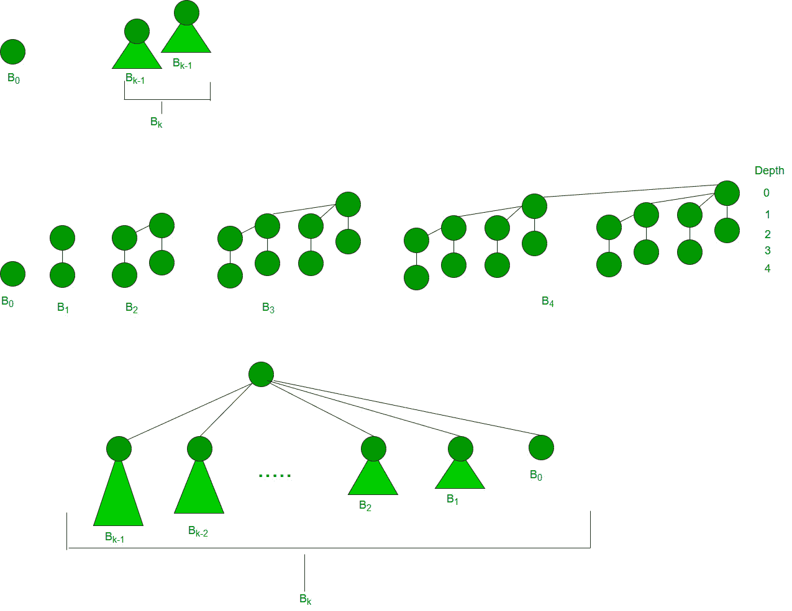
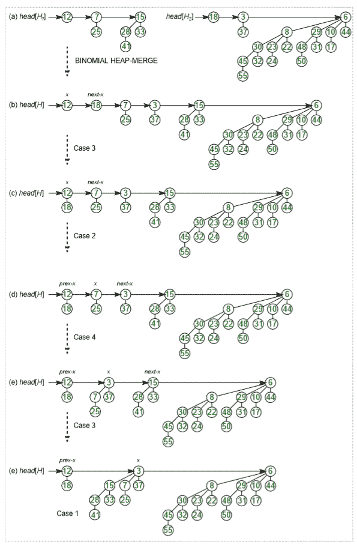

# 二项式堆

> 原文:[https://www.geeksforgeeks.org/binomial-heap-2/](https://www.geeksforgeeks.org/binomial-heap-2/)

[二进制堆](http://geeksquiz.com/binary-heap/)的主要应用是作为实现优先级队列。二项式堆是[二进制堆](http://geeksquiz.com/binary-heap/)的扩展，它与二进制堆提供的其他操作一起提供更快的联合或合并操作。

*二项式堆是二项式树的集合*

**什么是二叉树？**
0 阶二叉树有 1 个节点。k 阶的二叉树可以通过取两个 k-1 阶的二叉树并使其中一个作为最左边的子树或另一个来构造。
k 阶二叉树具有以下性质。
a)它正好有 2 个 <sup>k</sup> 节点。
b)深度为 k.
c)深度 I 处正好有 <sup>k</sup> C <sub>i</sub> 节点，i = 0，1，。。。，k.
d)根有度 k，根的子树本身是 k-1，k-2，..从左到右为 0。

```
k = 0 (Single Node)

 o

k = 1 (2 nodes) 
[We take two k = 0 order Binomial Trees, and
make one as child of other]
  o
 /  
o     

k = 2 (4 nodes)
[We take two k = 1 order Binomial Trees, and
make one as child of other]
     o
   /   \
  o     o
 /       
o        

k = 3 (8 nodes)
[We take two k = 2 order Binomial Trees, and
make one as child of other]
      o   
   /  | \ 
  o   o  o
 / \  | 
o   o o   
     \           
      o         

```

下图参考第二版 [CLRS 书](http://www.flipkart.com/introduction-algorithms-english-3rd/p/itmdwxyrafdburzg?pid=9788120340077&affid=sandeepgfg)。



**二项式堆:**
二项式堆是一组二叉树，其中每个二叉树遵循最小堆属性。任何程度的二叉树最多只能有一个。

**二项式堆示例:**

```
12------------10--------------------20
             /  \                 /  | \
           15    50             70  50  40
           |                  / |    |     
           30               80  85  65 
                            |
                           100
A Binomial Heap with 13 nodes. It is a collection of 3 
Binomial Trees of orders 0, 2 and 3 from left to right. 

    10--------------------20
   /  \                 /  | \
 15    50             70  50  40
 |                  / |    |     
 30               80  85  65 
                  |
                 100

```

具有 12 个节点的二项式堆。从左到右是 2 阶和 3 阶的 2
二叉树的集合。

**一个数的二进制表示和二项式堆**
具有 n 个节点的二项式堆的二项式树的数量等于 n 的二进制表示中的集合位数。例如，假设 n 为 13，则 n (00001101)的二进制表示中有 3 个集合位，因此有 3 个二项式树。我们还可以将这些二叉树的度数与集合位的位置联系起来。利用这种关系，我们可以得出结论，在具有“n”个节点的二项式堆中存在 O(Logn)个二项式树。

**二项式堆的操作:**
二项式堆中的主要操作是 union()，其他所有操作主要使用这个操作。union()操作是将两个二项式堆合并成一个。让我们先讨论其他操作，稍后我们将讨论联合。

1.  插入(H，k):在二项式堆“H”中插入一个键“k”。这个操作首先创建一个带有单个键“k”的二项式堆，然后调用 H 和新的二项式堆的并集。
2.  getMin(H):getMin()的一个简单方法是遍历二叉树的根列表并返回最小键。这个实现需要 O(Logn)时间。通过维护一个指向最小键根的指针，可以将其优化为 0(1)。
3.  extractMin(H):这个操作也使用 union()。我们首先调用 getMin()来找到最小键二叉树，然后移除该节点，并通过连接移除的最小节点的所有子树来创建一个新的二叉树堆。最后，我们在 H 和新创建的二项式堆上调用 union()。此操作需要 0(Logn)时间。
4.  delete(H):和 Binary Heap 一样，delete 操作首先将键减为负无穷大，然后调用 extractMin()。
5.  decreaseKey(H): decreaseKey() is also similar to Binary Heap. We compare the decreases key with it parent and if parent’s key is more, we swap keys and recur for the parent. We stop when we either reach a node whose parent has a smaller key or we hit the root node. Time complexity of decreaseKey() is O(Logn). 

    **二项式堆中的并集操作:**
    给定两个二项式堆 H1 和 H2，并集(H1、H2)创建单个二项式堆。

6.  第一步是简单地以非递减的度数顺序合并两个 Heaps。下图中，图(b)显示了合并后的结果。
7.  After the simple merge, we need to make sure that there is at most one Binomial Tree of any order. To do this, we need to combine Binomial Trees of the same order. We traverse the list of merged roots, we keep track of three-pointers, prev, x and next-x. There can be following 4 cases when we traverse the list of roots. 
    —–Case 1: Orders of x and next-x are not same, we simply move ahead. 
    In following 3 cases orders of x and next-x are same. 
    —–Case 2: If the order of next-next-x is also same, move ahead. 
    —–Case 3: If the key of x is smaller than or equal to the key of next-x, then make next-x as a child of x by linking it with x. 
    —–Case 4: If the key of x is greater, then make x as the child of next. 

    下图摘自 [CLRS 书](http://www.flipkart.com/introduction-algorithms-english-3rd/p/itmdwxyrafdburzg?pid=9788120340077&affid=sandeepgfg)第二版。



**如何表示二项式堆？**
二项式堆是一组二项式树。二叉树的表示方式必须允许从最左边的兄弟节点开始对所有兄弟节点进行顺序访问(我们在和 extractMin()和 delete()中需要这个)。其思想是将二叉树表示为最左边的子树和右边的兄弟树，即每个节点存储两个指针，一个指向最左边的子树，另一个指向右边的兄弟树。

### [二项式堆的实现](https://www.geeksforgeeks.org/implementation-binomial-heap/)

**资料来源:**
[克利福德·斯坦、托马斯·h·科曼、查尔斯·e·雷瑟森、罗纳德·l .](http://www.flipkart.com/introduction-algorithms-8120340078/p/itmczynzhyhxv2gs?pid=9788120340077&affid=sandeepgfg)的《算法导论》

本文由**希瓦姆**供稿。如果您发现任何不正确的地方，或者您想分享更多关于上面讨论的主题的信息，请写评论