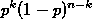
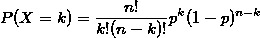
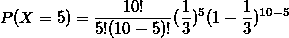

# 二项式随机变量

> 原文:[https://www.geeksforgeeks.org/binomial-random-variables/](https://www.geeksforgeeks.org/binomial-random-variables/)

在这篇文章中，我们将讨论二项式随机变量。
**先决条件:** [随机变量](https://www.geeksforgeeks.org/random-variable/)
一种特定类型的**离散**随机变量，用于计算特定事件在固定次数的尝试或试验中发生的频率。
对于二项式随机变量，必须满足以下所有条件:

1.  有固定数量的试验(固定样本量)。
2.  在每次试验中，感兴趣的事件要么发生，要么不发生。
3.  每次试验发生(或不发生)的概率都是一样的。
4.  审判是相互独立的。

数学符号

```
n = number of trials
p = probability of success in each trial
k = number of success in n trials
```

现在我们试着找出 n 次试验中 k 成功的概率。
这里每个试验的成功概率为 p，与其他试验无关。
所以我们首先选择 k 个会成功的试验，其余 n-k 个试验都会失败。这样做的方法有很多


由于所有的 n 个事件都是独立的，因此在 n 个试验中 k 个成功的概率等于每个试验的概率的乘积。
这里是它的 k 次成功和 n-k 次失败，那么每种方式获得 k 次成功和 n-k 次失败的概率是



因此最终概率为

```
(number of ways to achieve k success
 and n-k failures)
 *
(probability for each way to achieve k
 success and n-k failure)
```

那么二项式随机变量概率由下式给出:



设 X 为二项式随机变量，试验次数为 n，每次试验的成功概率为 p
预期成功次数由
给出

```
E[X] = np
```

成功次数的方差由
给出

```
Var[X] = np(1-p)
```

**例 1** :考虑一个随机实验，投 10 次有偏币(头像概率= 1/3)。求出现的人头数为 5 的概率。
解决方案:

```
Let X be binomial random variable 
with n = 10 and p = 1/3
P(X=5) = ?
```




下面是同样的
的实现

## C++

```
// C++ program to compute Binomial Probability
#include <iostream>
#include <cmath>
using namespace std;

// function to calculate nCr i.e., number of 
// ways to choose r out of n objects
int nCr(int n, int r)
{
    // Since nCr is same as nC(n-r)
    // To decrease number of iterations
    if (r > n / 2)
        r = n - r;

    int answer = 1;
    for (int i = 1; i <= r; i++) {
        answer *= (n - r + i);
        answer /= i;
    }

    return answer;
}

// function to calculate binomial r.v. probability
float binomialProbability(int n, int k, float p)
{
    return nCr(n, k) * pow(p, k) *
                pow(1 - p, n - k);
}

// Driver code
int main()
{

    int n = 10;
    int k = 5;
    float p = 1.0 / 3;

    float probability = binomialProbability(n, k, p);

    cout << "Probability of " << k;
    cout << " heads when a coin is tossed " << n;
    cout << " times where probability of each head is " << p << endl;
    cout << " is = " << probability << endl;
}
```

## Java 语言(一种计算机语言，尤用于创建网站)

```
// Java program to compute Binomial Probability

import java.util.*;

class GFG
{
    // function to calculate nCr i.e., number of 
    // ways to choose r out of n objects
    static int nCr(int n, int r)
    {
        // Since nCr is same as nC(n-r)
        // To decrease number of iterations
        if (r > n / 2)
            r = n - r;

        int answer = 1;
        for (int i = 1; i <= r; i++) {
            answer *= (n - r + i);
            answer /= i;
        }

        return answer;
    }

    // function to calculate binomial r.v. probability
    static float binomialProbability(int n, int k, float p)
    {
        return nCr(n, k) * (float)Math.pow(p, k) * 
                        (float)Math.pow(1 - p, n - k);
    }

    // Driver code
    public static void main(String[] args)
    {
        int n = 10;
        int k = 5;
        float p = (float)1.0 / 3;

        float probability = binomialProbability(n, k, p);

        System.out.print("Probability of " +k);
        System.out.print(" heads when a coin is tossed " +n);
        System.out.println(" times where probability of each head is " +p);
        System.out.println( " is = " + probability );
    }
}

/* This code is contributed by Mr. Somesh Awasthi */
```

## 蟒蛇 3

```
# Python3 program to compute Binomial 
# Probability

# function to calculate nCr i.e.,
# number of ways to choose r out
# of n objects
def nCr(n, r):

    # Since nCr is same as nC(n-r)
    # To decrease number of iterations
    if (r > n / 2):
        r = n - r;

    answer = 1;
    for i in range(1, r + 1):
        answer *= (n - r + i);
        answer /= i;

    return answer;

# function to calculate binomial r.v.
# probability
def binomialProbability(n, k, p):

    return (nCr(n, k) * pow(p, k) * 
                        pow(1 - p, n - k));

# Driver code
n = 10;
k = 5;
p = 1.0 / 3;

probability = binomialProbability(n, k, p);

print("Probability of", k, 
      "heads when a coin is tossed", end = " ");
print(n, "times where probability of each head is", 
                                      round(p, 6));
print("is = ", round(probability, 6));

# This code is contributed by mits
```

## C#

```
// C# program to compute Binomial
// Probability.
using System;

class GFG {

    // function to calculate nCr
    // i.e., number of ways to 
    // choose r out of n objects
    static int nCr(int n, int r)
    {

        // Since nCr is same as
        // nC(n-r) To decrease 
        // number of iterations
        if (r > n / 2)
            r = n - r;

        int answer = 1;
        for (int i = 1; i <= r; i++)
        {
            answer *= (n - r + i);
            answer /= i;
        }

        return answer;
    }

    // function to calculate binomial
    // r.v. probability
    static float binomialProbability(
                  int n, int k, float p)
    {
        return nCr(n, k) * 
                   (float)Math.Pow(p, k)
                * (float)Math.Pow(1 - p,
                                 n - k);
    }

    // Driver code
    public static void Main()
    {
        int n = 10;
        int k = 5;
        float p = (float)1.0 / 3;

        float probability = 
              binomialProbability(n, k, p);

        Console.Write("Probability of "
                                      + k);
        Console.Write(" heads when a coin "
                       + "is tossed " + n);
        Console.Write(" times where "
           + "probability of each head is "
                                      + p);
        Console.Write( " is = "
                           + probability );
    }
}

// This code is contributed by nitin mittal.
```

## 服务器端编程语言（Professional Hypertext Preprocessor 的缩写）

```
<?php
// php program to compute Binomial 
// Probability

// function to calculate nCr i.e.,
// number of ways to choose r out
// of n objects
function nCr($n, $r)
{

    // Since nCr is same as nC(n-r)
    // To decrease number of iterations
    if ($r > $n / 2)
        $r = $n - $r;

    $answer = 1;
    for ($i = 1; $i <= $r; $i++) {
        $answer *= ($n - $r + $i);
        $answer /= $i;
    }

    return $answer;
}

// function to calculate binomial r.v.
// probability
function binomialProbability($n, $k, $p)
{
    return nCr($n, $k) * pow($p, $k) *
                   pow(1 - $p, $n - $k);
}

// Driver code
    $n = 10;
    $k = 5;
    $p = 1.0 / 3;

    $probability = 
         binomialProbability($n, $k, $p);

    echo "Probability of " . $k;
    echo " heads when a coin is tossed "
                                    . $n;
    echo " times where probability of "
                 . "each head is " . $p ;
    echo " is = " . $probability ;

// This code is contributed by nitin mittal.
?>
```

## java 描述语言

```
<script>

// Javascript program to compute Binomial Probability

    // function to calculate nCr i.e., number of 
    // ways to choose r out of n objects
    function nCr(n, r)
    {
        // Since nCr is same as nC(n-r)
        // To decrease number of iterations
        if (r > n / 2)
            r = n - r;

        let answer = 1;
        for (let i = 1; i <= r; i++) {
            answer *= (n - r + i);
            answer /= i;
        }

        return answer;
    }

    // function to calculate binomial r.v. probability
    function binomialProbability(n, k, p)
    {
        return nCr(n, k) * Math.pow(p, k) * 
                        Math.pow(1 - p, n - k);
    }

// driver program
        let n = 10;
        let k = 5;
        let p = 1.0 / 3;

        let probability = binomialProbability(n, k, p);

        document.write("Probability of " +k);
        document.write(" heads when a coin is tossed " +n);
        document.write(" times where probability of each head is " +p);
        document.write( " is = " + probability );

 // This code is contributed by code_hunt.
</script>
```

**输出:**

```
Probability of 5 heads when a coin is tossed 10 times where probability of each head is 0.333333
 is = 0.136565
```

**参考** :
[stat200](https://onlinecourses.science.psu.edu/stat200/node/37)
本文由 [**Pratik Chhajer**](https://github.com/Pratik-Chhajer) 供稿。如果你喜欢 GeeksforGeeks 并想投稿，你也可以使用[write.geeksforgeeks.org](http://www.write.geeksforgeeks.org)写一篇文章或者把你的文章邮寄到 review-team@geeksforgeeks.org。看到你的文章出现在极客博客主页上，帮助其他极客。
如果发现有不正确的地方，或者想分享更多关于上述话题的信息，请写评论。