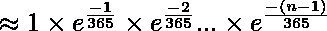
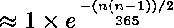

# 生日悖论

> 原文:[https://www.geeksforgeeks.org/birthday-paradox/](https://www.geeksforgeeks.org/birthday-paradox/)

*一个房间里必须有多少人才能 100%保证——房间里至少有两个人生日相同？*
回答:367(因为有 366 个可能的生日，包括 2 月 29 日)。
以上问题很简单。自己试试下面的问题。
***一个房间里必须有多少人才能使房间里至少有两个人生日相同的概率达到 50%？***
答案:23
这个数字低得惊人。事实上，我们只需要 70 个人就可以使概率达到 99.9 %。
我们来讨论一下广义公式。
**n 个人中有两个人生日相同的概率是多少？**
让 n 个房间的两个人生日相同的概率为 P(相同)。P(相同)可以很容易地用 P(不同)来评估，其中 P(不同)是它们都有不同生日的概率。
P(相同)= 1–P(不同)
P(不同)可以写成 1 x(364/365)x(363/365)x(362/365)x。x(1 –( n-1)/365)
*我们是如何得到上面的表达式的？*
从第一个到最后一个的人可以按照以下顺序过生日，这样所有的生日都是不同的:
第一个人可以有 365 个
中的任何一个生日，第二个人应该有一个和第一个人不一样的生日
第三个人应该有一个和前两个人不一样的生日。
………………。
…………
第 n 个人的生日应该与先前考虑的任何(n-1)个人的生日不同。
**上述表达式的近似**
上述表达式可以用泰勒级数近似。

为 ex for x 提供了一阶近似< < 1:

要将此近似应用于为 p(不同)导出的第一个表达式，请设置 x = -a / 365。因此，

上述推导出的 p(differential)表达式可以写成
1 x(1–1/365)x(1–2/365)x(1–3/365)x。x(1 –( n-1)/365)
通过将 1–a/365 的值作为 e <sup>-a/365</sup> ，我们得到如下结果。



因此，
p(相同)= 1- p(不同)

一个更粗略的近似由
p(相同)

给出通过取两边的 Log，我们得到了相反的公式。

利用上面的近似公式，我们可以对给定概率的人数进行近似。例如，下面的 C++函数 find()返回概率大于给定 p 的最小 n。
**近似公式的实现。**
下面是程序对给定概率的人数进行近似。

## C++

```
// C++ program to approximate number of people in Birthday Paradox
// problem
#include <cmath>
#include <iostream>
using namespace std;

// Returns approximate number of people for a given probability
int find(double p)
{
    return ceil(sqrt(2*365*log(1/(1-p))));
}

int main()
{
   cout << find(0.70);
}
```

## Java 语言(一种计算机语言，尤用于创建网站)

```
// Java program to approximate number
// of people in Birthday Paradox problem
class GFG {

    // Returns approximate number of people
    // for a given probability
    static double find(double p) {

        return Math.ceil(Math.sqrt(2 *
            365 * Math.log(1 / (1 - p))));
    }

    // Driver code
    public static void main(String[] args)
    {

        System.out.println(find(0.70));
    }
}

// This code is contributed by Anant Agarwal.
```

## 蟒蛇 3

```
# Python3 code to approximate number
# of people in Birthday Paradox problem
import math

# Returns approximate number of
# people for a given probability
def find( p ):
    return math.ceil(math.sqrt(2 * 365 *
                     math.log(1/(1-p))));

# Driver Code
print(find(0.70))

# This code is contributed by "Sharad_Bhardwaj".
```

## C#

```
// C# program to approximate number
// of people in Birthday Paradox problem.
using System;

class GFG {

    // Returns approximate number of people
    // for a given probability
    static double find(double p) {

        return Math.Ceiling(Math.Sqrt(2 *
            365 * Math.Log(1 / (1 - p))));
    }

    // Driver code
    public static void Main()
    {        
    Console.Write(find(0.70));
    }
}

// This code is contributed by nitin mittal.
```

## 服务器端编程语言（Professional Hypertext Preprocessor 的缩写）

```
<?php
// PHP program to approximate
// number of people in Birthday
// Paradox problem

// Returns approximate number
// of people for a given probability
function find( $p)
{
    return ceil(sqrt(2 * 365 *
                     log(1 / (1 - $p))));
}

// Driver Code
echo find(0.70);

// This code is contributed by aj_36
?>
```

## java 描述语言

```
<script>

// JavaScript program to approximate number
// of people in Birthday Paradox problem

// Returns approximate number of
// people for a given probability
function find( p){
    return Math.ceil(Math.sqrt(2*365*Math.log(1/(1-p))));
}
document.write(find(0.70));

</script>
```

**输出:**

```
30
```

时间复杂度:0(对数 n)

辅助空间:0(1)

**来源:**
[【http://en.wikipedia.org/wiki/Birthday_problem】](http://en.wikipedia.org/wiki/Birthday_problem)
**应用:**
1)生日悖论通常用散列法来讨论，以表明即使对于一小组密钥，冲突处理的重要性。
2) [生日攻击](http://en.wikipedia.org/wiki/Birthday_attack)
下面是 C 语言中的一个替代实现:

## C

```
#include<stdio.h>
int main(){

    // Assuming non-leap year
    float num = 365;

    float denom = 365;
    float pr;
    int n = 0;
    printf("Probability to find : ");
    scanf("%f", &pr);

    float p = 1;
    while (p > pr){
        p *= (num/denom);
        num--;
        n++;
    }

    printf("\nTotal no. of people out of which there "
          " is %0.1f probability that two of them "
          "have same birthdays is %d ", p, n);

    return 0;
}
```

时间复杂度:0(对数 n)

辅助空间:0(1)

本文由 **Shubham** 供稿。如果你发现任何不正确的地方，或者你想分享更多关于上面讨论的话题的信息，请写评论。