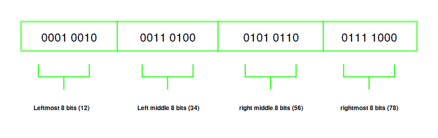
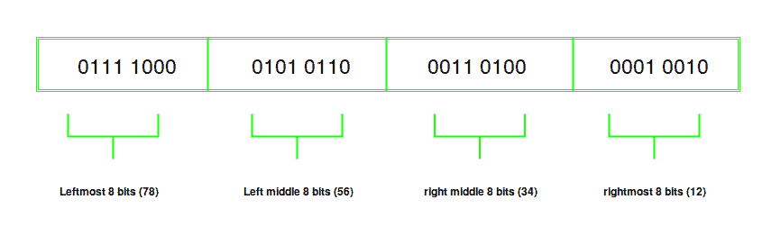

# 位操作|数字的交换字符顺序

> 原文:[https://www . geesforgeks . org/bit-operation-swap-endianness-of-a-number/](https://www.geeksforgeeks.org/bit-manipulation-swap-endianness-of-a-number/)

**先决条件:**[https://www . geeksforgeeks . org/Little-and-big-Endian-神秘感/](https://www.geeksforgeeks.org/little-and-big-endian-mystery/)
Little-Endian 和 Big-Endian 是在机器中存储数据的方式。一些机器可能使用小端字节顺序，而其他机器可能使用大端字节顺序。当您将数据从大端机器传输到小端机器时，会产生不一致性。通常，编译器负责转换。但是，在网络中，大端被用作网络间数据交换的标准。因此，小端机器在通过网络发送数据时，需要将其数据转换为大端。类似地，当小端机器从网络接收数据时，它们需要交换字节顺序。
因此，当您通过网络从一台主机向另一台主机发送和接收数据时，Endianness 就会出现。如果发送方和接收方计算机具有不同的字符顺序，则需要交换字符顺序以便兼容。
因此，将数据转换为小端或大端很重要，这样才有一致性和数据完整性。在本文中，我们将研究如何交换数字的 Endianness。这也是常见的面试问题。

## 方法:

1.  通过将其与 0x000000FF 相加得到该数字最右边的 8 位，因为最后 8 位都是 1，其余都是 0，结果将是该数字最右边的 8 位。结果存储在一个名为最左边字节
    的变量中
2.  同样，通过将数字与 0x0000FF00 进行 and 运算，得到数字的下 8 位(从右到中)。结果存储在左 _ 中 _ 字节
    中
3.  通过将其与 0x00FF0000 相加，获得该数字的下 8 位。结果存储在右 _ 中 _ 字节
    中
4.  最后，通过与 0xFF000000 进行 and 运算，得到数字最左边的 8 位。结果存储在最右边的 _ 字节
    中
5.  现在我们有了这个数字的所有 4 个字节，我们需要以相反的顺序连接它。即交换号码的字符顺序。为此，我们将最右边的 8 位向左移动 24，使其成为最左边的 8 位。我们将右中间字节左移 16(存储为左中间字节)我们将左中间字节左移 8(存储为右混乱字节)我们最终将最左边的字节左移 24 到左边

6.  现在，我们在逻辑上“或”(连接)所有变量以获得结果。

考虑数字 0x12345678。该数字为 4 字节宽。在**大端**中，这个数字表示为:



在**小端**中，相同的数字表示为:



**例:**

> **输入:**0x 12345678
> T3】输出:0x 78563412
> T6】输入:0x 87654321
> T9】输出: 0x21436587

**实施** :

## C++

```
// C++ program to print the difference
// of Alternate Nodes
#include <bits/stdc++.h>
using namespace std;

// Function to swap a value from
// big Endian to little Endian and
// vice versa.
int swap_Endians(int value)
{

    // This var holds the leftmost 8
    // bits of the output.
    int leftmost_byte;

    // This holds the left middle
    // 8 bits of the output
    int left_middle_byle;

    // This holds the right middle
    // 8 bits of the output
    int right_middle_byte;

    // This holds the rightmost
    // 8 bits of the output
    int rightmost_byte;

    // To store the result
    // after conversion
    int result;

    // Get the rightmost 8 bits of the number
    // by anding it 0x000000FF. since the last
    // 8 bits are all ones, the result will be the
    // rightmost 8 bits of the number. this will
    // be converted into the leftmost 8 bits for the
    // output (swapping)
    leftmost_byte = (value & 0x000000FF) >> 0;

    // Similarly, get the right middle and left
    // middle 8 bits which will become
    // the left_middle bits in the output
    left_middle_byle = (value & 0x0000FF00) >> 8;

    right_middle_byte = (value & 0x00FF0000) >> 16;

    // Get the leftmost 8 bits which will be the
    // rightmost 8 bits of the output
    rightmost_byte = (value & 0xFF000000) >> 24;

    // Left shift the 8 bits by 24
    // so that it is shifted to the
    // leftmost end
    leftmost_byte <<= 24;

    // Similarly, left shift by 16
    // so that it is in the left_middle
    // position. i.e, it starts at the
    // 9th bit from the left and ends at the
    // 16th bit from the left
    left_middle_byle <<= 16;

    right_middle_byte <<= 8;

    // The rightmost bit stays as it is
    // as it is in the correct position
    rightmost_byte <<= 0;

    // Result is the concatenation of all these values.
    result = (leftmost_byte | left_middle_byle |
              right_middle_byte | rightmost_byte);

    return result;
}

// Driver Code
int main()
{

    // Consider a hexadecimal value
    // given below. we are gonna convert
    // this from big Endian to little Endian
    // and vice versa.

    int big_Endian = 0x12345678;
    int little_Endian = 0x78563412;

    int result1, result2;

    result1 = swap_Endians(big_Endian);

    result2 = swap_Endians(little_Endian);

    printf("big Endian to little:"
           "0x%x\nlittle Endian to big: 0x%x\n",
            result1, result2);

    return 0;
}

// This code is contributed by SHUBHAMSINGH10
```

## C

```
#include <stdio.h>

// Function to swap a value from
// big Endian to little Endian and
// vice versa.

int swap_Endians(int value)
{

    // This var holds the leftmost 8
    // bits of the output.

    int leftmost_byte;

    // This holds the left middle
    // 8 bits of the output

    int left_middle_byle;

    // This holds the right middle
    // 8 bits of the output

    int right_middle_byte;

    // This holds the rightmost
    // 8 bits of the output

    int rightmost_byte;

    // To store the result
    // after conversion

    int result;

    // Get the rightmost 8 bits of the number
    // by anding it 0x000000FF. since the last
    // 8 bits are all ones, the result will be the
    // rightmost 8 bits of the number. this will
    // be converted into the leftmost 8 bits for the
    // output (swapping)

    leftmost_byte = (value & 0x000000FF) >> 0;

    // Similarly, get the right middle and left
    // middle 8 bits which will become
    // the left_middle bits in the output

    left_middle_byle = (value & 0x0000FF00) >> 8;

    right_middle_byte = (value & 0x00FF0000) >> 16;

    // Get the leftmost 8 bits which will be the
    // rightmost 8 bits of the output

    rightmost_byte = (value & 0xFF000000) >> 24;

    // Left shift the 8 bits by 24
    // so that it is shifted to the
    // leftmost end

    leftmost_byte <<= 24;

    // Similarly, left shift by 16
    // so that it is in the left_middle
    // position. i.e, it starts at the
    // 9th bit from the left and ends at the
    // 16th bit from the left

    left_middle_byle <<= 16;

    right_middle_byte <<= 8;

    // The rightmost bit stays as it is
    // as it is in the correct position

    rightmost_byte <<= 0;

    // Result is the concatenation of all these values.

    result = (leftmost_byte | left_middle_byle
              | right_middle_byte | rightmost_byte);

    return result;
}

// Driver Code
int main()
{

    // Consider a hexadecimal value
    // given below. we are gonna convert
    // this from big Endian to little Endian
    // and vice versa.

    int big_Endian = 0x12345678;
    int little_Endian = 0x78563412;

    int result1, result2;

    result1 = swap_Endians(big_Endian);

    result2 = swap_Endians(little_Endian);

    printf("big Endian to little: 0x%x\nlittle Endian to big: 0x%x\n",
           result1, result2);

    return 0;
}
```

## Java 语言(一种计算机语言，尤用于创建网站)

```
// Java program to print the difference
// of Alternate Nodes
import java.util.*;

class GFG
{

// Function to swap a value from
// big Endian to little Endian and
// vice versa.
static int swap_Endians(int value)
{

    // This var holds the leftmost 8
    // bits of the output.
    int leftmost_byte;

    // This holds the left middle
    // 8 bits of the output
    int left_middle_byle;

    // This holds the right middle
    // 8 bits of the output
    int right_middle_byte;

    // This holds the rightmost
    // 8 bits of the output
    int rightmost_byte;

    // To store the result
    // after conversion
    int result;

    // Get the rightmost 8 bits of the number
    // by anding it 0x000000FF. since the last
    // 8 bits are all ones, the result will be the
    // rightmost 8 bits of the number. this will
    // be converted into the leftmost 8 bits for the
    // output (swapping)
    leftmost_byte = (value & 0x000000FF) >> 0;

    // Similarly, get the right middle and left
    // middle 8 bits which will become
    // the left_middle bits in the output
    left_middle_byle = (value & 0x0000FF00) >> 8;

    right_middle_byte = (value & 0x00FF0000) >> 16;

    // Get the leftmost 8 bits which will be the
    // rightmost 8 bits of the output
    rightmost_byte = (value & 0xFF000000) >> 24;

    // Left shift the 8 bits by 24
    // so that it is shifted to the
    // leftmost end
    leftmost_byte <<= 24;

    // Similarly, left shift by 16
    // so that it is in the left_middle
    // position. i.e, it starts at the
    // 9th bit from the left and ends at the
    // 16th bit from the left
    left_middle_byle <<= 16;

    right_middle_byte <<= 8;

    // The rightmost bit stays as it is
    // as it is in the correct position
    rightmost_byte <<= 0;

    // Result is the concatenation of all these values.
    result = (leftmost_byte | left_middle_byle |
              right_middle_byte | rightmost_byte);

    return result;
}

// Driver Code
public static void main(String[] args)
{
    // Consider a hexadecimal value
    // given below. we are gonna convert
    // this from big Endian to little Endian
    // and vice versa.
    int big_Endian = 0x12345678;
    int little_Endian = 0x78563412;

    int result1, result2;

    result1 = swap_Endians(big_Endian);

    result2 = swap_Endians(little_Endian);

    System.out.printf("big Endian to little: 0x%x\n" +
                      "little Endian to big: 0x%x\n",
                       result1, result2);
}
}

// This code is contributed by PrinciRaj1992
```

## 蟒蛇 3

```
# Function to swap a value from
# big Endian to little Endian and
# vice versa.
def swap_Endians(value):

    # Get the rightmost 8 bits of the number
    # by anding it 0x000000FF. since the last
    # 8 bits are all ones, the result will be the
    # rightmost 8 bits of the number. this will
    # be converted into the leftmost 8 bits for the
    # output (swapping)

    leftmost_byte = (value & eval('0x000000FF')) >> 0

    # Similarly, get the right middle and left 
    # middle 8 bits which will become
    # the left_middle bits in the output

    left_middle_byle = (value & eval('0x0000FF00')) >> 8

    right_middle_byte = (value & eval('0x00FF0000'))>> 16

    # Get the leftmost 8 bits which will be the
    # rightmost 8 bits of the output

    rightmost_byte = (value & eval('0xFF000000'))>> 24

    # Left shift the 8 bits by 24
    # so that it is shifted to the
    # leftmost end

    leftmost_byte <<= 24

    # Similarly, left shift by 16
    # so that it is in the left_middle
    # position. i.e, it starts at the
    # 9th bit from the left and ends at the
    # 16th bit from the left

    left_middle_byle <<= 16

    right_middle_byte <<= 8

    # The rightmost bit stays as it is
    # as it is in the correct position

    rightmost_byte <<= 0

    # Result is the concatenation of all these values

    result = (leftmost_byte | left_middle_byle
                  | right_middle_byte | rightmost_byte)

    return result

# main function
if __name__ == '__main__':

    # Consider a hexadecimal value
    # given below. we are gonna convert
    # this from big Endian to little Endian
    # and vice versa.
    big_Endian = eval('0x12345678')
    little_Endian = eval('0x78563412')

    result1 = swap_Endians(big_Endian)

    result2 = swap_Endians(little_Endian)

    print("big Endian to little: % s\nlittle Endian
              to big: % s" %(hex(result1), hex(result2)))
```

## C#

```
// C# program to print the difference
// of Alternate Nodes
using System;

class GFG
{

// Function to swap a value from
// big Endian to little Endian and
// vice versa.
static int swap_Endians(int value)
{

    // This var holds the leftmost 8
    // bits of the output.
    int leftmost_byte;

    // This holds the left middle
    // 8 bits of the output
    int left_middle_byle;

    // This holds the right middle
    // 8 bits of the output
    int right_middle_byte;

    // This holds the rightmost
    // 8 bits of the output
    int rightmost_byte;

    // To store the result
    // after conversion
    int result;

    // Get the rightmost 8 bits of the number
    // by anding it 0x000000FF. since the last
    // 8 bits are all ones, the result will be the
    // rightmost 8 bits of the number. this will
    // be converted into the leftmost 8 bits for the
    // output (swapping)
    leftmost_byte = (value & 0x000000FF) >> 0;

    // Similarly, get the right middle and left
    // middle 8 bits which will become
    // the left_middle bits in the output
    left_middle_byle = (value & 0x0000FF00) >> 8;

    right_middle_byte = (value & 0x00FF0000) >> 16;

    // Get the leftmost 8 bits which will be the
    // rightmost 8 bits of the output
    rightmost_byte = (int)(value & 0xFF000000) >> 24;

    // Left shift the 8 bits by 24
    // so that it is shifted to the
    // leftmost end
    leftmost_byte <<= 24;

    // Similarly, left shift by 16
    // so that it is in the left_middle
    // position. i.e, it starts at the
    // 9th bit from the left and ends at the
    // 16th bit from the left
    left_middle_byle <<= 16;

    right_middle_byte <<= 8;

    // The rightmost bit stays as it is
    // as it is in the correct position
    rightmost_byte <<= 0;

    // Result is the concatenation of all these values.
    result = (leftmost_byte | left_middle_byle |
              right_middle_byte | rightmost_byte);

    return result;
}

// Driver Code
public static void Main(String[] args)
{
    // Consider a hexadecimal value
    // given below. we are gonna convert
    // this from big Endian to little Endian
    // and vice versa.
    int big_Endian = 0x12345678;
    int little_Endian = 0x78563412;

    int result1, result2;

    result1 = swap_Endians(big_Endian);

    result2 = swap_Endians(little_Endian);

    Console.Write("big Endian to little: 0x{0:x}\n" +
                    "little Endian to big: 0x{1:x}\n",
                                   result1, result2);
}
}

// This code is contributed by Rajput-Ji
```

**Output**

```
big Endian to little:0x78563412
little Endian to big: 0x12345678

```