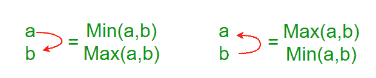
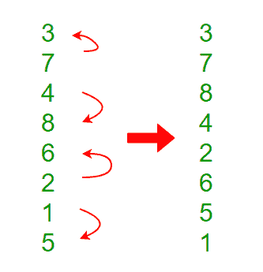
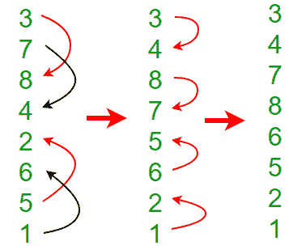
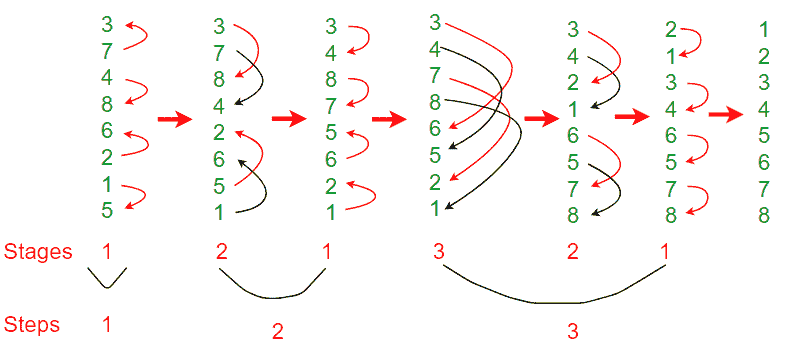

# 双音素排序

> 原文:[https://www.geeksforgeeks.org/bitonic-sort/](https://www.geeksforgeeks.org/bitonic-sort/)

**背景**

Bitonic Sort 是一种经典的并行排序算法。

*   双音素排序进行 0(n Log<sup>2</sup>n)比较。
*   由 Bitonic sort 完成的比较的数量比像 Merge Sort[do O(nLogn)比较]这样的流行排序算法更多，但是 Bitonice sort 更适合并行实现，因为我们总是以预定义的顺序比较元素，并且比较的顺序不依赖于数据。因此适合在硬件和[并行处理器阵列](https://en.wikipedia.org/wiki/Massively_parallel_processor_array)中实现。
*   如果要排序的元素数量是 2^n.，则必须进行双音素排序。如果元素数量不在上述精确数量内，则双音素排序过程失败。

要理解双音素排序，我们必须首先理解什么是双音素序列，以及如何使给定的序列双音素。

**双音素序列**

如果一个序列先递增后递减，则称之为比通序列。换句话说，数组 arr[0..n-i]是 Bitonic，如果存在索引 I，其中 0<=i<=n-1

```
***x0 <= x1 …..<= xi  and  xi >= xi+1….. >= xn-1*** 
```

1.  按递增顺序排序的序列被认为是双音素的，递减部分为空。类似地，递减顺序被认为是 Bitonic，递增部分为空。
2.  双调和序列的旋转也是双调和的。

**如何从一个随机输入形成一个双音素序列？**
我们从连续的 2 元序列形成 4 元双离子序列开始。考虑序列 x0，x1，x2，x3 中的 4 元素。我们按升序排列 x0 和 x1，按降序排列 x2 和 x3。然后，我们将这两对连接起来，形成一个 4 元素双音素序列。
接下来，我们取两个 4 元素双音素序列，一个按升序排序，另一个按降序排序(使用我们将在下面讨论的双音素排序)，以此类推，直到得到双音素序列。

**示例:**
将以下序列转换为双音素序列:3、7、4、8、6、2、1、5

**步骤 1** :将每 2 个连续的元素视为双音素序列，并对每 2 对元素应用双音素排序。下一步，取两个 4 元素双音素序列，以此类推。

 

**注意:** x0、x1 按升序排序，x2、x3 按降序排序，以此类推

**步骤 2:** 两个 4 元素双音素序列: **A** (3，7，8，4)和 **B** (2，6，5，1)，比较器长度为 2



经过这一步，我们将得到长度为 8 的双音素序列。

```
 3, 4, 7, 8, 6, 5, 2, 1
```

**双音素排序**

主要涉及两个步骤。

1.  形成双音序列(上面详细讨论过)。经过这一步，我们到达下图中的第四个阶段，即数组变成{3，4，7，8，6，5，2，1}
2.  从双音素序列创建一个排序序列:第一步后，前半部分按递增顺序排序，后半部分按递减顺序排序。
    我们将前半部分的第一个元素与后半部分的第一个元素进行比较，然后将前半部分的第二个元素与后半部分的第二个元素进行比较，以此类推。如果前半部分的元素较小，我们就交换元素。
    经过以上的比较和交换步骤，我们得到了数组中的两个双离子序列。见下图第五阶段。在第五阶段，我们有{3，4，2，1，6，5，7，8}。如果我们仔细观察这些元素，我们可以注意到有两个长度为 n/2 的双音素序列，使得第一个双音素序列{3，4，2，1}中的所有元素都小于第二个双音素序列{6，5，7，8}中的所有元素。
    我们在两个双离子序列中重复同样的过程，得到长度为 n/4 的四个双离子序列，使得最左边的双离子序列的所有元素都更小，最右边的所有元素都更小。见下图第六阶段，数组是{2，1，3，4，6，5，7，8}。
    如果我们再重复一次这个过程，我们会得到 8 个大小为 1 的 n/8 的双离子序列。因为所有这些双音素序列都是排序的，并且每个双音素序列都有一个元素，所以我们得到排序的数组。



下面是双音素排序的实现。

## C++

```
/* C++ Program for Bitonic Sort. Note that this program
   works only when size of input is a power of 2\. */
#include<bits/stdc++.h>
using namespace std;

/*The parameter dir indicates the sorting direction, ASCENDING
   or DESCENDING; if (a[i] > a[j]) agrees with the direction,
   then a[i] and a[j] are interchanged.*/
void compAndSwap(int a[], int i, int j, int dir)
{
    if (dir==(a[i]>a[j]))
        swap(a[i],a[j]);
}

/*It recursively sorts a bitonic sequence in ascending order,
  if dir = 1, and in descending order otherwise (means dir=0).
  The sequence to be sorted starts at index position low,
  the parameter cnt is the number of elements to be sorted.*/
void bitonicMerge(int a[], int low, int cnt, int dir)
{
    if (cnt>1)
    {
        int k = cnt/2;
        for (int i=low; i<low+k; i++)
            compAndSwap(a, i, i+k, dir);
        bitonicMerge(a, low, k, dir);
        bitonicMerge(a, low+k, k, dir);
    }
}

/* This function first produces a bitonic sequence by recursively
    sorting its two halves in opposite sorting orders, and then
    calls bitonicMerge to make them in the same order */
void bitonicSort(int a[],int low, int cnt, int dir)
{
    if (cnt>1)
    {
        int k = cnt/2;

        // sort in ascending order since dir here is 1
        bitonicSort(a, low, k, 1);

        // sort in descending order since dir here is 0
        bitonicSort(a, low+k, k, 0);

        // Will merge whole sequence in ascending order
        // since dir=1.
        bitonicMerge(a,low, cnt, dir);
    }
}

/* Caller of bitonicSort for sorting the entire array of
   length N in ASCENDING order */
void sort(int a[], int N, int up)
{
    bitonicSort(a,0, N, up);
}

// Driver code
int main()
{
    int a[]= {3, 7, 4, 8, 6, 2, 1, 5};
    int N = sizeof(a)/sizeof(a[0]);

    int up = 1;   // means sort in ascending order
    sort(a, N, up);

    printf("Sorted array: \n");
    for (int i=0; i<N; i++)
        printf("%d ", a[i]);
    return 0;
}
```

## Java 语言(一种计算机语言，尤用于创建网站)

```
/* Java program for Bitonic Sort. Note that this program
   works only when size of input is a power of 2\. */
public class BitonicSort
{
    /* The parameter dir indicates the sorting direction,
       ASCENDING or DESCENDING; if (a[i] > a[j]) agrees
       with the direction, then a[i] and a[j] are
       interchanged. */
    void compAndSwap(int a[], int i, int j, int dir)
    {
        if ( (a[i] > a[j] && dir == 1) ||
             (a[i] < a[j] && dir == 0))
        {
            // Swapping elements
            int temp = a[i];
            a[i] = a[j];
            a[j] = temp;
        }
    }

    /* It recursively sorts a bitonic sequence in ascending
       order, if dir = 1, and in descending order otherwise
       (means dir=0). The sequence to be sorted starts at
       index position low, the parameter cnt is the number
       of elements to be sorted.*/
    void bitonicMerge(int a[], int low, int cnt, int dir)
    {
        if (cnt>1)
        {
            int k = cnt/2;
            for (int i=low; i<low+k; i++)
                compAndSwap(a,i, i+k, dir);
            bitonicMerge(a,low, k, dir);
            bitonicMerge(a,low+k, k, dir);
        }
    }

    /* This function first produces a bitonic sequence by
       recursively sorting its two halves in opposite sorting
       orders, and then  calls bitonicMerge to make them in
       the same order */
    void bitonicSort(int a[], int low, int cnt, int dir)
    {
        if (cnt>1)
        {
            int k = cnt/2;

            // sort in ascending order since dir here is 1
            bitonicSort(a, low, k, 1);

            // sort in descending order since dir here is 0
            bitonicSort(a,low+k, k, 0);

            // Will merge whole sequence in ascending order
            // since dir=1.
            bitonicMerge(a, low, cnt, dir);
        }
    }

    /*Caller of bitonicSort for sorting the entire array
      of length N in ASCENDING order */
    void sort(int a[], int N, int up)
    {
        bitonicSort(a, 0, N, up);
    }

    /* A utility function to print array of size n */
    static void printArray(int arr[])
    {
        int n = arr.length;
        for (int i=0; i<n; ++i)
            System.out.print(arr[i] + " ");
        System.out.println();
    }

    // Driver method
    public static void main(String args[])
    {
        int a[] = {3, 7, 4, 8, 6, 2, 1, 5};
        int up = 1;
        BitonicSort ob = new BitonicSort();
        ob.sort(a, a.length,up);
        System.out.println("\nSorted array");
        printArray(a);
    }
}
```

## 计算机编程语言

```
# Python program for Bitonic Sort. Note that this program
# works only when size of input is a power of 2.

# The parameter dir indicates the sorting direction, ASCENDING
# or DESCENDING; if (a[i] > a[j]) agrees with the direction,
# then a[i] and a[j] are interchanged.*/
def compAndSwap(a, i, j, dire):
    if (dire==1 and a[i] > a[j]) or (dire==0 and a[i] < a[j]):
        a[i],a[j] = a[j],a[i]

# It recursively sorts a bitonic sequence in ascending order,
# if dir = 1, and in descending order otherwise (means dir=0).
# The sequence to be sorted starts at index position low,
# the parameter cnt is the number of elements to be sorted.
def bitonicMerge(a, low, cnt, dire):
    if cnt > 1:
        k = cnt/2
        for i in range(low , low+k):
            compAndSwap(a, i, i+k, dire)
        bitonicMerge(a, low, k, dire)
        bitonicMerge(a, low+k, k, dire)

# This function first produces a bitonic sequence by recursively
# sorting its two halves in opposite sorting orders, and then
# calls bitonicMerge to make them in the same order
def bitonicSort(a, low, cnt,dire):
    if cnt > 1:
          k = cnt/2
          bitonicSort(a, low, k, 1)
          bitonicSort(a, low+k, k, 0)
          bitonicMerge(a, low, cnt, dire)

# Caller of bitonicSort for sorting the entire array of length N
# in ASCENDING order
def sort(a,N, up):
    bitonicSort(a,0, N, up)

# Driver code to test above
a = [3, 7, 4, 8, 6, 2, 1, 5]
n = len(a)
up = 1

sort(a, n, up)
print ("\n\nSorted array is")
for i in range(n):
    print("%d" %a[i]),
```

## C#

```
/* C# Program for Bitonic Sort. Note that this program
   works only when size of input is a power of 2\. */
using System;

/*The parameter dir indicates the sorting direction, ASCENDING
   or DESCENDING; if (a[i] > a[j]) agrees with the direction,
   then a[i] and a[j] are interchanged.*/
class GFG
{
    /* To swap values */
    static void Swap<T>(ref T lhs, ref T rhs)
    {
        T temp;
        temp = lhs;
        lhs = rhs;
        rhs = temp;
    }
    public static void compAndSwap(int[] a, int i, int j, int dir)
    {
        int k;
        if((a[i]>a[j]))
            k=1;
        else
            k=0;
        if (dir==k)
            Swap(ref a[i],ref a[j]);
    }

    /*It recursively sorts a bitonic sequence in ascending order,
      if dir = 1, and in descending order otherwise (means dir=0).
      The sequence to be sorted starts at index position low,
      the parameter cnt is the number of elements to be sorted.*/
    public static void bitonicMerge(int[] a, int low, int cnt, int dir)
    {
        if (cnt>1)
        {
            int k = cnt/2;
            for (int i=low; i<low+k; i++)
                compAndSwap(a, i, i+k, dir);
            bitonicMerge(a, low, k, dir);
            bitonicMerge(a, low+k, k, dir);
        }
    }

    /* This function first produces a bitonic sequence by recursively
        sorting its two halves in opposite sorting orders, and then
        calls bitonicMerge to make them in the same order */
    public static void bitonicSort(int[] a,int low, int cnt, int dir)
    {
        if (cnt>1)
        {
            int k = cnt/2;

            // sort in ascending order since dir here is 1
            bitonicSort(a, low, k, 1);

            // sort in descending order since dir here is 0
            bitonicSort(a, low+k, k, 0);

            // Will merge whole sequence in ascending order
            // since dir=1.
            bitonicMerge(a,low, cnt, dir);
        }
    }

    /* Caller of bitonicSort for sorting the entire array of
       length N in ASCENDING order */
    public static void sort(int[] a, int N, int up)
    {
        bitonicSort(a,0, N, up);
    }

    // Driver code
    static void Main()
    {
        int[] a= {3, 7, 4, 8, 6, 2, 1, 5};
        int N = a.Length;

        int up = 1;   // means sort in ascending order
        sort(a, N, up);

        Console.Write("Sorted array: \n");
        for (int i=0; i<N; i++)
            Console.Write(a[i] + " ");
        }
        //This code is contributed by DrRoot_
}
```

## java 描述语言

```
<script>

      /* JavaScript program for Bitonic Sort.
      Note that this program
      works only when size of input is a power of 2\. */
      /* The parameter dir indicates the sorting direction,
    ASCENDING or DESCENDING; if (a[i] > a[j]) agrees
    with the direction, then a[i] and a[j] are
    interchanged. */
      function compAndSwap(a, i, j, dir) {
        if ((a[i] > a[j] && dir === 1) ||
        (a[i] < a[j] && dir === 0))
        {
          // Swapping elements
          var temp = a[i];
          a[i] = a[j];
          a[j] = temp;
        }
      }

      /* It recursively sorts a bitonic sequence in ascending
    order, if dir = 1, and in descending order otherwise
    (means dir=0). The sequence to be sorted starts at
    index position low, the parameter cnt is the number
    of elements to be sorted.*/
      function bitonicMerge(a, low, cnt, dir) {
        if (cnt > 1) {
          var k = parseInt(cnt / 2);
          for (var i = low; i < low + k; i++)
          compAndSwap(a, i, i + k, dir);
          bitonicMerge(a, low, k, dir);
          bitonicMerge(a, low + k, k, dir);
        }
      }

      /* This function first produces a bitonic sequence by
    recursively sorting its two halves in opposite sorting
    orders, and then calls bitonicMerge to make them in
    the same order */
      function bitonicSort(a, low, cnt, dir) {
        if (cnt > 1) {
          var k = parseInt(cnt / 2);

          // sort in ascending order since dir here is 1
          bitonicSort(a, low, k, 1);

          // sort in descending order since dir here is 0
          bitonicSort(a, low + k, k, 0);

          // Will merge whole sequence in ascending order
          // since dir=1.
          bitonicMerge(a, low, cnt, dir);
        }
      }

      /*Caller of bitonicSort for sorting the entire array
    of length N in ASCENDING order */
      function sort(a, N, up) {
        bitonicSort(a, 0, N, up);
      }

      /* A utility function to print array of size n */
      function printArray(arr) {
        var n = arr.length;
        for (var i = 0; i < n; ++i)
        document.write(arr[i] + " ");
        document.write("<br>");
      }

      // Driver method
      var a = [3, 7, 4, 8, 6, 2, 1, 5];
      var up = 1;
      sort(a, a.length, up);
      document.write("Sorted array: <br>");
      printArray(a);

</script>
```

**输出:**

```
Sorted array: 
1 2 3 4 5 6 7 8
```

**双音素排序分析**

为了从长度为 n/2 的两个排序序列中形成长度为 n 的排序序列，需要进行 log(n)比较(例如:当序列大小为 3 时，log(8) = 3)。因此，整个排序的比较次数 T(n)由下式给出:
T(n) = log(n) + T(n/2)
这个递推方程的解是
T(n)= log(n)+log(n)-1+log(n)-2+…+1 = log(n)(log(n)+1)/2
As，排序网络的每一级由 n/2 个比较器组成。因此总计？(n log <sup>2</sup> n)比较器。

**参考文献:**
1。[https://www.youtube.com/watch?v=GEQ8y26blEY](https://www.youtube.com/watch?v=GEQ8y26blEY)T5【2】。[http://www . iti . FH-flensburg . de/lang/algorithm en/sortieren/bitonic/bitonicen . htm](http://www.iti.fh-flensburg.de/lang/algorithmen/sortieren/bitonic/bitonicen.htm)
3。[https://en.wikipedia.org/wiki/Bitonic_sorter](https://en.wikipedia.org/wiki/Bitonic_sorter)
本文由**拉胡尔·阿加瓦尔供稿。**如果你喜欢 GeeksforGeeks，愿意投稿，也可以写一篇文章，把文章邮寄到 review-team@geeksforgeeks.org。看到你的文章出现在极客博客主页上，帮助其他极客。
如果发现有不正确的地方，或者想分享更多关于上述话题的信息，请写评论。