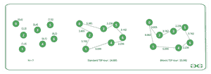

# 双离子旅行推销员问题

> 原文:[https://www . geesforgeks . org/bitonic-旅行推销员-问题/](https://www.geeksforgeeks.org/bitonic-traveling-salesman-problem/)

给定一个表示 2D 空间上已经按照 x 坐标和 y 坐标排序的 **N** 顶点的坐标列表的 [2D 数组](https://www.geeksforgeeks.org/multidimensional-arrays-c-cpp/)、**arr【】【】【】】**，任务是找到从最左边的顶点开始，并严格向右，然后在到达最右边的顶点时，严格从右向左返回到起始顶点的路线的最小距离。

**示例:**

> **输入:** N = 7，arr[][] = {{0，6}，{1 0}，{2 3}，{5 4}，{6 1}，{7 5}，{ 8 2 } }
> T3】输出:25.582
> T6】解释:
> 
> 
> 
> [TSP 游](https://www.geeksforgeeks.org/travelling-salesman-problem-set-1/) : 0-3-5-6-4-1-2-0 不是 Bitonic TSP 游，因为虽然该游最初是从左到右(0-3-5-6)，然后从右到左(6-4-1)返回，然后又进行了一次从左到右(1-2)，然后从右到左(2-0)的步骤。
> 游:0-2-3-5-6-4-1-0 是有效的 Bitonic TSP 游，因为它可以分解为两条路径:从左向右的 0-2-3-5-6 和从右向左返回的 6-4-1-0。
> 
> **输入:** N = 3，arr[][] = {{1，1}，{2，3}，{3，1 } }
> T3】输出: 6.47

**方法:**上述问题可以使用[动态规划](https://www.geeksforgeeks.org/dynamic-programming/)解决。为了理解，问题可以换成两个人。两者应该同时从最左边的点开始。沿着两条不同的路径走，最后到达最右边的点，除了起点和终点。

*   每一个点恰好被一个人通过。这里 **dp[i][j]** 代表第一个人走到 **i** 第二个人走到 **j** 有多远。
*   在解中， **dp[i][j]** 表示 **1** 到 **max(i，j)** 都已经走完了，两人目前的位置分别是 **i** 和 **j** ，需要走多远。
*   还有，可以推断 **dp[i][j]** 等于 **dp[j][i]** ，所以从现在开始规定 **i** 总是大于 **j** 即 **i > j** 处于状态。
*   这样，不管那个人，下一步都只能去 **i+1、i+2、……**这些点。
*   所以，状态 **dp[i][j]** 只能转移到 **dp[i+1][j]** 或 **dp[i][i+1]。**

按照以下步骤解决问题:

*   创建一个大小为 **N*N** 的 [2D 阵](https://www.geeksforgeeks.org/multidimensional-arrays-c-cpp/)**DP[][]**。
*   迭代表的最后一行 **dp** ，并将**DP【N-1】【I】**更新为**距离(N-1，N)** 和**距离(I，N)** 之和，其中**距离(x，y)** 表示 **xth** 和 **yth** 点之间的[欧氏距离](https://www.geeksforgeeks.org/calculate-the-euclidean-distance-using-numpy/)。
*   创建一个[递归函数](https://www.geeksforgeeks.org/recursive-functions/) **findTour(i，j)** 来填充所有其他单元格
    *   将 **dp[i][j]** 更新为最小的 **findTour(i+1，j)+距离(I，i+1)** 和 **findTour(i+1，I)+距离(j，i+1)** 。

下面是上述方法的实现:

## C++

```
// C++ program for the above approach
#include <bits/stdc++.h>
using namespace std;

// Size of the array a[]
const int mxN = 1005;

// Structure to store the x and
// y coordinates of a point
struct Coordinates {
    double x, y;
} a[mxN];

// Declare a 2-D dp array
float dp[mxN][mxN];

// Function to calculate the
// distance between two points
// in a Euclidian plane
float distance(int i, int j)
{
    // Return the distance
    return sqrt(
      (a[i].x - a[j].x) * (a[i].x - a[j].x)
    + (a[i].y - a[j].y) * (a[i].y - a[j].y));
}

// Utility recursive function to find
// the bitonic tour distance
float findTourDistance(int i, int j)
{
    // Memoization
    if (dp[i][j] > 0)
        return dp[i][j];

    // Update dp[i][j]
    dp[i][j] = min(
    findTourDistance(i + 1, j) + distance(i, i + 1),
    findTourDistance(i + 1, i) + distance(j, i + 1));

    return dp[i][j];
}

// Function to find the
// bitonic tour distance
void bitonicTSP(int N)
{
    // Initialize the dp array
    memset(dp, 0, sizeof(dp));

    // Base Case
    for (int j = 1; j < N - 1; j++)
        dp[N - 1][j] = distance(N - 1, N)
              + distance(j, N);

    // Print the answer
    printf("%.2f\n", findTourDistance(1, 1));
}

// Driver Code
int main()
{
    // Given Input
    int N = 3;
    a[1].x = 1, a[1].y = 1;
    a[2].x = 2, a[2].y = 3;
    a[3].x = 3, a[3].y = 1;

    // Function Call
    bitonicTSP(N);
}
```

**Output**

```
6.47
```

***时间复杂度:**O(N<sup>2</sup>)*
***辅助空间:** O(N <sup>2</sup> )*