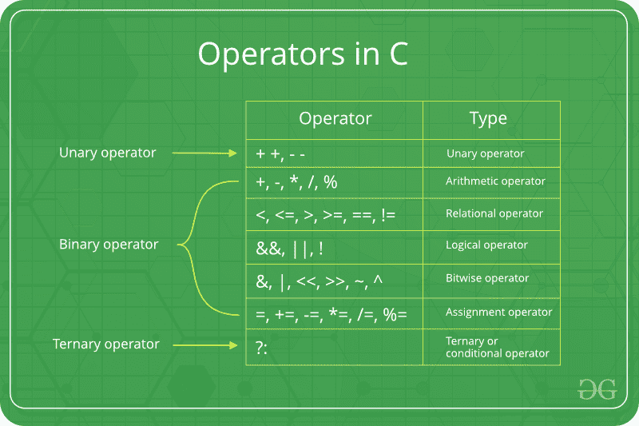

# C/c++中的按位运算符

> 原文:[https://www.geeksforgeeks.org/bitwise-operators-in-c-cpp/](https://www.geeksforgeeks.org/bitwise-operators-in-c-cpp/)

在 C 语言中，以下 6 个运算符是按位运算符(在位级工作)



1.  C 或 C++中的 **&(按位 AND)** 将两个数字作为操作数，并对两个数字的每一位进行 AND 运算。仅当两位都为 1 时，“与”的结果才为 1。

2.  C 或 C++中的 **|(按位或)**将两个数字作为操作数，并对两个数字的每一位进行或运算。如果两位中的任何一位为 1，则“或”的结果为 1。

3.  c 或 C++中的 **^(按位异或)**将两个数字作为操作数，并对两个数字的每一位进行异或运算。如果两位不同，异或的结果是 1。

4.  C 或 C++中的 **< <(左移)**取两个数，左移第一个操作数的位，第二个操作数决定移位的位数。

5.  C 或 C++中的 **> >(右移)**取两个数，右移第一个操作数的位，第二个操作数决定移位的位数。

6.  C 或 C++中的 **~(按位非)**取一个数字，并将其所有位反转

**示例:**

## C++

```
#include <iostream>
using namespace std;

int main() {
      // a = 5(00000101), b = 9(00001001)
    int a = 5, b = 9;

    // The result is 00000001
    cout<<"a = " << a <<","<< " b = " << b <<endl;
    cout << "a & b = " << (a & b) << endl;

    // The result is 00001101
    cout << "a | b = " << (a | b) << endl;

    // The result is 00001100
    cout << "a ^ b = " << (a ^ b) << endl;

    // The result is 11111010
    cout << "~(" << a << ") = " << (~a) << endl;

    // The result is 00010010
    cout<<"b << 1" <<" = "<< (b << 1) <<endl;

    // The result is 00000100
    cout<<"b >> 1 "<<"= " << (b >> 1 )<<endl;

    return 0;
}

// This code is contributed by sathiyamoorthics19
```

## C

```
// C Program to demonstrate use of bitwise operators
#include <stdio.h>
int main()
{
    // a = 5(00000101), b = 9(00001001)
    unsigned char a = 5, b = 9;

    // The result is 00000001
    printf("a = %d, b = %d\n", a, b);
    printf("a&b = %d\n", a & b);

    // The result is 00001101
    printf("a|b = %d\n", a | b);

    // The result is 00001100
    printf("a^b = %d\n", a ^ b);

    // The result is 11111010
    printf("~a = %d\n", a = ~a);

    // The result is 00010010
    printf("b<<1 = %d\n", b << 1);

    // The result is 00000100
    printf("b>>1 = %d\n", b >> 1);

    return 0;

}
```

**Output:** 

```
a = 5, b = 9
a&b = 1
a|b = 13
a^b = 12
~a = 250
b<<1 = 18
b>>1 = 4
```

**按位运算符的有趣事实**

1.  **左移和右移操作符不应用于负数**。如果第二个操作数(决定移位数)是负数，它会导致 c 中的未定义行为。例如，1 < < - 1 和 1 > > -1 的结果都是未定义的。此外，如果数字的移动超过整数的大小，则行为是未定义的。例如，如果使用 32 位存储整数，则 1 < < 33 未定义。另一件事是，如果加法表达式(决定移位数的操作数)为 0，则执行无移位操作。详见[本](https://wiki.sei.cmu.edu/confluence/display/c/INT34-C.+Do+not+shift+an+expression+by+a+negative+number+of+bits+or+by+greater+than+or+equal+to+the+number+of+bits+that+exist+in+the+operand)。
    **注:**在 **C++** 中，这种行为定义明确。
2.  **从****技术采访的角度来看，按位异或运算符是最有用的运算符。**用在很多问题上。一个简单的例子可能是“给定一组数字，其中除了一个数字之外，所有元素出现偶数次，找到出现奇数”这个问题可以通过对所有数字进行异或运算来有效解决。

## C++

```
#include <iostream>
using namespace std;

// Function to return the only odd
// occurring element
int findOdd(int arr[], int n)
{
    int res = 0, i;
    for (i = 0; i < n; i++)
        res ^= arr[i];
    return res;
}

// Driver Method
int main(void)
{
    int arr[] = { 12, 12, 14, 90, 14, 14, 14 };
    int n = sizeof(arr) / sizeof(arr[0]);
    cout << "The odd occurring element is  "<< findOdd(arr, n);
    return 0;
}

// This code is contributed by shivanisinghss2110
```

## C

```
#include <stdio.h>

// Function to return the only odd
// occurring element
int findOdd(int arr[], int n)
{
    int res = 0, i;
    for (i = 0; i < n; i++)
        res ^= arr[i];
    return res;
}

// Driver Method
int main(void)
{
    int arr[] = { 12, 12, 14, 90, 14, 14, 14 };
    int n = sizeof(arr) / sizeof(arr[0]);
    printf("The odd occurring element is %d ",
           findOdd(arr, n));
    return 0;
}
```

**Output:** 

```
The odd occurring element is 90
```

1.  下面是使用异或运算符的许多其他有趣的问题。
    1.  [查找缺失的号码](https://www.geeksforgeeks.org/find-the-missing-number/)
    2.  [在不使用临时变量的情况下交换两个数字](https://www.geeksforgeeks.org/swap-two-numbers-without-using-temporary-variable/)
    3.  [一个内存高效的双链表](https://www.geeksforgeeks.org/xor-linked-list-a-memory-efficient-doubly-linked-list-set-1/)
    4.  [找到两个不重复的元素](https://www.geeksforgeeks.org/find-two-non-repeating-elements-in-an-array-of-repeating-elements/)。
    5.  [在未排序的数组中找出出现次数为奇数的两个数字](https://www.geeksforgeeks.org/find-the-two-numbers-with-odd-occurences-in-an-unsorted-array/)。
    6.  [不使用算术运算符](https://www.geeksforgeeks.org/add-two-numbers-without-using-arithmetic-operators/)相加两个数。
    7.  [交换给定数字/](https://www.geeksforgeeks.org/swap-bits-in-a-given-number/) 中的位。
    8.  [计算将 a 转换为 b 需要翻转的位数](https://www.geeksforgeeks.org/count-number-of-bits-to-be-flipped-to-convert-a-to-b/)。
    9.  [找到出现一次的元素](https://www.geeksforgeeks.org/find-the-element-that-appears-once/)。
    10.  [检测两个整数是否符号相反。](https://www.geeksforgeeks.org/detect-if-two-integers-have-opposite-signs/)
2.  **不应使用按位运算符代替逻辑运算符。**逻辑运算符(& &)的结果，||和！)是 0 或 1，但按位运算符返回一个整数值。此外，逻辑运算符将任何非零操作数视为 1。例如，考虑以下程序，对于相同的操作数，&和& &的结果是不同的。

## C++

```
#include <iostream>
using namespace std;

int main()
{
    int x = 2, y = 5;
    (x & y) ? cout <<"True " : cout <<"False ";
    (x && y) ? cout <<"True " : cout <<"False ";
    return 0;
}

// This code is contributed by shivanisinghss2110
```

## C

```
#include <stdio.h>

int main()
{
    int x = 2, y = 5;
    (x & y) ? printf("True ") : printf("False ");
    (x && y) ? printf("True ") : printf("False ");
    return 0;
}
```

**Output:** 

```
False True
```

**1。左移和右移运算符分别相当于乘 2 和除 2。**如第 1 点所述，只有数字为正时，它才起作用。

## C++

```
#include <iostream>
using namespace std;

int main() {

    int x = 19;
    cout<<"x << 1 = "<< (x << 1) <<endl;
    cout<<"x >> 1 = "<< (x >> 1) <<endl;
    return 0;
}

// This code is contributed by sathiyamoorthics19
```

## C

```
#include <stdio.h>

int main()
{
    int x = 19;
    printf("x << 1 = %d\n", x << 1);
    printf("x >> 1 = %d\n", x >> 1);
    return 0;
}
```

**Output:** 

```
x << 1 = 38
x >> 1 = 9
```

**2。&运算符可用于快速检查一个数字是奇数还是偶数。**只有当 x 为奇数时，表达式(x & 1)的值才会非零，否则该值为零。

## C++

```
#include <iostream>
using namespace std;

int main() {

    int x = 19 ;
    (x & 1) ? cout<<"Odd" : cout<< "Even" ;

    return 0;
}

// This code is contributed by sathiyamoorthics19
```

## C

```
#include <stdio.h>

int main()
{
    int x = 19;
    (x & 1) ? printf("Odd") : printf("Even");
    return 0;
}
```

**Output:** 

```
Odd
```

**3。应该小心使用~运算符。**如果结果存储在无符号变量中，那么~运算符对一个小数字的结果可以是一个大数字。并且如果结果存储在有符号变量中，则结果可以是负数(假设负数以 2 的补码形式存储，其中最左边的位是符号位)

## C++

```
#include <iostream>
using namespace std;

int main() {

    unsigned int x = 1;
    signed int a = 1;
    cout<<"Signed Result "<< ~a <<endl ;
    cout<<"Unsigned Result "<< ~x ;
    return 0;
}
// This code is contributed by sathiyamoorthics19
```

## C

```
// Note that the output of the following
// program is compiler dependent
#include <stdio.h>

int main()
{
    unsigned int x = 1;
    printf("Signed Result %d \n", ~x);
    printf("Unsigned Result %ud \n", ~x);
    return 0;
}
```

**Output:** 

```
Signed Result -2 
Unsigned Result 4294967294d
```

1.  [比特操控(重要战术)](https://www.geeksforgeeks.org/bits-manipulation-important-tactics/)
2.  [竞争编程的逐位黑客攻击](https://www.geeksforgeeks.org/bitwise-hacks-for-competitive-programming/)
3.  [竞技编程的小技巧](https://www.geeksforgeeks.org/bit-tricks-competitive-programming/)