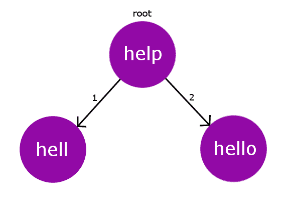
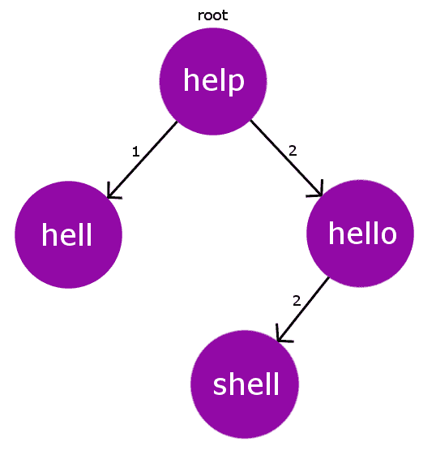
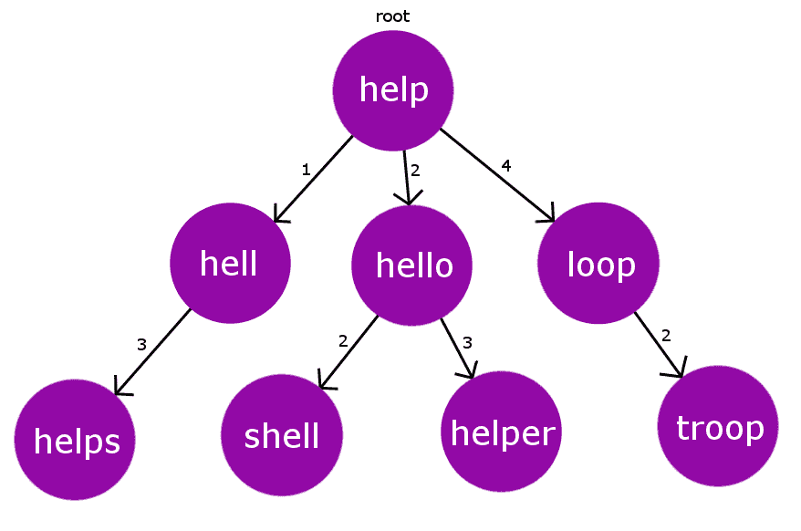

# BK-Tree |简介&实现

> 原文:[https://www . geesforgeks . org/bk-tree-introduction-implementation/](https://www.geeksforgeeks.org/bk-tree-introduction-implementation/)

BK 树或布尔夏德凯勒树是一种数据结构，用于执行基于编辑距离(莱文斯坦距离)概念的拼写检查。BK 树也用于近似字符串匹配。基于这种数据结构，可以实现许多软件中的各种自动校正功能。

```
Pre-requisites : Edit distance Problem
                 Metric tree
```

假设我们有一本单词字典，然后我们有一些其他的单词要在字典中检查拼写错误。我们需要收集字典中与给定单词非常接近的所有单词。例如，如果我们检查一个单词“ **ruk** ”，我们将有 **{“卡车”、“雄鹿”、“鸭子”……}** 。因此，拼写错误可以通过从单词中删除一个字符或在单词中添加一个新字符或用适当的字符替换单词中的字符来纠正。因此，我们将使用编辑距离来衡量字典中拼写错误的单词的正确性和匹配性。
现在，让我们看看我们的 BK 树的结构。像所有其他树一样，BK 树由节点和边组成。BK 树中的节点将代表我们字典中的单个单词，节点的数量将与我们字典中的单词数量完全相同。边将包含一些整数权重，它将告诉我们从一个节点到另一个节点的编辑距离。假设我们有一条从节点 **u** 到节点 **v** 的边，它有一些边权重 **w** ，那么 w 就是将字符串 u 转到 v 所需的编辑距离。

想想我们的字典里有这样的词: **{“救命”、“见鬼”、“你好”}** 。因此，对于本词典，我们的 BK 树将如下所示。



BK 树中的每个节点都有一个编辑距离相同的子节点。在这种情况下，如果我们在插入时遇到一些编辑距离的冲突，那么我们将向下传播子节点的插入过程，直到我们为字符串节点找到合适的父节点。

BK 树中的每个插入都将从我们的根节点开始。根节点可以是我们字典中的任何单词。
例如，让我们在上面的字典中添加另一个单词“ **shell** ”。现在我们的 **Dict[] = {“救命”、“见鬼”、“你好”、“贝壳”}** 。现在很明显“ **shell** ”的编辑距离与“ **hello** ”从根节点“ **help** ”即 2 的编辑距离相同。因此，我们遇到了碰撞。因此，我们通过在预先存在的冲突节点上递归地执行这个插入过程来处理这个冲突。
所以，现在我们不再在根节点**帮助**处插入“ **shell** ”，而是将其插入到碰撞节点 **hello** 。因此，现在新节点“ **shell** ”被添加到树中，并且它具有节点“ **hello** ”作为其父节点，边缘权重为 2(编辑距离)。下图描述了插入后的 BK 树。



所以，到目前为止，我们已经了解了我们将如何建立我们的 BK 树。现在，问题出现了，如何为我们拼错的单词找到最接近的正确单词？首先，我们需要设置一个公差值。这个**公差值**只是我们拼错的单词到字典中正确单词的最大编辑距离。因此，为了在公差范围内找到合适的正确单词，朴素方法将迭代字典中的所有单词，并收集公差范围内的单词。但是这种方法有 **O(n*m*n)** 时间复杂度( **n** 是 dict【】中的单词数， **m** 是正确单词的平均大小， **n** 是拼错单词的长度)，对于更大的字典大小，这种时间复杂度会超时。

所以，现在 BK 树开始行动了。众所周知，BK 树中的每个节点都是基于与其父节点的编辑距离度量来构建的。因此，我们将直接从根节点转到公差范围内的特定节点。假设我们的公差极限是 **TOL** ，当前节点到拼错单词的编辑距离是 **dist** 。因此，现在我们不再迭代它的所有子对象，而是只迭代编辑距离在范围内的子对象

[ **dist-TOL，dist+TOL** ]。这将在很大程度上降低我们的复杂性。我们将在时间复杂性分析中讨论这一点。
考虑下面构建的 BK 树。



假设我们有一个拼错的单词“ **oop** ”，公差限制为 2。现在，我们将看到如何为给定的拼写错误的单词收集预期的正确答案。
迭代 1:我们将开始检查从根节点的编辑距离。d(“OOP”->“帮助”)= 3。现在我们将迭代其编辑距离在范围[ D-TOL，D+TOL ]内的子节点，即[1，5]
迭代 2:让我们从最高可能的编辑距离子节点开始迭代，即编辑距离为 4 的节点“循环”。现在，我们将再次找到它与我们拼写错误的单词之间的编辑距离。D("oop "，" loop") = 1。
这里 D = 1，即 D < = TOL，因此我们将在预期的正确单词列表中添加“loop”，并处理其编辑距离在范围[D-TOL，D+TOL]即[1，3]内的子节点

迭代 3:现在，我们在节点“部队”。我们将再次检查它与拼写错误的单词的编辑距离。D("oop "，"部队")=2。这里再次 D <= TOL，因此我们再次将“部队”添加到预期的正确单词列表中。

我们将对范围[D-TOL，D+TOL]中的所有单词进行相同的处理，从根节点开始，直到最下面的叶节点。这类似于树上的 DFS 遍历，有选择地访问边缘权重位于某个给定范围内的子节点。
因此，最后拼错的单词“ **oop** 只剩下 2 个预期单词，即**{【loop】，** **【部队】}**

## C++

```
// C++ program to demonstrate working of BK-Tree
#include "bits/stdc++.h"
using namespace std;

// maximum number of words in dict[]
#define MAXN 100

// defines the tolerance value
#define TOL  2

// defines maximum length of a word
#define LEN 10

struct Node
{
    // stores the word of the current Node
    string word;

    // links to other Node in the tree
    int next[2*LEN];

    // constructors
    Node(string x):word(x)
    {
        // initializing next[i] = 0
        for(int i=0; i<2*LEN; i++)
            next[i] = 0;
    }
    Node() {}
};

// stores the root Node
Node RT;

// stores every Node of the tree
Node tree[MAXN];

// index for current Node of tree
int ptr;

int min(int a, int b, int c)
{
    return min(a, min(b, c));
}

// Edit Distance
// Dynamic-Approach O(m*n)
int editDistance(string& a,string& b)
{
    int m = a.length(), n = b.length();
    int dp[m+1][n+1];

    // filling base cases
    for (int i=0; i<=m; i++)
        dp[i][0] = i;
    for (int j=0; j<=n; j++)
        dp[0][j] = j;

    // populating matrix using dp-approach
    for (int i=1; i<=m; i++)
    {
        for (int j=1; j<=n; j++)
        {
            if (a[i-1] != b[j-1])
            {
                dp[i][j] = min( 1 + dp[i-1][j],  // deletion
                                1 + dp[i][j-1],  // insertion
                                1 + dp[i-1][j-1] // replacement
                              );
            }
            else
                dp[i][j] = dp[i-1][j-1];
        }
    }
    return dp[m][n];
}

// adds curr Node to the tree
void add(Node& root,Node& curr)
{
    if (root.word == "" )
    {
        // if it is the first Node
        // then make it the root Node
        root = curr;
        return;
    }

    // get its editDist from the Root Node
    int dist = editDistance(curr.word,root.word);

    if (tree[root.next[dist]].word == "")
    {
        /* if no Node exists at this dist from root
         * make it child of root Node*/

        // incrementing the pointer for curr Node
        ptr++;

        // adding curr Node to the tree
        tree[ptr] = curr;

        // curr as child of root Node
        root.next[dist] = ptr;
    }
    else
    {
        // recursively find the parent for curr Node
        add(tree[root.next[dist]],curr);
    }
}

vector <string> getSimilarWords(Node& root,string& s)
{
    vector < string > ret;
    if (root.word == "")
       return ret;

    // calculating editdistance of s from root
    int dist = editDistance(root.word,s);

    // if dist is less than tolerance value
    // add it to similar words
    if (dist <= TOL) ret.push_back(root.word);

    // iterate over the string having tolerance
    // in range (dist-TOL , dist+TOL)
    int start = dist - TOL;
    if (start < 0)
       start = 1;

    while (start <= dist + TOL)
    {
        vector <string> tmp =
             getSimilarWords(tree[root.next[start]],s);
        for (auto i : tmp)
            ret.push_back(i);
        start++;
    }
    return ret;
}

// driver program to run above functions
int main(int argc, char const *argv[])
{
    // dictionary words
    string dictionary[] = {"hell","help","shell","smell",
                           "fell","felt","oops","pop","oouch","halt"
                          };
    ptr = 0;
    int sz = sizeof(dictionary)/sizeof(string);

    // adding dict[] words on to tree
    for(int i=0; i<sz; i++)
    {
        Node tmp = Node(dictionary[i]);
        add(RT,tmp);
    }

    string w1 = "ops";
    string w2 = "helt";
    vector < string > match = getSimilarWords(RT,w1);
    cout << "similar words in dictionary for : " << w1 << ":\n";
    for (auto x : match)
        cout << x << endl;

    match = getSimilarWords(RT,w2);
    cout << "Correct words in dictionary for " << w2 << ":\n";
    for (auto x : match)
        cout << x << endl;

    return 0;
}
```

**Output**

```
similar words in dictionary for : ops:
oops
pop
Correct words in dictionary for helt:
hell
help
shell
fell
felt
halt
```

**时间复杂度:**很明显，时间复杂度主要取决于容限。我们将考虑将**公差极限**设为 **2** 。现在，粗略估计一下，BK Tree 的深度将是 log n，其中 n 是字典的大小。在每一层，我们都要访问树中的两个节点，并执行编辑距离计算。所以我们的时间复杂度会是 **O(L1*L2*log n)** ，这里 **L1** 是我们字典里单词的平均长度， **L2** 是拼错的长度。一般来说，L1 和 L2 会很小。

**参考文献**

*   [https://en . Wikipedia . org/wiki/bk-tree](https://en.wikipedia.org/wiki/BK-tree)
*   [https://issues.apache.org/jira/browse/LUCENE-2230](https://issues.apache.org/jira/browse/LUCENE-2230)

本文由 [**尼提什·库马尔**](https://www.linkedin.com/in/nk17kumar) 供稿。如果你喜欢极客博客并想投稿，你也可以用 write.geeksforgeeks.org 写一篇文章或者把你的文章邮寄到 review-team@geeksforgeeks.org。看到你的文章出现在极客博客主页上，帮助其他极客。
如果你发现任何不正确的地方，或者你想分享更多关于上面讨论的话题的信息，请写评论。