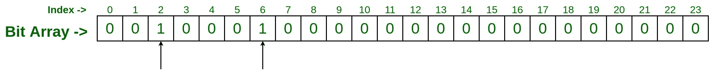
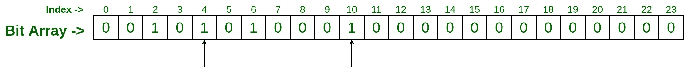
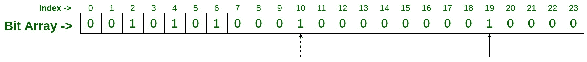
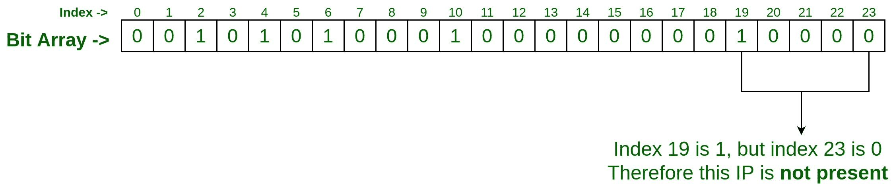
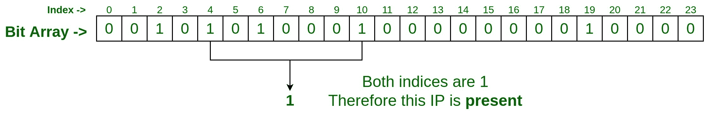
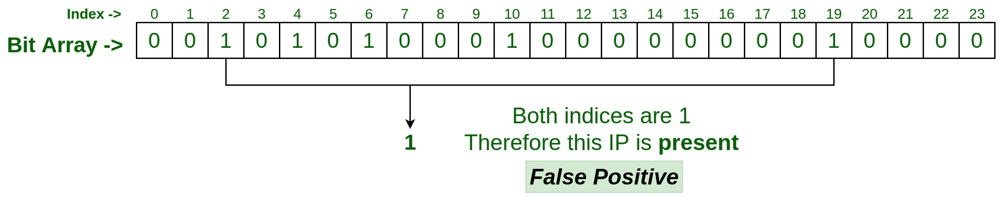
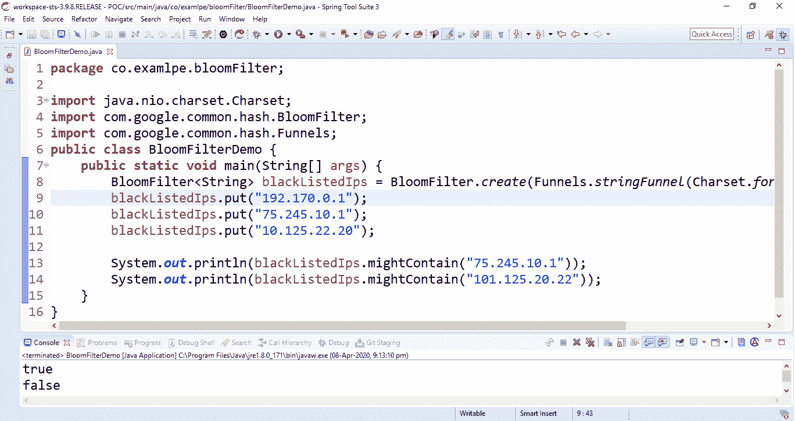

# Java 中的布隆过滤器示例

> 原文:[https://www . geesforgeks . org/bloom-filter-in-Java-with-examples/](https://www.geeksforgeeks.org/bloom-filter-in-java-with-examples/)

**布隆过滤器**用于确定元素是否存在于[集合](https://www.geeksforgeeks.org/set-in-java/)中的集合成员资格。布鲁姆滤波器是由**伯顿·h·布鲁姆**在 1970 年的一篇名为**的论文中发明的，该论文是关于允许误差的哈希编码中的空间/时间权衡(1970 年)**。Bloom filter 是一种概率数据结构，适用于[哈希编码方法](https://www.geeksforgeeks.org/hashing-data-structure/)(类似于[哈希表](https://www.geeksforgeeks.org/hashtable-in-java/))。

<u>**我们什么时候需要布隆过滤器？**</u>
考虑以下任一情况:

1.  假设我们有一些元素的列表，我们想要检查给定的元素是否存在？
2.  假设您正在使用电子邮件服务，并且正在尝试使用给定用户名已经存在或不存在的功能来实现注册端点？
3.  假设你给了一组黑名单上的 IP，你想过滤掉一个给定的 IP 是不是黑名单上的？

<u>**没有 Bloom Filter 的帮助，这些问题能解决吗？**T3】</u>

让我们试着用一个[哈希集](https://www.geeksforgeeks.org/hashset-in-java/)来解决这些问题

```
import java.util.HashSet;
import java.util.Set;

public class SetDemo {
    public static void main(String[] args)
    {
        Set<String> blackListedIPs
            = new HashSet<>();
        blackListedIPs.add("192.170.0.1");
        blackListedIPs.add("75.245.10.1");
        blackListedIPs.add("10.125.22.20");

        // true
        System.out.println(
            blackListedIPs
                .contains(
                    "75.245.10.1"));

        // false
        System.out.println(
            blackListedIPs
                .contains(
                    "101.125.20.22"));
    }
}
```

**Output:**

```
true
false

```

<u>**为什么像 [HashSet](https://www.geeksforgeeks.org/hashset-in-java/) 或者 [HashTable](https://www.geeksforgeeks.org/hashtable-in-java/) 这样的数据结构会失效？**</u>
当我们的数据集有限时，HashSet 或 HashTable 可以很好地工作，但是当我们处理大数据集时，它可能不适合。对于大型数据集，需要花费大量时间和大量内存。

**数据集的大小对哈希集类数据结构的插入时间**

```
----------------------------------------------
|Number of UUIDs          Insertion Time(ms) |
----------------------------------------------
|10                         <1               |
|100                         3               |
|1, 000                      58              |
|10, 000                     122             |
|100, 000                    836             |
|1, 000, 000                 7395            |
----------------------------------------------

```

对于类似哈希集的数据结构，数据集的大小与[内存(JVM 堆)](https://www.geeksforgeeks.org/java-memory-management/)

```
----------------------------------------------
|Number of UUIDs            JVM heap used(MB) |
----------------------------------------------
|10                         <2                |   
|100                        <2                |
|1, 000                      3                |
|10, 000                     9                |
|100, 000                    37               |
|1, 000, 000                 264              |
-----------------------------------------------

```

因此，很明显，如果我们有一大组数据，那么像 set 或 HashTable 这样的正常数据结构是不可行的，在这里，Bloom 过滤器就出现了。关于两者比较的更多细节，请参考本文:[布隆过滤器和哈希表](https://www.geeksforgeeks.org/difference-between-bloom-filters-and-hashtable/)的区别

<u>**如何借助 Bloom Filter 解决这些问题？**</u>
我们取一个大小为 **N** 的**位数组**(这里是 24)并用二进制零初始化每个位，现在取一些[散列函数](https://www.geeksforgeeks.org/what-are-hash-functions-and-how-to-choose-a-good-hash-function/)(你可以取任意多个，我们这里取两个散列函数作为说明)。

[](https://media.geeksforgeeks.org/wp-content/uploads/20200411093822/Bloom-Filter.jpg)

*   Now pass the first IP you have to both hash function, which generates some random number as given below

    ```
    hashFunction_1(192.170.0.1) : 2 
    hashFunction_2(192.170.0.1) : 6

    ```

    现在，转到索引 2 和 6，并将该位标记为二进制 1。

    [](https://media.geeksforgeeks.org/wp-content/uploads/20200411093820/Bloom-Filter-1.jpg)

*   Now pass the second IP you have, and follow the same step.

    ```
    hashFunction_1(75.245.10.1) : 4 
    hashFunction_2(75.245.10.1) : 10

    ```

    现在，转到索引 4 和 10，并将该位标记为二进制 1。

    [](https://media.geeksforgeeks.org/wp-content/uploads/20200411093818/Bloom-Filter-2.jpg)

*   Similarly pass the third IP to the both hash function, and suppose you got the below output of hash function

    ```
    hashFunction_1(10.125.22.20) : 10 
    hashFunction_2(10.125.22.20) : 19

    ```

    现在，转到索引 10 和 19，并标记为二进制 1，这里索引 10 已经被以前的条目标记，所以只需将索引 19 标记为二进制 1。

    [](https://media.geeksforgeeks.org/wp-content/uploads/20200411093815/Bloom-Filter-3.jpg)

    现在，是时候检查数据集中是否存在 IP 了，

*   **Test input #1**
    Let’s say we want to check IP **75.245.10.1**. Pass this IP with the same two hash functions which we have taken for adding the above inputs.

    ```
    hashFunction_1(75.245.10.1) : 4 
    hashFunction_2(75.245.10.1) : 10

    ```

    现在，转到索引并检查该位，如果索引 4 和 10 都用二进制 1 标记，则 IP**75.245.10.1**存在于集合中，否则它不与数据集在一起。

    [](https://media.geeksforgeeks.org/wp-content/uploads/20200411093813/Bloom-Filter-5.jpg)

*   **测试输入#2**
    假设我们要检查 IP**75.245.20.30**是否出现在集合中？所以过程将是相同的，传递这个 IP 与同样的两个散列函数，我们已经采取增加上述输入。

```
hashFunction_1(75.245.20.30) : 19 
hashFunction_2(75.245.20.30) : 23

```

因为在索引 19 它被设置为 1，但是在索引 23 它是 0，所以我们可以说给定的 IP**75.245.20.30**不在集合中。

[](https://media.geeksforgeeks.org/wp-content/uploads/20200411093811/Bloom-Filter-4.jpg)

<u>**为什么 Bloom Filter 是一种概率数据结构？**</u>
让我们再做一个测试来理解这一点，这次考虑一个 IP**101.125.20.22**并检查它是否存在于场景中。将此传递给两个哈希函数。考虑我们的散列函数结果如下。

```
hashFunction_1(101.125.20.22) : 19 
hashFunction_2(101.125.20.22) : 2

```

现在，访问设置为 1 的索引 19 和 2，它显示给定的 IP**101.125.20.22**存在于集合中。

[](https://media.geeksforgeeks.org/wp-content/uploads/20200411093808/Bloom-Filter-6.jpg)

但是，这个 IP**101.125.20.22**已经在上面的数据集中进行了处理，同时将 IP 添加到位数组中。这就是所谓的**假阳性**:

```
Expected Output: No
Actual Output: Yes *(False Positive)*

```

在这种情况下，索引 2 和 19 由其他输入设置为 1，而不是由该 IP**101.125.20.22**设置。这被称为**碰撞**，这就是为什么它是**概率**，发生的几率不是 100%。

<u>**对布隆过滤器有什么期待？**T3】</u>

1.  当布隆过滤器说某个元素不存在时，它肯定是 T2 不存在。它 100%保证给定的元素在集合中不可用，因为散列函数给出的索引的任一位都将被设置为 0。
2.  但是当 Bloom filter 说给定元素是 **present** 时，它是**不是 100%确定**，因为由于冲突，散列函数给出的索引的所有位都可能被其他输入设置为 1。

<u>**如何从一个 Bloom 滤镜得到 100%准确的结果？**</u>
嗯，这只能通过增加散列函数的数量来实现。**我们取的哈希函数数量越多，得到的结果就越准确，因为碰撞的几率就越小。**

<u>**布隆过滤器的时间和空间复杂性**</u>
假设我们有大约**4000 万个数据集**并且我们正在使用大约 **H 散列函数**，那么:

> **时间复杂度:O(H)** ，其中 H 为使用的哈希函数数量
> **空间复杂度:159 Mb** (针对 4000 万数据集)
> **误报情况:每 1000 万个**中有 1 个错误(针对 H = 23)

**使用番石榴库在 Java 中实现 Bloom filter:**
我们可以使用番石榴提供的 [Java 库实现 Bloom filter。](https://www.geeksforgeeks.org/guava-library-java/)

1.  包括下面的 maven 依赖:

    ```
    <dependency>
        <groupId>com.google.guava</groupId>
        <artifactId>guava</artifactId>
        <version>19.0</version>
    </dependency>
    ```

2.  Write the following code to implement the Bloom Filter:

    ```
    // Java program to implement
    // Bloom Filter using Guava Library

    import java.nio.charset.Charset;
    import com.google.common.hash.BloomFilter;
    import com.google.common.hash.Funnels;

    public class BloomFilterDemo {
        public static void main(String[] args)
        {

            // Create a Bloom Filter instance
            BloomFilter<String> blackListedIps
                = BloomFilter.create(
                    Funnels.stringFunnel(
                        Charset.forName("UTF-8")),
                    10000);

            // Add the data sets
            blackListedIps.put("192.170.0.1");
            blackListedIps.put("75.245.10.1");
            blackListedIps.put("10.125.22.20");

            // Test the bloom filter
            System.out.println(
                blackListedIps
                    .mightContain(
                        "75.245.10.1"));
            System.out.println(
                blackListedIps
                    .mightContain(
                        "101.125.20.22"));
        }
    }
    ```

    **输出:**

    [](https://media.geeksforgeeks.org/wp-content/uploads/20200408215600/bloomfilterOutput-1.png)

    布隆过滤器输出

    > **注意:**默认情况下，上述 Java 代码可能会返回 3%的误报概率。

3.  **Reduce the false-positive probability**
    Introduce another parameter in Bloom filter object creation as follows:
     `**BloomFilter <string>blackListedIps = BloomFilter.create(Funnels.stringFunnel(Charset.forName("UTF-8")), 10000, 0.005);</string>**` 

    现在假阳性概率已经从**的 0.03 降低到了 0.005** 。但是调整这个参数对布隆过滤器有影响。

**降低误报概率的效果:**
我们从哈希函数、数组位、时间复杂度和空间复杂度来分析一下这个效果。

*   让我们看看不同数据集的插入时间。

    ```
    -----------------------------------------------------------------------------
    |Number of UUIDs | Set Insertion Time(ms)  | Bloom Filter Insertion Time(ms) |
    -----------------------------------------------------------------------------
    |10                         <1                   71                          |   
    |100                         3                   17                          |
    |1, 000                      58                  84                          |
    |10, 000                     122                 272                         |
    |100, 000                    836                 556                         |
    |1, 000, 000                 7395                5173                        |
    ------------------------------------------------------------------------------

    ```

*   现在，让我们来看看内存(JVM 堆)

    ```
    --------------------------------------------------------------------------
    |Number of UUIDs | Set JVM heap used(MB) | Bloom filter JVM heap used(MB) | 
    --------------------------------------------------------------------------
    |10                         <2                   0.01                     |   
    |100                        <2                   0.01                     |
    |1, 000                      3                   0.01                     |
    |10, 000                     9                   0.02                     |
    |100, 000                    37                  0.1                      |
    |1, 000, 000                 264                 0.9                      |
    ---------------------------------------------------------------------------

    ```

*   位计数

    ```
    ----------------------------------------------
    |Suggested size of Bloom Filter  | Bit count  |
    ----------------------------------------------
    |10                                40         |   
    |100                               378        |
    |1, 000                            3654       |
    |10, 000                           36231      |
    |100, 000                          361992     |
    |1, 000, 000                       3619846    |
    -----------------------------------------------

    ```

*   用于各种假阳性概率的散列函数数量:

    ```
    -----------------------------------------------
    |Suggested FPP of Bloom Filter | Hash Functions|
    -----------------------------------------------
    |3%                                5           |   
    |1%                                7           |
    |0.1%                              10          |
    |0.01%                             13          |
    |0.001%                            17          |
    |0.0001%                           20          |
    ------------------------------------------------

    ```

<u>**结论:**</u>

因此可以说，在我们必须以低内存消耗处理大数据集的情况下，Bloom filter 是一个不错的选择。同样，我们想要的结果越精确，散列函数的数量就必须增加。